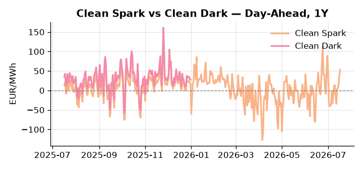
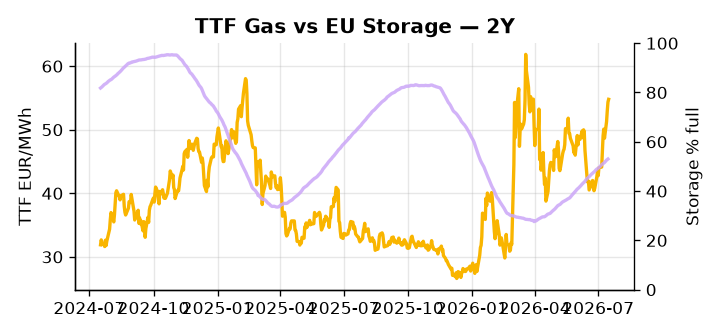

# European Cross-Commodity Risk Pack: Gas + Carbon → Power Curve Implications

**Daily desk brief — 2026-07-17**  
_Author: Sumer Sener · sumerberksener@gmail.com_  
_Generated by `scripts/generate_brief.py`. AI narrative + news themes via Anthropic Claude._

> **Data-freshness caveat:** Clean Dark (last 2025-12-31, 198d old); Coal (last 2025-12-26, 203d old). Numbers below should be read with this in mind.

## 1 · Executive summary

**TL;DR — GB Power at 99th percentile amid French nuclear offline and tight storage; Clean Spark 95th percentile; coal at 7th—fuel switch intact but carbon-policy weakness pressures margins.**

GB Power at the 99th percentile with French nuclear offline mid-summer and EU storage sitting at just 53% fill — 15.3 percentage points below seasonal norm — is the dominant signal this morning, with TTF running 2.2σ extended above trend and the refill pace now critical to autumn marginal cost. Clean Spark holds the 95th percentile, confirming gas-fired generation firmly in-the-money despite coal compressed to the 7th percentile, with the fuel switch structurally intact even as renewable output fell 15.29% on the day (38th percentile) and thermal call remains elevated. EUA at 33.04 EUR/t (37th percentile, -2.05% on the session) is sliding under pressure as the EU Commission's proposed carbon market weakening — including a stalled ETS reform vote and the carbon floor under review — removes a layer of fuel-switch discipline and flattens the merit-order incentive to displace coal, a bearish-EUA supply signal that compresses power-generation margins into autumn. With coal data 203 days stale and the Clean Dark spread 198 days old, the dark spread is indicative not bankable — the fuel-switch model should be calibrated to live Clean Spark and TTF rather than coal forwarding. With Hormuz tail-risk anchoring the LNG arb floor and Russia sanctions deadline end-July at risk of collapse, gas tightness at 2.2σ AND carbon policy-driven EUA softness AND Clean Spark extended to the 95th percentile pull front-curve risk sharply wider, while the Cal+1 regime remains contingent on French nuclear return timing and whether the storage deficit closes before the summer peak rolls into the autumn strip.

_Generated by **claude-sonnet-4-6** via Anthropic API (two-pass extract→narrate). Prompts/responses logged to `ai/logs/`._
_Next-5d temperature anomaly — DE -1.4°C / FR -0.0°C vs 5-yr seasonal normal (Open-Meteo)._

## 2 · Monitor metrics

**Primary (cross-commodity headline tiles)**

| Metric | As of | Latest | Unit | 1d Δ | 1w Δ | 5y pctile | Headline |
|---|---|---:|---|---:|---:|---:|---|
| TTF Gas | 2026-07-16 | 54.78 | EUR/MWh | +0.79% | +12.05% | 71 | extended 2.2σ above the 50d trend |
| EU Storage | 2026-07-15 | 53.00 | % full | +0.38% | +2.68% | 26 | 15.3 pp below the 5-yr seasonal average |
| EUA Carbon | 2026-07-16 | 33.04 | EUR/tCO2 | -2.05% | +0.18% | 37 | outsized daily move (-2.05%, 2.0σ) |
| DE Power | 2026-07-17 | 175.00 | EUR/MWh | +9.57% | +38.23% | 84 | Within typical range |
| GB Power | 2026-07-17 | 148.97 | EUR/MWh | -0.49% | +11.03% | 99 | 99th-percentile of 5-yr range — historically high |
| Renewables | 2026-07-16 | 37.28 | % of load | -15.29% | -18.29% | 38 | Within typical range |
| Clean Spark | 2026-07-17 | 53.27 | EUR/MWh | +15.28 | +30.24 | 95 | 95th-percentile of 5-yr range — historically high |
| Clean Dark | 2025-12-31 (STALE) | 27.95 | EUR/MWh | -0.56 | +11.63 | 48 | Within typical range |

**Fundamentals inputs** _(feed derived metrics; not separately traded)_

| Metric | As of | Latest | Unit | 1d Δ | 1w Δ | 5y pctile | Headline |
|---|---|---:|---|---:|---:|---:|---|
| Coal | 2025-12-26 (STALE) | 96.00 | USD/t | -0.57% | +0.08% | 7 | 7th-percentile of 5-yr range — historically low |

_Spreads → abs EUR/MWh deltas; others → pct. Weekly Δ uses 5d trailing means. Full history in `data/<metric>.csv`._

## 3 · Gas + LNG arb

**TTF front-month** prints at 54.78 EUR/MWh — _extended 2.2σ above the 50d trend_.
**EU storage** at 53.0% full (-15.3 pp vs 5-yr seasonal avg) — _15.3 pp below the 5-yr seasonal average_.
**TTF − JKM (LNG arb)** at -4.49 EUR/MWh (JKM 19.92 USD/MMBtu) — JKM richer than TTF — Asia pulls cargoes, marginal European tightening risk.

## 4 · Carbon (EU ETS)

**EUA December** prints at 33.04 EUR/tCO2 — _outsized daily move (-2.05%, 2.0σ)_. A euro of EUA adds ~0.37 EUR/MWh to gas-fired and ~0.85 EUR/MWh to coal-fired generation cost; strength compresses the dark spread faster than the spark.

**EU vs UK ETS** — Cobblestone's emissions desk trades EUA and UKA. Post-Brexit auction reform narrowed the UKA discount to EUA from £20+/t to single-digit £/t; CBAM phase-in pulls UK compliance demand toward parity. EUA−UKA basis remains a tradable cross-market signal.

**Supply / policy signal** — _EU Commission to weaken carbon market, allowing industry more emissions; ETS reform vote stalled—carbon floor under review._  
Side: `supply` · Polarity: `bearish EUA` · Source: Politico EU Energy

Weakened carbon discipline (EUA down 2.05% to 37th percentile) reduces fuel-switch incentive from gas to coal, flattening power-generation margins and subduing thermal dispatch merit order into autumn.

_Surfaced from today's news flow by the AI extract pass (`ai/prompts/extract_v1.md` → `carbon_policy_signal`)._

## 5 · Power — Day-Ahead & curve

**DE day-ahead baseload** at 175.00 EUR/MWh — _Within typical range_.
**GB day-ahead baseload** at 148.97 EUR/MWh — _99th-percentile of 5-yr range — historically high_.
**DE − GB spread** at +26.03 EUR/MWh (DE premium) — drives interconnector flow direction.
**Cross-border net flows (Power Transportation):** DE↔FR -31.7 GWh (FR export); GB↔FR -45.4 GWh (FR export); NL↔DE +60.6 GWh (NL export).

**Clean spark spread** at +53.27 EUR/MWh — _95th-percentile of 5-yr range — historically high_. Bridge from gas + carbon fundamentals to gas-fired economics; sustained positive spark = TTF moves transmit directly into the power curve.

**Curve shape:** DA → W+1 → M+1 → Q+1 → Cal+1 → Cal+2 = 175 / 122 / 122 / 122 / 122 / 122 EUR/MWh — **Backwardation** (DA −Cal+1 spread +53 EUR/MWh). Forwards are seasonality projections — see Methodology.

{width=49%} {width=49%}

**This week ahead**

- **Fri** 14:30 UTC — EIA weekly natural gas storage report: US storage trajectory anchors LNG export pricing into NW Europe — direct TTF transmission.
- **Fri** — ENTSO-E weekly day-ahead volumes / system-balance summary: Reads the European generation mix in last 7d — confirms or breaks the Cal+1 thesis.
- **Tue** 08:00 UTC — AGSI+ daily storage print: First read on the week's gas injection / withdrawal pace; sets the tone for TTF curve shape.
- **Thu** — Russia oil sanctions deadline (end-July negotiation window): Failure to cap or extend agreement could spike Brent 5–10 USD/bbl, tightening LNG economics and lifting TTF arb floor. _(news-extracted)_

**Scenarios (24-72h | 1w horizon)**

| | Summary | TTF | DE Power |
|---|---|---:|---:|
| **Base** | French nuclear remains offline; TTF consolidates 2.2σ above trend; storage refill steady. Power holds 84th percentile. | ±1–2% | tracks |
| **Upside** | France nuclear offline extends into late July + Russia sanctions collapse; Brent spikes 8–12 USD/bbl, tightening LNG arb. TTF +5–8%; DE power +8–12%. | +5–8% | +8–12% |
| **Downside** | France nuclear restarts mid-week; EU storage refill accelerates on mild weather; Russia sanctions agreement caps Brent. TTF -4–6%; DE power -6–10%. | -4–6% | -6–10% |

_Illustrative, not forecasts. Magnitudes sized off historical sensitivity; AI-generated from today's extract pass._

## 6 · Today's themes

**Weather watch (next 7d)**
- **Storm · DE · Fri 17 – Tue 21 Jul** — peak gust 55 m/s (~197 km/h) on Sun 19 Jul. Wind generation likely surges Day 1, then risk of turbine cut-off if gusts exceed 25 m/s. Bearish DA early, sharp reversal possible. Watch DE-FR flow swings.
- **Storm · FR · Fri 17 – Thu 23 Jul** — peak gust 41 m/s (~147 km/h) on Mon 20 Jul. Strong wind boost to French generation; FR may export to neighbours. DA print likely below seasonal norm; watch FR-GB IFA flow toward GB.

**Watchlist (1–4 weeks)**
- EU ETS reform vote (Parliament/Council); outcome determines carbon floor and fuel-switch incentive.
- Russia oil sanctions final deadline end-July; price cap agreement or cap ratchet up.

_Risk framing — built within a discipline of clear limits and continuous monitoring; observations here are framed as risk inputs, not directional calls. Positioning decisions remain with the desk._
_Methodology + sources: **README §Methodology**. Numbers auditable via the snapshot JSONs. Rule-based / informational — not investment advice._