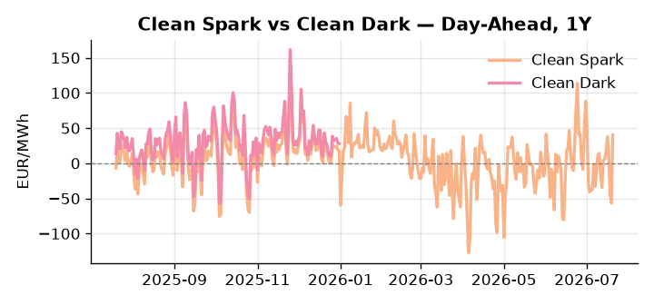
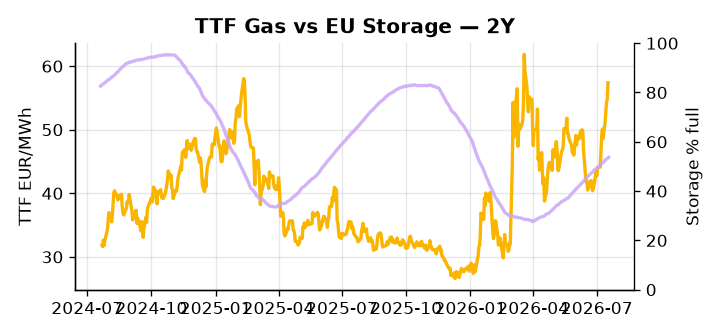

# European Cross-Commodity Risk Pack: Gas + Carbon → Power Curve Implications

**Daily desk brief — 2026-07-20**  
_Author: Sumer Sener · sumerberksener@gmail.com_  
_Generated by `scripts/generate_brief.py`. AI narrative + news themes via Anthropic Claude._

> **Data-freshness caveat:** Clean Dark (last 2025-12-31, 201d old); Coal (last 2025-12-26, 206d old). Numbers below should be read with this in mind.

## 1 · Executive summary

**TL;DR — GB Power at 98th-percentile on Hormuz supply risk and renewables pullback; Clean Spark at 93rd-percentile signals sustained thermal tension despite loose ETS policy.**

GB Power at the 98th percentile and Clean Spark at the 93rd percentile frame the dominant signal: sustained thermal tension driven by Hormuz supply curtailment at two-thirds capacity, which keeps Brent elevated, OCGT dispatch in-the-money, and TTF arb margins extended. Renewables running at the 92nd percentile (68.66% of load) are compressing day-ahead, but GB isolation remains anchored at the 98th percentile on wind outages and demand inelasticity, sustaining the GB-DE spread. EUA free-allocation relief, as the EU extends industry allowances through to the 2040s under an electrification push — a slow-motion bearish-supply signal — removes structural carbon scarcity from the merit order and is already pressuring Cal+1 power spreads 2–4% lower over the coming months, dampening fuel-switch urgency even as storage sits 15.5 percentage points below seasonal norms at 53.67% full. With coal and clean-dark data 206 and 201 days stale respectively, the thermal merit order post-year-end is indicative not bankable, limiting seasonal fuel-switch granularity. Gas tightness from Hormuz-driven TTF elevation AND carbon headroom compressed by ETS loosening AND clean sparks in-the-money at the 93rd percentile keep the front-curve regime tight, but with Hormuz tail-risk unresolved into next week's EU oil price-cap negotiations, front-curve risk remains wide and Cal+1 spread compression hinges on whether Hormuz de-escalates before the storage refill window closes.

_Generated by **claude-sonnet-4-6** via Anthropic API (two-pass extract→narrate). Prompts/responses logged to `ai/logs/`._
_Next-5d temperature anomaly — DE -3.7°C / FR +0.9°C / GB +1.7°C vs 5-yr seasonal normal (Open-Meteo)._

## 2 · Monitor metrics

**Primary (cross-commodity headline tiles)**

| Metric | As of | Latest | Unit | 1d Δ | 1w Δ | 5y pctile | Headline |
|---|---|---:|---|---:|---:|---:|---|
| TTF Gas | 2026-07-17 | 57.40 | EUR/MWh | +4.76% | +13.54% | 72 | extended 2.6σ above the 50d trend |
| EU Storage | 2026-07-18 | 53.67 | % full | +0.56% | +2.43% | 27 | 15.5 pp below the 5-yr seasonal average |
| EUA Carbon | 2026-07-17 | 33.15 | EUR/tCO2 | +0.33% | -0.08% | 38 | Within typical range |
| DE Power | 2026-07-20 | 167.33 | EUR/MWh | +138.46% | +12.95% | 83 | outsized daily move (+138.46%, 2.8σ) |
| GB Power | 2026-07-20 | 145.33 | EUR/MWh | +59.79% | +5.80% | 98 | 98th-percentile of 5-yr range — historically high |
| Renewables | 2026-07-19 | 68.66 | % of load | -0.75% | -0.35% | 92 | 92th-percentile of 5-yr range — historically high |
| Clean Spark | 2026-07-20 | 40.34 | EUR/MWh | +97.16 | +5.27 | 93 | 93th-percentile of 5-yr range — historically high |
| Clean Dark | 2025-12-31 (STALE) | 27.95 | EUR/MWh | -0.56 | +11.63 | 48 | Within typical range |

**Fundamentals inputs** _(feed derived metrics; not separately traded)_

| Metric | As of | Latest | Unit | 1d Δ | 1w Δ | 5y pctile | Headline |
|---|---|---:|---|---:|---:|---:|---|
| Coal | 2025-12-26 (STALE) | 96.00 | USD/t | -0.57% | +0.08% | 7 | 7th-percentile of 5-yr range — historically low |

_Spreads → abs EUR/MWh deltas; others → pct. Weekly Δ uses 5d trailing means. Full history in `data/<metric>.csv`._

## 3 · Gas + LNG arb

**TTF front-month** prints at 57.40 EUR/MWh — _extended 2.6σ above the 50d trend_.
**EU storage** at 53.7% full (-15.5 pp vs 5-yr seasonal avg) — _15.5 pp below the 5-yr seasonal average_.
**TTF − JKM (LNG arb)** at -5.17 EUR/MWh (JKM 20.99 USD/MMBtu) — JKM richer than TTF — Asia pulls cargoes, marginal European tightening risk.

## 4 · Carbon (EU ETS)

**EUA December** prints at 33.15 EUR/tCO2 — _Within typical range_. A euro of EUA adds ~0.37 EUR/MWh to gas-fired and ~0.85 EUR/MWh to coal-fired generation cost; strength compresses the dark spread faster than the spark.

**EU vs UK ETS** — Cobblestone's emissions desk trades EUA and UKA. Post-Brexit auction reform narrowed the UKA discount to EUA from £20+/t to single-digit £/t; CBAM phase-in pulls UK compliance demand toward parity. EUA−UKA basis remains a tradable cross-market signal.

**Supply / policy signal** — _EU extends free pollution allowances for industry to 2040s amid electrification push; ETS scarcity relief._  
Side: `supply` · Polarity: `bearish EUA` · Source: Politico EU Energy

Extended free allocation reduces carbon cost embedded in power generators' merit-order calculation; dampens fuel-switch incentive and compresses Cal+1 power spreads 2–4% over months.

_Surfaced from today's news flow by the AI extract pass (`ai/prompts/extract_v1.md` → `carbon_policy_signal`)._

## 5 · Power — Day-Ahead & curve

**DE day-ahead baseload** at 167.33 EUR/MWh — _outsized daily move (+138.46%, 2.8σ)_.
**GB day-ahead baseload** at 145.33 EUR/MWh — _98th-percentile of 5-yr range — historically high_.
**DE − GB spread** at +22.00 EUR/MWh (DE premium) — drives interconnector flow direction.
**Cross-border net flows (Power Transportation):** DE↔FR -41.3 GWh (FR export); GB↔FR -82.2 GWh (FR export); NL↔DE -16.7 GWh (DE export).

**Clean spark spread** at +40.34 EUR/MWh — _93th-percentile of 5-yr range — historically high_. Bridge from gas + carbon fundamentals to gas-fired economics; sustained positive spark = TTF moves transmit directly into the power curve.

**Curve shape:** DA → W+1 → M+1 → Q+1 → Cal+1 → Cal+2 = 167 / 115 / 115 / 115 / 115 / 115 EUR/MWh — **Backwardation** (DA −Cal+1 spread +52 EUR/MWh). Forwards are seasonality projections — see Methodology.

{width=49%} {width=49%}

**This week ahead**

- **Tue** 08:00 UTC — AGSI+ daily storage print: First read on the week's gas injection / withdrawal pace; sets the tone for TTF curve shape.
- **Wed** 09:00 UTC — EEX EUA primary auction (Mon–Thu daily; Wed is largest volume): Supply-side EUA signal; auction clearing relative to spot reads as ETS demand strength.
- **Wed** — ENTSO-E DE_LU + GB next-week wind/solar forecast refresh: Sets the residual-load curve a week out; outsized prints move power Cal+1 directionally.
- **end-Jul** — EU Russia oil price-cap ratchet decision: Outcome determines Brent floor and OCGT call magnitude; 5–8% upside or +risk asymmetry. _(news-extracted)_

**Scenarios (1w horizon)**

| | Summary | TTF | DE Power |
|---|---|---:|---:|
| **Base** | GB power remains elevated on Hormuz risk and renewables dip; ETS loosening gradual bearish drift. | +2–4% | ±1–2% |
| **Upside** | Hormuz escalation forces OCGT dispatch surge; EU oil price-cap talks collapse, Brent +7–10%. | +8–12% | +10–15% |
| **Downside** | Hormuz traffic normalizes; ETS loosening accelerates; record LNG supply arbs to TTF; demand softens. | −6–10% | −8–12% |

_Illustrative, not forecasts. Magnitudes sized off historical sensitivity; AI-generated from today's extract pass._

## 6 · Today's themes

**Weather watch (next 7d)**
- **Storm · DE · Mon 20 – Thu 23 Jul** — peak gust 52 m/s (~188 km/h) on Thu 23 Jul. Wind generation likely surges Day 1, then risk of turbine cut-off if gusts exceed 25 m/s. Bearish DA early, sharp reversal possible. Watch DE-FR flow swings.
- **Storm · FR · Mon 20 – Sun 26 Jul** — peak gust 43 m/s (~154 km/h) on Sat 25 Jul. Strong wind boost to French generation; FR may export to neighbours. DA print likely below seasonal norm; watch FR-GB IFA flow toward GB.

**Watchlist (1–4 weeks)**
- EU Parliament, member-state feedback on ETS loosening; negotiate final rule by end-Q3
- Russia sanctions reconvene next week (late July); oil price-cap ratchet decision

_Risk framing — built within a discipline of clear limits and continuous monitoring; observations here are framed as risk inputs, not directional calls. Positioning decisions remain with the desk._
_Methodology + sources: **README §Methodology**. Numbers auditable via the snapshot JSONs. Rule-based / informational — not investment advice._