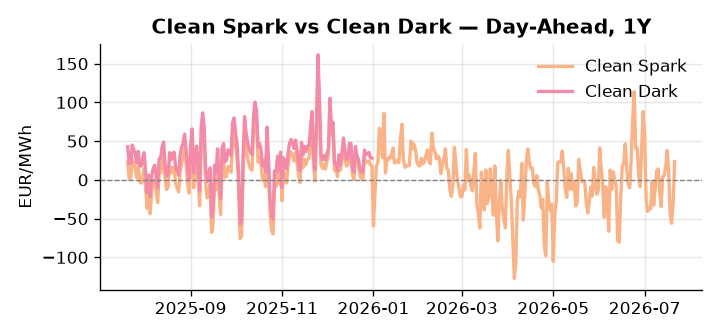
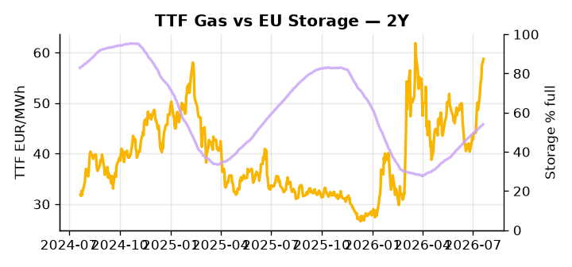

# European Cross-Commodity Risk Pack: Gas + Carbon → Power Curve Implications

**Daily desk brief — 2026-07-21**  
_Author: Sumer Sener · sumerberksener@gmail.com_  
_Generated by `scripts/generate_brief.py`. AI narrative + news themes via Anthropic Claude._

> **Data-freshness caveat:** Clean Dark (last 2025-12-31, 202d old); Coal (last 2025-12-26, 207d old). Numbers below should be read with this in mind.

## 1 · Executive summary

**TL;DR — GB Power at 99th percentile amid tight EU storage (15.5 pp below seasonal); TTF extended +2.7σ on Iran-Hormuz premium, EU carbon reform bearish, US LNG supply upside risk.**

GB Power at the 99th percentile — 160.85 EUR/MWh, a 13.86% daily move — is the dominant signal, pointing to a capacity or import shock that has pulled front-curve risk sharply wider even as TTF trades extended at 58.74 EUR/MWh, +2.7σ above its 50-day trend, with EU storage sitting 15.5 percentage points below seasonal norms at 54% full and sustaining the gas tightness premium. EUA headroom is being actively eroded on the supply side as EU trilogue negotiations move toward longer free allocation through the 2040s — a bearish-EUA policy signal that compresses the coal-to-gas fuel-switch incentive and anchors abatement cost lower across the merit order. With coal data 207 days old and the clean dark spread 202 days stale, dark-spread readings are indicative not bankable, leaving the fuel-mix picture effectively gas-centric. US LNG record exports at 56.3 Bcf/d in 2025 add convergence risk to the TTF front-month, a potential offset to the storage-driven upside bias if the supply glut extends. With Iran-Hormuz tail-risk sustaining the TTF geopolitical premium, gas tightness AND EUA drift lower on reform oversupply AND clean spreads compressed by stale coal parity keep the Cal+1 regime anchored in a gas-dominated, carbon-softening curve — where front-curve risk remains wide until Hormuz escalation or sanctions resolution forces a reassessment.

_Generated by **claude-sonnet-4-6** via Anthropic API (two-pass extract→narrate). Prompts/responses logged to `ai/logs/`._
_Next-5d temperature anomaly — DE -2.1°C / FR +0.8°C / GB +3.6°C vs 5-yr seasonal normal (Open-Meteo)._

## 2 · Monitor metrics

**Primary (cross-commodity headline tiles)**

| Metric | As of | Latest | Unit | 1d Δ | 1w Δ | 5y pctile | Headline |
|---|---|---:|---|---:|---:|---:|---|
| TTF Gas | 2026-07-20 | 58.74 | EUR/MWh | +2.35% | +13.27% | 72 | extended 2.7σ above the 50d trend |
| EU Storage | 2026-07-19 | 54.00 | % full | +0.50% | +2.38% | 28 | 15.5 pp below the 5-yr seasonal average |
| EUA Carbon | 2026-07-20 | 34.25 | EUR/tCO2 | +3.32% | +0.43% | 48 | outsized daily move (+3.32%, 2.9σ) |
| DE Power | 2026-07-21 | 153.81 | EUR/MWh | +50.08% | -10.45% | 80 | Within typical range |
| GB Power | 2026-07-21 | 160.85 | EUR/MWh | +13.86% | +4.29% | 99 | 99th-percentile of 5-yr range — historically high |
| Renewables | 2026-07-20 | 61.69 | % of load | -10.14% | +6.43% | 85 | Within typical range |
| Clean Spark | 2026-07-21 | 23.72 | EUR/MWh | +51.32 | -24.33 | 83 | Within typical range |
| Clean Dark | 2025-12-31 (STALE) | 27.95 | EUR/MWh | -0.56 | +11.63 | 48 | Within typical range |

**Fundamentals inputs** _(feed derived metrics; not separately traded)_

| Metric | As of | Latest | Unit | 1d Δ | 1w Δ | 5y pctile | Headline |
|---|---|---:|---|---:|---:|---:|---|
| Coal | 2025-12-26 (STALE) | 96.00 | USD/t | -0.57% | +0.08% | 7 | 7th-percentile of 5-yr range — historically low |

_Spreads → abs EUR/MWh deltas; others → pct. Weekly Δ uses 5d trailing means. Full history in `data/<metric>.csv`._

## 3 · Gas + LNG arb

**TTF front-month** prints at 58.74 EUR/MWh — _extended 2.7σ above the 50d trend_.
**EU storage** at 54.0% full (-15.5 pp vs 5-yr seasonal avg) — _15.5 pp below the 5-yr seasonal average_.
**TTF − JKM (LNG arb)** at -4.04 EUR/MWh (JKM 21.02 USD/MMBtu) — JKM richer than TTF — Asia pulls cargoes, marginal European tightening risk.

## 4 · Carbon (EU ETS)

**EUA December** prints at 34.25 EUR/tCO2 — _outsized daily move (+3.32%, 2.9σ)_. A euro of EUA adds ~0.37 EUR/MWh to gas-fired and ~0.85 EUR/MWh to coal-fired generation cost; strength compresses the dark spread faster than the spark.

**EU vs UK ETS** — Cobblestone's emissions desk trades EUA and UKA. Post-Brexit auction reform narrowed the UKA discount to EUA from £20+/t to single-digit £/t; CBAM phase-in pulls UK compliance demand toward parity. EUA−UKA basis remains a tradable cross-market signal.

**Supply / policy signal** — _EU loosens ETS rules, allowing industry longer free allocation through 2040s; trilogue negotiations on stringency ongoing._  
Side: `supply` · Polarity: `bearish EUA` · Source: Politico EU Energy

Reduced EUA scarcity via extended free allocation lowers fossil-power generation's carbon compliance cost, depressing merit-order abatement incentive and coal-to-gas switching margin.

_Surfaced from today's news flow by the AI extract pass (`ai/prompts/extract_v1.md` → `carbon_policy_signal`)._

## 5 · Power — Day-Ahead & curve

**DE day-ahead baseload** at 153.81 EUR/MWh — _Within typical range_.
**GB day-ahead baseload** at 160.85 EUR/MWh — _99th-percentile of 5-yr range — historically high_.
**DE − GB spread** at -7.04 EUR/MWh (GB premium) — drives interconnector flow direction.
**Cross-border net flows (Power Transportation):** DE↔FR -49.4 GWh (FR export); GB↔FR -90.5 GWh (FR export); NL↔DE -3.8 GWh (DE export).

**Clean spark spread** at +23.72 EUR/MWh — _Within typical range_. Bridge from gas + carbon fundamentals to gas-fired economics; sustained positive spark = TTF moves transmit directly into the power curve.

**Curve shape:** DA → W+1 → M+1 → Q+1 → Cal+1 → Cal+2 = 154 / 113 / 113 / 113 / 113 / 113 EUR/MWh — **Backwardation** (DA −Cal+1 spread +41 EUR/MWh). Forwards are seasonality projections — see Methodology.

{width=49%} {width=49%}

**This week ahead**

- **Tue** 08:00 UTC — AGSI+ daily storage print: First read on the week's gas injection / withdrawal pace; sets the tone for TTF curve shape.
- **Wed** 09:00 UTC — EEX EUA primary auction (Mon–Thu daily; Wed is largest volume): Supply-side EUA signal; auction clearing relative to spot reads as ETS demand strength.
- **Wed** — ENTSO-E DE_LU + GB next-week wind/solar forecast refresh: Sets the residual-load curve a week out; outsized prints move power Cal+1 directionally.
- **Jul** — EU Russia crude price-cap decision: Sanctions outcome signals escalation trajectory; affects Brent, HFO burn, and indirect TTF substitution pressure. _(news-extracted)_

**Scenarios (24-72h | 1w horizon)**

| | Summary | TTF | DE Power |
|---|---|---:|---:|
| **Base** | GB supply tightens, TTF holds premium on storage deficit; EUA drifts lower on reform oversupply signal. | +2–4% | tracks |
| **Upside** | Iran-Hormuz escalation or EU sanctions ratchet tightens crude; HFO burn lifts gas arb; GB capacity shock deepens. TTF +8–12%, DE Power +5–8%. | +8–12% | +5–8% |
| **Downside** | US LNG supply surge + cooler forecast weakens demand; EU storage refill accelerates. TTF –5–8%, DE Power –3–6%. | –5–8% | –3–6% |

_Illustrative, not forecasts. Magnitudes sized off historical sensitivity; AI-generated from today's extract pass._

## 6 · Today's themes

**Weather watch (next 7d)**
- **Storm · GB · Fri 24 – Mon 27 Jul** — peak gust 41 m/s (~147 km/h) on Sat 25 Jul. GB wind capacity is large — DA likely soft. Cut-off risk if gusts exceed safety thresholds; opposite tail (sudden tightening) possible.
- **Storm · DE · Sun 26 – Mon 27 Jul** — peak gust 54 m/s (~193 km/h) on Mon 27 Jul. Wind generation likely surges Day 1, then risk of turbine cut-off if gusts exceed 25 m/s. Bearish DA early, sharp reversal possible. Watch DE-FR flow swings.

**Watchlist (1–4 weeks)**
- EU ETS / carbon market reform trilogue: Parliament vs. Council negotiations on stringency and phase-out timeline.
- Russia crude price cap decision (end July): outcome will signal sanctions escalation or de-escalation trajectory.

_Risk framing — built within a discipline of clear limits and continuous monitoring; observations here are framed as risk inputs, not directional calls. Positioning decisions remain with the desk._
_Methodology + sources: **README §Methodology**. Numbers auditable via the snapshot JSONs. Rule-based / informational — not investment advice._