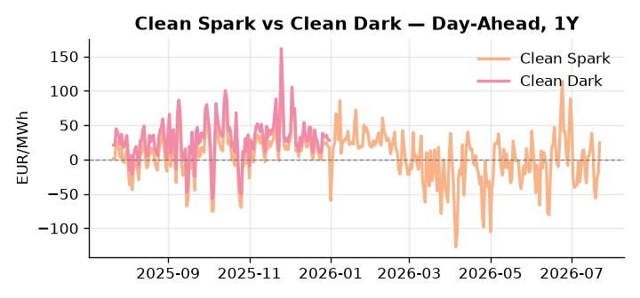
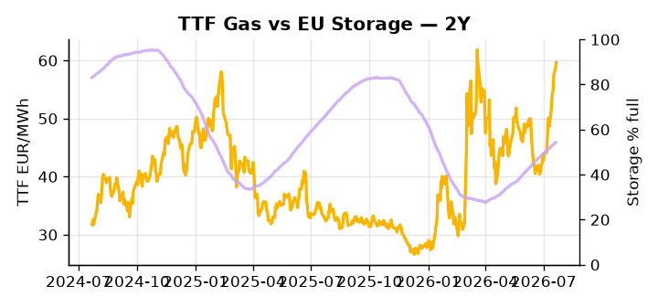

# European Cross-Commodity Risk Pack: Gas + Carbon → Power Curve Implications

**Daily desk brief — 2026-07-22**  
_Author: Sumer Sener · sumerberksener@gmail.com_  
_Generated by `scripts/generate_brief.py`. AI narrative + news themes via Anthropic Claude._

> **Data-freshness caveat:** Clean Dark (last 2025-12-31, 203d old); Coal (last 2025-12-26, 208d old). Numbers below should be read with this in mind.

## 1 · Executive summary

**TL;DR — GB power at 99th-percentile amid Hormuz premium and storage deficit; TTF extended 2.6σ on geopolitical tail-risk, but EU carbon loosening and record LNG supply offer downside anchor.**

GB power at the 99th percentile and TTF extended 2.6σ above its 50-day trend dominate the board, with the Hormuz geopolitical premium sustaining the bid against a storage deficit sitting 15.5 percentage points below seasonal — at 54.2% full, the refill pace is the single most consequential variable for the September–October curve shape. EUA sentiment is increasingly anchored on the bearish-supply side as the EU Commission moves to extend industry free allowances into the 2040s, loosening scarcity and compressing the gas-vs-coal merit-order narrative; with coal at the 7th percentile (96 USD/t), the dark spread at 48th percentile is indicative trend rather than bankable — coal and clean-dark data are 208 and 203 days stale respectively. Clean spark holding the 84th percentile keeps gas-fired dispatch in-the-money on the power side, but the headroom is narrowing as the carbon policy signal turns structurally bearish-EUA and record global LNG supply (56.3 Bcf/d) provides a credible downside anchor to the front-month. With Hormuz tail-risk pulling front-curve risk wider, gas tightness AND a bearish EUA supply signal from the 2040s allowance extension AND a compressed clean-dark spread keep the Cal+1 regime in a precarious elevated hold — one Hormuz de-escalation or accelerated LNG arb unwind away from a sharp regime reset.

_Generated by **claude-sonnet-4-6** via Anthropic API (two-pass extract→narrate). Prompts/responses logged to `ai/logs/`._
_Next-5d temperature anomaly — DE -1.5°C / FR +1.8°C / GB +3.3°C vs 5-yr seasonal normal (Open-Meteo)._

## 2 · Monitor metrics

**Primary (cross-commodity headline tiles)**

| Metric | As of | Latest | Unit | 1d Δ | 1w Δ | 5y pctile | Headline |
|---|---|---:|---|---:|---:|---:|---|
| TTF Gas | 2026-07-21 | 59.66 | EUR/MWh | +1.57% | +13.06% | 73 | extended 2.6σ above the 50d trend |
| EU Storage | 2026-07-20 | 54.20 | % full | +0.33% | +2.27% | 28 | 15.5 pp below the 5-yr seasonal average |
| EUA Carbon | 2026-07-21 | 34.08 | EUR/tCO2 | -0.50% | +0.45% | 47 | Within typical range |
| DE Power | 2026-07-22 | 156.40 | EUR/MWh | +38.99% | -22.72% | 81 | Within typical range |
| GB Power | 2026-07-22 | 149.93 | EUR/MWh | -7.95% | -3.17% | 99 | 99th-percentile of 5-yr range — historically high |
| Renewables | 2026-07-21 | 49.37 | % of load | -19.98% | +18.52% | 65 | Within typical range |
| Clean Spark | 2026-07-22 | 24.53 | EUR/MWh | +43.87 | -42.63 | 84 | Within typical range |
| Clean Dark | 2025-12-31 (STALE) | 27.95 | EUR/MWh | -0.56 | +11.63 | 48 | Within typical range |

**Fundamentals inputs** _(feed derived metrics; not separately traded)_

| Metric | As of | Latest | Unit | 1d Δ | 1w Δ | 5y pctile | Headline |
|---|---|---:|---|---:|---:|---:|---|
| Coal | 2025-12-26 (STALE) | 96.00 | USD/t | -0.57% | +0.08% | 7 | 7th-percentile of 5-yr range — historically low |

_Spreads → abs EUR/MWh deltas; others → pct. Weekly Δ uses 5d trailing means. Full history in `data/<metric>.csv`._

## 3 · Gas + LNG arb

**TTF front-month** prints at 59.66 EUR/MWh — _extended 2.6σ above the 50d trend_.
**EU storage** at 54.2% full (-15.5 pp vs 5-yr seasonal avg) — _15.5 pp below the 5-yr seasonal average_.
**TTF − JKM (LNG arb)** at -4.09 EUR/MWh (JKM 21.33 USD/MMBtu) — JKM richer than TTF — Asia pulls cargoes, marginal European tightening risk.

## 4 · Carbon (EU ETS)

**EUA December** prints at 34.08 EUR/tCO2 — _Within typical range_. A euro of EUA adds ~0.37 EUR/MWh to gas-fired and ~0.85 EUR/MWh to coal-fired generation cost; strength compresses the dark spread faster than the spark.

**EU vs UK ETS** — Cobblestone's emissions desk trades EUA and UKA. Post-Brexit auction reform narrowed the UKA discount to EUA from £20+/t to single-digit £/t; CBAM phase-in pulls UK compliance demand toward parity. EUA−UKA basis remains a tradable cross-market signal.

**Supply / policy signal** — _EU Commission extends industry free pollution allowances to 2040s; loosens carbon market scarcity narrative and fuel-switch incentives._  
Side: `supply` · Polarity: `bearish EUA` · Source: Politico EU Energy

Weaker EUA scarcity reduces gas-vs-coal merit-order spread; compressed clean-dark margin lowers power-plant fuel-switch call on thermal dispatch.

_Surfaced from today's news flow by the AI extract pass (`ai/prompts/extract_v1.md` → `carbon_policy_signal`)._

## 5 · Power — Day-Ahead & curve

**DE day-ahead baseload** at 156.40 EUR/MWh — _Within typical range_.
**GB day-ahead baseload** at 149.93 EUR/MWh — _99th-percentile of 5-yr range — historically high_.
**DE − GB spread** at +6.47 EUR/MWh (DE premium) — drives interconnector flow direction.
**Cross-border net flows (Power Transportation):** DE↔FR -50.1 GWh (FR export); GB↔FR -87.6 GWh (FR export); NL↔DE +5.2 GWh (NL export).

**Clean spark spread** at +24.53 EUR/MWh — _Within typical range_. Bridge from gas + carbon fundamentals to gas-fired economics; sustained positive spark = TTF moves transmit directly into the power curve.

**Curve shape:** DA → W+1 → M+1 → Q+1 → Cal+1 → Cal+2 = 156 / 113 / 113 / 113 / 113 / 113 EUR/MWh — **Backwardation** (DA −Cal+1 spread +43 EUR/MWh). Forwards are seasonality projections — see Methodology.

{width=49%} {width=49%}

**This week ahead**

- **Wed** 09:00 UTC — EEX EUA primary auction (Mon–Thu daily; Wed is largest volume): Supply-side EUA signal; auction clearing relative to spot reads as ETS demand strength.
- **Wed** — ENTSO-E DE_LU + GB next-week wind/solar forecast refresh: Sets the residual-load curve a week out; outsized prints move power Cal+1 directionally.
- **Fri** 14:30 UTC — EIA weekly natural gas storage report: US storage trajectory anchors LNG export pricing into NW Europe — direct TTF transmission.
- **Sep** — NATO fuel pipeline Turkey compromise deadline: Infrastructure delay extends geopolitical uncertainty into Q4 heating-season gas demand curve. _(news-extracted)_

**Scenarios (24-72h | 1w horizon)**

| | Summary | TTF | DE Power |
|---|---|---:|---:|
| **Base** | Hormuz premium persists; storage refill steady; EU carbon policy drift. TTF holds 58–61 range; DE power 150–160. | +2–4% | tracks |
| **Upside** | Hormuz escalation or Strait closing signal; LNG arb widens; storage refill stalls. TTF spike on supply scarcity. | +12–18% | +15–20% |
| **Downside** | Hormuz de-escalation, Middle East tension eases; record LNG supply quenches arb; EU carbon loosening cements bearish fuel-switch. | −8–12% | −10–15% |

_Illustrative, not forecasts. Magnitudes sized off historical sensitivity; AI-generated from today's extract pass._

## 6 · Today's themes

**Weather watch (next 7d)**
- **Storm · DE · Wed 22 – Fri 24 Jul** — peak gust 42 m/s (~152 km/h) on Thu 23 Jul. Wind generation likely surges Day 1, then risk of turbine cut-off if gusts exceed 25 m/s. Bearish DA early, sharp reversal possible. Watch DE-FR flow swings.
- **Storm · FR · Wed 22 – Tue 28 Jul** — peak gust 42 m/s (~152 km/h) on Sat 25 Jul. Strong wind boost to French generation; FR may export to neighbours. DA print likely below seasonal norm; watch FR-GB IFA flow toward GB.

**Watchlist (1–4 weeks)**
- Middle East Strait of Hormuz traffic levels; track 2/3 baseline vs escalation risk to Q3 gas curve.
- EU carbon market policy vote; Parliament/member state push-back on Commission's 2040s pollution allowance extension.

_Risk framing — built within a discipline of clear limits and continuous monitoring; observations here are framed as risk inputs, not directional calls. Positioning decisions remain with the desk._
_Methodology + sources: **README §Methodology**. Numbers auditable via the snapshot JSONs. Rule-based / informational — not investment advice._