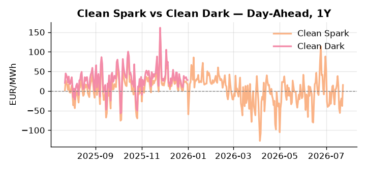
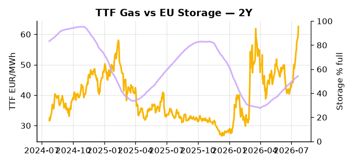

# European Cross-Commodity Risk Pack: Gas + Carbon → Power Curve Implications

**Daily desk brief — 2026-07-23**  
_Author: Sumer Sener · sumerberksener@gmail.com_  
_Generated by `scripts/generate_brief.py`. AI narrative + news themes via Anthropic Claude._

> **Data-freshness caveat:** Clean Dark (last 2025-12-31, 204d old); Coal (last 2025-12-26, 209d old). Numbers below should be read with this in mind.

## 1 · Executive summary

**TL;DR — GB Power at 98th-percentile amid Hormuz escalation and EU sanctions finalized; TTF 2.9σ extended on geopolitical premium; storage 15.6pp below seasonal raises H2 tightness.**

GB Power has reached the 98th percentile at 148.54 EUR/MWh, signalling acute supply-side stress consistent with interconnector congestion or a renewable shortfall, while TTF sits 2.9σ extended above its 50-day trend at 62.54 EUR/MWh as traders price a permanent geopolitical premium through the Hormuz escalation and finalized EU sanctions on Russian transit routing. EU storage at 54.38% full — 15.6 percentage points below the five-year seasonal norm — leaves refill pace into H2 as the critical governor of Q4 power tail risk, with insufficient buffer threatening demand destruction or forced LNG spot bids at elevated arb levels. On the carbon side, EUA demand headroom is being compressed by the approved German nuclear project, which, once online, displaces gas and coal units down the merit order and reduces carbon-intensive generation share — a bearish-EUA supply-side signal that anchors near-term EUA pricing even as gas tightness would ordinarily support it. With coal data 209 days old and the clean-dark spread 204 days stale, the fuel-switch regime is indicative not bankable — verify against live ICE coal before sizing any dark-spread position. Gas tightness at 2.9σ AND EUA demand compressed by incoming nuclear baseload AND clean-dark spreads unverifiable keep the front-curve risk wide on Hormuz tail-pricing while the Cal+1 regime remains hostage to the storage deficit's refill trajectory.

_Generated by **claude-sonnet-4-6** via Anthropic API (two-pass extract→narrate). Prompts/responses logged to `ai/logs/`._
_Next-5d temperature anomaly — DE -1.0°C / FR +2.5°C vs 5-yr seasonal normal (Open-Meteo)._

## 2 · Monitor metrics

**Primary (cross-commodity headline tiles)**

| Metric | As of | Latest | Unit | 1d Δ | 1w Δ | 5y pctile | Headline |
|---|---|---:|---|---:|---:|---:|---|
| TTF Gas | 2026-07-22 | 62.54 | EUR/MWh | +4.82% | +13.90% | 73 | extended 2.9σ above the 50d trend |
| EU Storage | 2026-07-21 | 54.38 | % full | +0.28% | +2.24% | 28 | 15.6 pp below the 5-yr seasonal average |
| EUA Carbon | 2026-07-22 | 35.18 | EUR/tCO2 | +3.23% | +1.14% | 50 | extended 2.9σ above the 50d trend |
| DE Power | 2026-07-23 | 153.40 | EUR/MWh | +53.64% | -16.01% | 80 | Within typical range |
| GB Power | 2026-07-23 | 148.54 | EUR/MWh | -8.95% | +1.41% | 98 | 98th-percentile of 5-yr range — historically high |
| Renewables | 2026-07-22 | 64.09 | % of load | +29.81% | +44.90% | 87 | Within typical range |
| Clean Spark | 2026-07-23 | 15.38 | EUR/MWh | +53.55 | -30.56 | 73 | Within typical range |
| Clean Dark | 2025-12-31 (STALE) | 27.95 | EUR/MWh | -0.56 | +11.63 | 48 | Within typical range |

**Fundamentals inputs** _(feed derived metrics; not separately traded)_

| Metric | As of | Latest | Unit | 1d Δ | 1w Δ | 5y pctile | Headline |
|---|---|---:|---|---:|---:|---:|---|
| Coal | 2025-12-26 (STALE) | 96.00 | USD/t | -0.57% | +0.08% | 7 | 7th-percentile of 5-yr range — historically low |

_Spreads → abs EUR/MWh deltas; others → pct. Weekly Δ uses 5d trailing means. Full history in `data/<metric>.csv`._

## 3 · Gas + LNG arb

**TTF front-month** prints at 62.54 EUR/MWh — _extended 2.9σ above the 50d trend_.
**EU storage** at 54.4% full (-15.6 pp vs 5-yr seasonal avg) — _15.6 pp below the 5-yr seasonal average_.
**TTF − JKM (LNG arb)** at -3.29 EUR/MWh (JKM 22.00 USD/MMBtu) — JKM richer than TTF — Asia pulls cargoes, marginal European tightening risk.

## 4 · Carbon (EU ETS)

**EUA December** prints at 35.18 EUR/tCO2 — _extended 2.9σ above the 50d trend_. A euro of EUA adds ~0.37 EUR/MWh to gas-fired and ~0.85 EUR/MWh to coal-fired generation cost; strength compresses the dark spread faster than the spark.

**EU vs UK ETS** — Cobblestone's emissions desk trades EUA and UKA. Post-Brexit auction reform narrowed the UKA discount to EUA from £20+/t to single-digit £/t; CBAM phase-in pulls UK compliance demand toward parity. EUA−UKA basis remains a tradable cross-market signal.

**Supply / policy signal** — _German nuclear project approved post-safety review; new baseload capacity online timeline TBD — increases non-fossil generation, pressuring German day-ahead and Cal+1 power prices._  
Side: `supply` · Polarity: `bearish EUA` · Source: Politico EU Energy

New nuclear baseload reduces fossil dispatch need; merit-order effect displaces gas and coal units, lowering German marginal generation cost and power-linked EUA demand via lower carbon-intensive generation share.

_Surfaced from today's news flow by the AI extract pass (`ai/prompts/extract_v1.md` → `carbon_policy_signal`)._

## 5 · Power — Day-Ahead & curve

**DE day-ahead baseload** at 153.40 EUR/MWh — _Within typical range_.
**GB day-ahead baseload** at 148.54 EUR/MWh — _98th-percentile of 5-yr range — historically high_.
**DE − GB spread** at +4.86 EUR/MWh (DE premium) — drives interconnector flow direction.
**Cross-border net flows (Power Transportation):** DE↔FR -18.6 GWh (FR export); GB↔FR -82.8 GWh (FR export); NL↔DE -57.4 GWh (DE export).

**Clean spark spread** at +15.38 EUR/MWh — _Within typical range_. Bridge from gas + carbon fundamentals to gas-fired economics; sustained positive spark = TTF moves transmit directly into the power curve.

**Curve shape:** DA → W+1 → M+1 → Q+1 → Cal+1 → Cal+2 = 153 / 111 / 111 / 111 / 111 / 111 EUR/MWh — **Backwardation** (DA −Cal+1 spread +42 EUR/MWh). Forwards are seasonality projections — see Methodology.

{width=49%} {width=49%}

**This week ahead**

- **Fri** 14:30 UTC — EIA weekly natural gas storage report: US storage trajectory anchors LNG export pricing into NW Europe — direct TTF transmission.
- **Thu** 14:30 UTC — US EIA weekly crude inventories: Crude — and via crack spreads, refined-products — feed back into LNG arb economics.
- **Fri** — ENTSO-E weekly day-ahead volumes / system-balance summary: Reads the European generation mix in last 7d — confirms or breaks the Cal+1 thesis.
- **TBD** — Hormuz escalation or Trump/Iran military action: LNG supply shock; direct upside to TTF and power spreads; watch for shipping insecurity premium. _(news-extracted)_

**Scenarios (24-72h | 1w horizon)**

| | Summary | TTF | DE Power |
|---|---|---:|---:|
| **Base** | Geopolitical premium persists; storage refill gradual; GB Power elevated but within historical band. | +0-3% | tracks |
| **Upside** | Hormuz closure or major LNG tanker damage; Middle East escalation spreads; Asian LNG spot surges, tightening EU arb. | +8-15% | +5-12% |
| **Downside** | Hormuz reopens or geopolitical tension de-escalates; EU methane regulation bluff called; oversupply relief and storage build accelerates. | -5-10% | -3-8% |

_Illustrative, not forecasts. Magnitudes sized off historical sensitivity; AI-generated from today's extract pass._

## 6 · Today's themes

**Weather watch (next 7d)**
- **Storm · DE · Thu 23 – Fri 24 Jul** — peak gust 45 m/s (~163 km/h) on Thu 23 Jul. Wind generation likely surges Day 1, then risk of turbine cut-off if gusts exceed 25 m/s. Bearish DA early, sharp reversal possible. Watch DE-FR flow swings.
- **Storm · FR · Sat 25 – Tue 28 Jul** — peak gust 41 m/s (~147 km/h) on Sat 25 Jul. Strong wind boost to French generation; FR may export to neighbours. DA print likely below seasonal norm; watch FR-GB IFA flow toward GB.

**Watchlist (1–4 weeks)**
- Middle East Strait of Hormuz disruption escalation; monitor Trump/Iran military actions for LNG supply shocks.
- EU methane regulation implementation timeline and exporter push-back; supply contraction risk to TTF.

_Risk framing — built within a discipline of clear limits and continuous monitoring; observations here are framed as risk inputs, not directional calls. Positioning decisions remain with the desk._
_Methodology + sources: **README §Methodology**. Numbers auditable via the snapshot JSONs. Rule-based / informational — not investment advice._