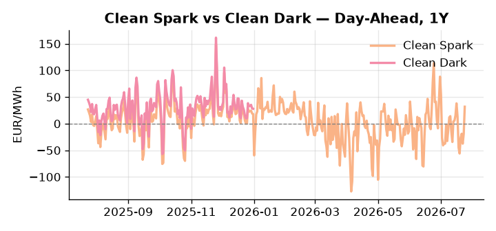
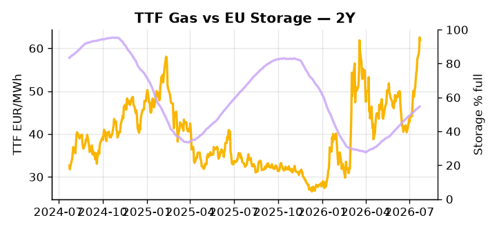

# European Cross-Commodity Risk Pack: Gas + Carbon → Power Curve Implications

**Daily desk brief — 2026-07-24**  
_Author: Sumer Sener · sumerberksener@gmail.com_  
_Generated by `scripts/generate_brief.py`. AI narrative + news themes via Anthropic Claude._

> **Data-freshness caveat:** Clean Dark (last 2025-12-31, 205d old); Coal (last 2025-12-26, 210d old). Numbers below should be read with this in mind.

## 1 · Executive summary

**TL;DR — GB power at 98th percentile (155 EUR/MWh) on tight supply; storage 16pp below seasonal; Hormuz risk and EU sanctions clarity lift TTF—watch refill pace and LNG arbitrage.**

GB power at 155 EUR/MWh (98th percentile) is the dominant signal, with structural island tightness driving an acute supply-demand imbalance as TTF trades extended at 61.9 EUR/MWh (73rd percentile, +2.5σ above its 50-day trend), underpinned by EU storage sitting 15.7 percentage points below seasonal norms at the 28th percentile. EUA at 34.17 EUR/t (47th percentile) recorded a 2.5σ daily selloff, and with German nuclear regulatory approval easing power-side demand and reducing marginal gas-dispatch generation, the carbon policy signal is bearish-EUA on the supply side — compressing EUA floor support and fuel-switch economics. Clean spark at the 89th percentile (31.85 EUR/MWh) confirms gas firmly in-the-money for marginal generation, while coal at the 7th percentile (96 USD/t) offers little competitive displacement pressure — with coal data 210 days old and clean dark at 205 days stale, the dark spread reads at the 48th percentile but is indicative only, not bankable. Renewables at the 85th percentile (62.31% share, +28.6% week-on-week) are suppressing DA in continental markets but leave GB structurally decoupled, exposing the desk to sharp regional asymmetry on any wind reversal. With Hormuz tail-risk repricing LNG spot and storage refill headroom compressed, gas tightness AND EUA bearish-supply anchored mid-range AND clean spark in-the-money keep the front-curve risk regime bid — but Hormuz escalation is the single event that widens the GB-continent spark differential and tests the Cal+1 structure.

_Generated by **claude-sonnet-4-6** via Anthropic API (two-pass extract→narrate). Prompts/responses logged to `ai/logs/`._
_Next-5d temperature anomaly — DE -0.7°C / GB +3.7°C vs 5-yr seasonal normal (Open-Meteo)._

## 2 · Monitor metrics

**Primary (cross-commodity headline tiles)**

| Metric | As of | Latest | Unit | 1d Δ | 1w Δ | 5y pctile | Headline |
|---|---|---:|---|---:|---:|---:|---|
| TTF Gas | 2026-07-23 | 61.90 | EUR/MWh | -1.02% | +14.58% | 73 | extended 2.5σ above the 50d trend |
| EU Storage | 2026-07-22 | 54.61 | % full | +0.37% | +2.27% | 28 | 15.7 pp below the 5-yr seasonal average |
| EUA Carbon | 2026-07-23 | 34.17 | EUR/tCO2 | -2.87% | +1.93% | 47 | outsized daily move (-2.87%, 2.5σ) |
| DE Power | 2026-07-24 | 168.22 | EUR/MWh | +43.44% | +1.99% | 83 | Within typical range |
| GB Power | 2026-07-24 | 155.31 | EUR/MWh | +5.78% | +18.44% | 98 | 98th-percentile of 5-yr range — historically high |
| Renewables | 2026-07-23 | 62.31 | % of load | -2.78% | +28.63% | 85 | Within typical range |
| Clean Spark | 2026-07-24 | 31.85 | EUR/MWh | +50.94 | -7.44 | 89 | Within typical range |
| Clean Dark | 2025-12-31 (STALE) | 27.95 | EUR/MWh | -0.56 | +11.63 | 48 | Within typical range |

**Fundamentals inputs** _(feed derived metrics; not separately traded)_

| Metric | As of | Latest | Unit | 1d Δ | 1w Δ | 5y pctile | Headline |
|---|---|---:|---|---:|---:|---:|---|
| Coal | 2025-12-26 (STALE) | 96.00 | USD/t | -0.57% | +0.08% | 7 | 7th-percentile of 5-yr range — historically low |

_Spreads → abs EUR/MWh deltas; others → pct. Weekly Δ uses 5d trailing means. Full history in `data/<metric>.csv`._

## 3 · Gas + LNG arb

**TTF front-month** prints at 61.90 EUR/MWh — _extended 2.5σ above the 50d trend_.
**EU storage** at 54.6% full (-15.7 pp vs 5-yr seasonal avg) — _15.7 pp below the 5-yr seasonal average_.
**TTF − JKM (LNG arb)** at -3.36 EUR/MWh (JKM 21.83 USD/MMBtu) — JKM richer than TTF — Asia pulls cargoes, marginal European tightening risk.

## 4 · Carbon (EU ETS)

**EUA December** prints at 34.17 EUR/tCO2 — _outsized daily move (-2.87%, 2.5σ)_. A euro of EUA adds ~0.37 EUR/MWh to gas-fired and ~0.85 EUR/MWh to coal-fired generation cost; strength compresses the dark spread faster than the spark.

**EU vs UK ETS** — Cobblestone's emissions desk trades EUA and UKA. Post-Brexit auction reform narrowed the UKA discount to EUA from £20+/t to single-digit £/t; CBAM phase-in pulls UK compliance demand toward parity. EUA−UKA basis remains a tradable cross-market signal.

**Supply / policy signal** — _German nuclear capacity addition (Moscow-linked northwest project) regulatory approval eases power demand; reduces marginal gas-dispatch generation and DA spread pressure._  
Side: `supply` · Polarity: `bearish EUA` · Source: Politico EU Energy

Lower gas-marginal generation dispatch reduces thermal emissions and EUA demand; DA curve shape flattens, diminishing fuel-switch economics and EUA floor support from power upside.

_Surfaced from today's news flow by the AI extract pass (`ai/prompts/extract_v1.md` → `carbon_policy_signal`)._

## 5 · Power — Day-Ahead & curve

**DE day-ahead baseload** at 168.22 EUR/MWh — _Within typical range_.
**GB day-ahead baseload** at 155.31 EUR/MWh — _98th-percentile of 5-yr range — historically high_.
**DE − GB spread** at +12.91 EUR/MWh (DE premium) — drives interconnector flow direction.
**Cross-border net flows (Power Transportation):** DE↔FR -29.3 GWh (FR export); GB↔FR -81.8 GWh (FR export); NL↔DE -28.5 GWh (DE export).

**Clean spark spread** at +31.85 EUR/MWh — _Within typical range_. Bridge from gas + carbon fundamentals to gas-fired economics; sustained positive spark = TTF moves transmit directly into the power curve.

**Curve shape:** DA → W+1 → M+1 → Q+1 → Cal+1 → Cal+2 = 168 / 112 / 112 / 112 / 112 / 112 EUR/MWh — **Backwardation** (DA −Cal+1 spread +56 EUR/MWh). Forwards are seasonality projections — see Methodology.

{width=49%} {width=49%}

**This week ahead**

- **Fri** 14:30 UTC — EIA weekly natural gas storage report: US storage trajectory anchors LNG export pricing into NW Europe — direct TTF transmission.
- **Fri** — ENTSO-E weekly day-ahead volumes / system-balance summary: Reads the European generation mix in last 7d — confirms or breaks the Cal+1 thesis.
- **Tue** 08:00 UTC — AGSI+ daily storage print: First read on the week's gas injection / withdrawal pace; sets the tone for TTF curve shape.
- **Fri** — EU sanctions implementation timeline: Politico report—Greek concession clinches deal. Timetable for Russian gas reroute logistics and third-country flow diversion will reset LNG arb expectations and TTF medium-term curve shape. _(news-extracted)_

**Scenarios (1w horizon)**

| | Summary | TTF | DE Power |
|---|---|---:|---:|
| **Base** | GB supply tensions persist; TTF holds elevated on storage deficit and LNG arb. DA soft from renewables; Q4 power tracks storage refill pace. | ±3-5% | ±2-4% |
| **Upside** | Hormuz escalates or Strait transits disrupted. Asian LNG spot surges; EU refill costs spike; storage premium reasserts. GB wind output falters. | +8-12% | +6-10% |
| **Downside** | Middle East de-escalates; EU sanctions clear Russian supply channels; LNG arb reverses. GB wind normalizes; renewable share falls; demand softens; storage refill eases. | -7-10% | -5-8% |

_Illustrative, not forecasts. Magnitudes sized off historical sensitivity; AI-generated from today's extract pass._

## 6 · Today's themes

**Weather watch (next 7d)**
- **Storm · DE · Fri 24 – Mon 27 Jul** — peak gust 49 m/s (~175 km/h) on Mon 27 Jul. Wind generation likely surges Day 1, then risk of turbine cut-off if gusts exceed 25 m/s. Bearish DA early, sharp reversal possible. Watch DE-FR flow swings.
- **Storm · GB · Fri 24 – Mon 27 Jul** — peak gust 47 m/s (~168 km/h) on Sun 26 Jul. GB wind capacity is large — DA likely soft. Cut-off risk if gusts exceed safety thresholds; opposite tail (sudden tightening) possible.

**Watchlist (1–4 weeks)**
- EU Russia sanctions implementation timetable and third-country gas rerouting logistics.
- Iran–US escalation trajectory; Strait of Hormuz transit disruption risk to LNG flows.

_Risk framing — built within a discipline of clear limits and continuous monitoring; observations here are framed as risk inputs, not directional calls. Positioning decisions remain with the desk._
_Methodology + sources: **README §Methodology**. Numbers auditable via the snapshot JSONs. Rule-based / informational — not investment advice._