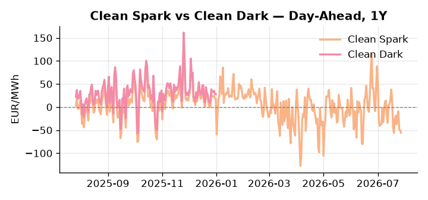
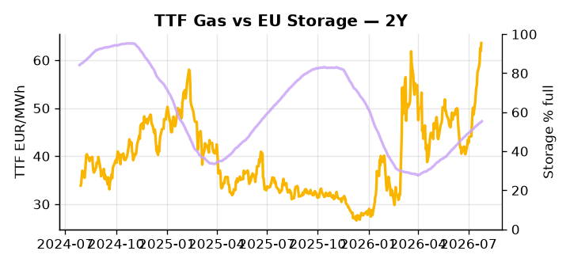

# European Cross-Commodity Risk Pack: Gas + Carbon → Power Curve Implications

**Daily desk brief — 2026-07-27**  
_Author: Sumer Sener · sumerberksener@gmail.com_  
_Generated by `scripts/generate_brief.py`. AI narrative + news themes via Anthropic Claude._

> **Data-freshness caveat:** Clean Dark (last 2025-12-31, 208d old); Coal (last 2025-12-26, 213d old). Numbers below should be read with this in mind.

## 1 · Executive summary

**TL;DR — TTF extended 2.6σ above 50d trend amid Hormuz escalation fears; EU storage 15.9pp below seasonal average supports gas rally despite Mexico LNG supply relief.**

TTF is extended 2.6σ above its 50-day trend at 63.58 EUR/MWh (73rd percentile), with Hormuz escalation fears embedding a live geopolitical risk premium as Iran-US tensions keep LNG supply routes under active scrutiny. EU storage at 55.35% — 15.9pp below seasonal average and at the 29th percentile — compounds the tightness narrative, leaving the market structurally exposed to any summer demand spike that could stall injection pace and extend H2 scarcity premium. Mexico's new 0.4 Bcf/d Energia Costa Azul capacity offers a structural offset but remains 2–3 months from first European terminal delivery, providing no near-term headroom. With coal data 213 days stale and the clean dark spread (27.95 EUR/MWh, 48th percentile) similarly aged at 208 days, thermal merit-order economics are indicative not bankable, and the true fuel-switch threshold under current gas costs cannot be confirmed. Gas tightness at the 73rd percentile anchored by Hormuz tail-risk, EUA at mid-range, and clean spreads whose bankability is compromised keep the front-curve risk wide and the Cal+1 regime contingent on Strait of Hormuz transit confirmation — any confirmed LNG voyage disruption pulls front-curve risk sharply wider with no dark spread compression to absorb it.

_Generated by **claude-sonnet-4-6** via Anthropic API (two-pass extract→narrate). Prompts/responses logged to `ai/logs/`._
_Next-5d temperature anomaly — DE +2.7°C / FR +4.7°C vs 5-yr seasonal normal (Open-Meteo)._

## 2 · Monitor metrics

**Primary (cross-commodity headline tiles)**

| Metric | As of | Latest | Unit | 1d Δ | 1w Δ | 5y pctile | Headline |
|---|---|---:|---|---:|---:|---:|---|
| TTF Gas | 2026-07-24 | 63.58 | EUR/MWh | +2.71% | +13.17% | 73 | extended 2.6σ above the 50d trend |
| EU Storage | 2026-07-25 | 55.35 | % full | +0.51% | +2.13% | 29 | 15.9 pp below the 5-yr seasonal average |
| EUA Carbon | 2026-07-23 | 34.17 | EUR/tCO2 | -2.87% | +1.93% | 47 | outsized daily move (-2.87%, 2.5σ) |
| DE Power | 2026-07-27 | 84.26 | EUR/MWh | -5.91% | +9.18% | 33 | Within typical range |
| GB Power | 2026-07-27 | 98.97 | EUR/MWh | +31.63% | -20.25% | 53 | Within typical range |
| Renewables | 2026-07-26 | 56.50 | % of load | +1.16% | -1.02% | 78 | Within typical range |
| Clean Spark | 2026-07-27 | -55.46 | EUR/MWh | -5.29 | +0.37 | 14 | Within typical range |
| Clean Dark | 2025-12-31 (STALE) | 27.95 | EUR/MWh | -0.56 | +11.63 | 48 | Within typical range |

**Fundamentals inputs** _(feed derived metrics; not separately traded)_

| Metric | As of | Latest | Unit | 1d Δ | 1w Δ | 5y pctile | Headline |
|---|---|---:|---|---:|---:|---:|---|
| Coal | 2025-12-26 (STALE) | 96.00 | USD/t | -0.57% | +0.08% | 7 | 7th-percentile of 5-yr range — historically low |

_Spreads → abs EUR/MWh deltas; others → pct. Weekly Δ uses 5d trailing means. Full history in `data/<metric>.csv`._

## 3 · Gas + LNG arb

**TTF front-month** prints at 63.58 EUR/MWh — _extended 2.6σ above the 50d trend_.
**EU storage** at 55.4% full (-15.9 pp vs 5-yr seasonal avg) — _15.9 pp below the 5-yr seasonal average_.
**TTF − JKM (LNG arb)** at -2.41 EUR/MWh (JKM 22.00 USD/MMBtu) — JKM richer than TTF — Asia pulls cargoes, marginal European tightening risk.

## 4 · Carbon (EU ETS)

**EUA December** prints at 34.17 EUR/tCO2 — _outsized daily move (-2.87%, 2.5σ)_. A euro of EUA adds ~0.37 EUR/MWh to gas-fired and ~0.85 EUR/MWh to coal-fired generation cost; strength compresses the dark spread faster than the spark.

**EU vs UK ETS** — Cobblestone's emissions desk trades EUA and UKA. Post-Brexit auction reform narrowed the UKA discount to EUA from £20+/t to single-digit £/t; CBAM phase-in pulls UK compliance demand toward parity. EUA−UKA basis remains a tradable cross-market signal.

**Supply / policy signal** — _CBAM full operational phase live since 1 Jan 2026 — importers paying for embedded emissions_  
Side: `policy` · Polarity: `bullish EUA` · Source: EU Regulation 2023/956 (CBAM)

Domestic carbon-cost burden gradually levelled with imports; supports EUA demand floor as carbon leakage protection tightens through 2034.

_No ETS-relevant news surfaced today — falling back to `data/policy_facts.py` (hand-maintained structural fact pack). Fact pack last reviewed 2026-05-08 (80d ago)._

## 5 · Power — Day-Ahead & curve

**DE day-ahead baseload** at 84.26 EUR/MWh — _Within typical range_.
**GB day-ahead baseload** at 98.97 EUR/MWh — _Within typical range_.
**DE − GB spread** at -14.71 EUR/MWh (GB premium) — drives interconnector flow direction.
**Cross-border net flows (Power Transportation):** DE↔FR -53.5 GWh (FR export); GB↔FR -74.4 GWh (FR export); NL↔DE -13.6 GWh (DE export).

**Clean spark spread** at -55.46 EUR/MWh — _Within typical range_. Bridge from gas + carbon fundamentals to gas-fired economics; sustained positive spark = TTF moves transmit directly into the power curve.

**Curve shape:** DA → W+1 → M+1 → Q+1 → Cal+1 → Cal+2 = 84 / 102 / 102 / 102 / 102 / 102 EUR/MWh — **Contango** (DA −Cal+1 spread -18 EUR/MWh). Forwards are seasonality projections — see Methodology.

{width=49%} {width=49%}

**This week ahead**

- **Tue** 08:00 UTC — AGSI+ daily storage print: First read on the week's gas injection / withdrawal pace; sets the tone for TTF curve shape.
- **Wed** 09:00 UTC — EEX EUA primary auction (Mon–Thu daily; Wed is largest volume): Supply-side EUA signal; auction clearing relative to spot reads as ETS demand strength.
- **Wed** — ENTSO-E DE_LU + GB next-week wind/solar forecast refresh: Sets the residual-load curve a week out; outsized prints move power Cal+1 directionally.
- **ongoing** — EU Russia sanctions implementation: Crude cap frozen 12mo; gas transit policy clarity reduces near-term policy shock risk but geopolitical tail remains. _(news-extracted)_
- **ongoing** — Strait of Hormuz LNG voyage tracking: Real-time escalation monitor; any confirmed delay lifts global LNG premium and EU marginal cost immediately. _(news-extracted)_

**Scenarios (1w horizon)**

| | Summary | TTF | DE Power |
|---|---|---:|---:|
| **Base** | TTF holds 60–66 EUR/MWh amid balanced Hormuz risk premium and storage refill momentum; DE power tracks gas-weighted 82–88 EUR/MWh. | +2–5% | tracks |
| **Upside** | Hormuz closure or major LNG voyage disruption confirmed; TTF spikes on supply shock; storage deficit narrative intensifies. | +12–18% | +8–12% |
| **Downside** | Iran-US tensions de-escalate or Strait access confirmed safe; Mexico LNG ramp accelerates; storage refill exceeds seasonal pace. | −8–12% | −6–10% |

_Illustrative, not forecasts. Magnitudes sized off historical sensitivity; AI-generated from today's extract pass._

## 6 · Today's themes

**Weather watch (next 7d)**
- **Storm · DE · Mon 27 – Wed 29 Jul** — peak gust 51 m/s (~184 km/h) on Mon 27 Jul. Wind generation likely surges Day 1, then risk of turbine cut-off if gusts exceed 25 m/s. Bearish DA early, sharp reversal possible. Watch DE-FR flow swings.
- **Heat dome · FR · Tue 28 – Thu 30 Jul** — peak +8.8°C vs normal. Bullish FR power on AC load and possible nuclear river-cooling derating. Watch FR-nuclear availability prints if heat persists.

**Watchlist (1–4 weeks)**
- EU Russia sanctions implementation timeline and any further gas transit clarifications.
- Iran–US escalation in Strait of Hormuz; monitor for LNG voyage delays, spot LNG premiums.

_Risk framing — built within a discipline of clear limits and continuous monitoring; observations here are framed as risk inputs, not directional calls. Positioning decisions remain with the desk._
_Methodology + sources: **README §Methodology**. Numbers auditable via the snapshot JSONs. Rule-based / informational — not investment advice._