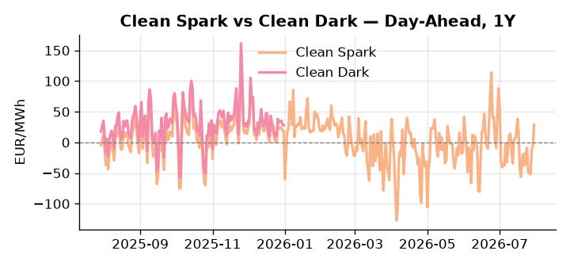
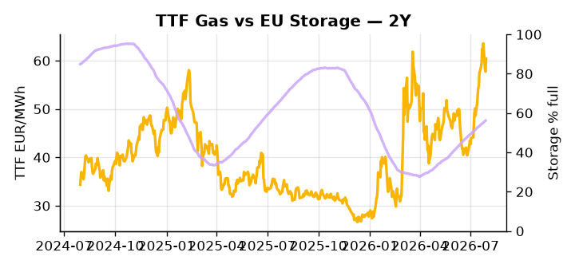

# European Cross-Commodity Risk Pack: Gas + Carbon → Power Curve Implications

**Daily desk brief — 2026-07-30**  
_Author: Sumer Sener · sumerberksener@gmail.com_  
_Generated by `scripts/generate_brief.py`. AI narrative + news themes via Anthropic Claude._

> **Data-freshness caveat:** Clean Dark (last 2025-12-31, 211d old); Coal (last 2025-12-26, 216d old). Numbers below should be read with this in mind.

## 1 · Executive summary

**TL;DR — GB Power at 96th percentile (143.47 EUR/MWh) dominates; EU storage 16 pp below seasonal average; TTF +4.65% on sanctions resolution and NATO infrastructure deal supporting geopolitical stability.**

GB Power at 143.47 EUR/MWh — 96th percentile — is the dominant signal, reflecting tight generation margins with renewable share at 48.87% and EU storage running 16 percentage points below seasonal average at 56.15% full, a structural deficit that keeps the H2 refill pace critical for the entire power curve. TTF extended 4.65% on sanctions resolution and the NATO €27B fuel infrastructure deal, with the Greek shipping concession unlocking a clearer hedging horizon on Russian flows, though Mexico's second LNG terminal adding 0.4 Bcf/d introduces a competing arb force that could compress the import premium in the weeks ahead. With coal data 216 days old at the 7th percentile and clean-dark spreads 211 days stale, the fuel-switch merit order and coal-gas arb are indicative not bankable, leaving the spark spread as the actionable clean-spread reference. The Spain wildfire — 100,000-plus displaced with firefighting gaps reported — holds live upside tail risk to Iberian thermal and hydro assets, with any transmission or generation loss capable of spiking day-ahead spreads materially this week. Gas tightness anchored by the storage deficit AND EUA headroom in mid-range AND clean-dark visibility impaired keep the curve in an extended front-month premium regime, with the NATO infrastructure deal resolving enough sanctions tail-risk to hold Cal+1 compressed but the Spain wildfire threatening to pull front-curve risk wider if Iberian generation loss materialises.

_Generated by **claude-sonnet-4-6** via Anthropic API (two-pass extract→narrate). Prompts/responses logged to `ai/logs/`._
_Next-5d temperature anomaly — DE +4.5°C / FR +5.8°C vs 5-yr seasonal normal (Open-Meteo)._

## 2 · Monitor metrics

**Primary (cross-commodity headline tiles)**

| Metric | As of | Latest | Unit | 1d Δ | 1w Δ | 5y pctile | Headline |
|---|---|---:|---|---:|---:|---:|---|
| TTF Gas | 2026-07-29 | 60.42 | EUR/MWh | +4.65% | +2.99% | 72 | Within typical range |
| EU Storage | 2026-07-28 | 56.15 | % full | +0.36% | +2.26% | 31 | 16.0 pp below the 5-yr seasonal average |
| EUA Carbon | 2026-07-29 | 33.44 | EUR/tCO2 | -0.12% | -0.57% | 41 | Within typical range |
| DE Power | 2026-07-30 | 162.16 | EUR/MWh | +28.31% | +3.60% | 82 | Within typical range |
| GB Power | 2026-07-30 | 143.47 | EUR/MWh | -4.32% | -12.19% | 96 | 96th-percentile of 5-yr range — historically high |
| Renewables | 2026-07-29 | 48.87 | % of load | -2.55% | +0.32% | 63 | Within typical range |
| Clean Spark | 2026-07-30 | 29.01 | EUR/MWh | +35.78 | +8.56 | 87 | Within typical range |
| Clean Dark | 2025-12-31 (STALE) | 27.95 | EUR/MWh | -0.56 | +11.63 | 48 | Within typical range |

**Fundamentals inputs** _(feed derived metrics; not separately traded)_

| Metric | As of | Latest | Unit | 1d Δ | 1w Δ | 5y pctile | Headline |
|---|---|---:|---|---:|---:|---:|---|
| Coal | 2025-12-26 (STALE) | 96.00 | USD/t | -0.57% | +0.08% | 7 | 7th-percentile of 5-yr range — historically low |

_Spreads → abs EUR/MWh deltas; others → pct. Weekly Δ uses 5d trailing means. Full history in `data/<metric>.csv`._

## 3 · Gas + LNG arb

**TTF front-month** prints at 60.42 EUR/MWh — _Within typical range_.
**EU storage** at 56.1% full (-16.0 pp vs 5-yr seasonal avg) — _16.0 pp below the 5-yr seasonal average_.
**TTF − JKM (LNG arb)** at -3.80 EUR/MWh (JKM 21.43 USD/MMBtu) — JKM richer than TTF — Asia pulls cargoes, marginal European tightening risk.

## 4 · Carbon (EU ETS)

**EUA December** prints at 33.44 EUR/tCO2 — _Within typical range_. A euro of EUA adds ~0.37 EUR/MWh to gas-fired and ~0.85 EUR/MWh to coal-fired generation cost; strength compresses the dark spread faster than the spark.

**EU vs UK ETS** — Cobblestone's emissions desk trades EUA and UKA. Post-Brexit auction reform narrowed the UKA discount to EUA from £20+/t to single-digit £/t; CBAM phase-in pulls UK compliance demand toward parity. EUA−UKA basis remains a tradable cross-market signal.

**Supply / policy signal** — _CBAM full operational phase live since 1 Jan 2026 — importers paying for embedded emissions_  
Side: `policy` · Polarity: `bullish EUA` · Source: EU Regulation 2023/956 (CBAM)

Domestic carbon-cost burden gradually levelled with imports; supports EUA demand floor as carbon leakage protection tightens through 2034.

_No ETS-relevant news surfaced today — falling back to `data/policy_facts.py` (hand-maintained structural fact pack). Fact pack last reviewed 2026-05-08 (83d ago)._

## 5 · Power — Day-Ahead & curve

**DE day-ahead baseload** at 162.16 EUR/MWh — _Within typical range_.
**GB day-ahead baseload** at 143.47 EUR/MWh — _96th-percentile of 5-yr range — historically high_.
**DE − GB spread** at +18.69 EUR/MWh (DE premium) — drives interconnector flow direction.
**Cross-border net flows (Power Transportation):** DE↔FR -40.8 GWh (FR export); GB↔FR -79.8 GWh (FR export); NL↔DE +2.9 GWh (NL export).

**Clean spark spread** at +29.01 EUR/MWh — _Within typical range_. Bridge from gas + carbon fundamentals to gas-fired economics; sustained positive spark = TTF moves transmit directly into the power curve.

**Curve shape:** DA → W+1 → M+1 → Q+1 → Cal+1 → Cal+2 = 162 / 110 / 110 / 110 / 110 / 110 EUR/MWh — **Backwardation** (DA −Cal+1 spread +52 EUR/MWh). Forwards are seasonality projections — see Methodology.

{width=49%} {width=49%}

**This week ahead**

- **Fri** 14:30 UTC — EIA weekly natural gas storage report: US storage trajectory anchors LNG export pricing into NW Europe — direct TTF transmission.
- **Thu** 14:30 UTC — US EIA weekly crude inventories: Crude — and via crack spreads, refined-products — feed back into LNG arb economics.
- **Fri** — ENTSO-E weekly day-ahead volumes / system-balance summary: Reads the European generation mix in last 7d — confirms or breaks the Cal+1 thesis.
- **Wed** — Spain wildfire impact assessment: Grid stability and thermal/hydro asset damage risk; demand surge from emergency response could support power spreads. _(news-extracted)_

**Scenarios (24-72h horizon)**

| | Summary | TTF | DE Power |
|---|---|---:|---:|
| **Base** | GB Power remains elevated on storage stress; TTF stable near 60.42 EUR/MWh with sanctions risk priced; Spanish heatwave contained. | ±1-2% | tracks |
| **Upside** | Spain wildfire spreads to Iberian thermal assets or transmission; emergency demand spike and generation loss support GB-DE power rally. | +3-5% | +5-8% |
| **Downside** | EU Russia sanctions implementation timeline slips; NATO fuel infrastructure funding reallocated; Mexico LNG ramp accelerates, TTF arb widens. | -4-7% | -2-4% |

_Illustrative, not forecasts. Magnitudes sized off historical sensitivity; AI-generated from today's extract pass._

## 6 · Today's themes

**Weather watch (next 7d)**
- **Heat dome · DE · Thu 30 – Fri 31 Jul** — peak +8.8°C vs normal. Mild bullish DE power on cooling load, but gas demand softens. Spark spread compresses; renewables (solar) likely strong — watch DA print fall midday.
- **Heat dome · FR · Thu 30 – Wed 05 Aug** — peak +9.1°C vs normal. Bullish FR power on AC load and possible nuclear river-cooling derating. Watch FR-nuclear availability prints if heat persists.

**Watchlist (1–4 weeks)**
- EU Russia sanctions package implementation and LNG shipping exemption scope details.
- Spanish wildfire impact assessment on thermal generation and grid stability this week.

_Risk framing — built within a discipline of clear limits and continuous monitoring; observations here are framed as risk inputs, not directional calls. Positioning decisions remain with the desk._
_Methodology + sources: **README §Methodology**. Numbers auditable via the snapshot JSONs. Rule-based / informational — not investment advice._