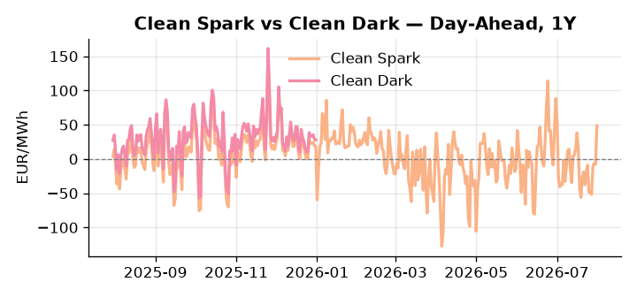
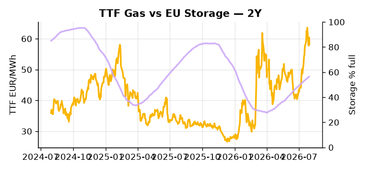

# European Cross-Commodity Risk Pack: Gas + Carbon → Power Curve Implications

**Daily desk brief — 2026-07-31**  
_Author: Sumer Sener · sumerberksener@gmail.com_  
_Generated by `scripts/generate_brief.py`. AI narrative + news themes via Anthropic Claude._

> **Data-freshness caveat:** Clean Dark (last 2025-12-31, 212d old); Coal (last 2025-12-26, 217d old). Numbers below should be read with this in mind.

## 1 · Executive summary

**TL;DR — GB Power at 97th-percentile amid Spanish wildfire grid-damage risk; Clean Spark at 95th-percentile signals tight thermal merit order despite coal at 7th-percentile lows and storage 16 pp below seasonal.**

GB Power at the 97th percentile (146.72 EUR/MWh) is the dominant signal, driven by Spanish and French wildfire grid-damage risk that has tightened the near-term thermal merit order and elevated the island-isolation premium to extreme levels, while DE Power at the 84th percentile (177.28 EUR/MWh) confirms the continental stress is broadly shared. Clean Spark holding at the 95th percentile against coal at only the 7th percentile marks a sharply compressed and inverted merit order — spark spread is elevated on tail-risk premium, not on underlying fuel economics. Storage at 56.39% full sits 16.1 percentage points below the five-year seasonal norm, leaving the refill window through Q3 as the governing variable for winter curve steepness and Cal+1 thermal call. With coal data 217 days old and clean-dark figures 212 days old, the dark spread is indicative not bankable, and any coal-side leverage read must be treated as stale. Gas tightness anchored by below-seasonal storage AND EUA mid-range holding steady AND clean spark in-the-money but merit-order compressed by cheap coal point to a front-curve risk-premium regime, and with Hormuz tail-risk unresolved — partially offset by Mexico LNG Phase 1 arb flows capping TTF winter upside — the front-curve remains extended while the Cal+1 regime stays contingent on wildfire containment and storage refill pace through autumn.

_Generated by **claude-sonnet-4-6** via Anthropic API (two-pass extract→narrate). Prompts/responses logged to `ai/logs/`._
_Next-5d temperature anomaly — DE +4.1°C / FR +5.5°C vs 5-yr seasonal normal (Open-Meteo)._

## 2 · Monitor metrics

**Primary (cross-commodity headline tiles)**

| Metric | As of | Latest | Unit | 1d Δ | 1w Δ | 5y pctile | Headline |
|---|---|---:|---|---:|---:|---:|---|
| TTF Gas | 2026-07-30 | 58.18 | EUR/MWh | -3.71% | -0.69% | 72 | Within typical range |
| EU Storage | 2026-07-29 | 56.39 | % full | +0.43% | +2.31% | 31 | 16.1 pp below the 5-yr seasonal average |
| EUA Carbon | 2026-07-30 | 33.67 | EUR/tCO2 | +0.69% | -1.52% | 44 | Within typical range |
| DE Power | 2026-07-31 | 177.28 | EUR/MWh | +46.64% | +16.80% | 84 | Within typical range |
| GB Power | 2026-07-31 | 146.72 | EUR/MWh | -4.19% | +14.11% | 97 | 97th-percentile of 5-yr range — historically high |
| Renewables | 2026-07-30 | 54.00 | % of load | +10.49% | +1.77% | 73 | Within typical range |
| Clean Spark | 2026-07-31 | 48.53 | EUR/MWh | +56.38 | +26.98 | 95 | 95th-percentile of 5-yr range — historically high |
| Clean Dark | 2025-12-31 (STALE) | 27.95 | EUR/MWh | -0.56 | +11.63 | 48 | Within typical range |

**Fundamentals inputs** _(feed derived metrics; not separately traded)_

| Metric | As of | Latest | Unit | 1d Δ | 1w Δ | 5y pctile | Headline |
|---|---|---:|---|---:|---:|---:|---|
| Coal | 2025-12-26 (STALE) | 96.00 | USD/t | -0.57% | +0.08% | 7 | 7th-percentile of 5-yr range — historically low |

_Spreads → abs EUR/MWh deltas; others → pct. Weekly Δ uses 5d trailing means. Full history in `data/<metric>.csv`._

## 3 · Gas + LNG arb

**TTF front-month** prints at 58.18 EUR/MWh — _Within typical range_.
**EU storage** at 56.4% full (-16.1 pp vs 5-yr seasonal avg) — _16.1 pp below the 5-yr seasonal average_.
**TTF − JKM (LNG arb)** at -5.42 EUR/MWh (JKM 21.38 USD/MMBtu) — JKM richer than TTF — Asia pulls cargoes, marginal European tightening risk.

## 4 · Carbon (EU ETS)

**EUA December** prints at 33.67 EUR/tCO2 — _Within typical range_. A euro of EUA adds ~0.37 EUR/MWh to gas-fired and ~0.85 EUR/MWh to coal-fired generation cost; strength compresses the dark spread faster than the spark.

**EU vs UK ETS** — Cobblestone's emissions desk trades EUA and UKA. Post-Brexit auction reform narrowed the UKA discount to EUA from £20+/t to single-digit £/t; CBAM phase-in pulls UK compliance demand toward parity. EUA−UKA basis remains a tradable cross-market signal.

**Supply / policy signal** — _CBAM full operational phase live since 1 Jan 2026 — importers paying for embedded emissions_  
Side: `policy` · Polarity: `bullish EUA` · Source: EU Regulation 2023/956 (CBAM)

Domestic carbon-cost burden gradually levelled with imports; supports EUA demand floor as carbon leakage protection tightens through 2034.

_No ETS-relevant news surfaced today — falling back to `data/policy_facts.py` (hand-maintained structural fact pack). Fact pack last reviewed 2026-05-08 (84d ago)._

## 5 · Power — Day-Ahead & curve

**DE day-ahead baseload** at 177.28 EUR/MWh — _Within typical range_.
**GB day-ahead baseload** at 146.72 EUR/MWh — _97th-percentile of 5-yr range — historically high_.
**DE − GB spread** at +30.56 EUR/MWh (DE premium) — drives interconnector flow direction.
**Cross-border net flows (Power Transportation):** DE↔FR -29.5 GWh (FR export); GB↔FR -80.0 GWh (FR export); NL↔DE -25.3 GWh (DE export).

**Clean spark spread** at +48.53 EUR/MWh — _95th-percentile of 5-yr range — historically high_. Bridge from gas + carbon fundamentals to gas-fired economics; sustained positive spark = TTF moves transmit directly into the power curve.

**Curve shape:** DA → W+1 → M+1 → Q+1 → Cal+1 → Cal+2 = 177 / 113 / 113 / 113 / 113 / 113 EUR/MWh — **Backwardation** (DA −Cal+1 spread +64 EUR/MWh). Forwards are seasonality projections — see Methodology.

{width=49%} {width=49%}

**This week ahead**

- **Fri** 14:30 UTC — EIA weekly natural gas storage report: US storage trajectory anchors LNG export pricing into NW Europe — direct TTF transmission.
- **Fri** — ENTSO-E weekly day-ahead volumes / system-balance summary: Reads the European generation mix in last 7d — confirms or breaks the Cal+1 thesis.
- **Tue** 08:00 UTC — AGSI+ daily storage print: First read on the week's gas injection / withdrawal pace; sets the tone for TTF curve shape.
- **Thu** — Spain wildfire containment update: Grid asset damage assessments drive intraday DA volatility and GB power premium duration. _(news-extracted)_

**Scenarios (24-72h horizon)**

| | Summary | TTF | DE Power |
|---|---|---:|---:|
| **Base** | Wildfire damage contained; GB power normalizes within week; TTF stable on LNG arb balance. | −2% to +1% | −5% to +3% |
| **Upside** | Cascading wildfire blackouts in Spain/France; transmission losses force load shedding; Strait escalation spikes crude and LNG scarcity. | +8% to +15% | +12% to +20% |
| **Downside** | Wildfires contained; Mexico LNG ramp accelerates; Hormuz tensions ease; mild weather forecasts; storage refill disappoints. | −5% to −12% | −8% to −15% |

_Illustrative, not forecasts. Magnitudes sized off historical sensitivity; AI-generated from today's extract pass._

## 6 · Today's themes

**Weather watch (next 7d)**
- **Heat dome · FR · Fri 31 – Thu 06 Aug** — peak +8.2°C vs normal. Bullish FR power on AC load and possible nuclear river-cooling derating. Watch FR-nuclear availability prints if heat persists.
- **Storm · DE · Fri 31 – Sat 01 Aug** — peak gust 55 m/s (~198 km/h) on Fri 31 Jul. Wind generation likely surges Day 1, then risk of turbine cut-off if gusts exceed 25 m/s. Bearish DA early, sharp reversal possible. Watch DE-FR flow swings.

**Watchlist (1–4 weeks)**
- Spain wildfire containment & power asset damage assessments (next 3–5 days).
- EU LNG arbitrage flows; Mexico Energia Costa Azul ramp-up impact on TTF (weeks).

_Risk framing — built within a discipline of clear limits and continuous monitoring; observations here are framed as risk inputs, not directional calls. Positioning decisions remain with the desk._
_Methodology + sources: **README §Methodology**. Numbers auditable via the snapshot JSONs. Rule-based / informational — not investment advice._