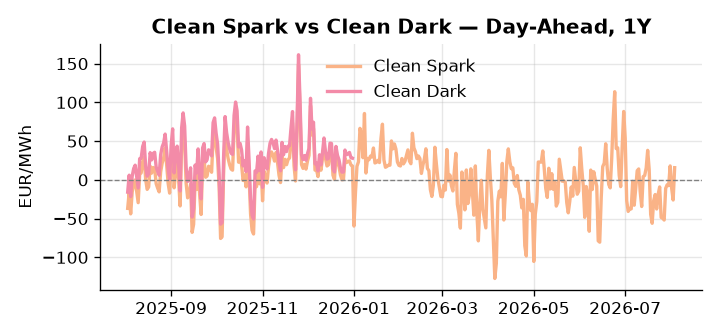
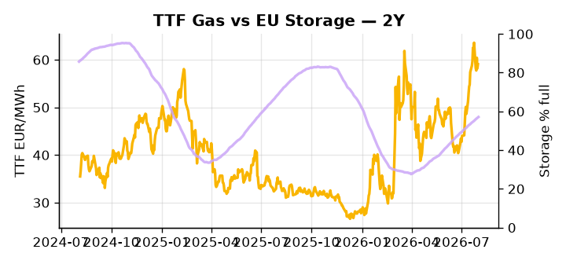

# European Cross-Commodity Risk Pack: Gas + Carbon → Power Curve Implications

**Daily desk brief — 2026-08-03**  
_Author: Sumer Sener · sumerberksener@gmail.com_  
_Generated by `scripts/generate_brief.py`. AI narrative + news themes via Anthropic Claude._

> **Data-freshness caveat:** Clean Dark (last 2025-12-31, 215d old); Coal (last 2025-12-26, 220d old). Numbers below should be read with this in mind.

## 1 · Executive summary

**TL;DR — Hungary's Paks nuclear plant offline amid Danube drought; EU storage 16.3 pp below seasonal drives gas and power upside in Central/SW Europe.**

Hungary's Paks nuclear plant (1.9 GW) is offline against a Danube drought backdrop, forcing Central European thermal dispatch and import competition that has pushed DE Power to the 78th percentile at 146.32 EUR/MWh and GB Power to the 90th percentile at 134.06 EUR/MWh. EU storage sits at 57.1% — the 32nd percentile and 16.3 percentage points below seasonal norm — leaving the curve with minimal headroom to absorb any additional demand or supply shock, while TTF remains anchored in the 58–61 EUR/MWh range on a tightening seasonal draw. Spain and France carry compounding wildfire risk to Iberian thermal and hydro corridors, and Hormuz tension sustains a crude premium even as Mexico LNG ramp-up (0.4 Bcf/d) softens the US-EU arbitrage incentive; with coal data 220 days stale and the clean dark spread of 27.95 EUR/MWh similarly 215 days old, coal-based merit order signals are indicative not bankable. Gas tightness at the 57.1% storage deficit AND EUA levels absent a policy catalyst AND clean spreads compressed by stale dark-spread reads → the curve regime is extended on the front-month with Hormuz tail-risk keeping front-curve risk wide, while Cal+1 stability depends entirely on whether the Paks outage and Danube drought cascade before storage can recover seasonal ground.

_Generated by **claude-sonnet-4-6** via Anthropic API (two-pass extract→narrate). Prompts/responses logged to `ai/logs/`._
_Next-5d temperature anomaly — DE +4.7°C / FR +4.9°C vs 5-yr seasonal normal (Open-Meteo)._

## 2 · Monitor metrics

**Primary (cross-commodity headline tiles)**

| Metric | As of | Latest | Unit | 1d Δ | 1w Δ | 5y pctile | Headline |
|---|---|---:|---|---:|---:|---:|---|
| TTF Gas | 2026-07-31 | 59.07 | EUR/MWh | +1.53% | -4.16% | 72 | Within typical range |
| EU Storage | 2026-08-01 | 57.11 | % full | +0.40% | +2.23% | 32 | 16.3 pp below the 5-yr seasonal average |
| EUA Carbon | 2026-07-31 | 33.75 | EUR/tCO2 | +0.24% | -2.04% | 45 | Within typical range |
| DE Power | 2026-08-03 | 146.32 | EUR/MWh | +39.91% | +27.59% | 78 | Within typical range |
| GB Power | 2026-08-03 | 134.06 | EUR/MWh | -12.33% | +29.12% | 90 | Within typical range |
| Renewables | 2026-08-02 | 51.62 | % of load | +19.11% | -16.56% | 69 | Within typical range |
| Clean Spark | 2026-08-03 | 15.76 | EUR/MWh | +41.74 | +31.33 | 73 | Within typical range |
| Clean Dark | 2025-12-31 (STALE) | 27.95 | EUR/MWh | -0.56 | +11.63 | 48 | Within typical range |

**Fundamentals inputs** _(feed derived metrics; not separately traded)_

| Metric | As of | Latest | Unit | 1d Δ | 1w Δ | 5y pctile | Headline |
|---|---|---:|---|---:|---:|---:|---|
| Coal | 2025-12-26 (STALE) | 96.00 | USD/t | -0.57% | +0.08% | 7 | 7th-percentile of 5-yr range — historically low |

_Spreads → abs EUR/MWh deltas; others → pct. Weekly Δ uses 5d trailing means. Full history in `data/<metric>.csv`._

## 3 · Gas + LNG arb

**TTF front-month** prints at 59.07 EUR/MWh — _Within typical range_.
**EU storage** at 57.1% full (-16.3 pp vs 5-yr seasonal avg) — _16.3 pp below the 5-yr seasonal average_.
**TTF − JKM (LNG arb)** at -4.44 EUR/MWh (JKM 21.45 USD/MMBtu) — JKM richer than TTF — Asia pulls cargoes, marginal European tightening risk.

## 4 · Carbon (EU ETS)

**EUA December** prints at 33.75 EUR/tCO2 — _Within typical range_. A euro of EUA adds ~0.37 EUR/MWh to gas-fired and ~0.85 EUR/MWh to coal-fired generation cost; strength compresses the dark spread faster than the spark.

**EU vs UK ETS** — Cobblestone's emissions desk trades EUA and UKA. Post-Brexit auction reform narrowed the UKA discount to EUA from £20+/t to single-digit £/t; CBAM phase-in pulls UK compliance demand toward parity. EUA−UKA basis remains a tradable cross-market signal.

**Supply / policy signal** — _CBAM full operational phase live since 1 Jan 2026 — importers paying for embedded emissions_  
Side: `policy` · Polarity: `bullish EUA` · Source: EU Regulation 2023/956 (CBAM)

Domestic carbon-cost burden gradually levelled with imports; supports EUA demand floor as carbon leakage protection tightens through 2034.

_No ETS-relevant news surfaced today — falling back to `data/policy_facts.py` (hand-maintained structural fact pack). Fact pack last reviewed 2026-05-08 (87d ago)._

## 5 · Power — Day-Ahead & curve

**DE day-ahead baseload** at 146.32 EUR/MWh — _Within typical range_.
**GB day-ahead baseload** at 134.06 EUR/MWh — _Within typical range_.
**DE − GB spread** at +12.26 EUR/MWh (DE premium) — drives interconnector flow direction.
**Cross-border net flows (Power Transportation):** DE↔FR -28.1 GWh (FR export); GB↔FR -79.6 GWh (FR export); NL↔DE +39.9 GWh (NL export).

**Clean spark spread** at +15.76 EUR/MWh — _Within typical range_. Bridge from gas + carbon fundamentals to gas-fired economics; sustained positive spark = TTF moves transmit directly into the power curve.

**Curve shape:** DA → W+1 → M+1 → Q+1 → Cal+1 → Cal+2 = 146 / 114 / 114 / 114 / 114 / 114 EUR/MWh — **Backwardation** (DA −Cal+1 spread +32 EUR/MWh). Forwards are seasonality projections — see Methodology.

{width=49%} {width=49%}

**This week ahead**

- **Tue** 08:00 UTC — AGSI+ daily storage print: First read on the week's gas injection / withdrawal pace; sets the tone for TTF curve shape.
- **Wed** 09:00 UTC — EEX EUA primary auction (Mon–Thu daily; Wed is largest volume): Supply-side EUA signal; auction clearing relative to spot reads as ETS demand strength.
- **Wed** — ENTSO-E DE_LU + GB next-week wind/solar forecast refresh: Sets the residual-load curve a week out; outsized prints move power Cal+1 directionally.

**Scenarios (1w horizon)**

| | Summary | TTF | DE Power |
|---|---|---:|---:|
| **Base** | Paks offline, storage deficit managed; power remains elevated (DE 140–150, GB 130–140); TTF steady 58–61 EUR/MWh on seasonal gas draw. | ±2-4% | ±3-5% (tracks elevated thermal merit order) |
| **Upside** | Danube drought spreads to Kozloduy (Bulgaria) or further east EU nuclear; wildfire expansion into French hydro; Hormuz escalation spike crude premium. | +8-12% | +12-18% (fuel switch, Central EU import demand) |
| **Downside** | Paks returns within days; cooler weather reduces AC demand; Mexico LNG ramp accelerates, softening US arb; Hormuz de-escalates. | -5-8% | -8-12% (thermal dispatch eases, storage stabilizes) |

_Illustrative, not forecasts. Magnitudes sized off historical sensitivity; AI-generated from today's extract pass._

## 6 · Today's themes

**Weather watch (next 7d)**
- **Heat dome · DE · Mon 03 – Thu 06 Aug** — peak +7.8°C vs normal. Mild bullish DE power on cooling load, but gas demand softens. Spark spread compresses; renewables (solar) likely strong — watch DA print fall midday.
- **Heat dome · FR · Mon 03 – Wed 05 Aug** — peak +9.5°C vs normal. Bullish FR power on AC load and possible nuclear river-cooling derating. Watch FR-nuclear availability prints if heat persists.

**Watchlist (1–4 weeks)**
- Danube water levels and Paks cooling capacity updates; scope of Hungarian demand-side response.
- Spain/France wildfire perimeter; thermal plant outages and transmission line status.

_Risk framing — built within a discipline of clear limits and continuous monitoring; observations here are framed as risk inputs, not directional calls. Positioning decisions remain with the desk._
_Methodology + sources: **README §Methodology**. Numbers auditable via the snapshot JSONs. Rule-based / informational — not investment advice._