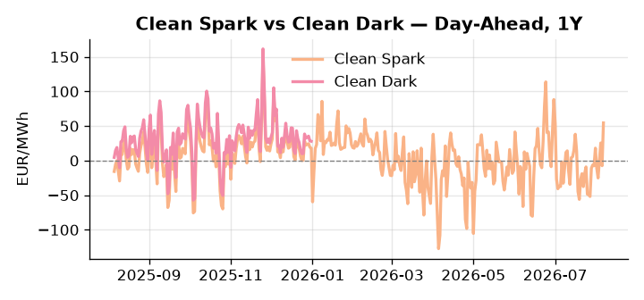
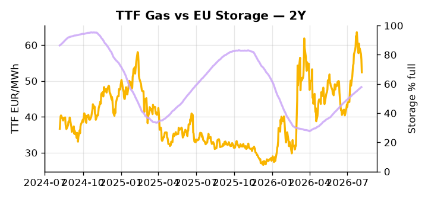

# European Cross-Commodity Risk Pack: Gas + Carbon → Power Curve Implications

**Daily desk brief — 2026-08-06**  
_Author: Sumer Sener · sumerberksener@gmail.com_  
_Generated by `scripts/generate_brief.py`. AI narrative + news themes via Anthropic Claude._

> **Data-freshness caveat:** Clean Dark (last 2025-12-31, 218d old); Coal (last 2025-12-26, 223d old). Numbers below should be read with this in mind.

## 1 · Executive summary

**TL;DR — Clean Spark at 96th-percentile (54.51 EUR/MWh) dominates; Hungary nuclear offline forces fuel-switch; storage 16.5pp below seasonal risks H2 refill.**

Clean Spark at the 96th percentile (54.51 EUR/MWh) is the dominant signal: Hungary's 2 GW nuclear outage has forced an immediate Central European fuel-switch to gas, and with EU storage sitting at 57.87% fill — 16.5 points below seasonal at the 33rd percentile — the autumn refill window is compressed and front-month TTF tail-risk remains anchored to geopolitical premium already +12.51% on the month. With coal data 218 days old and clean dark indicative at the 47th percentile (27.95 EUR/MWh) carrying a 223-day stale caveat, the clean dark spread is indicative not bankable, leaving the clean spark as the operative fuel-switch signal for regime assessment. The Danube drought threatens further hydro and nuclear headroom across Central Europe through autumn, while Ukraine infrastructure strikes continue to embed an LNG supply-tightening premium that could extend the current backwardation into Cal+1 if refill pace stalls below 2% weekly. Gas tightness at historically extended levels AND EUA mid-range AND a clean spark in-the-money at the 96th percentile keep the front-curve in a hard fuel-switch regime, and with Ukraine energy-war escalation reasserting as the live geopolitical driver, front-curve risk remains wide and any storage-driven de-escalation of that premium is the primary reversal threat to watch.

_Generated by **claude-sonnet-4-6** via Anthropic API (two-pass extract→narrate). Prompts/responses logged to `ai/logs/`._
_Next-5d temperature anomaly — DE +2.2°C / FR +2.5°C vs 5-yr seasonal normal (Open-Meteo)._

## 2 · Monitor metrics

**Primary (cross-commodity headline tiles)**

| Metric | As of | Latest | Unit | 1d Δ | 1w Δ | 5y pctile | Headline |
|---|---|---:|---|---:|---:|---:|---|
| TTF Gas | 2026-08-05 | 52.40 | EUR/MWh | -6.29% | -6.23% | 68 | outsized daily move (-6.29%, 2.0σ) |
| EU Storage | 2026-08-04 | 57.87 | % full | +0.31% | +2.20% | 33 | 16.5 pp below the 5-yr seasonal average |
| EUA Carbon | 2026-08-05 | 33.99 | EUR/tCO2 | +0.30% | +0.14% | 47 | Within typical range |
| DE Power | 2026-08-06 | 171.83 | EUR/MWh | +56.25% | +5.02% | 83 | Within typical range |
| GB Power | 2026-08-06 | 132.07 | EUR/MWh | +32.91% | -4.85% | 88 | Within typical range |
| Renewables | 2026-08-05 | 56.45 | % of load | +12.74% | +0.47% | 77 | Within typical range |
| Clean Spark | 2026-08-06 | 54.51 | EUR/MWh | +61.86 | +13.15 | 96 | 96th-percentile of 5-yr range — historically high |
| Clean Dark | 2025-12-31 (STALE) | 27.95 | EUR/MWh | -0.56 | +11.63 | 47 | Within typical range |

**Fundamentals inputs** _(feed derived metrics; not separately traded)_

| Metric | As of | Latest | Unit | 1d Δ | 1w Δ | 5y pctile | Headline |
|---|---|---:|---|---:|---:|---:|---|
| Coal | 2025-12-26 (STALE) | 96.00 | USD/t | -0.57% | +0.08% | 7 | 7th-percentile of 5-yr range — historically low |

_Spreads → abs EUR/MWh deltas; others → pct. Weekly Δ uses 5d trailing means. Full history in `data/<metric>.csv`._

## 3 · Gas + LNG arb

**TTF front-month** prints at 52.40 EUR/MWh — _outsized daily move (-6.29%, 2.0σ)_.
**EU storage** at 57.9% full (-16.5 pp vs 5-yr seasonal avg) — _16.5 pp below the 5-yr seasonal average_.
**TTF − JKM (LNG arb)** at -9.48 EUR/MWh (JKM 20.92 USD/MMBtu) — JKM richer than TTF — Asia pulls cargoes, marginal European tightening risk.

## 4 · Carbon (EU ETS)

**EUA December** prints at 33.99 EUR/tCO2 — _Within typical range_. A euro of EUA adds ~0.37 EUR/MWh to gas-fired and ~0.85 EUR/MWh to coal-fired generation cost; strength compresses the dark spread faster than the spark.

**EU vs UK ETS** — Cobblestone's emissions desk trades EUA and UKA. Post-Brexit auction reform narrowed the UKA discount to EUA from £20+/t to single-digit £/t; CBAM phase-in pulls UK compliance demand toward parity. EUA−UKA basis remains a tradable cross-market signal.

**Supply / policy signal** — _CBAM full operational phase live since 1 Jan 2026 — importers paying for embedded emissions_  
Side: `policy` · Polarity: `bullish EUA` · Source: EU Regulation 2023/956 (CBAM)

Domestic carbon-cost burden gradually levelled with imports; supports EUA demand floor as carbon leakage protection tightens through 2034.

_No ETS-relevant news surfaced today — falling back to `data/policy_facts.py` (hand-maintained structural fact pack). Fact pack last reviewed 2026-05-08 (90d ago)._

## 5 · Power — Day-Ahead & curve

**DE day-ahead baseload** at 171.83 EUR/MWh — _Within typical range_.
**GB day-ahead baseload** at 132.07 EUR/MWh — _Within typical range_.
**DE − GB spread** at +39.76 EUR/MWh (DE premium) — drives interconnector flow direction.
**Cross-border net flows (Power Transportation):** DE↔FR -56.0 GWh (FR export); GB↔FR -29.1 GWh (FR export); NL↔DE +82.8 GWh (NL export).

**Clean spark spread** at +54.51 EUR/MWh — _96th-percentile of 5-yr range — historically high_. Bridge from gas + carbon fundamentals to gas-fired economics; sustained positive spark = TTF moves transmit directly into the power curve.

**Curve shape:** DA → W+1 → M+1 → Q+1 → Cal+1 → Cal+2 = 172 / 120 / 120 / 120 / 120 / 120 EUR/MWh — **Backwardation** (DA −Cal+1 spread +52 EUR/MWh). Forwards are seasonality projections — see Methodology.

{width=49%} {width=49%}

**This week ahead**

- **Fri** 14:30 UTC — EIA weekly natural gas storage report: US storage trajectory anchors LNG export pricing into NW Europe — direct TTF transmission.
- **Thu** 14:30 UTC — US EIA weekly crude inventories: Crude — and via crack spreads, refined-products — feed back into LNG arb economics.
- **Fri** — ENTSO-E weekly day-ahead volumes / system-balance summary: Reads the European generation mix in last 7d — confirms or breaks the Cal+1 thesis.
- **Thu** — Danube drought update, EU energy alerts: Intra-week water-level data informs nuclear restart risk and Iberian hydro carry-forward; sets tactical DA/intraday hedge sizing. _(news-extracted)_

**Scenarios (1w horizon)**

| | Summary | TTF | DE Power |
|---|---|---:|---:|
| **Base** | Hungary offline absorbed; fuel-switch sustains Clean Spark ~50–55 EUR/MWh; storage refill steady at +2–3% weekly. | –2 to +3% | +2 to +5% |
| **Upside** | Danube drought deepens; further EU nuclear/hydro offline; Ukraine LNG attack escalates; storage refill stalls below 2% weekly. | +8 to +15% | +10 to +18% |
| **Downside** | Danube water-level recovers; Ukraine winter campaign pauses; Italian renewables curtail forward demand expectations; refill accelerates 3–4% weekly. | –6 to –12% | –8 to –14% |

_Illustrative, not forecasts. Magnitudes sized off historical sensitivity; AI-generated from today's extract pass._

## 6 · Today's themes

**Weather watch (next 7d)**
- **Storm · DE · Thu 06 – Fri 07 Aug** — peak gust 45 m/s (~163 km/h) on Thu 06 Aug. Wind generation likely surges Day 1, then risk of turbine cut-off if gusts exceed 25 m/s. Bearish DA early, sharp reversal possible. Watch DE-FR flow swings.
- **Storm · FR · Thu 06 Aug** — peak gust 37 m/s (~132 km/h) on Thu 06 Aug. Strong wind boost to French generation; FR may export to neighbours. DA print likely below seasonal norm; watch FR-GB IFA flow toward GB.

**Watchlist (1–4 weeks)**
- Danube water-level outlook; risk of further EU nuclear/hydro shutdowns in Sept–Oct.
- Ukraine winter campaign timeline; LNG arbitrage & TTF risk premia.

_Risk framing — built within a discipline of clear limits and continuous monitoring; observations here are framed as risk inputs, not directional calls. Positioning decisions remain with the desk._
_Methodology + sources: **README §Methodology**. Numbers auditable via the snapshot JSONs. Rule-based / informational — not investment advice._