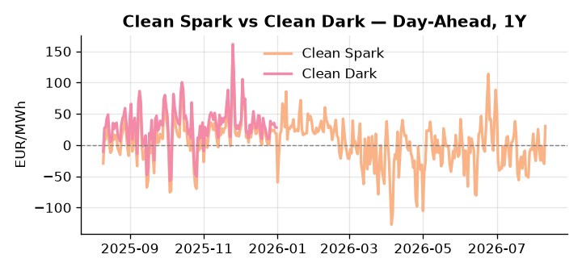
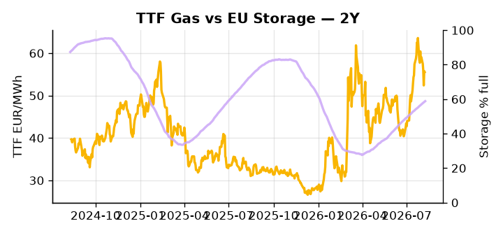

# European Cross-Commodity Risk Pack: Gas + Carbon → Power Curve Implications

**Daily desk brief — 2026-08-10**  
_Author: Sumer Sener · sumerberksener@gmail.com_  
_Generated by `scripts/generate_brief.py`. AI narrative + news themes via Anthropic Claude._

> **Data-freshness caveat:** Clean Dark (last 2025-12-31, 222d old); Coal (last 2025-12-26, 227d old). Numbers below should be read with this in mind.

## 1 · Executive summary

**TL;DR — Storage 16.7 pp below seasonal; coal at 7th-percentile; Hungary Paks offline removes 2 GW from CEE grid—bullish power regime faces downside from Hormuz reopening and US sanctions legislative uncertainty.**

EU storage at 58.84% — 16.7 percentage points below the seasonal average and in the 34th percentile — is the dominant signal, keeping the gas complex structurally tight as September injection pace will determine whether a winter scarcity premium builds into the TTF forward curve. The Hungary Paks drought outage compounds regional tightness by removing roughly 2 GW from the CEE grid, with no confirmed restart timeline, widening DA and Cal+1 spreads across Central Europe. Coal at the 7th percentile (96 USD/t) would ordinarily flag deep in-the-money dark spreads, but with coal data 227 days stale and the clean dark spread similarly 222 days old, merit-order and fuel-switch signals are indicative only — those prints are not bankable until refreshed. Geopolitical tension is bifurcated: a US Senate Russia sanctions bill has passed with a House vote expected in September, carrying a credible +5–8% TTF upside tail if LNG license restrictions tighten flows, while the Hormuz reopening under the Iran-Oman deal partially offsets that premium through crude relief and fuel-switch economics. With Russia-sanctions escalation risk pulling front-curve risk wider against a storage deficit that is not yet self-correcting, and carbon policy neutral, gas tightness AND flat carbon framing AND stale-but-indicative clean spreads keep the curve in a cautiously bullish regime where front-month exposure is supported but Cal+1 shape will pivot sharply on the House vote outcome.

_Generated by **claude-sonnet-4-6** via Anthropic API (two-pass extract→narrate). Prompts/responses logged to `ai/logs/`._
_Next-5d temperature anomaly — DE +0.2°C / FR +4.4°C vs 5-yr seasonal normal (Open-Meteo)._

## 2 · Monitor metrics

**Primary (cross-commodity headline tiles)**

| Metric | As of | Latest | Unit | 1d Δ | 1w Δ | 5y pctile | Headline |
|---|---|---:|---|---:|---:|---:|---|
| TTF Gas | 2026-08-07 | 55.54 | EUR/MWh | -0.40% | -5.63% | 70 | Within typical range |
| EU Storage | 2026-08-08 | 58.84 | % full | +0.43% | +2.06% | 34 | 16.7 pp below the 5-yr seasonal average |
| EUA Carbon | 2026-08-07 | 34.52 | EUR/tCO2 | +1.23% | +1.24% | 49 | Within typical range |
| DE Power | 2026-08-10 | 154.12 | EUR/MWh | +64.25% | -7.33% | 80 | Within typical range |
| GB Power | 2026-08-10 | 128.70 | EUR/MWh | +18.50% | -11.40% | 86 | Within typical range |
| Renewables | 2026-08-09 | 60.58 | % of load | +19.38% | +16.45% | 82 | Within typical range |
| Clean Spark | 2026-08-10 | 30.33 | EUR/MWh | +60.28 | -5.81 | 88 | Within typical range |
| Clean Dark | 2025-12-31 (STALE) | 27.95 | EUR/MWh | -0.56 | +11.63 | 47 | Within typical range |

**Fundamentals inputs** _(feed derived metrics; not separately traded)_

| Metric | As of | Latest | Unit | 1d Δ | 1w Δ | 5y pctile | Headline |
|---|---|---:|---|---:|---:|---:|---|
| Coal | 2025-12-26 (STALE) | 96.00 | USD/t | -0.57% | +0.08% | 7 | 7th-percentile of 5-yr range — historically low |

_Spreads → abs EUR/MWh deltas; others → pct. Weekly Δ uses 5d trailing means. Full history in `data/<metric>.csv`._

## 3 · Gas + LNG arb

**TTF front-month** prints at 55.54 EUR/MWh — _Within typical range_.
**EU storage** at 58.8% full (-16.7 pp vs 5-yr seasonal avg) — _16.7 pp below the 5-yr seasonal average_.
**TTF − JKM (LNG arb)** at -6.97 EUR/MWh (JKM 21.11 USD/MMBtu) — JKM richer than TTF — Asia pulls cargoes, marginal European tightening risk.

## 4 · Carbon (EU ETS)

**EUA December** prints at 34.52 EUR/tCO2 — _Within typical range_. A euro of EUA adds ~0.37 EUR/MWh to gas-fired and ~0.85 EUR/MWh to coal-fired generation cost; strength compresses the dark spread faster than the spark.

**EU vs UK ETS** — Cobblestone's emissions desk trades EUA and UKA. Post-Brexit auction reform narrowed the UKA discount to EUA from £20+/t to single-digit £/t; CBAM phase-in pulls UK compliance demand toward parity. EUA−UKA basis remains a tradable cross-market signal.

**Supply / policy signal** — _CBAM full operational phase live since 1 Jan 2026 — importers paying for embedded emissions_  
Side: `policy` · Polarity: `bullish EUA` · Source: EU Regulation 2023/956 (CBAM)

Domestic carbon-cost burden gradually levelled with imports; supports EUA demand floor as carbon leakage protection tightens through 2034.

_No ETS-relevant news surfaced today — falling back to `data/policy_facts.py` (hand-maintained structural fact pack). Fact pack last reviewed 2026-05-08 (94d ago)._

## 5 · Power — Day-Ahead & curve

**DE day-ahead baseload** at 154.12 EUR/MWh — _Within typical range_.
**GB day-ahead baseload** at 128.70 EUR/MWh — _Within typical range_.
**DE − GB spread** at +25.42 EUR/MWh (DE premium) — drives interconnector flow direction.
**Cross-border net flows (Power Transportation):** DE↔FR -5.1 GWh (FR export); GB↔FR -65.1 GWh (FR export); NL↔DE -12.0 GWh (DE export).

**Clean spark spread** at +30.33 EUR/MWh — _Within typical range_. Bridge from gas + carbon fundamentals to gas-fired economics; sustained positive spark = TTF moves transmit directly into the power curve.

**Curve shape:** DA → W+1 → M+1 → Q+1 → Cal+1 → Cal+2 = 154 / 116 / 116 / 116 / 116 / 116 EUR/MWh — **Backwardation** (DA −Cal+1 spread +38 EUR/MWh). Forwards are seasonality projections — see Methodology.

{width=49%} {width=49%}

**This week ahead**

- **Tue** 08:00 UTC — AGSI+ daily storage print: First read on the week's gas injection / withdrawal pace; sets the tone for TTF curve shape.
- **Wed** 09:00 UTC — EEX EUA primary auction (Mon–Thu daily; Wed is largest volume): Supply-side EUA signal; auction clearing relative to spot reads as ETS demand strength.
- **Wed** — ENTSO-E DE_LU + GB next-week wind/solar forecast refresh: Sets the residual-load curve a week out; outsized prints move power Cal+1 directionally.
- **Sep** — US House Russia sanctions vote: LNG license restrictions could tighten global gas supply and raise TTF calendar spreads. _(news-extracted)_

**Scenarios (1w | 1m horizon)**

| | Summary | TTF | DE Power |
|---|---|---:|---:|
| **Base** | Paks restart delayed; storage refill steady; Hormuz reopening gradually eases crude premium. | +2-5% | +3-8% |
| **Upside** | US House passes broad Russia sanctions; LNG license restrictions tighten supply. Paks remains offline through September. | +8-12% | +12-18% |
| **Downside** | Paks restarts within 2-3 weeks; Hormuz deal accelerates crude relief; storage refill exceeds seasonal pace. | -4-7% | -6-12% |

_Illustrative, not forecasts. Magnitudes sized off historical sensitivity; AI-generated from today's extract pass._

## 6 · Today's themes

**Weather watch (next 7d)**
- **Storm · DE · Mon 10 – Tue 11 Aug** — peak gust 47 m/s (~170 km/h) on Mon 10 Aug. Wind generation likely surges Day 1, then risk of turbine cut-off if gusts exceed 25 m/s. Bearish DA early, sharp reversal possible. Watch DE-FR flow swings.
- **Heat dome · FR · Wed 12 – Fri 14 Aug** — peak +7.2°C vs normal. Bullish FR power on AC load and possible nuclear river-cooling derating. Watch FR-nuclear availability prints if heat persists.

**Watchlist (1–4 weeks)**
- US House vote on Russia sanctions bill (September) – LNG license impact
- Hungary Paks restart timeline – tracks drought recovery and regional supply

_Risk framing — built within a discipline of clear limits and continuous monitoring; observations here are framed as risk inputs, not directional calls. Positioning decisions remain with the desk._
_Methodology + sources: **README §Methodology**. Numbers auditable via the snapshot JSONs. Rule-based / informational — not investment advice._