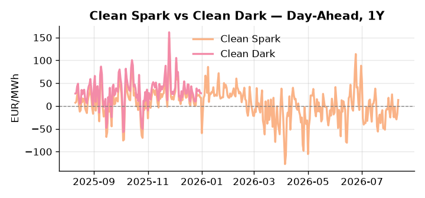
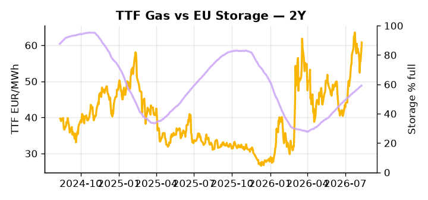

# European Cross-Commodity Risk Pack: Gas + Carbon → Power Curve Implications

**Daily desk brief — 2026-08-11**  
_Author: Sumer Sener · sumerberksener@gmail.com_  
_Generated by `scripts/generate_brief.py`. AI narrative + news themes via Anthropic Claude._

> **Data-freshness caveat:** Clean Dark (last 2025-12-31, 223d old); Coal (last 2025-12-26, 228d old). Numbers below should be read with this in mind.

## 1 · Executive summary

**TL;DR — GB Power at 99th-percentile (162.46 EUR/MWh) amid low EU storage (-16.8pp seasonal) and TTF +9.46% daily spike; demand destruction offsets supply tightness, but winter reserve risk and sanctions escalation create tail upside.**

GB Power at the 99th percentile (162.46 EUR/MWh) is the dominant signal, reflecting structural GB-EU divergence atop a storage deficit running 16.8 percentage points below seasonal norms (59.12%, 35th percentile), with TTF posting a 9.46% daily spike — a 2.6-sigma move — on the advance of the US Senate Russia sanctions bill. Demand destruction across French and Dutch industrial loads is providing partial offset, keeping the forward curve from a clean breakout, but EU storage adequacy through winter hinges entirely on H2 refill pace and the Cal+1 regime remains exposed to the upside scenario. With coal data 228 days stale (7th percentile, 96 USD/t) and the clean-dark spread 223 days stale (47th percentile, 27.95 EUR/MWh), merit-order and dark-spread readings are indicative not bankable, and any coal-gas fuel-switch call should be treated with caution. Carbon data carries no live policy signal at this read, leaving EUA influence on clean spark headroom unquantified in this pass. With the US House sanctions vote in September reasserting as the key geopolitical binary, gas tightness — already extended — AND the unresolved carbon position AND compressed but stale clean-dark spreads keep front-curve risk wide while Cal+1 regime shape remains hostage to that LNG arbitrage outcome.

_Generated by **claude-sonnet-4-6** via Anthropic API (two-pass extract→narrate). Prompts/responses logged to `ai/logs/`._
_Next-5d temperature anomaly — DE +0.4°C / GB +3.6°C vs 5-yr seasonal normal (Open-Meteo)._

## 2 · Monitor metrics

**Primary (cross-commodity headline tiles)**

| Metric | As of | Latest | Unit | 1d Δ | 1w Δ | 5y pctile | Headline |
|---|---|---:|---|---:|---:|---:|---|
| TTF Gas | 2026-08-10 | 60.80 | EUR/MWh | +9.46% | -4.26% | 73 | outsized daily move (+9.46%, 2.6σ) |
| EU Storage | 2026-08-09 | 59.12 | % full | +0.41% | +2.07% | 35 | 16.8 pp below the 5-yr seasonal average |
| EUA Carbon | 2026-08-10 | 34.21 | EUR/tCO2 | -0.90% | +1.61% | 48 | Within typical range |
| DE Power | 2026-08-11 | 147.37 | EUR/MWh | +25.39% | -2.16% | 78 | Within typical range |
| GB Power | 2026-08-11 | 162.46 | EUR/MWh | +16.95% | -5.63% | 99 | 99th-percentile of 5-yr range — historically high |
| Renewables | 2026-08-10 | 54.62 | % of load | -9.85% | +6.50% | 74 | Within typical range |
| Clean Spark | 2026-08-11 | 13.18 | EUR/MWh | +29.84 | -4.09 | 70 | Within typical range |
| Clean Dark | 2025-12-31 (STALE) | 27.95 | EUR/MWh | -0.56 | +11.63 | 47 | Within typical range |

**Fundamentals inputs** _(feed derived metrics; not separately traded)_

| Metric | As of | Latest | Unit | 1d Δ | 1w Δ | 5y pctile | Headline |
|---|---|---:|---|---:|---:|---:|---|
| Coal | 2025-12-26 (STALE) | 96.00 | USD/t | -0.57% | +0.08% | 7 | 7th-percentile of 5-yr range — historically low |

_Spreads → abs EUR/MWh deltas; others → pct. Weekly Δ uses 5d trailing means. Full history in `data/<metric>.csv`._

## 3 · Gas + LNG arb

**TTF front-month** prints at 60.80 EUR/MWh — _outsized daily move (+9.46%, 2.6σ)_.
**EU storage** at 59.1% full (-16.8 pp vs 5-yr seasonal avg) — _16.8 pp below the 5-yr seasonal average_.
**TTF − JKM (LNG arb)** at -1.97 EUR/MWh (JKM 21.26 USD/MMBtu) — JKM richer than TTF — Asia pulls cargoes, marginal European tightening risk.

## 4 · Carbon (EU ETS)

**EUA December** prints at 34.21 EUR/tCO2 — _Within typical range_. A euro of EUA adds ~0.37 EUR/MWh to gas-fired and ~0.85 EUR/MWh to coal-fired generation cost; strength compresses the dark spread faster than the spark.

**EU vs UK ETS** — Cobblestone's emissions desk trades EUA and UKA. Post-Brexit auction reform narrowed the UKA discount to EUA from £20+/t to single-digit £/t; CBAM phase-in pulls UK compliance demand toward parity. EUA−UKA basis remains a tradable cross-market signal.

**Supply / policy signal** — _CBAM full operational phase live since 1 Jan 2026 — importers paying for embedded emissions_  
Side: `policy` · Polarity: `bullish EUA` · Source: EU Regulation 2023/956 (CBAM)

Domestic carbon-cost burden gradually levelled with imports; supports EUA demand floor as carbon leakage protection tightens through 2034.

_No ETS-relevant news surfaced today — falling back to `data/policy_facts.py` (hand-maintained structural fact pack). Fact pack last reviewed 2026-05-08 (95d ago)._

## 5 · Power — Day-Ahead & curve

**DE day-ahead baseload** at 147.37 EUR/MWh — _Within typical range_.
**GB day-ahead baseload** at 162.46 EUR/MWh — _99th-percentile of 5-yr range — historically high_.
**DE − GB spread** at -15.09 EUR/MWh (GB premium) — drives interconnector flow direction.
**Cross-border net flows (Power Transportation):** DE↔FR -29.5 GWh (FR export); GB↔FR -57.9 GWh (FR export); NL↔DE +16.6 GWh (NL export).

**Clean spark spread** at +13.18 EUR/MWh — _Within typical range_. Bridge from gas + carbon fundamentals to gas-fired economics; sustained positive spark = TTF moves transmit directly into the power curve.

**Curve shape:** DA → W+1 → M+1 → Q+1 → Cal+1 → Cal+2 = 147 / 115 / 115 / 115 / 115 / 115 EUR/MWh — **Backwardation** (DA −Cal+1 spread +32 EUR/MWh). Forwards are seasonality projections — see Methodology.

{width=49%} {width=49%}

**This week ahead**

- **Tue** 08:00 UTC — AGSI+ daily storage print: First read on the week's gas injection / withdrawal pace; sets the tone for TTF curve shape.
- **Wed** 09:00 UTC — EEX EUA primary auction (Mon–Thu daily; Wed is largest volume): Supply-side EUA signal; auction clearing relative to spot reads as ETS demand strength.
- **Wed** — ENTSO-E DE_LU + GB next-week wind/solar forecast refresh: Sets the residual-load curve a week out; outsized prints move power Cal+1 directionally.
- **Sep** — US House Russia Sanctions Bill Vote: Outcome determines LNG export risk; tighter sanctions could raise TTF +5–10% via arbitrage shock. _(news-extracted)_

**Scenarios (1w | 1m horizon)**

| | Summary | TTF | DE Power |
|---|---|---:|---:|
| **Base** | Storage refill continues; demand softness caps rally. TTF stable around 58–62 EUR/MWh. GB premium persists but stabilizes. | ±2–4% | ±1–3% |
| **Upside** | US House sanctions vote in September tightens LNG exports; Russian refinery losses spike EU spot LNG cost; TTF front spikes, Cal+1 reprices higher. | +8–15% | +5–10% |
| **Downside** | Winter demand destruction accelerates on recession fears; industrial load sheds (France DSM); storage fills faster than feared. TTF retreats; power follows. | -6–12% | -8–12% |

_Illustrative, not forecasts. Magnitudes sized off historical sensitivity; AI-generated from today's extract pass._

## 6 · Today's themes

**Weather watch (next 7d)**
- **Storm · DE · Tue 11 Aug** — peak gust 41 m/s (~149 km/h) on Tue 11 Aug. Wind generation likely surges Day 1, then risk of turbine cut-off if gusts exceed 25 m/s. Bearish DA early, sharp reversal possible. Watch DE-FR flow swings.
- **Storm · GB · Tue 11 – Fri 14 Aug** — peak gust 39 m/s (~140 km/h) on Tue 11 Aug. GB wind capacity is large — DA likely soft. Cut-off risk if gusts exceed safety thresholds; opposite tail (sudden tightening) possible.

**Watchlist (1–4 weeks)**
- EU gas storage fill rates (weekly); target vs. Oct target for winter adequacy.
- France 2027 blackout drill logistics; signals state emergency preparedness & potential DSM/load-shedding policy.

_Risk framing — built within a discipline of clear limits and continuous monitoring; observations here are framed as risk inputs, not directional calls. Positioning decisions remain with the desk._
_Methodology + sources: **README §Methodology**. Numbers auditable via the snapshot JSONs. Rule-based / informational — not investment advice._