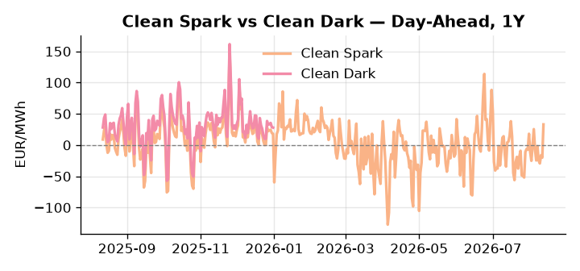
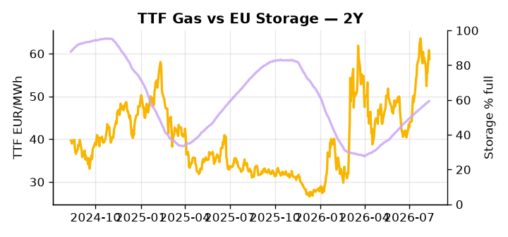

# European Cross-Commodity Risk Pack: Gas + Carbon → Power Curve Implications

**Daily desk brief — 2026-08-12**  
_Author: Sumer Sener · sumerberksener@gmail.com_  
_Generated by `scripts/generate_brief.py`. AI narrative + news themes via Anthropic Claude._

> **Data-freshness caveat:** Clean Dark (last 2025-12-31, 224d old); Coal (last 2025-12-26, 229d old). Numbers below should be read with this in mind.

## 1 · Executive summary

**TL;DR — GB Power at 98th-percentile amid French nuclear cooling stress; EU storage 16.8 pp below seasonal drives winter gas risk; US Russia sanctions escalation looms September.**

GB Power at 153.81 EUR/MWh (98th-percentile) dominates the session, with French nuclear cooling-water disruptions forcing baseload reduction and cascading expensive gas-to-power dispatch across the EU stack. EU storage sitting 16.8 percentage points below seasonal average sharpens the winter adequacy case, anchoring the forward curve in a bullish bias through Cal+1 and leaving limited headroom for any further supply miss into September. With coal data 229 days old and clean dark at 47th-percentile on figures equally stale, the fuel-switch and merit-order read is indicative not bankable — the gas-to-coal arb mechanics may have shifted materially since those prints. A pending US House vote on Russia sanctions, flagged for September, represents the live geopolitical tail-risk: passage would tighten LNG supply to Europe and transmit directly into TTF arb cost, with the desk's own upside scenario pricing a 5–12% TTF move on that trigger alone. Gas tightness at a 16.8 pp storage deficit AND carbon absent a policy anchor AND clean spreads stale but directionally in-the-money keep the front-curve in an extended regime — with the US sanctions vote the single event most capable of repricing front-curve risk sharply wider into Q4.

_Generated by **claude-sonnet-4-6** via Anthropic API (two-pass extract→narrate). Prompts/responses logged to `ai/logs/`._
_Next-5d temperature anomaly — DE -0.0°C / FR +5.8°C / GB +3.8°C vs 5-yr seasonal normal (Open-Meteo)._

## 2 · Monitor metrics

**Primary (cross-commodity headline tiles)**

| Metric | As of | Latest | Unit | 1d Δ | 1w Δ | 5y pctile | Headline |
|---|---|---:|---|---:|---:|---:|---|
| TTF Gas | 2026-08-11 | 58.74 | EUR/MWh | -3.39% | -2.70% | 72 | Within typical range |
| EU Storage | 2026-08-10 | 59.40 | % full | +0.47% | +2.08% | 36 | 16.8 pp below the 5-yr seasonal average |
| EUA Carbon | 2026-08-11 | 34.25 | EUR/tCO2 | +0.12% | +1.58% | 49 | Within typical range |
| DE Power | 2026-08-12 | 163.11 | EUR/MWh | +48.29% | -4.17% | 82 | Within typical range |
| GB Power | 2026-08-12 | 153.81 | EUR/MWh | -1.39% | +1.09% | 98 | 98th-percentile of 5-yr range — historically high |
| Renewables | 2026-08-11 | 58.87 | % of load | +7.79% | -2.83% | 80 | Within typical range |
| Clean Spark | 2026-08-12 | 33.04 | EUR/MWh | +53.12 | -9.50 | 90 | Within typical range |
| Clean Dark | 2025-12-31 (STALE) | 27.95 | EUR/MWh | -0.56 | +11.63 | 47 | Within typical range |

**Fundamentals inputs** _(feed derived metrics; not separately traded)_

| Metric | As of | Latest | Unit | 1d Δ | 1w Δ | 5y pctile | Headline |
|---|---|---:|---|---:|---:|---:|---|
| Coal | 2025-12-26 (STALE) | 96.00 | USD/t | -0.57% | +0.08% | 7 | 7th-percentile of 5-yr range — historically low |

_Spreads → abs EUR/MWh deltas; others → pct. Weekly Δ uses 5d trailing means. Full history in `data/<metric>.csv`._

## 3 · Gas + LNG arb

**TTF front-month** prints at 58.74 EUR/MWh — _Within typical range_.
**EU storage** at 59.4% full (-16.8 pp vs 5-yr seasonal avg) — _16.8 pp below the 5-yr seasonal average_.
**TTF − JKM (LNG arb)** at -3.87 EUR/MWh (JKM 21.18 USD/MMBtu) — JKM richer than TTF — Asia pulls cargoes, marginal European tightening risk.

## 4 · Carbon (EU ETS)

**EUA December** prints at 34.25 EUR/tCO2 — _Within typical range_. A euro of EUA adds ~0.37 EUR/MWh to gas-fired and ~0.85 EUR/MWh to coal-fired generation cost; strength compresses the dark spread faster than the spark.

**EU vs UK ETS** — Cobblestone's emissions desk trades EUA and UKA. Post-Brexit auction reform narrowed the UKA discount to EUA from £20+/t to single-digit £/t; CBAM phase-in pulls UK compliance demand toward parity. EUA−UKA basis remains a tradable cross-market signal.

**Supply / policy signal** — _CBAM full operational phase live since 1 Jan 2026 — importers paying for embedded emissions_  
Side: `policy` · Polarity: `bullish EUA` · Source: EU Regulation 2023/956 (CBAM)

Domestic carbon-cost burden gradually levelled with imports; supports EUA demand floor as carbon leakage protection tightens through 2034.

_No ETS-relevant news surfaced today — falling back to `data/policy_facts.py` (hand-maintained structural fact pack). Fact pack last reviewed 2026-05-08 (96d ago)._

## 5 · Power — Day-Ahead & curve

**DE day-ahead baseload** at 163.11 EUR/MWh — _Within typical range_.
**GB day-ahead baseload** at 153.81 EUR/MWh — _98th-percentile of 5-yr range — historically high_.
**DE − GB spread** at +9.30 EUR/MWh (DE premium) — drives interconnector flow direction.
**Cross-border net flows (Power Transportation):** DE↔FR -21.9 GWh (FR export); GB↔FR -65.6 GWh (FR export); NL↔DE +31.8 GWh (NL export).

**Clean spark spread** at +33.04 EUR/MWh — _Within typical range_. Bridge from gas + carbon fundamentals to gas-fired economics; sustained positive spark = TTF moves transmit directly into the power curve.

**Curve shape:** DA → W+1 → M+1 → Q+1 → Cal+1 → Cal+2 = 163 / 117 / 117 / 117 / 117 / 117 EUR/MWh — **Backwardation** (DA −Cal+1 spread +47 EUR/MWh). Forwards are seasonality projections — see Methodology.

{width=49%} {width=49%}

**This week ahead**

- **Wed** 09:00 UTC — EEX EUA primary auction (Mon–Thu daily; Wed is largest volume): Supply-side EUA signal; auction clearing relative to spot reads as ETS demand strength.
- **Wed** — ENTSO-E DE_LU + GB next-week wind/solar forecast refresh: Sets the residual-load curve a week out; outsized prints move power Cal+1 directionally.
- **Fri** 14:30 UTC — EIA weekly natural gas storage report: US storage trajectory anchors LNG export pricing into NW Europe — direct TTF transmission.
- **Sep** — US House Russia sanctions vote: LNG cost escalation transmission to TTF arb and EU power curves; timing unclear but month flagged in news. _(news-extracted)_

**Scenarios (24-72h | 1w horizon)**

| | Summary | TTF | DE Power |
|---|---|---:|---:|
| **Base** | GB power remains extended; French nuclear outages manageable via gas dispatch; storage fill steady; sanctions risk priced gradually. | ±1–3% | tracks |
| **Upside** | US House passes Russia sanctions; LNG tightens; French nuclear unit fails restart; storage fill misses target trajectory into September. | +5–12% | +8–15% |
| **Downside** | Summer demand destruction deepens; renewables ramp higher; French nuclear restarts; storage refill pace accelerates; macro recession fears weigh. | −6–10% | −12–18% |

_Illustrative, not forecasts. Magnitudes sized off historical sensitivity; AI-generated from today's extract pass._

## 6 · Today's themes

**Weather watch (next 7d)**
- **Heat dome · FR · Wed 12 – Sat 15 Aug** — peak +9.0°C vs normal. Bullish FR power on AC load and possible nuclear river-cooling derating. Watch FR-nuclear availability prints if heat persists.
- **Heat dome · GB · Wed 12 – Fri 14 Aug** — peak +8.0°C vs normal. Modest bullish GB power on cooling demand; less heating-demand downside than continental peers (UK AC penetration is lower).

**Watchlist (1–4 weeks)**
- House vote on Russia sanctions bill (September 2026) — escalates LNG cost risk to EU.
- EU gas storage fill rates through August–September — winter adequacy critical for TTF curve.

_Risk framing — built within a discipline of clear limits and continuous monitoring; observations here are framed as risk inputs, not directional calls. Positioning decisions remain with the desk._
_Methodology + sources: **README §Methodology**. Numbers auditable via the snapshot JSONs. Rule-based / informational — not investment advice._