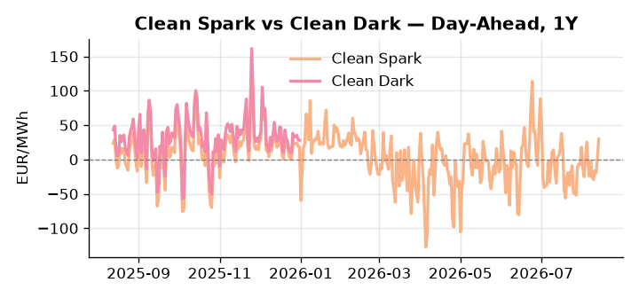
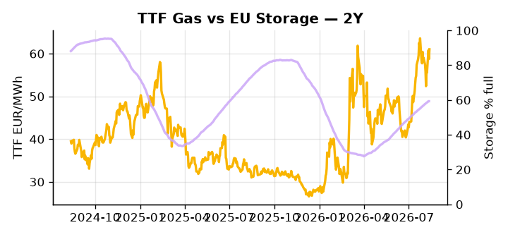

# European Cross-Commodity Risk Pack: Gas + Carbon → Power Curve Implications

**Daily desk brief — 2026-08-13**  
_Author: Sumer Sener · sumerberksener@gmail.com_  
_Generated by `scripts/generate_brief.py`. AI narrative + news themes via Anthropic Claude._

> **Data-freshness caveat:** Clean Dark (last 2025-12-31, 225d old); Coal (last 2025-12-26, 230d old). Numbers below should be read with this in mind.

## 1 · Executive summary

**TL;DR — GB Power at 93rd-percentile amid French nuclear constraints and low EU storage; TTF strength (+3.89% daily) reflects winter adequacy risk offsetting US LNG supply growth.**

GB Power at the 93rd percentile (141.1 EUR/MWh) is the dominant signal, driven by recurring French nuclear jellyfish outages forcing gas displacement and compounding a structural Island supply constraint that has held the GB-continent spread wide through the summer. EU storage sitting at 59.3% — 17.2 percentage points below seasonal average — means the August–September refill pace is now the primary TTF curve-shape driver, with Cal+1 premium at risk of widening materially if fill rates fall short of the roughly 20 percentage-point gain required by November–December. TTF itself gained 3.89% on the day, reflecting winter adequacy anxiety that is currently outweighing the bearish signal from record US LNG production at 122.5 Bcf/d, which narrows the Atlantic arbitrage and applies a ceiling to forward curves. With coal data 230 days old and clean dark series 225 days stale, merit-order thermal dispatch visibility is severely impaired — the dark spread is indicative not bankable, and marginal-cost positioning should not rely on these figures. Gas tightness anchored by storage underperformance, EUA signals absent from the merit stack, and clean spreads compressed by degraded dark-spread visibility collectively keep the front-month regime elevated and the Cal+1 curve extended, with refill adequacy — not demand destruction — as the decisive regime lever.

_Generated by **claude-sonnet-4-6** via Anthropic API (two-pass extract→narrate). Prompts/responses logged to `ai/logs/`._
_Next-5d temperature anomaly — DE -0.3°C / FR +5.3°C vs 5-yr seasonal normal (Open-Meteo)._

## 2 · Monitor metrics

**Primary (cross-commodity headline tiles)**

| Metric | As of | Latest | Unit | 1d Δ | 1w Δ | 5y pctile | Headline |
|---|---|---:|---|---:|---:|---:|---|
| TTF Gas | 2026-08-12 | 61.02 | EUR/MWh | +3.89% | +3.10% | 73 | Within typical range |
| EU Storage | 2026-08-11 | 59.32 | % full | -0.02% | +1.92% | 35 | 17.2 pp below the 5-yr seasonal average |
| EUA Carbon | 2026-08-12 | 34.08 | EUR/tCO2 | -0.39% | +1.48% | 47 | Within typical range |
| DE Power | 2026-08-13 | 164.47 | EUR/MWh | +19.06% | +7.64% | 82 | Within typical range |
| GB Power | 2026-08-13 | 141.10 | EUR/MWh | -11.32% | +17.74% | 93 | 93th-percentile of 5-yr range — historically high |
| Renewables | 2026-08-12 | 46.30 | % of load | -21.35% | -3.23% | 58 | Within typical range |
| Clean Spark | 2026-08-13 | 29.89 | EUR/MWh | +26.33 | +1.29 | 88 | Within typical range |
| Clean Dark | 2025-12-31 (STALE) | 27.95 | EUR/MWh | -0.56 | +11.63 | 47 | Within typical range |

**Fundamentals inputs** _(feed derived metrics; not separately traded)_

| Metric | As of | Latest | Unit | 1d Δ | 1w Δ | 5y pctile | Headline |
|---|---|---:|---|---:|---:|---:|---|
| Coal | 2025-12-26 (STALE) | 96.00 | USD/t | -0.57% | +0.08% | 7 | 7th-percentile of 5-yr range — historically low |

_Spreads → abs EUR/MWh deltas; others → pct. Weekly Δ uses 5d trailing means. Full history in `data/<metric>.csv`._

## 3 · Gas + LNG arb

**TTF front-month** prints at 61.02 EUR/MWh — _Within typical range_.
**EU storage** at 59.3% full (-17.2 pp vs 5-yr seasonal avg) — _17.2 pp below the 5-yr seasonal average_.
**TTF − JKM (LNG arb)** at -1.76 EUR/MWh (JKM 21.24 USD/MMBtu) — JKM richer than TTF — Asia pulls cargoes, marginal European tightening risk.

## 4 · Carbon (EU ETS)

**EUA December** prints at 34.08 EUR/tCO2 — _Within typical range_. A euro of EUA adds ~0.37 EUR/MWh to gas-fired and ~0.85 EUR/MWh to coal-fired generation cost; strength compresses the dark spread faster than the spark.

**EU vs UK ETS** — Cobblestone's emissions desk trades EUA and UKA. Post-Brexit auction reform narrowed the UKA discount to EUA from £20+/t to single-digit £/t; CBAM phase-in pulls UK compliance demand toward parity. EUA−UKA basis remains a tradable cross-market signal.

**Supply / policy signal** — _CBAM full operational phase live since 1 Jan 2026 — importers paying for embedded emissions_  
Side: `policy` · Polarity: `bullish EUA` · Source: EU Regulation 2023/956 (CBAM)

Domestic carbon-cost burden gradually levelled with imports; supports EUA demand floor as carbon leakage protection tightens through 2034.

_No ETS-relevant news surfaced today — falling back to `data/policy_facts.py` (hand-maintained structural fact pack). Fact pack last reviewed 2026-05-08 (97d ago)._

## 5 · Power — Day-Ahead & curve

**DE day-ahead baseload** at 164.47 EUR/MWh — _Within typical range_.
**GB day-ahead baseload** at 141.10 EUR/MWh — _93th-percentile of 5-yr range — historically high_.
**DE − GB spread** at +23.37 EUR/MWh (DE premium) — drives interconnector flow direction.
**Cross-border net flows (Power Transportation):** DE↔FR -12.8 GWh (FR export); GB↔FR -44.2 GWh (FR export); NL↔DE +39.2 GWh (NL export).

**Clean spark spread** at +29.89 EUR/MWh — _Within typical range_. Bridge from gas + carbon fundamentals to gas-fired economics; sustained positive spark = TTF moves transmit directly into the power curve.

**Curve shape:** DA → W+1 → M+1 → Q+1 → Cal+1 → Cal+2 = 164 / 118 / 118 / 118 / 118 / 118 EUR/MWh — **Backwardation** (DA −Cal+1 spread +46 EUR/MWh). Forwards are seasonality projections — see Methodology.

{width=49%} {width=49%}

**This week ahead**

- **Fri** 14:30 UTC — EIA weekly natural gas storage report: US storage trajectory anchors LNG export pricing into NW Europe — direct TTF transmission.
- **Thu** 14:30 UTC — US EIA weekly crude inventories: Crude — and via crack spreads, refined-products — feed back into LNG arb economics.
- **Fri** — ENTSO-E weekly day-ahead volumes / system-balance summary: Reads the European generation mix in last 7d — confirms or breaks the Cal+1 thesis.

**Scenarios (1w horizon)**

| | Summary | TTF | DE Power |
|---|---|---:|---:|
| **Base** | Storage refill flat; French nuclear offline; GB premium holds; US LNG softens TTF curve. | +1-3% | tracks |
| **Upside** | Heat wave persists, French reactors extend outage, storage fill misses targets; winter panic. | +8-12% | +12-18% |
| **Downside** | Cool snap, French units resume, macro demand softens further, US LNG arbitrage floods market. | -5-8% | -8-12% |

_Illustrative, not forecasts. Magnitudes sized off historical sensitivity; AI-generated from today's extract pass._

## 6 · Today's themes

**Weather watch (next 7d)**
- **Heat dome · FR · Thu 13 – Sat 15 Aug** — peak +9.4°C vs normal. Bullish FR power on AC load and possible nuclear river-cooling derating. Watch FR-nuclear availability prints if heat persists.
- **Storm · DE · Mon 17 – Wed 19 Aug** — peak gust 44 m/s (~159 km/h) on Wed 19 Aug. Wind generation likely surges Day 1, then risk of turbine cut-off if gusts exceed 25 m/s. Bearish DA early, sharp reversal possible. Watch DE-FR flow swings.

**Watchlist (1–4 weeks)**
- EU gas storage fill rate through August–September; winter storage adequacy announcement expected.
- French nuclear units resumption timelines post-summer; coolant availability constraints.

_Risk framing — built within a discipline of clear limits and continuous monitoring; observations here are framed as risk inputs, not directional calls. Positioning decisions remain with the desk._
_Methodology + sources: **README §Methodology**. Numbers auditable via the snapshot JSONs. Rule-based / informational — not investment advice._