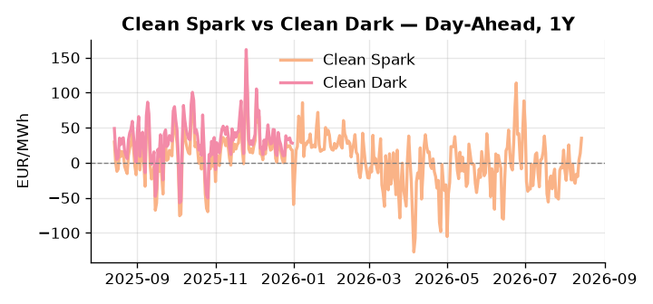
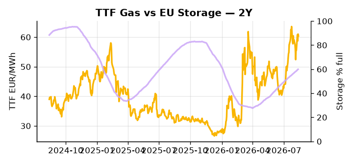

# European Cross-Commodity Risk Pack: Gas + Carbon → Power Curve Implications

**Daily desk brief — 2026-08-14**  
_Author: Sumer Sener · sumerberksener@gmail.com_  
_Generated by `scripts/generate_brief.py`. AI narrative + news themes via Anthropic Claude._

> **Data-freshness caveat:** Clean Dark (last 2025-12-31, 226d old); Coal (last 2025-12-26, 231d old). Numbers below should be read with this in mind.

## 1 · Executive summary

**TL;DR — GB Power at 99th percentile amid nuclear/hydro outages and extreme heat; storage 17pp below seasonal elevates winter gas-to-power spread risk.**

GB Power at 167.49 EUR/MWh — 99th percentile — is the dominant signal this morning, driven by concurrent French nuclear cooling constraints, Romanian hydro losses on the Danube, and a sustained heatwave that has left the grid with minimal headroom. EU storage sits 16.9 percentage points below seasonal norms at 59.92%, compressing the injection window ahead of Q4 and anchoring a steep winter-adequacy premium across the TTF Cal+1 curve. Clean Spark at the 90th percentile confirms gas-fired generation is firmly in-the-money, while coal's structural absence from the merit order is indicative only — with coal and clean dark data 231 and 226 days stale respectively, the dark spread cannot be treated as bankable for current regime assessment. US natural gas supply at a record 122.5 Bcf/d is easing the LNG arbitrage floor and softening inbound EU volumes, partially capping the fuel-switch ceiling on forward power. With gas tightness embedded in a 17pp storage deficit, EUA mid-range providing no offsetting relief, and clean sparks extended at the 90th percentile, the curve regime is one of structurally bid front-month power and a steep Cal+1 — a regime that remains intact unless the September US House Russia sanctions vote reshapes LNG inflows and forces a geopolitical premium reprice across front-curve risk.

_Generated by **claude-sonnet-4-6** via Anthropic API (two-pass extract→narrate). Prompts/responses logged to `ai/logs/`._
_Next-5d temperature anomaly — DE -0.6°C / FR +4.1°C vs 5-yr seasonal normal (Open-Meteo)._

## 2 · Monitor metrics

**Primary (cross-commodity headline tiles)**

| Metric | As of | Latest | Unit | 1d Δ | 1w Δ | 5y pctile | Headline |
|---|---|---:|---|---:|---:|---:|---|
| TTF Gas | 2026-08-13 | 60.40 | EUR/MWh | -1.02% | +5.64% | 72 | Within typical range |
| EU Storage | 2026-08-12 | 59.92 | % full | +0.44% | +2.18% | 37 | 16.9 pp below the 5-yr seasonal average |
| EUA Carbon | 2026-08-13 | 34.36 | EUR/tCO2 | +0.83% | +1.24% | 49 | Within typical range |
| DE Power | 2026-08-14 | 168.41 | EUR/MWh | +14.65% | +29.74% | 83 | Within typical range |
| GB Power | 2026-08-14 | 167.49 | EUR/MWh | +0.80% | +39.60% | 99 | 99th-percentile of 5-yr range — historically high |
| Renewables | 2026-08-13 | 55.15 | % of load | +19.11% | +1.90% | 75 | Within typical range |
| Clean Spark | 2026-08-14 | 34.97 | EUR/MWh | +21.53 | +24.60 | 90 | 90th-percentile of 5-yr range — historically high |
| Clean Dark | 2025-12-31 (STALE) | 27.95 | EUR/MWh | -0.56 | +11.63 | 47 | Within typical range |

**Fundamentals inputs** _(feed derived metrics; not separately traded)_

| Metric | As of | Latest | Unit | 1d Δ | 1w Δ | 5y pctile | Headline |
|---|---|---:|---|---:|---:|---:|---|
| Coal | 2025-12-26 (STALE) | 96.00 | USD/t | -0.57% | +0.08% | 7 | 7th-percentile of 5-yr range — historically low |

_Spreads → abs EUR/MWh deltas; others → pct. Weekly Δ uses 5d trailing means. Full history in `data/<metric>.csv`._

## 3 · Gas + LNG arb

**TTF front-month** prints at 60.40 EUR/MWh — _Within typical range_.
**EU storage** at 59.9% full (-16.9 pp vs 5-yr seasonal avg) — _16.9 pp below the 5-yr seasonal average_.
**TTF − JKM (LNG arb)** at -2.32 EUR/MWh (JKM 21.19 USD/MMBtu) — JKM richer than TTF — Asia pulls cargoes, marginal European tightening risk.

## 4 · Carbon (EU ETS)

**EUA December** prints at 34.36 EUR/tCO2 — _Within typical range_. A euro of EUA adds ~0.37 EUR/MWh to gas-fired and ~0.85 EUR/MWh to coal-fired generation cost; strength compresses the dark spread faster than the spark.

**EU vs UK ETS** — Cobblestone's emissions desk trades EUA and UKA. Post-Brexit auction reform narrowed the UKA discount to EUA from £20+/t to single-digit £/t; CBAM phase-in pulls UK compliance demand toward parity. EUA−UKA basis remains a tradable cross-market signal.

**Supply / policy signal** — _CBAM full operational phase live since 1 Jan 2026 — importers paying for embedded emissions_  
Side: `policy` · Polarity: `bullish EUA` · Source: EU Regulation 2023/956 (CBAM)

Domestic carbon-cost burden gradually levelled with imports; supports EUA demand floor as carbon leakage protection tightens through 2034.

_No ETS-relevant news surfaced today — falling back to `data/policy_facts.py` (hand-maintained structural fact pack). Fact pack last reviewed 2026-05-08 (98d ago)._

## 5 · Power — Day-Ahead & curve

**DE day-ahead baseload** at 168.41 EUR/MWh — _Within typical range_.
**GB day-ahead baseload** at 167.49 EUR/MWh — _99th-percentile of 5-yr range — historically high_.
**DE − GB spread** at +0.92 EUR/MWh (DE premium) — drives interconnector flow direction.
**Cross-border net flows (Power Transportation):** DE↔FR +15.2 GWh (DE export); GB↔FR -71.3 GWh (FR export); NL↔DE -7.1 GWh (DE export).

**Clean spark spread** at +34.97 EUR/MWh — _90th-percentile of 5-yr range — historically high_. Bridge from gas + carbon fundamentals to gas-fired economics; sustained positive spark = TTF moves transmit directly into the power curve.

**Curve shape:** DA → W+1 → M+1 → Q+1 → Cal+1 → Cal+2 = 168 / 120 / 120 / 120 / 120 / 120 EUR/MWh — **Backwardation** (DA −Cal+1 spread +48 EUR/MWh). Forwards are seasonality projections — see Methodology.

{width=49%} {width=49%}

**This week ahead**

- **Fri** 14:30 UTC — EIA weekly natural gas storage report: US storage trajectory anchors LNG export pricing into NW Europe — direct TTF transmission.
- **Fri** — ENTSO-E weekly day-ahead volumes / system-balance summary: Reads the European generation mix in last 7d — confirms or breaks the Cal+1 thesis.
- **Tue** 08:00 UTC — AGSI+ daily storage print: First read on the week's gas injection / withdrawal pace; sets the tone for TTF curve shape.
- **Sep** — US House Russia sanctions vote: Could tighten LNG supply landscape or amplify geopolitical premium on TTF; transmission via supply reallocation and risk repricing. _(news-extracted)_

**Scenarios (1w horizon)**

| | Summary | TTF | DE Power |
|---|---|---:|---:|
| **Base** | Tight power grid sustained by nuclear/hydro outages; storage injection accelerates slightly; gas remains supported by low reserves. | +2-4% | +3-5% |
| **Upside** | Danube water crises worsens; French nuclear derate extends into autumn; heatwave persists; storage refill lags seasonal norms. | +8-12% | +12-18% |
| **Downside** | Heat breaks; wind/rain improve renewables; nuclear units return online; LNG inflows accelerate; storage refill catches seasonal track. | -5-8% | -8-12% |

_Illustrative, not forecasts. Magnitudes sized off historical sensitivity; AI-generated from today's extract pass._

## 6 · Today's themes

**Weather watch (next 7d)**
- **Heat dome · FR · Fri 14 – Sat 15 Aug** — peak +8.7°C vs normal. Bullish FR power on AC load and possible nuclear river-cooling derating. Watch FR-nuclear availability prints if heat persists.
- **Storm · FR · Tue 18 – Thu 20 Aug** — peak gust 39 m/s (~141 km/h) on Wed 19 Aug. Strong wind boost to French generation; FR may export to neighbours. DA print likely below seasonal norm; watch FR-GB IFA flow toward GB.

**Watchlist (1–4 weeks)**
- France 2027 blackout drill schedule and implications for winter capacity signaling.
- Danube water levels and French nuclear cooling constraint updates through autumn.

_Risk framing — built within a discipline of clear limits and continuous monitoring; observations here are framed as risk inputs, not directional calls. Positioning decisions remain with the desk._
_Methodology + sources: **README §Methodology**. Numbers auditable via the snapshot JSONs. Rule-based / informational — not investment advice._