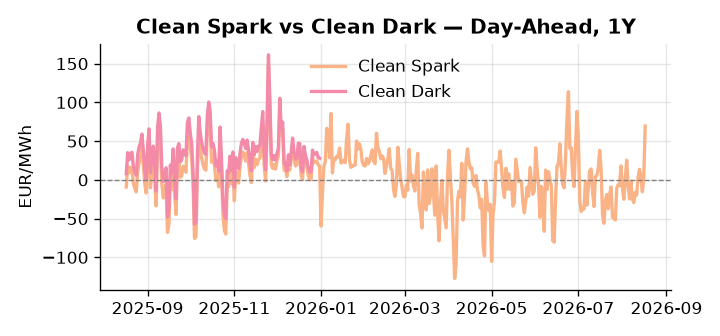
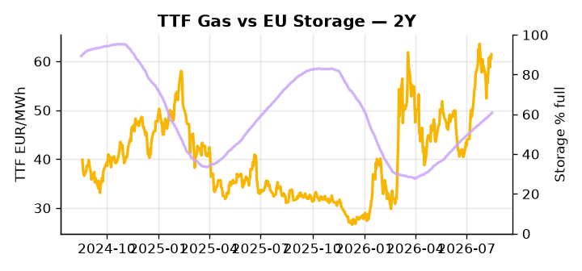

# European Cross-Commodity Risk Pack: Gas + Carbon → Power Curve Implications

**Daily desk brief — 2026-08-17**  
_Author: Sumer Sener · sumerberksener@gmail.com_  
_Generated by `scripts/generate_brief.py`. AI narrative + news themes via Anthropic Claude._

> **Data-freshness caveat:** Clean Dark (last 2025-12-31, 229d old); Coal (last 2025-12-26, 234d old). Numbers below should be read with this in mind.

## 1 · Executive summary

**TL;DR — GB Power at all-time highs (100th pctile); EU nuclear curtailed by heat/drought; Coal at 7th pctile creates extreme fuel-switch premium—structural supply crisis, not transient.**

GB Power has hit an all-time high at the 100th percentile (€191.53/MWh), driven by a structural nuclear supply crisis spanning France (jellyfish-driven Tricastin outages), Romania (Cernavoda), and Hungary (Paks), all compounded by record-low Danube levels constraining cooling water access at peak summer demand. European storage sits 17 percentage points below seasonal norms at 60.78% full (38th percentile), compressing refill headroom precisely as the thermal call extends, with DE Power running +2.94σ above its 50-day trend at €205/MWh. The fuel-switch signal is structural not noise: Coal at the 7th percentile (96 USD/t) alongside TTF at the 73rd percentile (€61.42/MWh) and EUA at the 49th percentile (€34.35/t, neutral) has driven Clean Spark to the 98th percentile (€69.51/MWh), a configuration that reflects merit-order exhaustion rather than a transient premium. With coal data 234 days stale and Clean Dark 229 days stale, dark spread readings are indicative not bankable, and the September US Senate sanctions bill advancing to a House vote brackets LNG supply risk on both sides of the arb. Gas tightness at the 73rd percentile AND carbon anchored at mid-range AND Clean Spark in deep in-the-money territory keep the front-curve regime extended, while the pending US sanctions vote on Russian LNG flows introduces asymmetric front-curve risk that could either relieve or reinforce the current supply-crisis-driven power elevation.

_Generated by **claude-sonnet-4-6** via Anthropic API (two-pass extract→narrate). Prompts/responses logged to `ai/logs/`._
_Next-5d temperature anomaly — DE -1.6°C / FR +1.8°C / GB +1.2°C vs 5-yr seasonal normal (Open-Meteo)._

## 2 · Monitor metrics

**Primary (cross-commodity headline tiles)**

| Metric | As of | Latest | Unit | 1d Δ | 1w Δ | 5y pctile | Headline |
|---|---|---:|---|---:|---:|---:|---|
| TTF Gas | 2026-08-14 | 61.42 | EUR/MWh | +1.70% | +9.11% | 73 | Within typical range |
| EU Storage | 2026-08-15 | 60.78 | % full | +0.56% | +2.31% | 38 | 17.0 pp below the 5-yr seasonal average |
| EUA Carbon | 2026-08-14 | 34.35 | EUR/tCO2 | -0.03% | +0.64% | 49 | Within typical range |
| DE Power | 2026-08-17 | 205.00 | EUR/MWh | +49.04% | +33.88% | 88 | extended 2.9σ above the 50d trend |
| GB Power | 2026-08-17 | 191.53 | EUR/MWh | +11.42% | +30.03% | 100 | 100th-percentile of 5-yr range — historically high |
| Renewables | 2026-08-16 | 44.54 | % of load | -17.67% | -6.38% | 53 | Within typical range |
| Clean Spark | 2026-08-17 | 69.51 | EUR/MWh | +67.45 | +37.43 | 98 | 98th-percentile of 5-yr range — historically high |
| Clean Dark | 2025-12-31 (STALE) | 27.95 | EUR/MWh | -0.56 | +11.63 | 47 | Within typical range |

**Fundamentals inputs** _(feed derived metrics; not separately traded)_

| Metric | As of | Latest | Unit | 1d Δ | 1w Δ | 5y pctile | Headline |
|---|---|---:|---|---:|---:|---:|---|
| Coal | 2025-12-26 (STALE) | 96.00 | USD/t | -0.57% | +0.08% | 7 | 7th-percentile of 5-yr range — historically low |

_Spreads → abs EUR/MWh deltas; others → pct. Weekly Δ uses 5d trailing means. Full history in `data/<metric>.csv`._

## 3 · Gas + LNG arb

**TTF front-month** prints at 61.42 EUR/MWh — _Within typical range_.
**EU storage** at 60.8% full (-17.0 pp vs 5-yr seasonal avg) — _17.0 pp below the 5-yr seasonal average_.
**TTF − JKM (LNG arb)** at -1.34 EUR/MWh (JKM 21.22 USD/MMBtu) — JKM richer than TTF — Asia pulls cargoes, marginal European tightening risk.

## 4 · Carbon (EU ETS)

**EUA December** prints at 34.35 EUR/tCO2 — _Within typical range_. A euro of EUA adds ~0.37 EUR/MWh to gas-fired and ~0.85 EUR/MWh to coal-fired generation cost; strength compresses the dark spread faster than the spark.

**EU vs UK ETS** — Cobblestone's emissions desk trades EUA and UKA. Post-Brexit auction reform narrowed the UKA discount to EUA from £20+/t to single-digit £/t; CBAM phase-in pulls UK compliance demand toward parity. EUA−UKA basis remains a tradable cross-market signal.

**Supply / policy signal** — _CBAM full operational phase live since 1 Jan 2026 — importers paying for embedded emissions_  
Side: `policy` · Polarity: `bullish EUA` · Source: EU Regulation 2023/956 (CBAM)

Domestic carbon-cost burden gradually levelled with imports; supports EUA demand floor as carbon leakage protection tightens through 2034.

_No ETS-relevant news surfaced today — falling back to `data/policy_facts.py` (hand-maintained structural fact pack). Fact pack last reviewed 2026-05-08 (101d ago)._

## 5 · Power — Day-Ahead & curve

**DE day-ahead baseload** at 205.00 EUR/MWh — _extended 2.9σ above the 50d trend_.
**GB day-ahead baseload** at 191.53 EUR/MWh — _100th-percentile of 5-yr range — historically high_.
**DE − GB spread** at +13.47 EUR/MWh (DE premium) — drives interconnector flow direction.
**Cross-border net flows (Power Transportation):** DE↔FR -4.4 GWh (FR export); GB↔FR -67.6 GWh (FR export); NL↔DE +3.5 GWh (NL export).

**Clean spark spread** at +69.51 EUR/MWh — _98th-percentile of 5-yr range — historically high_. Bridge from gas + carbon fundamentals to gas-fired economics; sustained positive spark = TTF moves transmit directly into the power curve.

**Curve shape:** DA → W+1 → M+1 → Q+1 → Cal+1 → Cal+2 = 205 / 126 / 126 / 126 / 126 / 126 EUR/MWh — **Backwardation** (DA −Cal+1 spread +79 EUR/MWh). Forwards are seasonality projections — see Methodology.

{width=49%} {width=49%}

**This week ahead**

- **Tue** 08:00 UTC — AGSI+ daily storage print: First read on the week's gas injection / withdrawal pace; sets the tone for TTF curve shape.
- **Wed** 09:00 UTC — EEX EUA primary auction (Mon–Thu daily; Wed is largest volume): Supply-side EUA signal; auction clearing relative to spot reads as ETS demand strength.
- **Wed** — ENTSO-E DE_LU + GB next-week wind/solar forecast refresh: Sets the residual-load curve a week out; outsized prints move power Cal+1 directionally.
- **Sep** — US House vote: Russia sanctions bill: Determines LNG export restrictions; EU TTF arb and gas cost transmission into power settles within week. _(news-extracted)_

**Scenarios (1w horizon)**

| | Summary | TTF | DE Power |
|---|---|---:|---:|
| **Base** | Nuclear outages persist; storage drawdown moderate; TTF holds 70–75 EUR/MWh band; power cooling from highs but remains 50–70th pctile. | +0-3% | -5-10% |
| **Upside** | Danube levels fall further; Paks shutdown confirmed; Cernavoda offline extends. Gas call rises; TTF breaches 70 EUR/MWh mid-range. | +5-12% | +8-15% |
| **Downside** | Renewable forecast swing +20 pctile; Danube stabilizes; France/Hungary nuclear restart timelines accelerate. Merit-order reversal pressures power Cal+1. | -3-8% | -12-20% |

_Illustrative, not forecasts. Magnitudes sized off historical sensitivity; AI-generated from today's extract pass._

## 6 · Today's themes

**Weather watch (next 7d)**
- **Storm · DE · Mon 17 – Thu 20 Aug** — peak gust 48 m/s (~171 km/h) on Wed 19 Aug. Wind generation likely surges Day 1, then risk of turbine cut-off if gusts exceed 25 m/s. Bearish DA early, sharp reversal possible. Watch DE-FR flow swings.
- **Storm · FR · Mon 17 – Fri 21 Aug** — peak gust 37 m/s (~132 km/h) on Tue 18 Aug. Strong wind boost to French generation; FR may export to neighbours. DA print likely below seasonal norm; watch FR-GB IFA flow toward GB.

**Watchlist (1–4 weeks)**
- Danube water levels and thermal plant cooling constraints; monitor HU/RO nuclear availability weekly.
- House vote on Russia sanctions bill (September); outcome determines LNG export/sanctions risk to EU TTF.

_Risk framing — built within a discipline of clear limits and continuous monitoring; observations here are framed as risk inputs, not directional calls. Positioning decisions remain with the desk._
_Methodology + sources: **README §Methodology**. Numbers auditable via the snapshot JSONs. Rule-based / informational — not investment advice._