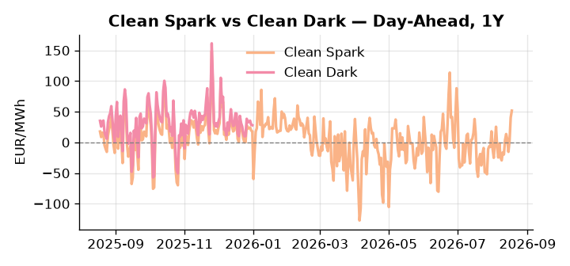
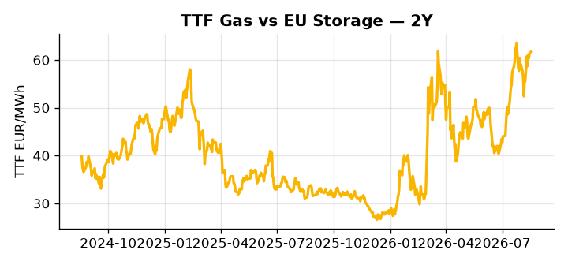

# European Cross-Commodity Risk Pack: Gas + Carbon → Power Curve Implications

**Daily desk brief — 2026-08-18**  
_Author: Sumer Sener · sumerberksener@gmail.com_  
_Generated by `scripts/generate_brief.py`. AI narrative + news themes via Anthropic Claude._

> **Data-freshness caveat:** Clean Dark (last 2025-12-31, 230d old); Coal (last 2025-12-26, 235d old). Numbers below should be read with this in mind.

## 1 · Executive summary

**TL;DR — EU summer nuclear crisis (Romania, France, Hungary offline) forces gas-fired backup online; GB Power at 97th-percentile, Clean Spark 95th; US LNG record production caps TTF upside.**

The dominant signal this morning is the EU summer nuclear crisis: Romania, France, and Hungary outages have stripped approximately 3–4 GW of EU baseload, forcing gas-fired thermal firmly onto the merit order and driving GB Power to the 97th percentile at 157.85 EUR/MWh while the Clean Spark sits at the 95th percentile at 51.78 EUR/MWh, confirming gas-in-merit as the prevailing regime. Renewables are running 2.0σ below trend at the 18th percentile, locking in elevated thermal call through peak and leaving the desk with no near-term renewable offset headroom. US LNG at a record 122.5 Bcf/d keeps supply elasticity anchored on the TTF topside, capping the front-month gas rally even as island supply stress in GB remains extended. With coal data 235 days old and clean dark 230 days old, the dark spread reads as indicative, not bankable, for intra-day positioning — the 7th-percentile coal print and 47th-percentile clean dark suggest only modest arbitrage headroom at best. Gas tightness from sustained nuclear deratings AND EUA mid-range AND a clean spark in-the-money at the 95th percentile keep the front-curve in a thermal-dispatch regime, with the Danube drought threatening to extend that regime well into Cal+1 if Paks-II commissioning slips further on Rosatom sanctions.

_Generated by **claude-sonnet-4-6** via Anthropic API (two-pass extract→narrate). Prompts/responses logged to `ai/logs/`._
_Next-5d temperature anomaly — DE -0.8°C / FR +0.7°C / GB +0.0°C vs 5-yr seasonal normal (Open-Meteo)._

## 2 · Monitor metrics

**Primary (cross-commodity headline tiles)**

| Metric | As of | Latest | Unit | 1d Δ | 1w Δ | 5y pctile | Headline |
|---|---|---:|---|---:|---:|---:|---|
| TTF Gas | 2026-08-17 | 61.76 | EUR/MWh | +0.54% | +8.17% | 73 | Within typical range |
| EU Storage | — | — | % full | — | — | — | (no data) |
| EUA Carbon | 2026-08-14 | 34.35 | EUR/tCO2 | -0.03% | +1.26% | 49 | Within typical range |
| DE Power | 2026-08-18 | 187.93 | EUR/MWh | +6.52% | +25.42% | 86 | extended 2.4σ above the 50d trend |
| GB Power | 2026-08-18 | 157.85 | EUR/MWh | -17.09% | +16.27% | 97 | 97th-percentile of 5-yr range — historically high |
| Renewables | 2026-08-17 | 27.65 | % of load | -37.92% | -12.16% | 18 | extended 2.0σ below the 50d trend |
| Clean Spark | 2026-08-18 | 51.78 | EUR/MWh | +11.50 | +29.73 | 95 | 95th-percentile of 5-yr range — historically high |
| Clean Dark | 2025-12-31 (STALE) | 27.95 | EUR/MWh | -0.56 | +11.63 | 47 | Within typical range |

**Fundamentals inputs** _(feed derived metrics; not separately traded)_

| Metric | As of | Latest | Unit | 1d Δ | 1w Δ | 5y pctile | Headline |
|---|---|---:|---|---:|---:|---:|---|
| Coal | 2025-12-26 (STALE) | 96.00 | USD/t | -0.57% | +0.08% | 7 | 7th-percentile of 5-yr range — historically low |

_Spreads → abs EUR/MWh deltas; others → pct. Weekly Δ uses 5d trailing means. Full history in `data/<metric>.csv`._

## 3 · Gas + LNG arb

**TTF front-month** prints at 61.76 EUR/MWh — _Within typical range_.
**TTF − JKM (LNG arb)** at -1.97 EUR/MWh (JKM 21.61 USD/MMBtu) — JKM richer than TTF — Asia pulls cargoes, marginal European tightening risk.

## 4 · Carbon (EU ETS)

**EUA December** prints at 34.35 EUR/tCO2 — _Within typical range_. A euro of EUA adds ~0.37 EUR/MWh to gas-fired and ~0.85 EUR/MWh to coal-fired generation cost; strength compresses the dark spread faster than the spark.

**EU vs UK ETS** — Cobblestone's emissions desk trades EUA and UKA. Post-Brexit auction reform narrowed the UKA discount to EUA from £20+/t to single-digit £/t; CBAM phase-in pulls UK compliance demand toward parity. EUA−UKA basis remains a tradable cross-market signal.

**Supply / policy signal** — _CBAM full operational phase live since 1 Jan 2026 — importers paying for embedded emissions_  
Side: `policy` · Polarity: `bullish EUA` · Source: EU Regulation 2023/956 (CBAM)

Domestic carbon-cost burden gradually levelled with imports; supports EUA demand floor as carbon leakage protection tightens through 2034.

_No ETS-relevant news surfaced today — falling back to `data/policy_facts.py` (hand-maintained structural fact pack). Fact pack last reviewed 2026-05-08 (102d ago)._

## 5 · Power — Day-Ahead & curve

**DE day-ahead baseload** at 187.93 EUR/MWh — _extended 2.4σ above the 50d trend_.
**GB day-ahead baseload** at 157.85 EUR/MWh — _97th-percentile of 5-yr range — historically high_.
**DE − GB spread** at +30.08 EUR/MWh (DE premium) — drives interconnector flow direction.
**Cross-border net flows (Power Transportation):** DE↔FR -32.8 GWh (FR export); GB↔FR -29.1 GWh (FR export); NL↔DE +60.5 GWh (NL export).

**Clean spark spread** at +51.78 EUR/MWh — _95th-percentile of 5-yr range — historically high_. Bridge from gas + carbon fundamentals to gas-fired economics; sustained positive spark = TTF moves transmit directly into the power curve.

**Curve shape:** DA → W+1 → M+1 → Q+1 → Cal+1 → Cal+2 = 188 / 128 / 128 / 128 / 128 / 128 EUR/MWh — **Backwardation** (DA −Cal+1 spread +60 EUR/MWh). Forwards are seasonality projections — see Methodology.

{width=49%} {width=49%}

**This week ahead**

- **Tue** 08:00 UTC — AGSI+ daily storage print: First read on the week's gas injection / withdrawal pace; sets the tone for TTF curve shape.
- **Wed** 09:00 UTC — EEX EUA primary auction (Mon–Thu daily; Wed is largest volume): Supply-side EUA signal; auction clearing relative to spot reads as ETS demand strength.
- **Wed** — ENTSO-E DE_LU + GB next-week wind/solar forecast refresh: Sets the residual-load curve a week out; outsized prints move power Cal+1 directionally.
- **TBD** — Romania nuclear restart decision: Cooling-water recovery timeline will signal thermal supply relief or sustained high-merit gas call. _(news-extracted)_
- **TBD** — France reactor return schedule update: Jellyfish/cooling pattern indicates weekly risk; timing affects Q4 power curve baseload assumptions. _(news-extracted)_

**Scenarios (1w horizon)**

| | Summary | TTF | DE Power |
|---|---|---:|---:|
| **Base** | Danube stabilizes, nuclear outages persist through August–September; gas in-the-money, thermal dispatch sustained. | +2-4% | +5-8% |
| **Upside** | Danube drought worsens; Romania/Hungary thermal offline extended into October; French jellyfishes recur. Gas-fired backup surge. | +8-15% | +15-25% |
| **Downside** | Renewables recover to 50th-percentile; Danube levels improve; nuclear plants online. Thermal call collapses, Clean Spark mean-reverts. | -5-10% | -12-18% |

_Illustrative, not forecasts. Magnitudes sized off historical sensitivity; AI-generated from today's extract pass._

## 6 · Today's themes

**Weather watch (next 7d)**
- **Storm · DE · Tue 18 – Thu 20 Aug** — peak gust 48 m/s (~171 km/h) on Wed 19 Aug. Wind generation likely surges Day 1, then risk of turbine cut-off if gusts exceed 25 m/s. Bearish DA early, sharp reversal possible. Watch DE-FR flow swings.
- **Storm · FR · Sun 23 – Mon 24 Aug** — peak gust 54 m/s (~194 km/h) on Mon 24 Aug. Strong wind boost to French generation; FR may export to neighbours. DA print likely below seasonal norm; watch FR-GB IFA flow toward GB.

**Watchlist (1–4 weeks)**
- Danube water levels & thermal plant reopening timeline (Romania, Hungary, France).
- French nuclear reactor return-to-service schedule (cooling outages, jellyfish-risk dates).

_Risk framing — built within a discipline of clear limits and continuous monitoring; observations here are framed as risk inputs, not directional calls. Positioning decisions remain with the desk._
_Methodology + sources: **README §Methodology**. Numbers auditable via the snapshot JSONs. Rule-based / informational — not investment advice._