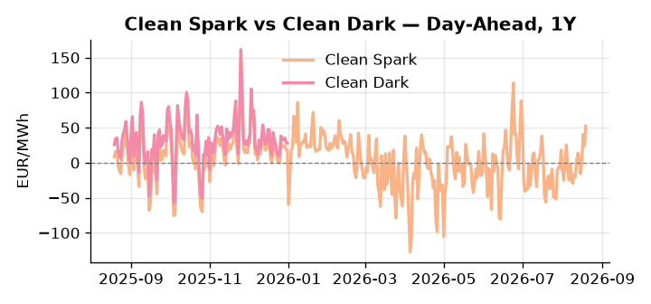
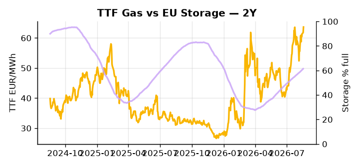

# European Cross-Commodity Risk Pack: Gas + Carbon → Power Curve Implications

**Daily desk brief — 2026-08-19**  
_Author: Sumer Sener · sumerberksener@gmail.com_  
_Generated by `scripts/generate_brief.py`. AI narrative + news themes via Anthropic Claude._

> **Data-freshness caveat:** Clean Dark (last 2025-12-31, 231d old); Coal (last 2025-12-26, 236d old). Numbers below should be read with this in mind.

## 1 · Executive summary

**TL;DR — GB Power at 99th-percentile amid marine heat-wave nuclear constraints; storage 17pp below seasonal average tightens H2 refill risk.**

GB Power at the 99th percentile (189.66 EUR/MWh, +5.61% on the day) is the dominant signal, driven by marine heat waves suppressing nuclear and hydro cooling capacity continent-wide, with Danube constraints on Paks II sustaining a Central EU premium that shows no immediate release valve. Storage at 61.37% — 17.1 percentage points below the five-year seasonal average — means the refill window through September carries compounding Q4 tail risk, keeping the fuel-switch regime extended and thermal dispatch elevated. The Clean Spark at the 95th percentile (52.09 EUR/MWh) confirms tight gas-to-power economics, while renewables at the 28th percentile (33.1% share) prolongs coal-avoidance pressure on the stack; with coal data 236 days old and Clean Dark stale at 231 days, the dark spread is indicative not bankable for intraday positioning. US LNG at a projected 122.5 Bcf/d shifts the Henry Hub–TTF arb over the coming months, offering a slow-moving headroom signal for the Cal+1 regime but providing no near-term relief to front-month tightness. Gas tightness anchored by sub-seasonal storage AND EUA demand elevated via forced thermal dispatch AND clean spark in-the-money at the 95th percentile keep the front-curve in a high-cost, fuel-switch-extended regime, with Paks II and broader nuclear cooling risk the single most live lever on the Cal+1 spread.

_Generated by **claude-sonnet-4-6** via Anthropic API (two-pass extract→narrate). Prompts/responses logged to `ai/logs/`._
_Next-5d temperature anomaly — DE -0.7°C / FR -0.3°C / GB -0.5°C vs 5-yr seasonal normal (Open-Meteo)._

## 2 · Monitor metrics

**Primary (cross-commodity headline tiles)**

| Metric | As of | Latest | Unit | 1d Δ | 1w Δ | 5y pctile | Headline |
|---|---|---:|---|---:|---:|---:|---|
| TTF Gas | 2026-08-18 | 63.65 | EUR/MWh | +3.06% | +8.83% | 73 | Within typical range |
| EU Storage | 2026-08-17 | 61.37 | % full | +0.39% | +2.38% | 39 | 17.1 pp below the 5-yr seasonal average |
| EUA Carbon | 2026-08-18 | 34.30 | EUR/tCO2 | -0.03% | +0.19% | 49 | Within typical range |
| DE Power | 2026-08-19 | 192.00 | EUR/MWh | +17.30% | +20.87% | 86 | extended 2.6σ above the 50d trend |
| GB Power | 2026-08-19 | 189.66 | EUR/MWh | +5.61% | +14.52% | 99 | 99th-percentile of 5-yr range — historically high |
| Renewables | 2026-08-18 | 33.10 | % of load | +19.72% | -21.56% | 28 | Within typical range |
| Clean Spark | 2026-08-19 | 52.09 | EUR/MWh | +28.32 | +28.18 | 95 | 95th-percentile of 5-yr range — historically high |
| Clean Dark | 2025-12-31 (STALE) | 27.95 | EUR/MWh | -0.56 | +11.63 | 47 | Within typical range |

**Fundamentals inputs** _(feed derived metrics; not separately traded)_

| Metric | As of | Latest | Unit | 1d Δ | 1w Δ | 5y pctile | Headline |
|---|---|---:|---|---:|---:|---:|---|
| Coal | 2025-12-26 (STALE) | 96.00 | USD/t | -0.57% | +0.08% | 7 | 7th-percentile of 5-yr range — historically low |

_Spreads → abs EUR/MWh deltas; others → pct. Weekly Δ uses 5d trailing means. Full history in `data/<metric>.csv`._

## 3 · Gas + LNG arb

**TTF front-month** prints at 63.65 EUR/MWh — _Within typical range_.
**EU storage** at 61.4% full (-17.1 pp vs 5-yr seasonal avg) — _17.1 pp below the 5-yr seasonal average_.
**TTF − JKM (LNG arb)** at -0.82 EUR/MWh (JKM 21.89 USD/MMBtu) — JKM richer than TTF — Asia pulls cargoes, marginal European tightening risk.

## 4 · Carbon (EU ETS)

**EUA December** prints at 34.30 EUR/tCO2 — _Within typical range_. A euro of EUA adds ~0.37 EUR/MWh to gas-fired and ~0.85 EUR/MWh to coal-fired generation cost; strength compresses the dark spread faster than the spark.

**EU vs UK ETS** — Cobblestone's emissions desk trades EUA and UKA. Post-Brexit auction reform narrowed the UKA discount to EUA from £20+/t to single-digit £/t; CBAM phase-in pulls UK compliance demand toward parity. EUA−UKA basis remains a tradable cross-market signal.

**Supply / policy signal** — _CBAM full operational phase live since 1 Jan 2026 — importers paying for embedded emissions_  
Side: `policy` · Polarity: `bullish EUA` · Source: EU Regulation 2023/956 (CBAM)

Domestic carbon-cost burden gradually levelled with imports; supports EUA demand floor as carbon leakage protection tightens through 2034.

_No ETS-relevant news surfaced today — falling back to `data/policy_facts.py` (hand-maintained structural fact pack). Fact pack last reviewed 2026-05-08 (103d ago)._

## 5 · Power — Day-Ahead & curve

**DE day-ahead baseload** at 192.00 EUR/MWh — _extended 2.6σ above the 50d trend_.
**GB day-ahead baseload** at 189.66 EUR/MWh — _99th-percentile of 5-yr range — historically high_.
**DE − GB spread** at +2.34 EUR/MWh (DE premium) — drives interconnector flow direction.
**Cross-border net flows (Power Transportation):** DE↔FR -56.4 GWh (FR export); GB↔FR -12.4 GWh (FR export); NL↔DE +99.6 GWh (NL export).

**Clean spark spread** at +52.09 EUR/MWh — _95th-percentile of 5-yr range — historically high_. Bridge from gas + carbon fundamentals to gas-fired economics; sustained positive spark = TTF moves transmit directly into the power curve.

**Curve shape:** DA → W+1 → M+1 → Q+1 → Cal+1 → Cal+2 = 192 / 130 / 130 / 130 / 130 / 130 EUR/MWh — **Backwardation** (DA −Cal+1 spread +62 EUR/MWh). Forwards are seasonality projections — see Methodology.

{width=49%} {width=49%}

**This week ahead**

- **Wed** 09:00 UTC — EEX EUA primary auction (Mon–Thu daily; Wed is largest volume): Supply-side EUA signal; auction clearing relative to spot reads as ETS demand strength.
- **Wed** — ENTSO-E DE_LU + GB next-week wind/solar forecast refresh: Sets the residual-load curve a week out; outsized prints move power Cal+1 directionally.
- **Fri** 14:30 UTC — EIA weekly natural gas storage report: US storage trajectory anchors LNG export pricing into NW Europe — direct TTF transmission.
- **N/A** — Danube water-level and Paks II output monitoring (weekly): Ongoing marine heat-wave constraint on nuclear cooling; no fixed event date, but real-time tracking critical for power dispatch updates. _(news-extracted)_

**Scenarios (1w horizon)**

| | Summary | TTF | DE Power |
|---|---|---:|---:|
| **Base** | Tight thermal dispatch, sub-seasonal storage; GB Power holds premium, DA power near 190 EUR/MWh. | ±1-3% | tracks |
| **Upside** | Next heat wave deepens nuclear cooling crisis; Danube falls further or France/Germany outages spike. | +5-12% | +8-15% |
| **Downside** | Temperature normalisation, hydro inflows recover, storage build accelerates, nuclear capacity restored. | −3-8% | −5-12% |

_Illustrative, not forecasts. Magnitudes sized off historical sensitivity; AI-generated from today's extract pass._

## 6 · Today's themes

**Weather watch (next 7d)**
- **Storm · FR · Wed 19 – Fri 21 Aug** — peak gust 58 m/s (~210 km/h) on Wed 19 Aug. Strong wind boost to French generation; FR may export to neighbours. DA print likely below seasonal norm; watch FR-GB IFA flow toward GB.
- **Storm · GB · Wed 19 – Fri 21 Aug** — peak gust 41 m/s (~147 km/h) on Wed 19 Aug. GB wind capacity is large — DA likely soft. Cut-off risk if gusts exceed safety thresholds; opposite tail (sudden tightening) possible.

**Watchlist (1–4 weeks)**
- Danube water-level recovery; monitor Paks II nuclear output weekly.
- EU sanctions decision timeline on Rosatom (Hungary plant permit risk).

_Risk framing — built within a discipline of clear limits and continuous monitoring; observations here are framed as risk inputs, not directional calls. Positioning decisions remain with the desk._
_Methodology + sources: **README §Methodology**. Numbers auditable via the snapshot JSONs. Rule-based / informational — not investment advice._