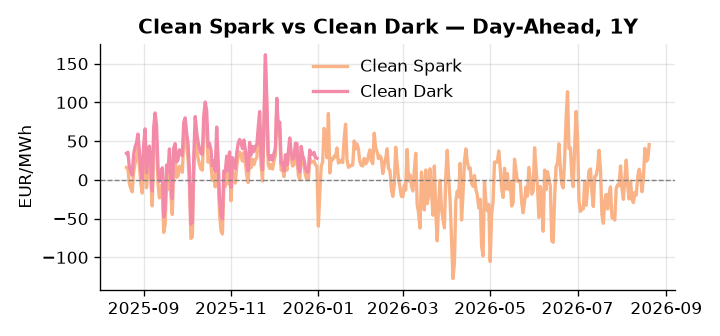
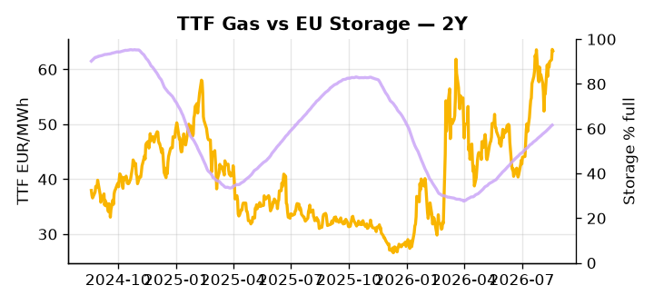

# European Cross-Commodity Risk Pack: Gas + Carbon → Power Curve Implications

**Daily desk brief — 2026-08-20**  
_Author: Sumer Sener · sumerberksener@gmail.com_  
_Generated by `scripts/generate_brief.py`. AI narrative + news themes via Anthropic Claude._

> **Data-freshness caveat:** Clean Dark (last 2025-12-31, 232d old); Coal (last 2025-12-26, 237d old). Numbers below should be read with this in mind.

## 1 · Executive summary

**TL;DR — GB Power at 98th-percentile amid European heat wave; Clean Spark at 94th-percentile despite record US LNG supply bearishness — thermal dispatch tightness trumps gas glut.**

GB Power at the 98th-percentile and Clean Spark at 94th-percentile signal that heat-wave-driven cooling demand is overriding record US LNG supply bearishness at 122.5 Bcf/d, keeping the thermal merit order steep and gas firmly in-the-money for dispatch. EU storage at 61.61% — 17.1 percentage points below seasonal norm — is refilling at only +0.39% daily, leaving the curve exposed to any geopolitical shock on the supply side. EUA demand carries a structural bullish tilt as French nuclear capex constraints under a budget crunch risk deferring the Paks II timeline and forcing coal and gas substitution into H2, raising EUA intensity per MWh; potential EU sanctions on Rosatom fuel supply amplify this pressure as a slow-motion supply tightening on the carbon curve. With coal data 237 days old and clean dark spread stale as of 31-Dec, the 27.95 EUR/MWh dark spread at 47th-percentile is indicative not bankable for current merit-order positioning. With Rosatom sanctions tail-risk forcing fuel-switch economics, gas tightness at the 98th-percentile AND EUA bullish-supply pressure from deferred nuclear AND clean spark in-the-money at 94th-percentile keep the front-curve risk elevated, while storage headroom compression anchors an extended thermal-dispatch regime through the Cal+1 arc.

_Generated by **claude-sonnet-4-6** via Anthropic API (two-pass extract→narrate). Prompts/responses logged to `ai/logs/`._
_Next-5d temperature anomaly — DE -1.0°C / FR -0.6°C vs 5-yr seasonal normal (Open-Meteo)._

## 2 · Monitor metrics

**Primary (cross-commodity headline tiles)**

| Metric | As of | Latest | Unit | 1d Δ | 1w Δ | 5y pctile | Headline |
|---|---|---:|---|---:|---:|---:|---|
| TTF Gas | 2026-08-19 | 63.38 | EUR/MWh | -0.42% | +6.42% | 73 | Within typical range |
| EU Storage | 2026-08-18 | 61.61 | % full | +0.39% | +2.40% | 39 | 17.1 pp below the 5-yr seasonal average |
| EUA Carbon | 2026-08-19 | 34.56 | EUR/tCO2 | +0.76% | +0.58% | 50 | Within typical range |
| DE Power | 2026-08-20 | 185.00 | EUR/MWh | +11.61% | +26.39% | 86 | extended 2.3σ above the 50d trend |
| GB Power | 2026-08-20 | 164.95 | EUR/MWh | -10.70% | +10.35% | 98 | 98th-percentile of 5-yr range — historically high |
| Renewables | 2026-08-19 | 48.68 | % of load | +47.07% | -23.40% | 61 | Within typical range |
| Clean Spark | 2026-08-20 | 45.52 | EUR/MWh | +19.25 | +34.94 | 94 | 94th-percentile of 5-yr range — historically high |
| Clean Dark | 2025-12-31 (STALE) | 27.95 | EUR/MWh | -0.56 | +11.63 | 47 | Within typical range |

**Fundamentals inputs** _(feed derived metrics; not separately traded)_

| Metric | As of | Latest | Unit | 1d Δ | 1w Δ | 5y pctile | Headline |
|---|---|---:|---|---:|---:|---:|---|
| Coal | 2025-12-26 (STALE) | 96.00 | USD/t | -0.57% | +0.08% | 7 | 7th-percentile of 5-yr range — historically low |

_Spreads → abs EUR/MWh deltas; others → pct. Weekly Δ uses 5d trailing means. Full history in `data/<metric>.csv`._

## 3 · Gas + LNG arb

**TTF front-month** prints at 63.38 EUR/MWh — _Within typical range_.
**EU storage** at 61.6% full (-17.1 pp vs 5-yr seasonal avg) — _17.1 pp below the 5-yr seasonal average_.
**TTF − JKM (LNG arb)** at -1.70 EUR/MWh (JKM 22.08 USD/MMBtu) — JKM richer than TTF — Asia pulls cargoes, marginal European tightening risk.

## 4 · Carbon (EU ETS)

**EUA December** prints at 34.56 EUR/tCO2 — _Within typical range_. A euro of EUA adds ~0.37 EUR/MWh to gas-fired and ~0.85 EUR/MWh to coal-fired generation cost; strength compresses the dark spread faster than the spark.

**EU vs UK ETS** — Cobblestone's emissions desk trades EUA and UKA. Post-Brexit auction reform narrowed the UKA discount to EUA from £20+/t to single-digit £/t; CBAM phase-in pulls UK compliance demand toward parity. EUA−UKA basis remains a tradable cross-market signal.

**Supply / policy signal** — _French nuclear capex constraints amid budget crunch risk defer Paks II timeline and European baseload capacity; potential EU sanctions on Rosatom fuel supply threatens long-term nuclear strategy and forces coal/gas substitution, raising EUA demand._  
Side: `supply` · Polarity: `bullish EUA` · Source: Politico EU Energy

Delayed or sanctioned nuclear capacity forces thermal (coal/gas) dispatch into H2, raising EUA intensity per MWh; mandatory fuel-switching offsets LNG oversupply with higher-carbon generation economics.

_Surfaced from today's news flow by the AI extract pass (`ai/prompts/extract_v1.md` → `carbon_policy_signal`)._

## 5 · Power — Day-Ahead & curve

**DE day-ahead baseload** at 185.00 EUR/MWh — _extended 2.3σ above the 50d trend_.
**GB day-ahead baseload** at 164.95 EUR/MWh — _98th-percentile of 5-yr range — historically high_.
**DE − GB spread** at +20.05 EUR/MWh (DE premium) — drives interconnector flow direction.
**Cross-border net flows (Power Transportation):** DE↔FR -52.0 GWh (FR export); GB↔FR -30.9 GWh (FR export); NL↔DE +21.1 GWh (NL export).

**Clean spark spread** at +45.52 EUR/MWh — _94th-percentile of 5-yr range — historically high_. Bridge from gas + carbon fundamentals to gas-fired economics; sustained positive spark = TTF moves transmit directly into the power curve.

**Curve shape:** DA → W+1 → M+1 → Q+1 → Cal+1 → Cal+2 = 185 / 132 / 132 / 132 / 132 / 132 EUR/MWh — **Backwardation** (DA −Cal+1 spread +53 EUR/MWh). Forwards are seasonality projections — see Methodology.

{width=49%} {width=49%}

**This week ahead**

- **Fri** 14:30 UTC — EIA weekly natural gas storage report: US storage trajectory anchors LNG export pricing into NW Europe — direct TTF transmission.
- **Thu** 14:30 UTC — US EIA weekly crude inventories: Crude — and via crack spreads, refined-products — feed back into LNG arb economics.
- **Fri** — ENTSO-E weekly day-ahead volumes / system-balance summary: Reads the European generation mix in last 7d — confirms or breaks the Cal+1 thesis.
- **n/a** — French budget vote / nuclear maintenance announcements: No explicit date in news; watch Aug–Sep for capex and outage calendar; material for autumn power and EUA curve. _(news-extracted)_
- **n/a** — EU sanctions decision on Rosatom and Paks II: No firm date supplied; material for H2 baseload strategy and fuel-switch economics; monitor weekly for policy statements. _(news-extracted)_

**Scenarios (1w horizon)**

| | Summary | TTF | DE Power |
|---|---|---:|---:|
| **Base** | Heat wave persists; GB/DE power volatility tight around 98th/86th-pctile; TTF stable mid-60s EUR/MWh. | ±2-3% | ±3-5% |
| **Upside** | EU sanctions on Rosatom accelerate; Paks II delayed; French nuclear outage unplanned; coal forced baseload; EUA re-rates higher. | +5-8% | +8-12% |
| **Downside** | Heat wave breaks early; US LNG export bottleneck relief shipped Q4; arbitrage normalizes; storage refill accelerates; winter risk discount compresses. | -6-9% | -10-15% |

_Illustrative, not forecasts. Magnitudes sized off historical sensitivity; AI-generated from today's extract pass._

## 6 · Today's themes

**Weather watch (next 7d)**
- **Storm · DE · Thu 20 – Sun 23 Aug** — peak gust 48 m/s (~171 km/h) on Sun 23 Aug. Wind generation likely surges Day 1, then risk of turbine cut-off if gusts exceed 25 m/s. Bearish DA early, sharp reversal possible. Watch DE-FR flow swings.
- **Storm · FR · Thu 20 – Wed 26 Aug** — peak gust 44 m/s (~157 km/h) on Fri 21 Aug. Strong wind boost to French generation; FR may export to neighbours. DA print likely below seasonal norm; watch FR-GB IFA flow toward GB.

**Watchlist (1–4 weeks)**
- French budget vote / nuclear maintenance schedule announcements — capacity risk over autumn/winter.
- EU sanctions decision on Rosatom and Paks II timeline — impacts Hungarian baseload and EU ETS substitution demand.

_Risk framing — built within a discipline of clear limits and continuous monitoring; observations here are framed as risk inputs, not directional calls. Positioning decisions remain with the desk._
_Methodology + sources: **README §Methodology**. Numbers auditable via the snapshot JSONs. Rule-based / informational — not investment advice._