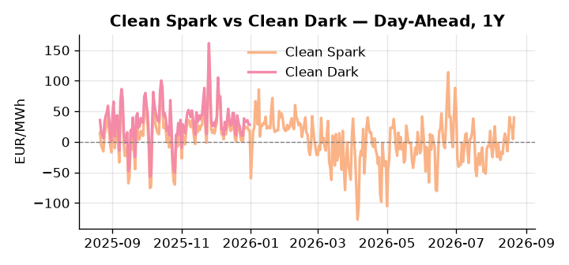
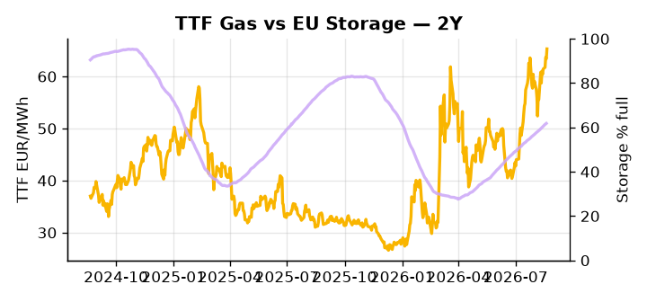

# European Cross-Commodity Risk Pack: Gas + Carbon → Power Curve Implications

**Daily desk brief — 2026-08-21**  
_Author: Sumer Sener · sumerberksener@gmail.com_  
_Generated by `scripts/generate_brief.py`. AI narrative + news themes via Anthropic Claude._

> **Data-freshness caveat:** Clean Dark (last 2025-12-31, 233d old); Coal (last 2025-12-26, 238d old). Numbers below should be read with this in mind.

## 1 · Executive summary

**TL;DR — GB Power at 96th-percentile drives Clean Spark to 92nd; storage 17 pp below seasonal underpins thermal call amid Romania gas security escalation.**

GB Power at 157.14 EUR/MWh (96th-percentile) and Clean Spark at 39.74 EUR/MWh (92nd-percentile) are both extended, anchored by a structural storage deficit running 17 percentage points below the five-year seasonal average and a sharp weekly collapse in renewable share to 46.77% — down nearly 26% week-on-week — that has placed a heavy and sustained thermal call on the system. The Romania offshore gas platform drone attack, with Moscow blamed, adds a credible supply-shock tail risk that reinforces storage build urgency over the four-to-six week horizon and keeps TTF supported above 65 EUR/MWh at the 73rd-percentile, even as the US LNG supply surge at a forecast 122.5 Bcf/d exerts competing arb pressure on the front-month. With coal data 238 days old and clean dark spreads 233 days stale, the merit-order shift between coal and gas generation cannot be assessed with precision today, so dark spread positioning should be treated as indicative rather than bankable. Gas tightness across a structurally undersupplied storage picture AND EUA absent a policy anchor AND clean sparks deeply in-the-money keep the front-curve regime firmly thermal-led, with the Romania Black Sea disruption tail asserting geopolitical risk directly into front-curve spark differentials and leaving Cal+1 headroom compressed until refill pace materially recovers.

_Generated by **claude-sonnet-4-6** via Anthropic API (two-pass extract→narrate). Prompts/responses logged to `ai/logs/`._
_Next-5d temperature anomaly — DE -1.3°C / FR -0.1°C / GB +0.1°C vs 5-yr seasonal normal (Open-Meteo)._

## 2 · Monitor metrics

**Primary (cross-commodity headline tiles)**

| Metric | As of | Latest | Unit | 1d Δ | 1w Δ | 5y pctile | Headline |
|---|---|---:|---|---:|---:|---:|---|
| TTF Gas | 2026-08-20 | 65.29 | EUR/MWh | +3.02% | +6.41% | 73 | Within typical range |
| EU Storage | 2026-08-19 | 61.82 | % full | +0.34% | +2.40% | 40 | 17.2 pp below the 5-yr seasonal average |
| EUA Carbon | 2026-08-20 | 34.56 | EUR/tCO2 | +0.01% | +0.39% | 50 | Within typical range |
| DE Power | 2026-08-21 | 183.05 | EUR/MWh | +23.82% | +22.46% | 85 | extended 2.2σ above the 50d trend |
| GB Power | 2026-08-21 | 157.14 | EUR/MWh | -7.61% | +7.06% | 96 | 96th-percentile of 5-yr range — historically high |
| Renewables | 2026-08-20 | 46.77 | % of load | -3.92% | -25.96% | 58 | Within typical range |
| Clean Spark | 2026-08-21 | 39.74 | EUR/MWh | +35.22 | +27.97 | 92 | 92th-percentile of 5-yr range — historically high |
| Clean Dark | 2025-12-31 (STALE) | 27.95 | EUR/MWh | -0.56 | +11.63 | 47 | Within typical range |

**Fundamentals inputs** _(feed derived metrics; not separately traded)_

| Metric | As of | Latest | Unit | 1d Δ | 1w Δ | 5y pctile | Headline |
|---|---|---:|---|---:|---:|---:|---|
| Coal | 2025-12-26 (STALE) | 96.00 | USD/t | -0.57% | +0.08% | 7 | 7th-percentile of 5-yr range — historically low |

_Spreads → abs EUR/MWh deltas; others → pct. Weekly Δ uses 5d trailing means. Full history in `data/<metric>.csv`._

## 3 · Gas + LNG arb

**TTF front-month** prints at 65.29 EUR/MWh — _Within typical range_.
**EU storage** at 61.8% full (-17.2 pp vs 5-yr seasonal avg) — _17.2 pp below the 5-yr seasonal average_.
**TTF − JKM (LNG arb)** at -0.79 EUR/MWh (JKM 22.61 USD/MMBtu) — JKM richer than TTF — Asia pulls cargoes, marginal European tightening risk.

## 4 · Carbon (EU ETS)

**EUA December** prints at 34.56 EUR/tCO2 — _Within typical range_. A euro of EUA adds ~0.37 EUR/MWh to gas-fired and ~0.85 EUR/MWh to coal-fired generation cost; strength compresses the dark spread faster than the spark.

**EU vs UK ETS** — Cobblestone's emissions desk trades EUA and UKA. Post-Brexit auction reform narrowed the UKA discount to EUA from £20+/t to single-digit £/t; CBAM phase-in pulls UK compliance demand toward parity. EUA−UKA basis remains a tradable cross-market signal.

**Supply / policy signal** — _CBAM full operational phase live since 1 Jan 2026 — importers paying for embedded emissions_  
Side: `policy` · Polarity: `bullish EUA` · Source: EU Regulation 2023/956 (CBAM)

Domestic carbon-cost burden gradually levelled with imports; supports EUA demand floor as carbon leakage protection tightens through 2034.

_No ETS-relevant news surfaced today — falling back to `data/policy_facts.py` (hand-maintained structural fact pack). Fact pack last reviewed 2026-05-08 (105d ago)._

## 5 · Power — Day-Ahead & curve

**DE day-ahead baseload** at 183.05 EUR/MWh — _extended 2.2σ above the 50d trend_.
**GB day-ahead baseload** at 157.14 EUR/MWh — _96th-percentile of 5-yr range — historically high_.
**DE − GB spread** at +25.91 EUR/MWh (DE premium) — drives interconnector flow direction.
**Cross-border net flows (Power Transportation):** DE↔FR -45.0 GWh (FR export); GB↔FR -37.3 GWh (FR export).

**Clean spark spread** at +39.74 EUR/MWh — _92th-percentile of 5-yr range — historically high_. Bridge from gas + carbon fundamentals to gas-fired economics; sustained positive spark = TTF moves transmit directly into the power curve.

**Curve shape:** DA → W+1 → M+1 → Q+1 → Cal+1 → Cal+2 = 183 / 133 / 133 / 133 / 133 / 133 EUR/MWh — **Backwardation** (DA −Cal+1 spread +50 EUR/MWh). Forwards are seasonality projections — see Methodology.

{width=49%} {width=49%}

**This week ahead**

- **Fri** 14:30 UTC — EIA weekly natural gas storage report: US storage trajectory anchors LNG export pricing into NW Europe — direct TTF transmission.
- **Fri** — ENTSO-E weekly day-ahead volumes / system-balance summary: Reads the European generation mix in last 7d — confirms or breaks the Cal+1 thesis.
- **Tue** 08:00 UTC — AGSI+ daily storage print: First read on the week's gas injection / withdrawal pace; sets the tone for TTF curve shape.
- **TBD** — Romania offshore gas escalation update: Geopolitical event timeline unclear; monitor EU/NATO response and any physical disruption notices from platform operators. _(news-extracted)_

**Scenarios (24-72h | 1w horizon)**

| | Summary | TTF | DE Power |
|---|---|---:|---:|
| **Base** | Renewables recovery and storage drift higher stabilize GB/DE; TTF holds 64–67 EUR/MWh amid balanced supply/arb tension. | ±1-2% | −2-3% |
| **Upside** | Romania offshore platform sustains drone attack or is shuttered; EU storage build urgency escalates; TTF rallies on supply shock. | +5-10% | +8-12% |
| **Downside** | US LNG capacity surge accelerates into Europe; renewables recover to 55%+ of load; storage seasonal momentum resumes; TTF arb widens. | −3-6% | −5-8% |

_Illustrative, not forecasts. Magnitudes sized off historical sensitivity; AI-generated from today's extract pass._

## 6 · Today's themes

**Weather watch (next 7d)**
- **Storm · FR · Fri 21 – Tue 25 Aug** — peak gust 57 m/s (~205 km/h) on Fri 21 Aug. Strong wind boost to French generation; FR may export to neighbours. DA print likely below seasonal norm; watch FR-GB IFA flow toward GB.
- **Storm · GB · Fri 21 – Thu 27 Aug** — peak gust 49 m/s (~177 km/h) on Mon 24 Aug. GB wind capacity is large — DA likely soft. Cut-off risk if gusts exceed safety thresholds; opposite tail (sudden tightening) possible.

**Watchlist (1–4 weeks)**
- Romanian offshore gas platform security escalation; physical disruption risk.
- US LNG export scheduling/capacity utilization updates; global TTF arb pressure.

_Risk framing — built within a discipline of clear limits and continuous monitoring; observations here are framed as risk inputs, not directional calls. Positioning decisions remain with the desk._
_Methodology + sources: **README §Methodology**. Numbers auditable via the snapshot JSONs. Rule-based / informational — not investment advice._