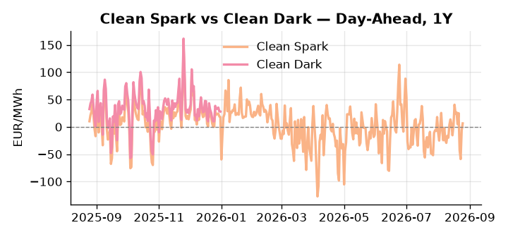
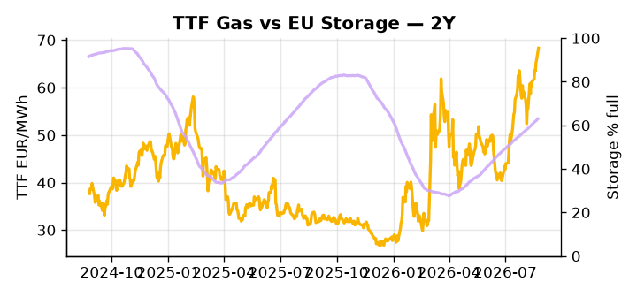

# European Cross-Commodity Risk Pack: Gas + Carbon → Power Curve Implications

**Daily desk brief — 2026-08-25**  
_Author: Sumer Sener · sumerberksener@gmail.com_  
_Generated by `scripts/generate_brief.py`. AI narrative + news themes via Anthropic Claude._

> **Data-freshness caveat:** Clean Dark (last 2025-12-31, 237d old); Coal (last 2025-12-26, 242d old). Numbers below should be read with this in mind.

## 1 · Executive summary

**TL;DR — GB Power at 92nd-percentile amid EU storage 17pp below seasonal; Romanian drone threat and Danube drought create gas/coal supply risks offsetting bearish US shale LNG expansion.**

GB Power at the 92nd percentile and DE Power at the 80th percentile are the dominant signals, with EU storage sitting at 63% full — 17.2 percentage points below the five-year seasonal mean — as heatwave-constrained hydro and the Danube drought force a coal-to-gas fuel switch that is straining the supply stack from both ends. The Romanian Black Sea platform drone strike introduces a credible direct-supply tail risk on TTF, and with coal data 242 days old and the clean dark spread (EUR 27.95/MWh, 47th percentile) stale since late December, the dark spread is indicative not bankable — regional thermal cost inflation from rail and truck rerouting is almost certainly understated. Bearish headroom from US Permian LNG expansion provides a partial offset to the upside, keeping TTF from repricing sharply in the base case, but the storage deficit leaves the curve with little cushion against a confirmed Romanian outage or a further deterioration in Danube logistics. An OPEC+ ministerial response to Iran sanctions, flagged for Friday, adds crude-linked LNG arb feedback as a secondary watchpoint that could extend the TTF risk premium into the forward strip. With the Romanian drone strike asserting front-curve risk on EU gas supply, gas tightness anchoring the stack well above seasonal norms AND carbon absent as a countervailing signal AND the clean dark spread compressed by stale coal pricing, the front-curve regime is extended and constrained, with GB isolation premium and fuel-switch economics keeping spark differentials tight until storage recovery pace and platform status are resolved.

_Generated by **claude-sonnet-4-6** via Anthropic API (two-pass extract→narrate). Prompts/responses logged to `ai/logs/`._
_Next-5d temperature anomaly — DE +1.1°C / FR +2.2°C vs 5-yr seasonal normal (Open-Meteo)._

## 2 · Monitor metrics

**Primary (cross-commodity headline tiles)**

| Metric | As of | Latest | Unit | 1d Δ | 1w Δ | 5y pctile | Headline |
|---|---|---:|---|---:|---:|---:|---|
| TTF Gas | 2026-08-24 | 68.32 | EUR/MWh | +3.73% | +7.64% | 74 | Within typical range |
| EU Storage | 2026-08-23 | 62.99 | % full | +0.56% | +2.12% | 42 | 17.2 pp below the 5-yr seasonal average |
| EUA Carbon | 2026-08-24 | 34.71 | EUR/tCO2 | +0.35% | +0.80% | 50 | Within typical range |
| DE Power | 2026-08-25 | 155.82 | EUR/MWh | +9.00% | -17.35% | 80 | Within typical range |
| GB Power | 2026-08-25 | 142.67 | EUR/MWh | -10.95% | -22.40% | 92 | 92th-percentile of 5-yr range — historically high |
| Renewables | 2026-08-24 | 43.06 | % of load | -41.33% | +25.78% | 49 | Within typical range |
| Clean Spark | 2026-08-25 | 6.41 | EUR/MWh | +12.86 | -45.75 | 60 | Within typical range |
| Clean Dark | 2025-12-31 (STALE) | 27.95 | EUR/MWh | -0.56 | +11.63 | 47 | Within typical range |

**Fundamentals inputs** _(feed derived metrics; not separately traded)_

| Metric | As of | Latest | Unit | 1d Δ | 1w Δ | 5y pctile | Headline |
|---|---|---:|---|---:|---:|---:|---|
| Coal | 2025-12-26 (STALE) | 96.00 | USD/t | -0.57% | +0.08% | 7 | 7th-percentile of 5-yr range — historically low |

_Spreads → abs EUR/MWh deltas; others → pct. Weekly Δ uses 5d trailing means. Full history in `data/<metric>.csv`._

## 3 · Gas + LNG arb

**TTF front-month** prints at 68.32 EUR/MWh — _Within typical range_.
**EU storage** at 63.0% full (-17.2 pp vs 5-yr seasonal avg) — _17.2 pp below the 5-yr seasonal average_.
**TTF − JKM (LNG arb)** at -0.35 EUR/MWh (JKM 23.51 USD/MMBtu) — JKM richer than TTF — Asia pulls cargoes, marginal European tightening risk.

## 4 · Carbon (EU ETS)

**EUA December** prints at 34.71 EUR/tCO2 — _Within typical range_. A euro of EUA adds ~0.37 EUR/MWh to gas-fired and ~0.85 EUR/MWh to coal-fired generation cost; strength compresses the dark spread faster than the spark.

**EU vs UK ETS** — Cobblestone's emissions desk trades EUA and UKA. Post-Brexit auction reform narrowed the UKA discount to EUA from £20+/t to single-digit £/t; CBAM phase-in pulls UK compliance demand toward parity. EUA−UKA basis remains a tradable cross-market signal.

**Supply / policy signal** — _CBAM full operational phase live since 1 Jan 2026 — importers paying for embedded emissions_  
Side: `policy` · Polarity: `bullish EUA` · Source: EU Regulation 2023/956 (CBAM)

Domestic carbon-cost burden gradually levelled with imports; supports EUA demand floor as carbon leakage protection tightens through 2034.

_No ETS-relevant news surfaced today — falling back to `data/policy_facts.py` (hand-maintained structural fact pack). Fact pack last reviewed 2026-05-08 (109d ago)._

## 5 · Power — Day-Ahead & curve

**DE day-ahead baseload** at 155.82 EUR/MWh — _Within typical range_.
**GB day-ahead baseload** at 142.67 EUR/MWh — _92th-percentile of 5-yr range — historically high_.
**DE − GB spread** at +13.15 EUR/MWh (DE premium) — drives interconnector flow direction.
**Cross-border net flows (Power Transportation):** DE↔FR -47.9 GWh (FR export); GB↔FR -93.6 GWh (FR export); NL↔DE +53.0 GWh (NL export).

**Clean spark spread** at +6.41 EUR/MWh — _Within typical range_. Bridge from gas + carbon fundamentals to gas-fired economics; sustained positive spark = TTF moves transmit directly into the power curve.

**Curve shape:** DA → W+1 → M+1 → Q+1 → Cal+1 → Cal+2 = 156 / 131 / 131 / 131 / 131 / 131 EUR/MWh — **Backwardation** (DA −Cal+1 spread +25 EUR/MWh). Forwards are seasonality projections — see Methodology.

{width=49%} {width=49%}

**This week ahead**

- **Tue** 08:00 UTC — AGSI+ daily storage print: First read on the week's gas injection / withdrawal pace; sets the tone for TTF curve shape.
- **Wed** 09:00 UTC — EEX EUA primary auction (Mon–Thu daily; Wed is largest volume): Supply-side EUA signal; auction clearing relative to spot reads as ETS demand strength.
- **Wed** — ENTSO-E DE_LU + GB next-week wind/solar forecast refresh: Sets the residual-load curve a week out; outsized prints move power Cal+1 directionally.
- **Fri** — OPEC+ ministerial meeting (assumed imminence): Iran sanctions and crude supply dynamics will shape OPEC+ cut response; outcome feeds LNG arb and TTF risk premium for weeks ahead. _(news-extracted)_

**Scenarios (1w horizon)**

| | Summary | TTF | DE Power |
|---|---|---:|---:|
| **Base** | Storage recovery modest; heatwave persists; Romanian platform stabilizes; US LNG growth dampens TTF baseline. | -2% to +3% | -3% to +2% |
| **Upside** | Romanian offshore production outage confirmed; Danube barge transport halts; OPEC+ announces surprise supply cuts; heatwave extends. | +8% to +15% | +5% to +12% |
| **Downside** | Romanian platform damage minimal; Danube recovers; US shale LNG accelerates; heatwave breaks and rainfall returns; storage refill pace accelerates. | -6% to -12% | -8% to -5% |

_Illustrative, not forecasts. Magnitudes sized off historical sensitivity; AI-generated from today's extract pass._

## 6 · Today's themes

**Weather watch (next 7d)**
- **Storm · DE · Tue 25 – Mon 31 Aug** — peak gust 52 m/s (~185 km/h) on Mon 31 Aug. Wind generation likely surges Day 1, then risk of turbine cut-off if gusts exceed 25 m/s. Bearish DA early, sharp reversal possible. Watch DE-FR flow swings.
- **Storm · FR · Thu 27 – Mon 31 Aug** — peak gust 67 m/s (~242 km/h) on Sat 29 Aug. Strong wind boost to French generation; FR may export to neighbours. DA print likely below seasonal norm; watch FR-GB IFA flow toward GB.

**Watchlist (1–4 weeks)**
- Romanian offshore platform security status and production continuity updates
- Danube water-level recovery forecasts; coal barge transport reopening timeline

_Risk framing — built within a discipline of clear limits and continuous monitoring; observations here are framed as risk inputs, not directional calls. Positioning decisions remain with the desk._
_Methodology + sources: **README §Methodology**. Numbers auditable via the snapshot JSONs. Rule-based / informational — not investment advice._