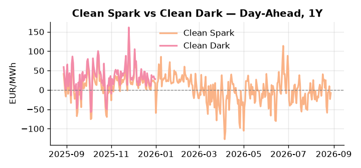
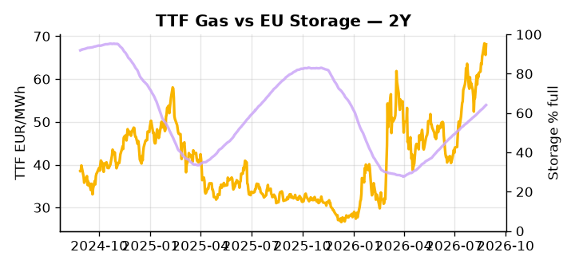

# European Cross-Commodity Risk Pack: Gas + Carbon → Power Curve Implications

**Daily desk brief — 2026-08-28**  
_Author: Sumer Sener · sumerberksener@gmail.com_  
_Generated by `scripts/generate_brief.py`. AI narrative + news themes via Anthropic Claude._

> **Data-freshness caveat:** Clean Dark (last 2025-12-31, 240d old); Coal (last 2025-12-26, 245d old). Numbers below should be read with this in mind.

## 1 · Executive summary

**TL;DR — GB Power at 98th-percentile amid 76% renewable penetration masks Danube drought and Romanian gas-platform sabotage risk; storage 17 pp below seasonal average sets H2 fuel-switch trigger.**

GB Power printing at the 98th percentile (168 EUR/MWh) despite 76% renewable load share is the dominant signal this morning, masking acute structural stress driven by Romanian Black Sea platform sabotage — a sustained offline scenario cuts 5–8% of EU gas inflow and reasserts a TTF fuel-switch premium into the autumn refill season. Storage sitting 17 percentage points below seasonal norm (64% vs. 81%) compresses the desk's flexibility headroom materially, with any refill pace below 2% weekly extending the fuel-switch window and keeping front-month TTF anchored at elevated levels. With coal and clean-dark data 240–245 days stale, the dark spread is indicative not bankable, though the 7th-percentile coal print and a 27.95 EUR/MWh clean-dark read suggest the coal stack remains deep out-of-the-money against current gas and power levels. Thursday's Von der Leyen State of the Union carries latent carbon signal — CBAM and ETS supply messaging could reprice thermal dispatch incentives across the curve intraday. With Romanian platform sabotage tightening front-curve gas supply, storage deficit anchoring the fuel-switch trigger into Q4, and GB premium at 168 EUR/MWh signalling interconnector stress, gas tightness AND the compressed clean-dark differential AND an extended GB-DE spread keep the Cal+1 regime in an elevated, volatility-wide posture with front-curve risk skewed materially to the upside.

_Generated by **claude-sonnet-4-6** via Anthropic API (two-pass extract→narrate). Prompts/responses logged to `ai/logs/`._
_Next-5d temperature anomaly — DE +2.5°C / FR +1.2°C vs 5-yr seasonal normal (Open-Meteo)._

## 2 · Monitor metrics

**Primary (cross-commodity headline tiles)**

| Metric | As of | Latest | Unit | 1d Δ | 1w Δ | 5y pctile | Headline |
|---|---|---:|---|---:|---:|---:|---|
| TTF Gas | 2026-08-27 | 68.10 | EUR/MWh | +3.76% | +6.02% | 74 | Within typical range |
| EU Storage | 2026-08-27 | 64.08 | % full | +0.42% | +2.35% | 44 | 17.2 pp below the 5-yr seasonal average |
| EUA Carbon | 2026-08-27 | 34.42 | EUR/tCO2 | -0.29% | +0.70% | 50 | Within typical range |
| DE Power | 2026-08-28 | 141.01 | EUR/MWh | +12.60% | +5.01% | 76 | Within typical range |
| GB Power | 2026-08-28 | 168.03 | EUR/MWh | -11.71% | +13.29% | 98 | 98th-percentile of 5-yr range — historically high |
| Renewables | 2026-08-27 | 76.00 | % of load | +31.95% | +35.03% | 95 | 95th-percentile of 5-yr range — historically high |
| Clean Spark | 2026-08-28 | -7.85 | EUR/MWh | +15.78 | +6.02 | 42 | Within typical range |
| Clean Dark | 2025-12-31 (STALE) | 27.95 | EUR/MWh | -0.56 | +11.63 | 47 | Within typical range |

**Fundamentals inputs** _(feed derived metrics; not separately traded)_

| Metric | As of | Latest | Unit | 1d Δ | 1w Δ | 5y pctile | Headline |
|---|---|---:|---|---:|---:|---:|---|
| Coal | 2025-12-26 (STALE) | 96.00 | USD/t | -0.57% | +0.08% | 7 | 7th-percentile of 5-yr range — historically low |

_Spreads → abs EUR/MWh deltas; others → pct. Weekly Δ uses 5d trailing means. Full history in `data/<metric>.csv`._

## 3 · Gas + LNG arb

**TTF front-month** prints at 68.10 EUR/MWh — _Within typical range_.
**EU storage** at 64.1% full (-17.2 pp vs 5-yr seasonal avg) — _17.2 pp below the 5-yr seasonal average_.
**TTF − JKM (LNG arb)** at -0.44 EUR/MWh (JKM 23.41 USD/MMBtu) — JKM richer than TTF — Asia pulls cargoes, marginal European tightening risk.

## 4 · Carbon (EU ETS)

**EUA December** prints at 34.42 EUR/tCO2 — _Within typical range_. A euro of EUA adds ~0.37 EUR/MWh to gas-fired and ~0.85 EUR/MWh to coal-fired generation cost; strength compresses the dark spread faster than the spark.

**EU vs UK ETS** — Cobblestone's emissions desk trades EUA and UKA. Post-Brexit auction reform narrowed the UKA discount to EUA from £20+/t to single-digit £/t; CBAM phase-in pulls UK compliance demand toward parity. EUA−UKA basis remains a tradable cross-market signal.

**Supply / policy signal** — _CBAM full operational phase live since 1 Jan 2026 — importers paying for embedded emissions_  
Side: `policy` · Polarity: `bullish EUA` · Source: EU Regulation 2023/956 (CBAM)

Domestic carbon-cost burden gradually levelled with imports; supports EUA demand floor as carbon leakage protection tightens through 2034.

_No ETS-relevant news surfaced today — falling back to `data/policy_facts.py` (hand-maintained structural fact pack). Fact pack last reviewed 2026-05-08 (112d ago)._

## 5 · Power — Day-Ahead & curve

**DE day-ahead baseload** at 141.01 EUR/MWh — _Within typical range_.
**GB day-ahead baseload** at 168.03 EUR/MWh — _98th-percentile of 5-yr range — historically high_.
**DE − GB spread** at -27.02 EUR/MWh (GB premium) — drives interconnector flow direction.
**Cross-border net flows (Power Transportation):** DE↔FR +25.4 GWh (DE export); GB↔FR -36.6 GWh (FR export); NL↔DE -68.2 GWh (DE export).

**Clean spark spread** at -7.85 EUR/MWh — _Within typical range_. Bridge from gas + carbon fundamentals to gas-fired economics; sustained positive spark = TTF moves transmit directly into the power curve.

**Curve shape:** DA → W+1 → M+1 → Q+1 → Cal+1 → Cal+2 = 141 / 132 / 132 / 132 / 132 / 132 EUR/MWh — **Backwardation** (DA −Cal+1 spread +9 EUR/MWh). Forwards are seasonality projections — see Methodology.

{width=49%} {width=49%}

**This week ahead**

- **Fri** 14:30 UTC — EIA weekly natural gas storage report: US storage trajectory anchors LNG export pricing into NW Europe — direct TTF transmission.
- **Fri** — ENTSO-E weekly day-ahead volumes / system-balance summary: Reads the European generation mix in last 7d — confirms or breaks the Cal+1 thesis.
- **Tue** 08:00 UTC — AGSI+ daily storage print: First read on the week's gas injection / withdrawal pace; sets the tone for TTF curve shape.
- **Thu** — Von der Leyen State of the Union speech: Carbon tariff (CBAM) signaling and ETS supply messaging could shift EUA outlook and thermal dispatch incentives. _(news-extracted)_

**Scenarios (24-72h | 1w horizon)**

| | Summary | TTF | DE Power |
|---|---|---:|---:|
| **Base** | Renewables sustain 70%+ penetration; storage drifts toward seasonal norm; no new supply disruption. | ±1–3% | ±2–4% |
| **Upside** | Romanian platform offline sustained 1–2 weeks; Danube nuclear derating announced; TTF fuel-switch premium reasserts. | +7–12% | +8–15% |
| **Downside** | Romanian platform operational restored; Danube levels stabilize; renewables extend into 80%+; storage injection accelerates. | −4–8% | −6–12% |

_Illustrative, not forecasts. Magnitudes sized off historical sensitivity; AI-generated from today's extract pass._

## 6 · Today's themes

**Weather watch (next 7d)**
- **Storm · DE · Fri 28 – Tue 01 Sep** — peak gust 49 m/s (~177 km/h) on Mon 31 Aug. Wind generation likely surges Day 1, then risk of turbine cut-off if gusts exceed 25 m/s. Bearish DA early, sharp reversal possible. Watch DE-FR flow swings.
- **Storm · FR · Fri 28 – Mon 31 Aug** — peak gust 56 m/s (~201 km/h) on Mon 31 Aug. Strong wind boost to French generation; FR may export to neighbours. DA print likely below seasonal norm; watch FR-GB IFA flow toward GB.

**Watchlist (1–4 weeks)**
- Von der Leyen State of the Union speech — climate & AI focus; watch for EU ETS, carbon tariff signaling.
- Industrial Accelerator Act finalization — France–Germany divergence on clean industry subsidy & carbon rules.

_Risk framing — built within a discipline of clear limits and continuous monitoring; observations here are framed as risk inputs, not directional calls. Positioning decisions remain with the desk._
_Methodology + sources: **README §Methodology**. Numbers auditable via the snapshot JSONs. Rule-based / informational — not investment advice._