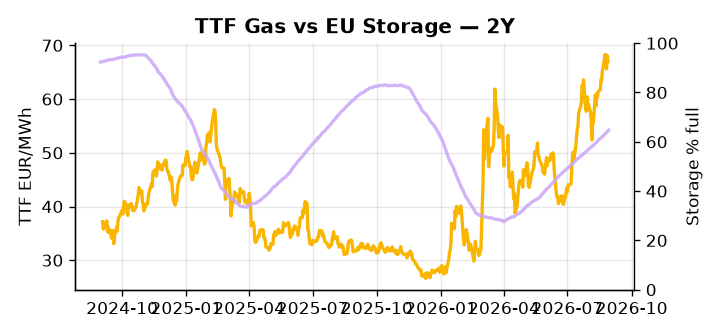

# European Cross-Commodity Risk Pack: Gas + Carbon → Power Curve Implications

**Daily desk brief — 2026-08-31**  
_Author: Sumer Sener · sumerberksener@gmail.com_  
_Generated by `scripts/generate_brief.py`. AI narrative + news themes via Anthropic Claude._

> **Data-freshness caveat:** Coal (last 2025-12-26, 248d old). Numbers below should be read with this in mind.

## 1 · Executive summary

**TL;DR — GB Power at 96th-percentile; EU storage 17pp below seasonal; TTF firm but coal data stale. Geopolitical tail-risks (Iran sanctions, Norway Arctic) offset by Dangote refinery supply easing.**

GB Power at the 96th percentile is the dominant signal, though an intraday reversal of 11.03% flags live volatility and keeps the desk on alert for a sharp unwind if demand softens or renewables recover. EU storage sitting 17 percentage points below its five-year seasonal norm anchors TTF at the 74th percentile — up 15.12% on the month — and leaves the winter 26–27 refill window uncomfortably tight, with LNG import dependency directly exposed to Iran sanctions escalation. EUA sentiment is in neutral territory as the EU Industrial Accelerator Act stalls in a France-Germany dispute over free allocations, EUA floor/cap design, and decarbonisation capex incentives — a slow-motion policy drag that clouds the 2027-plus demand curve and keeps carbon from acting as a clean directional anchor on fuel-switch economics. With coal data 248 days old, dark spread readings are indicative not bankable, and merit-order displacement versus gas cannot be confirmed with current data. Iran sanctions risk reasserting on the front curve, gas tightness via the storage deficit and firm TTF, and carbon anchored in policy limbo keep clean spreads compressed but in-the-money, with the Cal+1 regime held hostage to whether Iran crude supply disruption escalates and locks in the scarcity premium before the H4 refill window closes.

_Generated by **claude-sonnet-4-6** via Anthropic API (two-pass extract→narrate). Prompts/responses logged to `ai/logs/`._
_Next-5d temperature anomaly — DE +1.1°C / FR +1.4°C / GB +1.2°C vs 5-yr seasonal normal (Open-Meteo)._

## 2 · Monitor metrics

**Primary (cross-commodity headline tiles)**

| Metric | As of | Latest | Unit | 1d Δ | 1w Δ | 5y pctile | Headline |
|---|---|---:|---|---:|---:|---:|---|
| TTF Gas | 2026-08-28 | 66.98 | EUR/MWh | -1.64% | +4.90% | 74 | Within typical range |
| EU Storage | 2026-08-29 | 64.73 | % full | +0.56% | +2.32% | 45 | 17.0 pp below the 5-yr seasonal average |
| EUA Carbon | 2026-08-28 | 34.82 | EUR/tCO2 | +1.16% | +0.70% | 51 | Within typical range |
| DE Power | — | — | EUR/MWh | — | — | — | (no data) |
| GB Power | 2026-08-31 | 163.54 | EUR/MWh | -11.03% | +16.97% | 96 | 96th-percentile of 5-yr range — historically high |
| Renewables | — | — | % of load | — | — | — | (no data) |
| Clean Spark | — | — | EUR/MWh | — | — | — | (no data) |
| Clean Dark | — | — | EUR/MWh | — | — | — | (no data) |

**Fundamentals inputs** _(feed derived metrics; not separately traded)_

| Metric | As of | Latest | Unit | 1d Δ | 1w Δ | 5y pctile | Headline |
|---|---|---:|---|---:|---:|---:|---|
| Coal | 2025-12-26 (STALE) | 96.00 | USD/t | -0.57% | +0.08% | 7 | 7th-percentile of 5-yr range — historically low |

_Spreads → abs EUR/MWh deltas; others → pct. Weekly Δ uses 5d trailing means. Full history in `data/<metric>.csv`._

## 3 · Gas + LNG arb

**TTF front-month** prints at 66.98 EUR/MWh — _Within typical range_.
**EU storage** at 64.7% full (-17.0 pp vs 5-yr seasonal avg) — _17.0 pp below the 5-yr seasonal average_.
**TTF − JKM (LNG arb)** at -0.86 EUR/MWh (JKM 23.17 USD/MMBtu) — JKM richer than TTF — Asia pulls cargoes, marginal European tightening risk.

## 4 · Carbon (EU ETS)

**EUA December** prints at 34.82 EUR/tCO2 — _Within typical range_. A euro of EUA adds ~0.37 EUR/MWh to gas-fired and ~0.85 EUR/MWh to coal-fired generation cost; strength compresses the dark spread faster than the spark.

**EU vs UK ETS** — Cobblestone's emissions desk trades EUA and UKA. Post-Brexit auction reform narrowed the UKA discount to EUA from £20+/t to single-digit £/t; CBAM phase-in pulls UK compliance demand toward parity. EUA−UKA basis remains a tradable cross-market signal.

**Supply / policy signal** — _EU Industrial Accelerator Act: France-Germany split on clean manufacturing carbon regulation and industrial subsidy design._  
Side: `policy` · Polarity: `neutral` · Source: Politico EU Energy

Framework dispute over EUA floor/cap, free allocations, and decarbonization capex incentives directly affects power-to-X and industrial fuel-switch economics; outcome shapes 2027+ EUA demand curve.

_Surfaced from today's news flow by the AI extract pass (`ai/prompts/extract_v1.md` → `carbon_policy_signal`)._

## 5 · Power — Day-Ahead & curve

**GB day-ahead baseload** at 163.54 EUR/MWh — _96th-percentile of 5-yr range — historically high_.

**This week ahead**

- **Tue** 08:00 UTC — AGSI+ daily storage print: First read on the week's gas injection / withdrawal pace; sets the tone for TTF curve shape.
- **Wed** 09:00 UTC — EEX EUA primary auction (Mon–Thu daily; Wed is largest volume): Supply-side EUA signal; auction clearing relative to spot reads as ETS demand strength.
- **Wed** — ENTSO-E DE_LU + GB next-week wind/solar forecast refresh: Sets the residual-load curve a week out; outsized prints move power Cal+1 directionally.

**Scenarios (1w horizon)**

| | Summary | TTF | DE Power |
|---|---|---:|---:|
| **Base** | GB remains elevated but stabilizes; TTF firm on storage deficit; Iran sanctions priced in gradually. | ±1-3% | unavailable |
| **Upside** | Iran crude supply disruption escalates; LNG flows tighten; GB supply shock (outage or cold front); storage refill stalls. | +8-12% | unavailable |
| **Downside** | Iran sanctions relaxed or Russian LNG reroute; Norwegian supply materializes; Dangote product glut; demand softens. | −6-10% | unavailable |

_Illustrative, not forecasts. Magnitudes sized off historical sensitivity; AI-generated from today's extract pass._

## 6 · Today's themes

**Weather watch (next 7d)**
- **Storm · DE · Mon 31 – Sun 06 Sep** — peak gust 56 m/s (~202 km/h) on Sat 05 Sep. Wind generation likely surges Day 1, then risk of turbine cut-off if gusts exceed 25 m/s. Bearish DA early, sharp reversal possible. Watch DE-FR flow swings.
- **Storm · FR · Mon 31 Aug** — peak gust 44 m/s (~157 km/h) on Mon 31 Aug. Strong wind boost to French generation; FR may export to neighbours. DA print likely below seasonal norm; watch FR-GB IFA flow toward GB.

**Watchlist (1–4 weeks)**
- Von der Leyen State of the Union speech (climate & AI pillars) — watch for decarbonization spending targets, power-to-X roadmap updates.
- EU Industrial Accelerator Act negotiation outcome (France-Germany carbon regulation friction) — may reshape EUA floor / cap-and-trade design.

_Risk framing — built within a discipline of clear limits and continuous monitoring; observations here are framed as risk inputs, not directional calls. Positioning decisions remain with the desk._
_Methodology + sources: **README §Methodology**. Numbers auditable via the snapshot JSONs. Rule-based / informational — not investment advice._