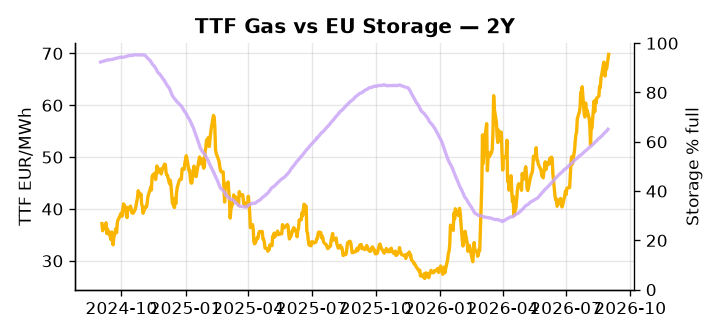

# European Cross-Commodity Risk Pack: Gas + Carbon → Power Curve Implications

**Daily desk brief — 2026-09-01**  
_Author: Sumer Sener · sumerberksener@gmail.com_  
_Generated by `scripts/generate_brief.py`. AI narrative + news themes via Anthropic Claude._

> **Data-freshness caveat:** Coal (last 2025-12-26, 249d old). Numbers below should be read with this in mind.

## 1 · Executive summary

**TL;DR — GB power at 97th percentile, TTF +4.2% on Hormuz geopolitics, EU storage 16.8 pp below seasonal — thermal premium is entrenched; Libya offset provides upside relief.**

GB power at the 97th percentile (165.91 EUR/MWh) and TTF up 4.2% on Hormuz tail-risk embed a clear thermal premium across the front curve, with EU storage sitting 16.8 percentage points below seasonal norms and reinforcing tightness into the winter 2026–27 refill window. Libya's crude ramp provides a mechanical offset to Hormuz escalation but remains an incomplete hedge, leaving the dominant geopolitical bid intact. EUA pricing holds in mid-range as the France-Germany Industrial Accelerator Act dispute leaves carbon cost allocation to heavy industry unresolved — regulatory clarity is pending, and the outcome will determine whether pass-through shifts marginal dispatch incentives or redirects hydrogen arbitrage economics. With coal data 249 days old, dark-spread economics are indicative not bankable, and current fuel-switch positioning in the merit order cannot be confirmed with confidence. Gas tightness — storage deficit compounding a geopolitical Hormuz premium — AND EUA policy ambiguity suppressing clean-spread headroom AND GB clean-spark spreads extended to the 97th percentile keep the front-curve risk regime firmly anchored to the upside, with Hormuz escalation the single event that would pull Cal+1 thermal differentials decisively wider.

_Generated by **claude-sonnet-4-6** via Anthropic API (two-pass extract→narrate). Prompts/responses logged to `ai/logs/`._
_Next-5d temperature anomaly — DE -0.0°C / FR +0.8°C vs 5-yr seasonal normal (Open-Meteo)._

## 2 · Monitor metrics

**Primary (cross-commodity headline tiles)**

| Metric | As of | Latest | Unit | 1d Δ | 1w Δ | 5y pctile | Headline |
|---|---|---:|---|---:|---:|---:|---|
| TTF Gas | 2026-08-31 | 69.81 | EUR/MWh | +4.23% | +3.24% | 74 | Within typical range |
| EU Storage | 2026-08-30 | 65.09 | % full | +0.54% | +2.33% | 46 | 16.8 pp below the 5-yr seasonal average |
| EUA Carbon | 2026-08-31 | 34.80 | EUR/tCO2 | -0.06% | +0.51% | 51 | Within typical range |
| DE Power | — | — | EUR/MWh | — | — | — | (no data) |
| GB Power | 2026-09-01 | 165.91 | EUR/MWh | +7.18% | +0.26% | 97 | 97th-percentile of 5-yr range — historically high |
| Renewables | — | — | % of load | — | — | — | (no data) |
| Clean Spark | — | — | EUR/MWh | — | — | — | (no data) |
| Clean Dark | — | — | EUR/MWh | — | — | — | (no data) |

**Fundamentals inputs** _(feed derived metrics; not separately traded)_

| Metric | As of | Latest | Unit | 1d Δ | 1w Δ | 5y pctile | Headline |
|---|---|---:|---|---:|---:|---:|---|
| Coal | 2025-12-26 (STALE) | 96.00 | USD/t | -0.57% | +0.08% | 7 | 7th-percentile of 5-yr range — historically low |

_Spreads → abs EUR/MWh deltas; others → pct. Weekly Δ uses 5d trailing means. Full history in `data/<metric>.csv`._

## 3 · Gas + LNG arb

**TTF front-month** prints at 69.81 EUR/MWh — _Within typical range_.
**EU storage** at 65.1% full (-16.8 pp vs 5-yr seasonal avg) — _16.8 pp below the 5-yr seasonal average_.
**TTF − JKM (LNG arb)** at +2.96 EUR/MWh (JKM 22.70 USD/MMBtu) — TTF richer than JKM — LNG cargoes favour Europe.

## 4 · Carbon (EU ETS)

**EUA December** prints at 34.80 EUR/tCO2 — _Within typical range_. A euro of EUA adds ~0.37 EUR/MWh to gas-fired and ~0.85 EUR/MWh to coal-fired generation cost; strength compresses the dark spread faster than the spark.

**EU vs UK ETS** — Cobblestone's emissions desk trades EUA and UKA. Post-Brexit auction reform narrowed the UKA discount to EUA from £20+/t to single-digit £/t; CBAM phase-in pulls UK compliance demand toward parity. EUA−UKA basis remains a tradable cross-market signal.

**Supply / policy signal** — _France-Germany Industrial Accelerator Act disputes carbon cost allocation to heavy industry; ETS regulatory clarity TBD, affecting hydrogen arbitrage incentives._  
Side: `policy` · Polarity: `neutral` · Source: Politico EU Energy

Outcome determines whether carbon cost pass-through to power or hydrogen shifts marginal dispatch incentives; ETS forward pricing and decarbonization investment pace hinge on ruling.

_Surfaced from today's news flow by the AI extract pass (`ai/prompts/extract_v1.md` → `carbon_policy_signal`)._

## 5 · Power — Day-Ahead & curve

**GB day-ahead baseload** at 165.91 EUR/MWh — _97th-percentile of 5-yr range — historically high_.

**This week ahead**

- **Tue** 08:00 UTC — AGSI+ daily storage print: First read on the week's gas injection / withdrawal pace; sets the tone for TTF curve shape.
- **Wed** 09:00 UTC — EEX EUA primary auction (Mon–Thu daily; Wed is largest volume): Supply-side EUA signal; auction clearing relative to spot reads as ETS demand strength.
- **Wed** — ENTSO-E DE_LU + GB next-week wind/solar forecast refresh: Sets the residual-load curve a week out; outsized prints move power Cal+1 directionally.
- **Wed** — EU Commission von der Leyen State of Union speech: Climate and energy priorities signalling; ETS policy direction affects carbon-to-power transmission and 2027 power forwards. _(news-extracted)_

**Scenarios (24-72h horizon)**

| | Summary | TTF | DE Power |
|---|---|---:|---:|
| **Base** | Hormuz risk priced into TTF; Libya ramp offsets. Storage refill gradual; GB premium persists. | +1–3% | unavailable |
| **Upside** | Hormuz shipping incident or Strait closure; crude spikes. EU thermal dispatch forced; Libya ramp insufficient offset. | +8–12% | +5–8% |
| **Downside** | Hormuz tensions ease; Libya ramp accelerates. EU power supply slack emerges; storage refill normalizes. | -4–6% | -3–5% |

_Illustrative, not forecasts. Magnitudes sized off historical sensitivity; AI-generated from today's extract pass._

## 6 · Today's themes

**Weather watch (next 7d)**
- **Storm · DE · Tue 01 – Mon 07 Sep** — peak gust 54 m/s (~196 km/h) on Fri 04 Sep. Wind generation likely surges Day 1, then risk of turbine cut-off if gusts exceed 25 m/s. Bearish DA early, sharp reversal possible. Watch DE-FR flow swings.
- **Storm · FR · Thu 03 – Fri 04 Sep** — peak gust 38 m/s (~138 km/h) on Fri 04 Sep. Strong wind boost to French generation; FR may export to neighbours. DA print likely below seasonal norm; watch FR-GB IFA flow toward GB.

**Watchlist (1–4 weeks)**
- Hormuz shipping incident or Strait closure; immediate crude/power spike risk.
- EU Commission von der Leyen State of Union speech (climate/energy priorities); policy signalling on ETS, decarbonization pace.

_Risk framing — built within a discipline of clear limits and continuous monitoring; observations here are framed as risk inputs, not directional calls. Positioning decisions remain with the desk._
_Methodology + sources: **README §Methodology**. Numbers auditable via the snapshot JSONs. Rule-based / informational — not investment advice._