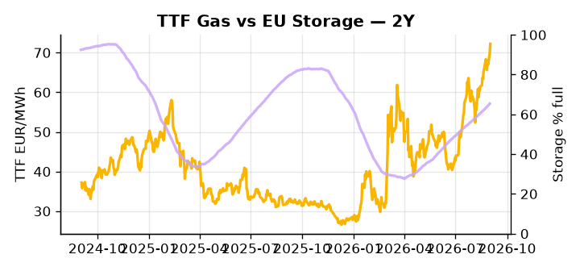

# European Cross-Commodity Risk Pack: Gas + Carbon → Power Curve Implications

**Daily desk brief — 2026-09-02**  
_Author: Sumer Sener · sumerberksener@gmail.com_  
_Generated by `scripts/generate_brief.py`. AI narrative + news themes via Anthropic Claude._

> **Data-freshness caveat:** Coal (last 2025-12-26, 250d old). Numbers below should be read with this in mind.

## 1 · Executive summary

**TL;DR — GB Power at 100th percentile (193.84 EUR/MWh) amid EU nuclear constraints and Hormuz escalation; TTF 75th percentile (72.22 EUR/MWh) supported by geopolitical premium despite US LNG growth.**

GB Power has hit the 100th percentile at 193.84 EUR/MWh, signalling an extreme regime driven by EU nuclear constraints under heat-driven cooling limits and a hard Hormuz geopolitical supply premium now embedded across the front curve. TTF sits at the 75th percentile (72.22 EUR/MWh) after a +3.45% daily move, with Hormuz escalation overriding the structural headwind from US LNG supply growth of +23% in H1, while EU storage at 65.39% full — 16.7 percentage points below seasonal norm — locks in refill urgency and underpins the Cal+1 gas floor. With coal data 250 days old as of 2025-12-26, the 7th-percentile coal signal is indicative not bankable, leaving dark spreads unreliable for today's merit-order dispatch analysis. Clean spreads remain in-the-money against a tight gas backdrop, though the +36.6% daily move in GB Power flags potential forced nuclear or transmission constraint and material unwinding risk if capacity normalises. With Hormuz tail-risk asserting a sustained geopolitical premium, gas tightness AND carbon anchored in mid-range AND clean spreads extended in-the-money keep front-curve risk wide, with the Cal+1 regime contingent on whether Strait disruption persists or US LNG headroom erodes the storage-fill premium.

_Generated by **claude-sonnet-4-6** via Anthropic API (two-pass extract→narrate). Prompts/responses logged to `ai/logs/`._
_Next-5d temperature anomaly — DE -0.9°C / FR +2.1°C / GB +1.5°C vs 5-yr seasonal normal (Open-Meteo)._

## 2 · Monitor metrics

**Primary (cross-commodity headline tiles)**

| Metric | As of | Latest | Unit | 1d Δ | 1w Δ | 5y pctile | Headline |
|---|---|---:|---|---:|---:|---:|---|
| TTF Gas | 2026-09-01 | 72.22 | EUR/MWh | +3.45% | +4.03% | 75 | Within typical range |
| EU Storage | 2026-08-31 | 65.39 | % full | +0.46% | +2.35% | 46 | 16.7 pp below the 5-yr seasonal average |
| EUA Carbon | 2026-09-01 | 34.74 | EUR/tCO2 | -0.17% | +0.47% | 51 | Within typical range |
| DE Power | — | — | EUR/MWh | — | — | — | (no data) |
| GB Power | 2026-09-02 | 193.84 | EUR/MWh | +36.60% | -1.96% | 100 | 100th-percentile of 5-yr range — historically high |
| Renewables | — | — | % of load | — | — | — | (no data) |
| Clean Spark | — | — | EUR/MWh | — | — | — | (no data) |
| Clean Dark | — | — | EUR/MWh | — | — | — | (no data) |

**Fundamentals inputs** _(feed derived metrics; not separately traded)_

| Metric | As of | Latest | Unit | 1d Δ | 1w Δ | 5y pctile | Headline |
|---|---|---:|---|---:|---:|---:|---|
| Coal | 2025-12-26 (STALE) | 96.00 | USD/t | -0.57% | +0.08% | 7 | 7th-percentile of 5-yr range — historically low |

_Spreads → abs EUR/MWh deltas; others → pct. Weekly Δ uses 5d trailing means. Full history in `data/<metric>.csv`._

## 3 · Gas + LNG arb

**TTF front-month** prints at 72.22 EUR/MWh — _Within typical range_.
**EU storage** at 65.4% full (-16.7 pp vs 5-yr seasonal avg) — _16.7 pp below the 5-yr seasonal average_.
**TTF − JKM (LNG arb)** at +2.86 EUR/MWh (JKM 23.61 USD/MMBtu) — TTF richer than JKM — LNG cargoes favour Europe.

## 4 · Carbon (EU ETS)

**EUA December** prints at 34.74 EUR/tCO2 — _Within typical range_. A euro of EUA adds ~0.37 EUR/MWh to gas-fired and ~0.85 EUR/MWh to coal-fired generation cost; strength compresses the dark spread faster than the spark.

**EU vs UK ETS** — Cobblestone's emissions desk trades EUA and UKA. Post-Brexit auction reform narrowed the UKA discount to EUA from £20+/t to single-digit £/t; CBAM phase-in pulls UK compliance demand toward parity. EUA−UKA basis remains a tradable cross-market signal.

**Supply / policy signal** — _CBAM full operational phase live since 1 Jan 2026 — importers paying for embedded emissions_  
Side: `policy` · Polarity: `bullish EUA` · Source: EU Regulation 2023/956 (CBAM)

Domestic carbon-cost burden gradually levelled with imports; supports EUA demand floor as carbon leakage protection tightens through 2034.

_No ETS-relevant news surfaced today — falling back to `data/policy_facts.py` (hand-maintained structural fact pack). Fact pack last reviewed 2026-05-08 (117d ago)._

## 5 · Power — Day-Ahead & curve

**GB day-ahead baseload** at 193.84 EUR/MWh — _100th-percentile of 5-yr range — historically high_.

**This week ahead**

- **Wed** 09:00 UTC — EEX EUA primary auction (Mon–Thu daily; Wed is largest volume): Supply-side EUA signal; auction clearing relative to spot reads as ETS demand strength.
- **Wed** — ENTSO-E DE_LU + GB next-week wind/solar forecast refresh: Sets the residual-load curve a week out; outsized prints move power Cal+1 directionally.
- **Fri** 14:30 UTC — EIA weekly natural gas storage report: US storage trajectory anchors LNG export pricing into NW Europe — direct TTF transmission.
- **TBD** — von der Leyen State of the Union: Likely climate/AI investment signals; may drive carbon and power demand rhetoric expectations into curve. _(news-extracted)_

**Scenarios (24-72h horizon)**

| | Summary | TTF | DE Power |
|---|---|---:|---:|
| **Base** | TTF holds 70–75 EUR/MWh on Hormuz premium and storage fill; GB Power moderates to 120–150 EUR/MWh if nuclear capacity normalizes. | +1-3% | tracks |
| **Upside** | Hormuz strait closure or major LNG force majeure announced; EU nuclear further derated by heat. TTF bulls +12–18%, GB Power extends 150–200 EUR/MWh. | +12-18% | +8-15% |
| **Downside** | Libya crude production ramps and fills European crude gap; Hormuz tensions ease diplomatically. US LNG supply floods market; TTF weakens to 60–65 EUR/MWh. | -8-12% | -5-10% |

_Illustrative, not forecasts. Magnitudes sized off historical sensitivity; AI-generated from today's extract pass._

## 6 · Today's themes

**Weather watch (next 7d)**
- **Storm · DE · Wed 02 – Tue 08 Sep** — peak gust 53 m/s (~190 km/h) on Sat 05 Sep. Wind generation likely surges Day 1, then risk of turbine cut-off if gusts exceed 25 m/s. Bearish DA early, sharp reversal possible. Watch DE-FR flow swings.
- **Storm · GB · Wed 02 – Fri 04 Sep** — peak gust 50 m/s (~180 km/h) on Fri 04 Sep. GB wind capacity is large — DA likely soft. Cut-off risk if gusts exceed safety thresholds; opposite tail (sudden tightening) possible.

**Watchlist (1–4 weeks)**
- von der Leyen State of the Union speech — likely to signal climate/AI investment urgency; watch for power demand/carbon price rhetoric.
- Hormuz chokepoint escalation trajectory — track strait closures, sanctions scope, LNG force majeure announcements (weekly).

_Risk framing — built within a discipline of clear limits and continuous monitoring; observations here are framed as risk inputs, not directional calls. Positioning decisions remain with the desk._
_Methodology + sources: **README §Methodology**. Numbers auditable via the snapshot JSONs. Rule-based / informational — not investment advice._