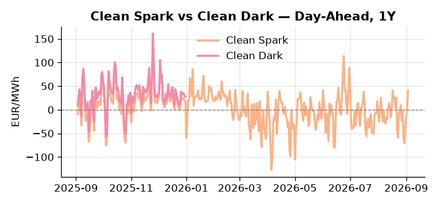
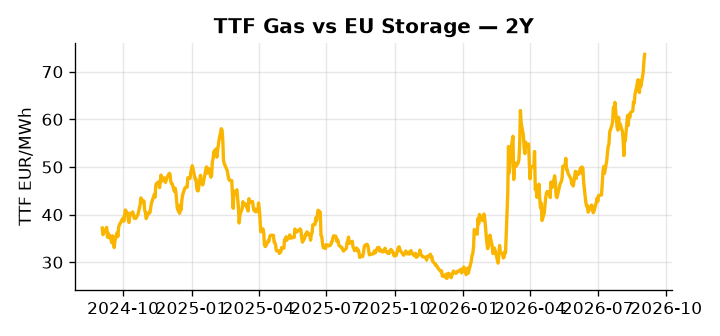

# European Cross-Commodity Risk Pack: Gas + Carbon → Power Curve Implications

**Daily desk brief — 2026-09-03**  
_Author: Sumer Sener · sumerberksener@gmail.com_  
_Generated by `scripts/generate_brief.py`. AI narrative + news themes via Anthropic Claude._

> **Data-freshness caveat:** Clean Dark (last 2025-12-31, 246d old); Coal (last 2025-12-26, 251d old). Numbers below should be read with this in mind.

## 1 · Executive summary

**TL;DR — GB Power at 96th-percentile amid nuclear climate stress and data-center demand surge; Hormuz escalation threatens LNG supply and TTF, offsetting US LNG export growth.**

GB Power at the 96th percentile (163.66 EUR/MWh, a 23.1% daily jump) is the dominant signal, driven by nuclear thermal-stress outages colliding with data-center baseload surge under summer cooling constraints. TTF sits at the 75th percentile (73.63 EUR/MWh) with Hormuz escalation tail-risk already embedded in the front-month, partially offset by US LNG export capacity running at 17.4 Bcf/d sustaining the NW Europe arb; the net effect is bidirectional volatility rather than clean directional headroom. EUA sits in mid-range but the policy bid is structurally supported, as the EU green-transition chief's proposed oil tax and joint debt mechanism signal regulatory capex intensification — a slow-motion tightening of the carbon supply backdrop that raises the marginal cost floor for fossil generators. With coal data 251 days stale and clean-dark spreads 246 days stale, the dark spread reads 47th percentile (27.95 EUR/MWh) but is indicative not bankable; rely on clean spark — anchored at the 93rd percentile (41.04 EUR/MWh) — as the live fuel-switch signal. With Hormuz tail-risk pulling front-curve risk wider on any escalation, gas tightness at the 75th percentile AND EUA structurally bid on policy intensification AND clean spark deep in-the-money keep the Cal+1 regime extended in favour of gas-fired generation economics over coal.

_Generated by **claude-sonnet-4-6** via Anthropic API (two-pass extract→narrate). Prompts/responses logged to `ai/logs/`._
_Next-5d temperature anomaly — DE -0.8°C / FR +2.6°C / GB +2.4°C vs 5-yr seasonal normal (Open-Meteo)._

## 2 · Monitor metrics

**Primary (cross-commodity headline tiles)**

| Metric | As of | Latest | Unit | 1d Δ | 1w Δ | 5y pctile | Headline |
|---|---|---:|---|---:|---:|---:|---|
| TTF Gas | 2026-09-02 | 73.63 | EUR/MWh | +1.96% | +5.74% | 75 | Within typical range |
| EU Storage | — | — | % full | — | — | — | (no data) |
| EUA Carbon | 2026-09-02 | 35.09 | EUR/tCO2 | +1.01% | +0.06% | 52 | Within typical range |
| DE Power | 2026-09-03 | 201.22 | EUR/MWh | +23.10% | +6.99% | 88 | extended 2.6σ above the 50d trend |
| GB Power | 2026-09-03 | 163.66 | EUR/MWh | -15.81% | +1.24% | 96 | 96th-percentile of 5-yr range — historically high |
| Renewables | — | — | % of load | — | — | — | (no data) |
| Clean Spark | 2026-09-03 | 41.04 | EUR/MWh | +37.76 | +8.50 | 93 | 93th-percentile of 5-yr range — historically high |
| Clean Dark | 2025-12-31 (STALE) | 27.95 | EUR/MWh | -0.56 | +11.63 | 47 | Within typical range |

**Fundamentals inputs** _(feed derived metrics; not separately traded)_

| Metric | As of | Latest | Unit | 1d Δ | 1w Δ | 5y pctile | Headline |
|---|---|---:|---|---:|---:|---:|---|
| Coal | 2025-12-26 (STALE) | 96.00 | USD/t | -0.57% | +0.08% | 7 | 7th-percentile of 5-yr range — historically low |

_Spreads → abs EUR/MWh deltas; others → pct. Weekly Δ uses 5d trailing means. Full history in `data/<metric>.csv`._

## 3 · Gas + LNG arb

**TTF front-month** prints at 73.63 EUR/MWh — _Within typical range_.
**TTF − JKM (LNG arb)** at +3.72 EUR/MWh (JKM 23.76 USD/MMBtu) — TTF richer than JKM — LNG cargoes favour Europe.

## 4 · Carbon (EU ETS)

**EUA December** prints at 35.09 EUR/tCO2 — _Within typical range_. A euro of EUA adds ~0.37 EUR/MWh to gas-fired and ~0.85 EUR/MWh to coal-fired generation cost; strength compresses the dark spread faster than the spark.

**EU vs UK ETS** — Cobblestone's emissions desk trades EUA and UKA. Post-Brexit auction reform narrowed the UKA discount to EUA from £20+/t to single-digit £/t; CBAM phase-in pulls UK compliance demand toward parity. EUA−UKA basis remains a tradable cross-market signal.

**Supply / policy signal** — _EU green-transition chief proposes new oil tax and joint debt mechanism for climate resilience funding; signals regulatory capex intensification._  
Side: `policy` · Polarity: `bullish EUA` · Source: Politico EU Energy

New carbon/energy tax mechanisms raise fossil-generator operating costs and increase regulatory capex burden, structurally supporting EUA bid and raising marginal generation cost.

_Surfaced from today's news flow by the AI extract pass (`ai/prompts/extract_v1.md` → `carbon_policy_signal`)._

## 5 · Power — Day-Ahead & curve

**DE day-ahead baseload** at 201.22 EUR/MWh — _extended 2.6σ above the 50d trend_.
**GB day-ahead baseload** at 163.66 EUR/MWh — _96th-percentile of 5-yr range — historically high_.
**DE − GB spread** at +37.56 EUR/MWh (DE premium) — drives interconnector flow direction.

**Clean spark spread** at +41.04 EUR/MWh — _93th-percentile of 5-yr range — historically high_. Bridge from gas + carbon fundamentals to gas-fired economics; sustained positive spark = TTF moves transmit directly into the power curve.

**Curve shape:** DA → W+1 → M+1 → Q+1 → Cal+1 → Cal+2 = 201 / 138 / 138 / 138 / 138 / 138 EUR/MWh — **Backwardation** (DA −Cal+1 spread +63 EUR/MWh). Forwards are seasonality projections — see Methodology.

{width=49%} {width=49%}

**This week ahead**

- **Fri** 14:30 UTC — EIA weekly natural gas storage report: US storage trajectory anchors LNG export pricing into NW Europe — direct TTF transmission.
- **Thu** 14:30 UTC — US EIA weekly crude inventories: Crude — and via crack spreads, refined-products — feed back into LNG arb economics.
- **Fri** — ENTSO-E weekly day-ahead volumes / system-balance summary: Reads the European generation mix in last 7d — confirms or breaks the Cal+1 thesis.
- **Thu** — Von der Leyen State of the Union address: Climate/AI/green-capex agenda may announce carbon-tax or emissions abatement rules affecting EUA floor and power-curve structural dynamics. _(news-extracted)_

**Scenarios (24-72h horizon)**

| | Summary | TTF | DE Power |
|---|---|---:|---:|
| **Base** | GB power holds premium on nuclear climate stress; TTF stable as US LNG arb pressures offset Hormuz tail-risk. | ±1-2% | ±2-3% |
| **Upside** | Hormuz military escalation triggers LNG supply shock; EU nuclear outage cluster reduces baseload; data-center demand spikes. | +12-18% | +15-22% |
| **Downside** | Hormuz diplomatic resolution; US LNG export ramp sustains NW Europe arb supply; mild weather reduces nuclear cooling stress. | -8-12% | -6-10% |

_Illustrative, not forecasts. Magnitudes sized off historical sensitivity; AI-generated from today's extract pass._

## 6 · Today's themes

**Weather watch (next 7d)**
- **Storm · DE · Thu 03 – Wed 09 Sep** — peak gust 63 m/s (~227 km/h) on Sat 05 Sep. Wind generation likely surges Day 1, then risk of turbine cut-off if gusts exceed 25 m/s. Bearish DA early, sharp reversal possible. Watch DE-FR flow swings.
- **Storm · GB · Thu 03 – Wed 09 Sep** — peak gust 51 m/s (~183 km/h) on Tue 08 Sep. GB wind capacity is large — DA likely soft. Cut-off risk if gusts exceed safety thresholds; opposite tail (sudden tightening) possible.

**Watchlist (1–4 weeks)**
- Von der Leyen State of the Union speech — climate/AI/green capex agenda may signal new carbon-pricing or emissions-abatement rules.
- EU industrial policy / Industrial Accelerator Act votes — could reshape grid infrastructure spend and renewables/nuclear procurement timelines.

_Risk framing — built within a discipline of clear limits and continuous monitoring; observations here are framed as risk inputs, not directional calls. Positioning decisions remain with the desk._
_Methodology + sources: **README §Methodology**. Numbers auditable via the snapshot JSONs. Rule-based / informational — not investment advice._