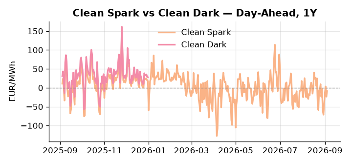
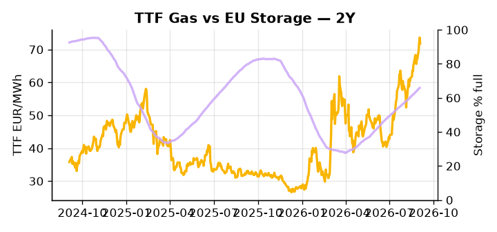

# European Cross-Commodity Risk Pack: Gas + Carbon → Power Curve Implications

**Daily desk brief — 2026-09-04**  
_Author: Sumer Sener · sumerberksener@gmail.com_  
_Generated by `scripts/generate_brief.py`. AI narrative + news themes via Anthropic Claude._

> **Data-freshness caveat:** Clean Dark (last 2025-12-31, 247d old); Coal (last 2025-12-26, 252d old). Numbers below should be read with this in mind.

## 1 · Executive summary

**TL;DR — GB Power at 98th percentile, EU storage 16.7 pp deficit, and Slovakia sanctions threat combine to support thermal; coal's 7th-percentile valuation signals fuel-switch headroom despite stale data.**

GB Power at the 98th percentile — 177.71 EUR/MWh, up 26.46% on the day — is the dominant signal, with EU storage sitting 16.7 percentage points below seasonal at 65.85% full, a combination that keeps the thermal complex anchored well above comfortable headroom. EUA demand finds structural support as the EU Parliament advances tighter SFDR fossil fuel exclusions, raising cost-of-capital for gas and coal plant operators and making the carbon complex structurally bullish over the months horizon, a slow-motion supply tightening that reinforces the current mid-range EUA regime. Coal's 7th-percentile valuation implies fuel-switch headroom on paper, though with coal data 252 days stale and clean dark and clean spark spreads dated to year-end 2025, those derived spreads are indicative not bankable, and the thermal merit order cannot be cleanly ranked against September 2026 fundamentals. The Slovakia sanctions holdout remains an unpriced tail risk: a failed EU embargo renewal could flood TTF and compress front-month gas sharply, introducing meaningful asymmetry against an otherwise tight supply narrative. With gas tightness anchored by a 16.7 pp storage deficit AND carbon structurally bullish under SFDR-driven capex suppression AND clean spreads too stale to confirm fuel-switch in-the-money status, the curve regime is extended on the front-month and Cal+1 power side — but the Slovakia sanctions tail keeps that regime conditionally fragile, with any Russian gas re-entry the single event most likely to break front-curve risk wider and compress the GB premium continent-wide.

_Generated by **claude-sonnet-4-6** via Anthropic API (two-pass extract→narrate). Prompts/responses logged to `ai/logs/`._
_Next-5d temperature anomaly — DE -0.9°C / FR +1.6°C / GB +0.2°C vs 5-yr seasonal normal (Open-Meteo)._

## 2 · Monitor metrics

**Primary (cross-commodity headline tiles)**

| Metric | As of | Latest | Unit | 1d Δ | 1w Δ | 5y pctile | Headline |
|---|---|---:|---|---:|---:|---:|---|
| TTF Gas | 2026-09-03 | 71.81 | EUR/MWh | -2.48% | +5.97% | 75 | Within typical range |
| EU Storage | 2026-09-02 | 65.85 | % full | +0.32% | +2.39% | 47 | 16.7 pp below the 5-yr seasonal average |
| EUA Carbon | 2026-09-03 | 34.74 | EUR/tCO2 | -0.99% | +0.52% | 51 | Within typical range |
| DE Power | 2026-09-04 | 147.64 | EUR/MWh | +11.08% | +19.70% | 78 | Within typical range |
| GB Power | 2026-09-04 | 177.71 | EUR/MWh | +26.46% | -5.26% | 98 | 98th-percentile of 5-yr range — historically high |
| Renewables | — | — | % of load | — | — | — | (no data) |
| Clean Spark | 2026-09-04 | -8.77 | EUR/MWh | +14.73 | +19.76 | 41 | Within typical range |
| Clean Dark | 2025-12-31 (STALE) | 27.95 | EUR/MWh | -0.56 | +11.63 | 47 | Within typical range |

**Fundamentals inputs** _(feed derived metrics; not separately traded)_

| Metric | As of | Latest | Unit | 1d Δ | 1w Δ | 5y pctile | Headline |
|---|---|---:|---|---:|---:|---:|---|
| Coal | 2025-12-26 (STALE) | 96.00 | USD/t | -0.57% | +0.08% | 7 | 7th-percentile of 5-yr range — historically low |

_Spreads → abs EUR/MWh deltas; others → pct. Weekly Δ uses 5d trailing means. Full history in `data/<metric>.csv`._

## 3 · Gas + LNG arb

**TTF front-month** prints at 71.81 EUR/MWh — _Within typical range_.
**EU storage** at 65.8% full (-16.7 pp vs 5-yr seasonal avg) — _16.7 pp below the 5-yr seasonal average_.
**TTF − JKM (LNG arb)** at +0.86 EUR/MWh (JKM 24.09 USD/MMBtu) — TTF richer than JKM — LNG cargoes favour Europe.

## 4 · Carbon (EU ETS)

**EUA December** prints at 34.74 EUR/tCO2 — _Within typical range_. A euro of EUA adds ~0.37 EUR/MWh to gas-fired and ~0.85 EUR/MWh to coal-fired generation cost; strength compresses the dark spread faster than the spark.

**EU vs UK ETS** — Cobblestone's emissions desk trades EUA and UKA. Post-Brexit auction reform narrowed the UKA discount to EUA from £20+/t to single-digit £/t; CBAM phase-in pulls UK compliance demand toward parity. EUA−UKA basis remains a tradable cross-market signal.

**Supply / policy signal** — _EU Parliament pushes tighter fossil fuel exclusions under SFDR (Sustainable Finance Directive); stricter capital restrictions on gas/coal plants raise cost of thermal generation._  
Side: `policy` · Polarity: `bullish EUA` · Source: Politico EU Energy

Higher cost-of-capital for fossil fuel generation reduces supply willingness and lifts power prices and EUA demand as coal/gas plants retire or defer capex; structural carbon-bullish over months horizon.

_Surfaced from today's news flow by the AI extract pass (`ai/prompts/extract_v1.md` → `carbon_policy_signal`)._

## 5 · Power — Day-Ahead & curve

**DE day-ahead baseload** at 147.64 EUR/MWh — _Within typical range_.
**GB day-ahead baseload** at 177.71 EUR/MWh — _98th-percentile of 5-yr range — historically high_.
**DE − GB spread** at -30.07 EUR/MWh (GB premium) — drives interconnector flow direction.

**Clean spark spread** at -8.77 EUR/MWh — _Within typical range_. Bridge from gas + carbon fundamentals to gas-fired economics; sustained positive spark = TTF moves transmit directly into the power curve.

**Curve shape:** DA → W+1 → M+1 → Q+1 → Cal+1 → Cal+2 = 148 / 134 / 134 / 134 / 134 / 134 EUR/MWh — **Backwardation** (DA −Cal+1 spread +14 EUR/MWh). Forwards are seasonality projections — see Methodology.

{width=49%} {width=49%}

**This week ahead**

- **Fri** 14:30 UTC — EIA weekly natural gas storage report: US storage trajectory anchors LNG export pricing into NW Europe — direct TTF transmission.
- **Fri** — ENTSO-E weekly day-ahead volumes / system-balance summary: Reads the European generation mix in last 7d — confirms or breaks the Cal+1 thesis.
- **Tue** 08:00 UTC — AGSI+ daily storage print: First read on the week's gas injection / withdrawal pace; sets the tone for TTF curve shape.

**Scenarios (1w horizon)**

| | Summary | TTF | DE Power |
|---|---|---:|---:|
| **Base** | GB premium persists on local supply tightness; storage deficit supports TTF; coal stays undervalued pending fresh data. | ±1-3% | tracks |
| **Upside** | Slovakia sanctions vote blocks EU embargo renewal; Russian gas re-enters EU market, flooding TTF and suppressing power prices sharply. | -8-12% | -6-10% |
| **Downside** | EU sanctions hardened; summer heatwave stress on nuclear cooling reduces baseload capacity; data-center demand accelerates; GB premium widens continent-wide. | +5-10% | +8-15% |

_Illustrative, not forecasts. Magnitudes sized off historical sensitivity; AI-generated from today's extract pass._

## 6 · Today's themes

**Weather watch (next 7d)**
- **Storm · DE · Fri 04 – Thu 10 Sep** — peak gust 57 m/s (~205 km/h) on Sat 05 Sep. Wind generation likely surges Day 1, then risk of turbine cut-off if gusts exceed 25 m/s. Bearish DA early, sharp reversal possible. Watch DE-FR flow swings.
- **Storm · FR · Fri 04 – Wed 09 Sep** — peak gust 45 m/s (~163 km/h) on Mon 07 Sep. Strong wind boost to French generation; FR may export to neighbours. DA print likely below seasonal norm; watch FR-GB IFA flow toward GB.

**Watchlist (1–4 weeks)**
- EU budget negotiation timeline and potential new fossil fuel / carbon taxes (Costa, Ribera proposals)
- Slovakia sanctions vote outcome and any EU Russia energy embargo modifications

_Risk framing — built within a discipline of clear limits and continuous monitoring; observations here are framed as risk inputs, not directional calls. Positioning decisions remain with the desk._
_Methodology + sources: **README §Methodology**. Numbers auditable via the snapshot JSONs. Rule-based / informational — not investment advice._