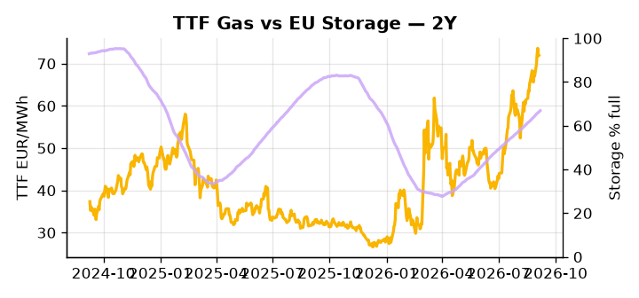

# European Cross-Commodity Risk Pack: Gas + Carbon → Power Curve Implications

**Daily desk brief — 2026-09-08**  
_Author: Sumer Sener · sumerberksener@gmail.com_  
_Generated by `scripts/generate_brief.py`. AI narrative + news themes via Anthropic Claude._

> **Data-freshness caveat:** Coal (last 2025-12-26, 256d old). Numbers below should be read with this in mind.

## 1 · Executive summary

**TL;DR — GB Power at 94th-percentile amid storage 16pp below seasonal; Norway gas ramp and US LNG +23% YoY bearish power; Slovakia sanctions block prolongs Russia supply tail-risk.**

GB Power at 158.8 EUR/MWh (94th-percentile) is the dominant signal this morning, anchored to an EU storage deficit running 16.4 percentage points below seasonal norms — a refill shortfall that keeps the winter term curve extended and thermal headroom compressed. Norway gas ramp and US LNG volumes running +23% YoY are both structurally bearish for TTF and, by extension, power spreads, though the arbitrage window closure remains a live watchpoint as US-EU differentials tighten. EUA policy context is incrementally supportive of price floor: CBAM revenue confirmed in budget negotiations with exemption scope clarified, reducing free-allocation erosion risk and reinforcing the carbon floor that underpins fuel-switch economics across the curve. With coal data 256 days old, any dark-spread read is indicative not bankable, leaving clean-spark as the operative thermal proxy. Slovakia's block on a 12-month Russia sanctions lock-in sustains a meaningful upside tail in TTF — if EU supply flows come under renewed pressure — and with gas tightness unresolved, EUA floor-supported, and clean spreads compressed by supply-side bearish flows, Russian pipeline uncertainty pulls front-curve risk wider while the Cal+1 regime remains conditionally intact pending sanctions resolution.

_Generated by **claude-sonnet-4-6** via Anthropic API (two-pass extract→narrate). Prompts/responses logged to `ai/logs/`._
_Next-5d temperature anomaly — DE -0.5°C / FR +0.3°C vs 5-yr seasonal normal (Open-Meteo)._

## 2 · Monitor metrics

**Primary (cross-commodity headline tiles)**

| Metric | As of | Latest | Unit | 1d Δ | 1w Δ | 5y pctile | Headline |
|---|---|---:|---|---:|---:|---:|---|
| TTF Gas | 2026-09-04 | 71.95 | EUR/MWh | +0.20% | +7.10% | 75 | Within typical range |
| EU Storage | 2026-09-06 | 66.90 | % full | +0.47% | +2.00% | 49 | 16.4 pp below the 5-yr seasonal average |
| EUA Carbon | 2026-09-04 | 34.88 | EUR/tCO2 | +0.39% | +0.42% | 51 | Within typical range |
| DE Power | — | — | EUR/MWh | — | — | — | (no data) |
| GB Power | 2026-09-08 | 158.80 | EUR/MWh | -1.26% | -28.09% | 94 | 94th-percentile of 5-yr range — historically high |
| Renewables | — | — | % of load | — | — | — | (no data) |
| Clean Spark | — | — | EUR/MWh | — | — | — | (no data) |
| Clean Dark | — | — | EUR/MWh | — | — | — | (no data) |

**Fundamentals inputs** _(feed derived metrics; not separately traded)_

| Metric | As of | Latest | Unit | 1d Δ | 1w Δ | 5y pctile | Headline |
|---|---|---:|---|---:|---:|---:|---|
| Coal | 2025-12-26 (STALE) | 96.00 | USD/t | -0.57% | +0.08% | 7 | 7th-percentile of 5-yr range — historically low |

_Spreads → abs EUR/MWh deltas; others → pct. Weekly Δ uses 5d trailing means. Full history in `data/<metric>.csv`._

## 3 · Gas + LNG arb

**TTF front-month** prints at 71.95 EUR/MWh — _Within typical range_.
**EU storage** at 66.9% full (-16.4 pp vs 5-yr seasonal avg) — _16.4 pp below the 5-yr seasonal average_.
**TTF − JKM (LNG arb)** at +1.37 EUR/MWh (JKM 24.02 USD/MMBtu) — TTF richer than JKM — LNG cargoes favour Europe.

## 4 · Carbon (EU ETS)

**EUA December** prints at 34.88 EUR/tCO2 — _Within typical range_. A euro of EUA adds ~0.37 EUR/MWh to gas-fired and ~0.85 EUR/MWh to coal-fired generation cost; strength compresses the dark spread faster than the spark.

**EU vs UK ETS** — Cobblestone's emissions desk trades EUA and UKA. Post-Brexit auction reform narrowed the UKA discount to EUA from £20+/t to single-digit £/t; CBAM phase-in pulls UK compliance demand toward parity. EUA−UKA basis remains a tradable cross-market signal.

**Supply / policy signal** — _EU carbon border adjustment mechanism (CBAM) revenue confirmed in budget negotiations; exemption scope and long-term EUA offset funding clarified._  
Side: `policy` · Polarity: `neutral` · Source: Politico EU Energy

CBAM revenue clarity supports EUA price floor by reducing free-allocation erosion risk; shapes power sector decarbonization capex path and fossil fuel switching incentives.

_Surfaced from today's news flow by the AI extract pass (`ai/prompts/extract_v1.md` → `carbon_policy_signal`)._

## 5 · Power — Day-Ahead & curve

**GB day-ahead baseload** at 158.80 EUR/MWh — _94th-percentile of 5-yr range — historically high_.

**This week ahead**

- **Tue** 08:00 UTC — AGSI+ daily storage print: First read on the week's gas injection / withdrawal pace; sets the tone for TTF curve shape.
- **Wed** 09:00 UTC — EEX EUA primary auction (Mon–Thu daily; Wed is largest volume): Supply-side EUA signal; auction clearing relative to spot reads as ETS demand strength.
- **Wed** — ENTSO-E DE_LU + GB next-week wind/solar forecast refresh: Sets the residual-load curve a week out; outsized prints move power Cal+1 directionally.

**Scenarios (1m horizon)**

| | Summary | TTF | DE Power |
|---|---|---:|---:|
| **Base** | Storage refill through Q4 gradual; Norway/US LNG supply moderates TTF scarcity premium; GB power normalizes toward 60th-pctile. | −5 to −8% | tracks |
| **Upside** | EU sanctions negotiation fails; Russia gas flows threatened or cut; storage refill stalls; Norway ramp delayed. TTF repricing on supply shock; GB/DE power rallies on thermal backup. | +15 to +22% | +12 to +18% |
| **Downside** | Norway ramp accelerates; US LNG arbitrage widens; mild Q4 weather; storage fills ahead of seasonal; Russia sanctions extended and supply normalizes. | −10 to −14% | −6 to −10% |

_Illustrative, not forecasts. Magnitudes sized off historical sensitivity; AI-generated from today's extract pass._

## 6 · Today's themes

**Weather watch (next 7d)**
- **Storm · DE · Tue 08 – Thu 10 Sep** — peak gust 38 m/s (~139 km/h) on Thu 10 Sep. Wind generation likely surges Day 1, then risk of turbine cut-off if gusts exceed 25 m/s. Bearish DA early, sharp reversal possible. Watch DE-FR flow swings.
- **Storm · FR · Tue 08 – Wed 09 Sep** — peak gust 47 m/s (~168 km/h) on Tue 08 Sep. Strong wind boost to French generation; FR may export to neighbours. DA print likely below seasonal norm; watch FR-GB IFA flow toward GB.

**Watchlist (1–4 weeks)**
- EU member state formal vote on Russia sanctions extension timeline (Slovakia blocking progress).
- Norwegian continental shelf gas project final investment decision and ramp schedule.

_Risk framing — built within a discipline of clear limits and continuous monitoring; observations here are framed as risk inputs, not directional calls. Positioning decisions remain with the desk._
_Methodology + sources: **README §Methodology**. Numbers auditable via the snapshot JSONs. Rule-based / informational — not investment advice._