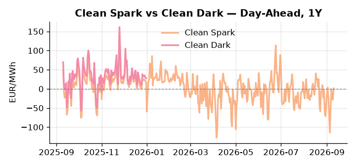
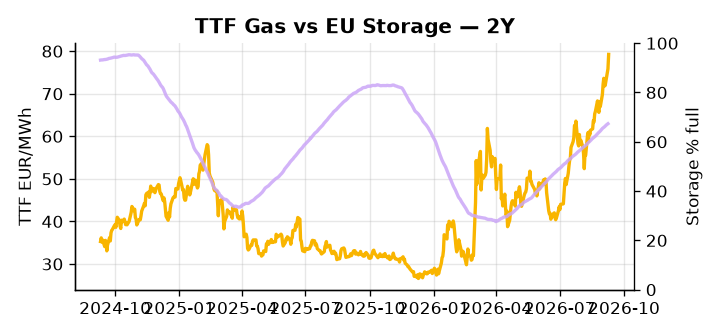

# European Cross-Commodity Risk Pack: Gas + Carbon → Power Curve Implications

**Daily desk brief — 2026-09-10**  
_Author: Sumer Sener · sumerberksener@gmail.com_  
_Generated by `scripts/generate_brief.py`. AI narrative + news themes via Anthropic Claude._

> **Data-freshness caveat:** Clean Dark (last 2025-12-31, 253d old); Coal (last 2025-12-26, 258d old). Numbers below should be read with this in mind.

## 1 · Executive summary

**TL;DR — GB Power at 99th percentile (189.35 EUR/MWh) amid renewable spike (+753%, 25σ); TTF +2.3σ and +30% monthly on geopolitical crude risk offsetting US LNG supply surge.**

GB Power has reached the 99th percentile at 189.35 EUR/MWh — the dominant signal — with TTF running +2.3σ and +30% on the month as Iranian tanker strikes embed a geopolitical crude premium that continues to offset the competing pull of US LNG capacity expanding +23% to 17.4 Bcf/d in H1 2026. A renewable surge of +753% (25.0σ) is collapsing day-ahead prices intraday, but the structural anchor remains the storage deficit at 67.33%, running 16.3 percentage points below the seasonal average, keeping the thermal bid firmly extended across the curve. EUA at 34.99 EUR/t (52nd percentile) sits at median but holds a policy floor as Ireland's endorsement of CBAM signals a cost ceiling on non-compliant imports, a slow-motion supply-side support for the EUA baseline that advances fuel-switch economics and raises the merit-order carbon shadow cost. With coal data 258 days stale and clean-dark 253 days old, the dark spread is indicative not bankable — desk should rely on live TTF, DE Power, and GB Power for spread construction. With Iranian tanker strikes reasserting Hormuz-adjacent tail-risk, gas tightness at +2.3σ AND EUA anchored at median with CBAM floor support AND clean-dark spreads in-the-money on live thermal signals pull front-curve risk wider, keeping the Cal+1 regime extended until storage refill pace or a geopolitical resolution materially shifts the supply stack.

_Generated by **claude-sonnet-4-6** via Anthropic API (two-pass extract→narrate). Prompts/responses logged to `ai/logs/`._
_Next-5d temperature anomaly — DE -0.9°C / FR +1.2°C vs 5-yr seasonal normal (Open-Meteo)._

## 2 · Monitor metrics

**Primary (cross-commodity headline tiles)**

| Metric | As of | Latest | Unit | 1d Δ | 1w Δ | 5y pctile | Headline |
|---|---|---:|---|---:|---:|---:|---|
| TTF Gas | 2026-09-09 | 79.25 | EUR/MWh | +4.49% | +8.68% | 77 | extended 2.3σ above the 50d trend |
| EU Storage | 2026-09-08 | 67.33 | % full | +0.31% | +1.91% | 50 | 16.3 pp below the 5-yr seasonal average |
| EUA Carbon | 2026-09-09 | 34.99 | EUR/tCO2 | +0.20% | +0.76% | 52 | Within typical range |
| DE Power | 2026-09-10 | 172.77 | EUR/MWh | +20.75% | +26.84% | 84 | Within typical range |
| GB Power | 2026-09-10 | 189.35 | EUR/MWh | +2.18% | +25.86% | 99 | 99th-percentile of 5-yr range — historically high |
| Renewables | 2026-09-09 | 55.49 | % of load | +753.13% | -15.28% | 74 | outsized daily move (+753.13%, 25.0σ) |
| Clean Spark | 2026-09-10 | 1.40 | EUR/MWh | +29.69 | +35.67 | 53 | Within typical range |
| Clean Dark | 2025-12-31 (STALE) | 27.95 | EUR/MWh | -0.56 | +11.63 | 47 | Within typical range |

**Fundamentals inputs** _(feed derived metrics; not separately traded)_

| Metric | As of | Latest | Unit | 1d Δ | 1w Δ | 5y pctile | Headline |
|---|---|---:|---|---:|---:|---:|---|
| Coal | 2025-12-26 (STALE) | 96.00 | USD/t | -0.57% | +0.08% | 7 | 7th-percentile of 5-yr range — historically low |

_Spreads → abs EUR/MWh deltas; others → pct. Weekly Δ uses 5d trailing means. Full history in `data/<metric>.csv`._

## 3 · Gas + LNG arb

**TTF front-month** prints at 79.25 EUR/MWh — _extended 2.3σ above the 50d trend_.
**EU storage** at 67.3% full (-16.3 pp vs 5-yr seasonal avg) — _16.3 pp below the 5-yr seasonal average_.
**TTF − JKM (LNG arb)** at +6.81 EUR/MWh (JKM 24.68 USD/MMBtu) — TTF richer than JKM — LNG cargoes favour Europe.

## 4 · Carbon (EU ETS)

**EUA December** prints at 34.99 EUR/tCO2 — _Within typical range_. A euro of EUA adds ~0.37 EUR/MWh to gas-fired and ~0.85 EUR/MWh to coal-fired generation cost; strength compresses the dark spread faster than the spark.

**EU vs UK ETS** — Cobblestone's emissions desk trades EUA and UKA. Post-Brexit auction reform narrowed the UKA discount to EUA from £20+/t to single-digit £/t; CBAM phase-in pulls UK compliance demand toward parity. EUA−UKA basis remains a tradable cross-market signal.

**Supply / policy signal** — _Ireland backs EU carbon-border-adjustment mechanism (CBAM) and e-waste levy; signals cost floor for non-compliant imports._  
Side: `supply` · Polarity: `bullish EUA` · Source: Politico EU Energy

CBAM cost floor supports EUA baseline and power-generation competitiveness vs. extra-EU; accelerates fuel-switch economics and carbon-intensive plant retirement, raising merit-order carbon shadow cost.

_Surfaced from today's news flow by the AI extract pass (`ai/prompts/extract_v1.md` → `carbon_policy_signal`)._

## 5 · Power — Day-Ahead & curve

**DE day-ahead baseload** at 172.77 EUR/MWh — _Within typical range_.
**GB day-ahead baseload** at 189.35 EUR/MWh — _99th-percentile of 5-yr range — historically high_.
**DE − GB spread** at -16.58 EUR/MWh (GB premium) — drives interconnector flow direction.
**Cross-border net flows (Power Transportation):** DE↔FR -17.7 GWh (FR export); GB↔FR -49.5 GWh (FR export); NL↔DE +11.5 GWh (NL export).

**Clean spark spread** at +1.40 EUR/MWh — _Within typical range_. Bridge from gas + carbon fundamentals to gas-fired economics; sustained positive spark = TTF moves transmit directly into the power curve.

**Curve shape:** DA → W+1 → M+1 → Q+1 → Cal+1 → Cal+2 = 173 / 134 / 134 / 134 / 134 / 134 EUR/MWh — **Backwardation** (DA −Cal+1 spread +38 EUR/MWh). Forwards are seasonality projections — see Methodology.

{width=49%} {width=49%}

**This week ahead**

- **Fri** 14:30 UTC — EIA weekly natural gas storage report: US storage trajectory anchors LNG export pricing into NW Europe — direct TTF transmission.
- **Thu** 14:30 UTC — US EIA weekly crude inventories: Crude — and via crack spreads, refined-products — feed back into LNG arb economics.
- **Fri** — ENTSO-E weekly day-ahead volumes / system-balance summary: Reads the European generation mix in last 7d — confirms or breaks the Cal+1 thesis.
- **Nov** — US midterm elections; Trump Iran resolution signals: Crude/LNG export policy clarity could lower geopolitical premium on TTF; reduces short-dated power rally. _(news-extracted)_

**Scenarios (24-72h horizon)**

| | Summary | TTF | DE Power |
|---|---|---:|---:|
| **Base** | GB/DE power elevated on storage deficit and geopolitical crude premium; renewables volatility contained. | +2-4% | tracks (±1-2%) |
| **Upside** | US-Iran escalation broadens to Hormuz chokepoint; Iranian oil/LNG facilities hit; crude spikes. | +8-12% | +5-8% |
| **Downside** | Trump announces Iran deal imminent; geopolitical premium unwinds. US LNG supply eases TTF. | -6-10% | -3-5% |

_Illustrative, not forecasts. Magnitudes sized off historical sensitivity; AI-generated from today's extract pass._

## 6 · Today's themes

**Weather watch (next 7d)**
- **Storm · DE · Sat 12 – Wed 16 Sep** — peak gust 44 m/s (~159 km/h) on Wed 16 Sep. Wind generation likely surges Day 1, then risk of turbine cut-off if gusts exceed 25 m/s. Bearish DA early, sharp reversal possible. Watch DE-FR flow swings.
- **Storm · FR · Tue 15 – Wed 16 Sep** — peak gust 40 m/s (~143 km/h) on Wed 16 Sep. Strong wind boost to French generation; FR may export to neighbours. DA print likely below seasonal norm; watch FR-GB IFA flow toward GB.

**Watchlist (1–4 weeks)**
- EU budget revenue negotiation (Costa tour Berlin, Warsaw, Madrid) — fiscal clarity affects industrial power demand.
- US midterm elections (November) — Trump Iran resolution risk; impacts crude/LNG export policy.

> **Cross-market regime tag:** Tight market: TTF rich vs history while storage runs below seasonal.

_Risk framing — built within a discipline of clear limits and continuous monitoring; observations here are framed as risk inputs, not directional calls. Positioning decisions remain with the desk._
_Methodology + sources: **README §Methodology**. Numbers auditable via the snapshot JSONs. Rule-based / informational — not investment advice._