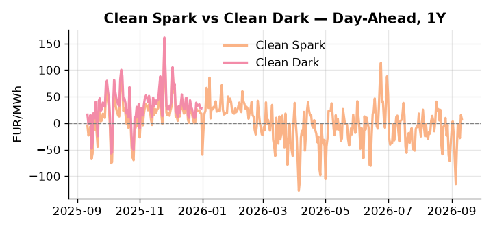
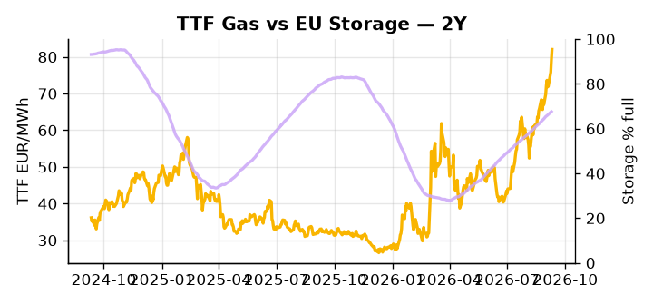

# European Cross-Commodity Risk Pack: Gas + Carbon → Power Curve Implications

**Daily desk brief — 2026-09-11**  
_Author: Sumer Sener · sumerberksener@gmail.com_  
_Generated by `scripts/generate_brief.py`. AI narrative + news themes via Anthropic Claude._

> **Data-freshness caveat:** Clean Dark (last 2025-12-31, 254d old); Coal (last 2025-12-26, 259d old). Numbers below should be read with this in mind.

## 1 · Executive summary

**TL;DR — GB Power at 96th-percentile (167 EUR/MWh) and storage 16pp below seasonal amid renewable collapse (−25% weekly); TTF extended 2.4σ on geopolitical risk; coal at 7th-percentile supports fuel-switch regime.**

GB Power at the 96th-percentile (167 EUR/MWh) is the dominant signal: renewable share has collapsed 25% week-on-week to 41%, storage sits 16.2 percentage points below seasonal at 67.6% full, and thermal marginal cost is fully in-the-money with the supply squeeze showing no near-term relief. TTF is extended 2.4σ at 82.05 EUR/MWh (78th-percentile) on active Iran tanker strikes and Hormuz escalation risk, with LNG arbitrage tightening as Brent supply risk amplifies the European gas ceiling. EUA at 35.01 EUR/t (52nd-percentile) sits in a neutral mid-range regime, leaving headroom for upside if a crude spike drives coal-to-gas fuel-switch and lifts emissions intensity demand. With coal data 259 days old at 96 USD/t (7th-percentile) and the clean-dark spread of 27.95 EUR/MWh stale at 254 days, the dark spread is indicative not bankable, though coal's low-percentile position anchors the fuel-switch economics directionally. Gas tightness extended on Hormuz tail-risk AND EUA anchored in mid-range AND clean-dark in-the-money keep the front-curve risk regime elevated, with Iran escalation the binary hinge on whether the Cal+1 structure reprices higher or compresses on de-escalation.

_Generated by **claude-sonnet-4-6** via Anthropic API (two-pass extract→narrate). Prompts/responses logged to `ai/logs/`._
_Next-5d temperature anomaly — DE -0.1°C / FR +3.8°C / GB +4.5°C vs 5-yr seasonal normal (Open-Meteo)._

## 2 · Monitor metrics

**Primary (cross-commodity headline tiles)**

| Metric | As of | Latest | Unit | 1d Δ | 1w Δ | 5y pctile | Headline |
|---|---|---:|---|---:|---:|---:|---|
| TTF Gas | 2026-09-10 | 82.05 | EUR/MWh | +3.53% | +8.60% | 78 | extended 2.4σ above the 50d trend |
| EU Storage | 2026-09-09 | 67.64 | % full | +0.46% | +1.92% | 50 | 16.2 pp below the 5-yr seasonal average |
| EUA Carbon | 2026-09-10 | 35.01 | EUR/tCO2 | +0.06% | +0.39% | 52 | Within typical range |
| DE Power | 2026-09-11 | 183.77 | EUR/MWh | -4.30% | +53.25% | 85 | Within typical range |
| GB Power | 2026-09-11 | 166.70 | EUR/MWh | -1.27% | +41.60% | 96 | 96th-percentile of 5-yr range — historically high |
| Renewables | 2026-09-10 | 41.44 | % of load | -25.31% | -25.73% | 43 | Within typical range |
| Clean Spark | 2026-09-11 | 6.79 | EUR/MWh | -8.25 | +58.55 | 61 | Within typical range |
| Clean Dark | 2025-12-31 (STALE) | 27.95 | EUR/MWh | -0.56 | +11.63 | 47 | Within typical range |

**Fundamentals inputs** _(feed derived metrics; not separately traded)_

| Metric | As of | Latest | Unit | 1d Δ | 1w Δ | 5y pctile | Headline |
|---|---|---:|---|---:|---:|---:|---|
| Coal | 2025-12-26 (STALE) | 96.00 | USD/t | -0.57% | +0.08% | 7 | 7th-percentile of 5-yr range — historically low |

_Spreads → abs EUR/MWh deltas; others → pct. Weekly Δ uses 5d trailing means. Full history in `data/<metric>.csv`._

## 3 · Gas + LNG arb

**TTF front-month** prints at 82.05 EUR/MWh — _extended 2.4σ above the 50d trend_.
**EU storage** at 67.6% full (-16.2 pp vs 5-yr seasonal avg) — _16.2 pp below the 5-yr seasonal average_.
**TTF − JKM (LNG arb)** at +9.27 EUR/MWh (JKM 24.82 USD/MMBtu) — TTF richer than JKM — LNG cargoes favour Europe.

## 4 · Carbon (EU ETS)

**EUA December** prints at 35.01 EUR/tCO2 — _Within typical range_. A euro of EUA adds ~0.37 EUR/MWh to gas-fired and ~0.85 EUR/MWh to coal-fired generation cost; strength compresses the dark spread faster than the spark.

**EU vs UK ETS** — Cobblestone's emissions desk trades EUA and UKA. Post-Brexit auction reform narrowed the UKA discount to EUA from £20+/t to single-digit £/t; CBAM phase-in pulls UK compliance demand toward parity. EUA−UKA basis remains a tradable cross-market signal.

**Supply / policy signal** — _CBAM full operational phase live since 1 Jan 2026 — importers paying for embedded emissions_  
Side: `policy` · Polarity: `bullish EUA` · Source: EU Regulation 2023/956 (CBAM)

Domestic carbon-cost burden gradually levelled with imports; supports EUA demand floor as carbon leakage protection tightens through 2034.

_No ETS-relevant news surfaced today — falling back to `data/policy_facts.py` (hand-maintained structural fact pack). Fact pack last reviewed 2026-05-08 (126d ago)._

## 5 · Power — Day-Ahead & curve

**DE day-ahead baseload** at 183.77 EUR/MWh — _Within typical range_.
**GB day-ahead baseload** at 166.70 EUR/MWh — _96th-percentile of 5-yr range — historically high_.
**DE − GB spread** at +17.07 EUR/MWh (DE premium) — drives interconnector flow direction.
**Cross-border net flows (Power Transportation):** DE↔FR -29.8 GWh (FR export); GB↔FR -41.2 GWh (FR export); NL↔DE +18.3 GWh (NL export).

**Clean spark spread** at +6.79 EUR/MWh — _Within typical range_. Bridge from gas + carbon fundamentals to gas-fired economics; sustained positive spark = TTF moves transmit directly into the power curve.

**Curve shape:** DA → W+1 → M+1 → Q+1 → Cal+1 → Cal+2 = 184 / 138 / 138 / 138 / 138 / 138 EUR/MWh — **Backwardation** (DA −Cal+1 spread +46 EUR/MWh). Forwards are seasonality projections — see Methodology.

{width=49%} {width=49%}

**This week ahead**

- **Fri** 14:30 UTC — EIA weekly natural gas storage report: US storage trajectory anchors LNG export pricing into NW Europe — direct TTF transmission.
- **Fri** — ENTSO-E weekly day-ahead volumes / system-balance summary: Reads the European generation mix in last 7d — confirms or breaks the Cal+1 thesis.
- **Tue** 08:00 UTC — AGSI+ daily storage print: First read on the week's gas injection / withdrawal pace; sets the tone for TTF curve shape.
- **Nov** — US midterm elections; Trump de-escalation signal: Iran tensions could unwind post-election; crude/LNG volatility could compress; monitor for policy shift on US LNG export licensing. _(news-extracted)_

**Scenarios (1w horizon)**

| | Summary | TTF | DE Power |
|---|---|---:|---:|
| **Base** | Storage deficit and renewable weakness sustain thermal dispatch pressure; TTF holds extended above trend; GB premium reflects supply tightness. | +1-3% | +2-5% |
| **Upside** | Iran escalation escalates (Hormuz disruption); crude/Brent spike 8–12%; LNG arbitrage tightens; TTF rallies on supply fear and fuel-switch incentive. | +8-15% | +10-18% |
| **Downside** | Trump de-escalation confirmed; Iran tensions unwind; crude softens; US LNG flows suppress TTF arbitrage; renewable recovery begins; storage inject accelerates. | -6-10% | -8-12% |

_Illustrative, not forecasts. Magnitudes sized off historical sensitivity; AI-generated from today's extract pass._

## 6 · Today's themes

**Weather watch (next 7d)**
- **Storm · GB · Fri 11 – Thu 17 Sep** — peak gust 46 m/s (~166 km/h) on Sat 12 Sep. GB wind capacity is large — DA likely soft. Cut-off risk if gusts exceed safety thresholds; opposite tail (sudden tightening) possible.
- **Storm · FR · Tue 15 – Wed 16 Sep** — peak gust 38 m/s (~139 km/h) on Tue 15 Sep. Strong wind boost to French generation; FR may export to neighbours. DA print likely below seasonal norm; watch FR-GB IFA flow toward GB.

**Watchlist (1–4 weeks)**
- State of the Union speech (von der Leyen): green/industrial policy signals; ETS, renewable targets, tech levy language.
- EU procurement rulebook finalization (€600B lever): impact on wind/solar capex competition, renewable capacity timeline.

> **Cross-market regime tag:** Tight market: TTF rich vs history while storage runs below seasonal.

_Risk framing — built within a discipline of clear limits and continuous monitoring; observations here are framed as risk inputs, not directional calls. Positioning decisions remain with the desk._
_Methodology + sources: **README §Methodology**. Numbers auditable via the snapshot JSONs. Rule-based / informational — not investment advice._