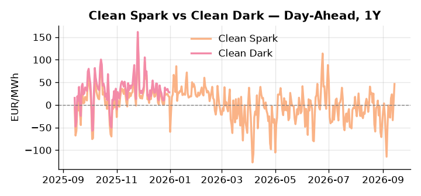
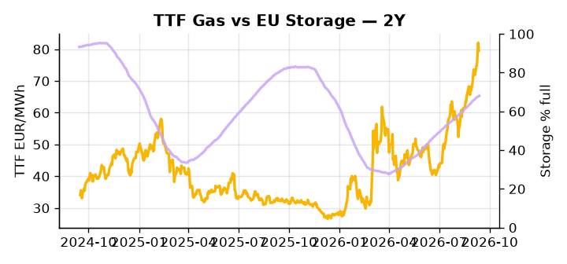

# European Cross-Commodity Risk Pack: Gas + Carbon → Power Curve Implications

**Daily desk brief — 2026-09-14**  
_Author: Sumer Sener · sumerberksener@gmail.com_  
_Generated by `scripts/generate_brief.py`. AI narrative + news themes via Anthropic Claude._

> **Data-freshness caveat:** Clean Dark (last 2025-12-31, 257d old); Coal (last 2025-12-26, 262d old). Numbers below should be read with this in mind.

## 1 · Executive summary

**TL;DR — GB Power at 99th-percentile, Clean Spark at 94th-pctile signal acute UK supply tightness; EU Russia sanctions rollover Monday deadline poses geopolitical TTF/EUA shock risk.**

GB Power at the 99th-percentile (193.49 EUR/MWh) flags acute UK supply exhaustion, with DE Power simultaneously at the 89th-percentile (218.18 EUR/MWh) — up 58% day-on-day — confirming thermal dispatch is fully locked in across both markets. The Clean Spark at the 94th-percentile (46.38 EUR/MWh) keeps gas-to-power margins historically extended and in-the-money, with coal at the 7th-percentile anchoring gas firmly ahead across the merit order. EU storage running 16.3 percentage points below seasonal norms sharpens the winter refill exposure heading into Q4, and with coal data 262 days old and the Clean Dark 257 days stale, the dark spread is indicative not bankable for marginal-cost narratives. The EU Russia sanctions rollover vote Monday is the dominant binary — relief compresses TTF 10–15% and eases storage inflows, escalation drives a 5–10% premium and narrows LNG routing optionality already compressed by Red Sea and Houthi chokepoint risk. With the Monday sanctions vote asserting tail-risk on Russian supply, gas tightness at historical extremes and the Clean Spark extended at the 94th-percentile keep front-curve risk wide, while storage deficits and thermal lock-in leave no headroom to soften the Cal+1 regime absent a geopolitical reversal.

_Generated by **claude-sonnet-4-6** via Anthropic API (two-pass extract→narrate). Prompts/responses logged to `ai/logs/`._
_Next-5d temperature anomaly — DE +0.5°C vs 5-yr seasonal normal (Open-Meteo)._

## 2 · Monitor metrics

**Primary (cross-commodity headline tiles)**

| Metric | As of | Latest | Unit | 1d Δ | 1w Δ | 5y pctile | Headline |
|---|---|---:|---|---:|---:|---:|---|
| TTF Gas | 2026-09-11 | 79.52 | EUR/MWh | -3.08% | +9.64% | 77 | extended 2.1σ above the 50d trend |
| EU Storage | 2026-09-12 | 68.04 | % full | +0.38% | +1.59% | 51 | 16.3 pp below the 5-yr seasonal average |
| EUA Carbon | 2026-09-11 | 34.68 | EUR/tCO2 | -0.94% | +0.16% | 51 | Within typical range |
| DE Power | 2026-09-14 | 218.18 | EUR/MWh | +58.15% | +63.80% | 89 | extended 2.6σ above the 50d trend |
| GB Power | 2026-09-14 | 193.49 | EUR/MWh | -14.73% | +30.25% | 99 | 99th-percentile of 5-yr range — historically high |
| Renewables | 2026-09-13 | 38.92 | % of load | -0.87% | -40.27% | 38 | Within typical range |
| Clean Spark | 2026-09-14 | 46.38 | EUR/MWh | +80.22 | +66.90 | 94 | 94th-percentile of 5-yr range — historically high |
| Clean Dark | 2025-12-31 (STALE) | 27.95 | EUR/MWh | -0.56 | +11.63 | 47 | Within typical range |

**Fundamentals inputs** _(feed derived metrics; not separately traded)_

| Metric | As of | Latest | Unit | 1d Δ | 1w Δ | 5y pctile | Headline |
|---|---|---:|---|---:|---:|---:|---|
| Coal | 2025-12-26 (STALE) | 96.00 | USD/t | -0.57% | +0.08% | 7 | 7th-percentile of 5-yr range — historically low |

_Spreads → abs EUR/MWh deltas; others → pct. Weekly Δ uses 5d trailing means. Full history in `data/<metric>.csv`._

## 3 · Gas + LNG arb

**TTF front-month** prints at 79.52 EUR/MWh — _extended 2.1σ above the 50d trend_.
**EU storage** at 68.0% full (-16.3 pp vs 5-yr seasonal avg) — _16.3 pp below the 5-yr seasonal average_.
**TTF − JKM (LNG arb)** at +6.38 EUR/MWh (JKM 24.89 USD/MMBtu) — TTF richer than JKM — LNG cargoes favour Europe.

## 4 · Carbon (EU ETS)

**EUA December** prints at 34.68 EUR/tCO2 — _Within typical range_. A euro of EUA adds ~0.37 EUR/MWh to gas-fired and ~0.85 EUR/MWh to coal-fired generation cost; strength compresses the dark spread faster than the spark.

**EU vs UK ETS** — Cobblestone's emissions desk trades EUA and UKA. Post-Brexit auction reform narrowed the UKA discount to EUA from £20+/t to single-digit £/t; CBAM phase-in pulls UK compliance demand toward parity. EUA−UKA basis remains a tradable cross-market signal.

**Supply / policy signal** — _CBAM full operational phase live since 1 Jan 2026 — importers paying for embedded emissions_  
Side: `policy` · Polarity: `bullish EUA` · Source: EU Regulation 2023/956 (CBAM)

Domestic carbon-cost burden gradually levelled with imports; supports EUA demand floor as carbon leakage protection tightens through 2034.

_No ETS-relevant news surfaced today — falling back to `data/policy_facts.py` (hand-maintained structural fact pack). Fact pack last reviewed 2026-05-08 (129d ago)._

## 5 · Power — Day-Ahead & curve

**DE day-ahead baseload** at 218.18 EUR/MWh — _extended 2.6σ above the 50d trend_.
**GB day-ahead baseload** at 193.49 EUR/MWh — _99th-percentile of 5-yr range — historically high_.
**DE − GB spread** at +24.69 EUR/MWh (DE premium) — drives interconnector flow direction.
**Cross-border net flows (Power Transportation):** DE↔FR -23.5 GWh (FR export); GB↔FR -71.9 GWh (FR export); NL↔DE -11.4 GWh (DE export).

**Clean spark spread** at +46.38 EUR/MWh — _94th-percentile of 5-yr range — historically high_. Bridge from gas + carbon fundamentals to gas-fired economics; sustained positive spark = TTF moves transmit directly into the power curve.

**Curve shape:** DA → W+1 → M+1 → Q+1 → Cal+1 → Cal+2 = 218 / 144 / 144 / 144 / 144 / 144 EUR/MWh — **Backwardation** (DA −Cal+1 spread +75 EUR/MWh). Forwards are seasonality projections — see Methodology.

{width=49%} {width=49%}

**This week ahead**

- **Tue** 08:00 UTC — AGSI+ daily storage print: First read on the week's gas injection / withdrawal pace; sets the tone for TTF curve shape.
- **Wed** 09:00 UTC — EEX EUA primary auction (Mon–Thu daily; Wed is largest volume): Supply-side EUA signal; auction clearing relative to spot reads as ETS demand strength.
- **Wed** — ENTSO-E DE_LU + GB next-week wind/solar forecast refresh: Sets the residual-load curve a week out; outsized prints move power Cal+1 directionally.
- **Mon** — EU Russia sanctions rollover vote: 16 Sept — energy sector sanctions expiry; binary outcome on gas/oil re-engagement risk; TTF/EUA volatility trigger intraday. _(news-extracted)_
- **Thu** — Italy Senate nuclear bill final vote: This week — confirms EU baseload strategy shift; signals long-dated structural bearish power but near-term gas displacement upside. _(news-extracted)_

**Scenarios (24-72h horizon)**

| | Summary | TTF | DE Power |
|---|---|---:|---:|
| **Base** | EU sanctions rollover approved Monday; Russian gas supply remains curtailed; GB thermal dispatch sustained; TTF stable ±2-3%, DE Power tracks. | ±2-3% | tracks |
| **Upside** | EU sanctions relief approved; Russian LNG/pipeline supply re-engagement; TTF arb softens; GB imports increase, power compression. | -10-15% | -8-12% |
| **Downside** | EU sanctions escalated; Red Sea/Houthi chokepoint persists; LNG diversion to Asia; TTF premium widens; GB supply tightens, power spike. | +8-12% | +12-18% |

_Illustrative, not forecasts. Magnitudes sized off historical sensitivity; AI-generated from today's extract pass._

## 6 · Today's themes

**Weather watch (next 7d)**
- **Storm · GB · Mon 14 – Sun 20 Sep** — peak gust 45 m/s (~161 km/h) on Sun 20 Sep. GB wind capacity is large — DA likely soft. Cut-off risk if gusts exceed safety thresholds; opposite tail (sudden tightening) possible.
- **Storm · FR · Tue 15 – Sun 20 Sep** — peak gust 46 m/s (~165 km/h) on Tue 15 Sep. Strong wind boost to French generation; FR may export to neighbours. DA print likely below seasonal norm; watch FR-GB IFA flow toward GB.

**Watchlist (1–4 weeks)**
- EU Russia sanctions rollover vote Monday 16 Sept—TTF/EUA volatility trigger.
- Italy Senate nuclear bill final vote expected this week.

> **Cross-market regime tag:** Tight market: TTF rich vs history while storage runs below seasonal.

_Risk framing — built within a discipline of clear limits and continuous monitoring; observations here are framed as risk inputs, not directional calls. Positioning decisions remain with the desk._
_Methodology + sources: **README §Methodology**. Numbers auditable via the snapshot JSONs. Rule-based / informational — not investment advice._