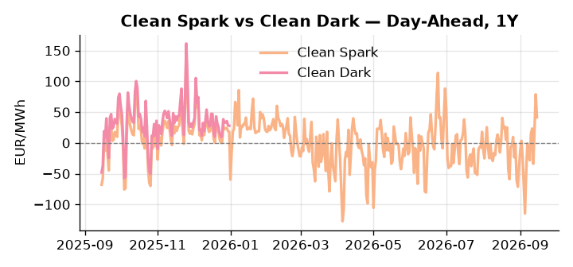
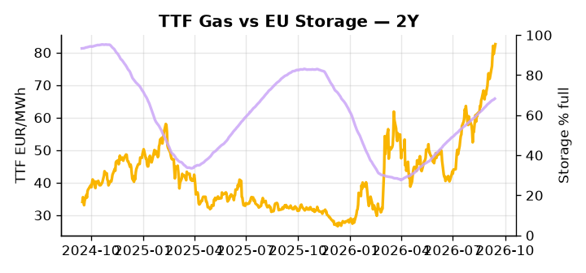

# European Cross-Commodity Risk Pack: Gas + Carbon → Power Curve Implications

**Daily desk brief — 2026-09-15**  
_Author: Sumer Sener · sumerberksener@gmail.com_  
_Generated by `scripts/generate_brief.py`. AI narrative + news themes via Anthropic Claude._

> **Data-freshness caveat:** Clean Dark (last 2025-12-31, 258d old); Coal (last 2025-12-26, 263d old). Numbers below should be read with this in mind.

## 1 · Executive summary

**TL;DR — GB Power at 99th-percentile (204.9 EUR/MWh) amid collapsed renewables (12th-pctile); TTF extended 2.3σ above trend; Red Sea geopolitical premium now embedded.**

GB Power at the 99th percentile (204.9 EUR/MWh) is the dominant signal, driven by a renewables collapse to the 12th percentile — down 44.56% week-on-week — that has extended the thermal merit order and embedded an insular scarcity premium with no near-term relief visible. TTF is stretched 2.3σ above trend at 82.57 EUR/MWh, underpinned by EU storage running 16.2 percentage points below seasonal average and a binary sanctions-rollover outcome due mid-week that keeps the front-month bid anchored. With coal data 263 days old and the clean dark spread 258 days stale, dark spread economics are indicative not bankable, and fuel-switch headroom cannot be cleanly quantified at present. The GB-DE spread remains wide and in-the-money for dispatchable thermal, while the ceasefire execution risk around Ukrainian transit adds a further layer of volatility to Cal+1 pricing. With Red Sea Houthi disruption elevating LNG freight and fuel oil parity, gas tightness at 2.3σ AND a storage deficit that compresses flexibility AND clean sparks extended on collapsed renewables pull front-curve risk wider, keeping the current scarcity regime intact across both front-month and Cal+1.

_Generated by **claude-sonnet-4-6** via Anthropic API (two-pass extract→narrate). Prompts/responses logged to `ai/logs/`._
_Next-5d temperature anomaly — DE +0.9°C / FR +2.4°C vs 5-yr seasonal normal (Open-Meteo)._

## 2 · Monitor metrics

**Primary (cross-commodity headline tiles)**

| Metric | As of | Latest | Unit | 1d Δ | 1w Δ | 5y pctile | Headline |
|---|---|---:|---|---:|---:|---:|---|
| TTF Gas | 2026-09-14 | 82.57 | EUR/MWh | +3.83% | +11.07% | 78 | extended 2.3σ above the 50d trend |
| EU Storage | 2026-09-13 | 68.26 | % full | +0.32% | +1.47% | 51 | 16.2 pp below the 5-yr seasonal average |
| EUA Carbon | 2026-09-14 | 35.24 | EUR/tCO2 | +1.61% | +0.34% | 53 | Within typical range |
| DE Power | 2026-09-15 | 219.74 | EUR/MWh | -14.48% | +68.27% | 89 | extended 2.3σ above the 50d trend |
| GB Power | 2026-09-15 | 204.90 | EUR/MWh | -2.15% | +20.45% | 99 | 99th-percentile of 5-yr range — historically high |
| Renewables | 2026-09-14 | 23.94 | % of load | -38.49% | -44.56% | 12 | extended 2.0σ below the 50d trend |
| Clean Spark | 2026-09-15 | 41.64 | EUR/MWh | -37.21 | +77.47 | 93 | 93th-percentile of 5-yr range — historically high |
| Clean Dark | 2025-12-31 (STALE) | 27.95 | EUR/MWh | -0.56 | +11.63 | 47 | Within typical range |

**Fundamentals inputs** _(feed derived metrics; not separately traded)_

| Metric | As of | Latest | Unit | 1d Δ | 1w Δ | 5y pctile | Headline |
|---|---|---:|---|---:|---:|---:|---|
| Coal | 2025-12-26 (STALE) | 96.00 | USD/t | -0.57% | +0.08% | 7 | 7th-percentile of 5-yr range — historically low |

_Spreads → abs EUR/MWh deltas; others → pct. Weekly Δ uses 5d trailing means. Full history in `data/<metric>.csv`._

## 3 · Gas + LNG arb

**TTF front-month** prints at 82.57 EUR/MWh — _extended 2.3σ above the 50d trend_.
**EU storage** at 68.3% full (-16.2 pp vs 5-yr seasonal avg) — _16.2 pp below the 5-yr seasonal average_.
**TTF − JKM (LNG arb)** at +8.81 EUR/MWh (JKM 25.06 USD/MMBtu) — TTF richer than JKM — LNG cargoes favour Europe.

## 4 · Carbon (EU ETS)

**EUA December** prints at 35.24 EUR/tCO2 — _Within typical range_. A euro of EUA adds ~0.37 EUR/MWh to gas-fired and ~0.85 EUR/MWh to coal-fired generation cost; strength compresses the dark spread faster than the spark.

**EU vs UK ETS** — Cobblestone's emissions desk trades EUA and UKA. Post-Brexit auction reform narrowed the UKA discount to EUA from £20+/t to single-digit £/t; CBAM phase-in pulls UK compliance demand toward parity. EUA−UKA basis remains a tradable cross-market signal.

**Supply / policy signal** — _CBAM full operational phase live since 1 Jan 2026 — importers paying for embedded emissions_  
Side: `policy` · Polarity: `bullish EUA` · Source: EU Regulation 2023/956 (CBAM)

Domestic carbon-cost burden gradually levelled with imports; supports EUA demand floor as carbon leakage protection tightens through 2034.

_No ETS-relevant news surfaced today — falling back to `data/policy_facts.py` (hand-maintained structural fact pack). Fact pack last reviewed 2026-05-08 (130d ago)._

## 5 · Power — Day-Ahead & curve

**DE day-ahead baseload** at 219.74 EUR/MWh — _extended 2.3σ above the 50d trend_.
**GB day-ahead baseload** at 204.90 EUR/MWh — _99th-percentile of 5-yr range — historically high_.
**DE − GB spread** at +14.84 EUR/MWh (DE premium) — drives interconnector flow direction.
**Cross-border net flows (Power Transportation):** DE↔FR -44.6 GWh (FR export); GB↔FR -29.5 GWh (FR export); NL↔DE +25.3 GWh (NL export).

**Clean spark spread** at +41.64 EUR/MWh — _93th-percentile of 5-yr range — historically high_. Bridge from gas + carbon fundamentals to gas-fired economics; sustained positive spark = TTF moves transmit directly into the power curve.

**Curve shape:** DA → W+1 → M+1 → Q+1 → Cal+1 → Cal+2 = 220 / 150 / 150 / 150 / 150 / 150 EUR/MWh — **Backwardation** (DA −Cal+1 spread +70 EUR/MWh). Forwards are seasonality projections — see Methodology.

{width=49%} {width=49%}

**This week ahead**

- **Tue** 08:00 UTC — AGSI+ daily storage print: First read on the week's gas injection / withdrawal pace; sets the tone for TTF curve shape.
- **Wed** 09:00 UTC — EEX EUA primary auction (Mon–Thu daily; Wed is largest volume): Supply-side EUA signal; auction clearing relative to spot reads as ETS demand strength.
- **Wed** — ENTSO-E DE_LU + GB next-week wind/solar forecast refresh: Sets the residual-load curve a week out; outsized prints move power Cal+1 directionally.
- **Wed** — EU Russia sanctions rollover decision: Deadline mid-week; outcome binary for TTF scarcity premium. Watch for hardline vs. dovish member-state statements. _(news-extracted)_
- **Thu** — Von der Leyen State of Union speech: Any energy/climate policy guidance or EU-UK trade signal may affect ETS supply narrative and LNG capex signals. _(news-extracted)_

**Scenarios (24-72h | 1w horizon)**

| | Summary | TTF | DE Power |
|---|---|---:|---:|
| **Base** | Thermal call persists; GB premium holds near 99th-pctile; TTF consolidates 2.3σ above trend pending sanctions outcome. | +1-3% | +2-4% |
| **Upside** | EU Russia sanctions hardened; Red Sea LNG diversion accelerates; renewables fall further. TTF and GB Power spike; clean spark widens. | +8-15% | +12-18% |
| **Downside** | EU Russia sanctions rollover weakened or reversed; Trump–Zelenskyy ceasefire holds; Ukrainian gas transit resumes. TTF retreats; thermal margin compresses. | -6-12% | -10-16% |

_Illustrative, not forecasts. Magnitudes sized off historical sensitivity; AI-generated from today's extract pass._

## 6 · Today's themes

**Weather watch (next 7d)**
- **Storm · FR · Tue 15 – Thu 17 Sep** — peak gust 44 m/s (~158 km/h) on Tue 15 Sep. Strong wind boost to French generation; FR may export to neighbours. DA print likely below seasonal norm; watch FR-GB IFA flow toward GB.
- **Storm · DE · Wed 16 – Mon 21 Sep** — peak gust 51 m/s (~184 km/h) on Sun 20 Sep. Wind generation likely surges Day 1, then risk of turbine cut-off if gusts exceed 25 m/s. Bearish DA early, sharp reversal possible. Watch DE-FR flow swings.

**Watchlist (1–4 weeks)**
- EU Russia sanctions deadline (extended ~1 week); watch for final rollover outcome.
- Red Sea shipping incidents; monitor LNG diversion routes and TTF-Asian LNG arb.

> **Cross-market regime tag:** Tight market: TTF rich vs history while storage runs below seasonal.

_Risk framing — built within a discipline of clear limits and continuous monitoring; observations here are framed as risk inputs, not directional calls. Positioning decisions remain with the desk._
_Methodology + sources: **README §Methodology**. Numbers auditable via the snapshot JSONs. Rule-based / informational — not investment advice._