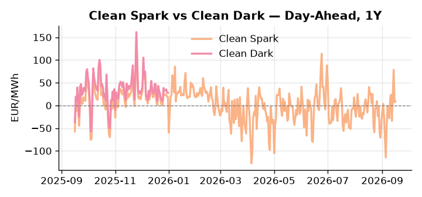
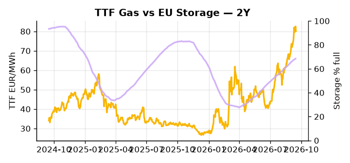

# European Cross-Commodity Risk Pack: Gas + Carbon → Power Curve Implications

**Daily desk brief — 2026-09-16**  
_Author: Sumer Sener · sumerberksener@gmail.com_  
_Generated by `scripts/generate_brief.py`. AI narrative + news themes via Anthropic Claude._

> **Data-freshness caveat:** Clean Dark (last 2025-12-31, 259d old); Coal (last 2025-12-26, 264d old). Numbers below should be read with this in mind.

## 1 · Executive summary

**TL;DR — Coal at 7th-percentile amid Houthi Red Sea threat tightens LNG/TTF; EUA crashes 3.2σ on EPA climate rollback; storage 16pp below seasonal keeps winter thermal call extended.**

Coal at the 7th percentile amid Houthi Red Sea pressure on LNG transit tightens the TTF supply picture, with storage sitting 16.1 percentage points below its five-year seasonal norm at 68.49% full and slowing daily builds keeping the winter thermal call extended. EUA suffered a 3.2-sigma sell-off following the EPA's scrapping of US power-plant climate rules, with the carbon policy signal firmly bearish as the US climate rollback deflates the global scarcity narrative and the EU's own MSR intake review — expected by month-end — now carries explicit downside risk for the EUA price floor. With coal data 264 days stale and clean dark spreads 259 days old, the thermal merit-order read is indicative not bankable, leaving spark spread dynamics as the more reliable regime signal. DE power holds the 85th percentile with a +28.5% MTD move while GB crashed 15.4% on the day, a divergence that underscores intraday renewable noise rather than a structural shift in the cross-market regime. With Houthi Red Sea seizure risk reasserting pressure on LNG shipping lanes by two to four weeks, gas tightness AND a carbon level under acute policy-driven bearish stress AND clean spreads carrying thermal uncertainty from stale coal data keep front-curve risk wide while any Cal+1 stability hinges on whether Corpus Christi Stage 3 ramp proves sufficient to offset Atlantic supply disruption.

_Generated by **claude-sonnet-4-6** via Anthropic API (two-pass extract→narrate). Prompts/responses logged to `ai/logs/`._
_Next-5d temperature anomaly — DE +0.8°C / FR +2.1°C vs 5-yr seasonal normal (Open-Meteo)._

## 2 · Monitor metrics

**Primary (cross-commodity headline tiles)**

| Metric | As of | Latest | Unit | 1d Δ | 1w Δ | 5y pctile | Headline |
|---|---|---:|---|---:|---:|---:|---|
| TTF Gas | 2026-09-15 | 80.06 | EUR/MWh | -3.04% | +10.39% | 77 | Within typical range |
| EU Storage | 2026-09-14 | 68.49 | % full | +0.28% | +1.42% | 51 | 16.1 pp below the 5-yr seasonal average |
| EUA Carbon | 2026-09-15 | 34.10 | EUR/tCO2 | -3.23% | -0.20% | 48 | outsized daily move (-3.23%, 3.2σ) |
| DE Power | 2026-09-16 | 181.74 | EUR/MWh | +1.16% | +27.67% | 85 | Within typical range |
| GB Power | 2026-09-16 | 147.44 | EUR/MWh | -15.44% | +0.02% | 89 | Within typical range |
| Renewables | 2026-09-15 | 41.20 | % of load | +72.12% | -32.79% | 43 | outsized daily move (+72.12%, 2.5σ) |
| Clean Spark | 2026-09-16 | 9.07 | EUR/MWh | +2.09 | +36.94 | 63 | Within typical range |
| Clean Dark | 2025-12-31 (STALE) | 27.95 | EUR/MWh | -0.56 | +11.63 | 47 | Within typical range |

**Fundamentals inputs** _(feed derived metrics; not separately traded)_

| Metric | As of | Latest | Unit | 1d Δ | 1w Δ | 5y pctile | Headline |
|---|---|---:|---|---:|---:|---:|---|
| Coal | 2025-12-26 (STALE) | 96.00 | USD/t | -0.57% | +0.08% | 7 | 7th-percentile of 5-yr range — historically low |

_Spreads → abs EUR/MWh deltas; others → pct. Weekly Δ uses 5d trailing means. Full history in `data/<metric>.csv`._

## 3 · Gas + LNG arb

**TTF front-month** prints at 80.06 EUR/MWh — _Within typical range_.
**EU storage** at 68.5% full (-16.1 pp vs 5-yr seasonal avg) — _16.1 pp below the 5-yr seasonal average_.
**TTF − JKM (LNG arb)** at +5.58 EUR/MWh (JKM 25.21 USD/MMBtu) — TTF richer than JKM — LNG cargoes favour Europe.

## 4 · Carbon (EU ETS)

**EUA December** prints at 34.10 EUR/tCO2 — _outsized daily move (-3.23%, 3.2σ)_. A euro of EUA adds ~0.37 EUR/MWh to gas-fired and ~0.85 EUR/MWh to coal-fired generation cost; strength compresses the dark spread faster than the spark.

**EU vs UK ETS** — Cobblestone's emissions desk trades EUA and UKA. Post-Brexit auction reform narrowed the UKA discount to EUA from £20+/t to single-digit £/t; CBAM phase-in pulls UK compliance demand toward parity. EUA−UKA basis remains a tradable cross-market signal.

**Supply / policy signal** — _EPA scraps US power-plant climate rules, weakening global decarbonization narrative; EU policy response and MSR intake review expected by month-end._  
Side: `policy` · Polarity: `bearish EUA` · Source: Politico EU Energy

US climate rollback reduces scarcity premium on global emissions allowances; EU may reassess MSR intake and free-allocation strategy, creating downside pressure on EUA supply expectations and price floor.

_Surfaced from today's news flow by the AI extract pass (`ai/prompts/extract_v1.md` → `carbon_policy_signal`)._

## 5 · Power — Day-Ahead & curve

**DE day-ahead baseload** at 181.74 EUR/MWh — _Within typical range_.
**GB day-ahead baseload** at 147.44 EUR/MWh — _Within typical range_.
**DE − GB spread** at +34.30 EUR/MWh (DE premium) — drives interconnector flow direction.
**Cross-border net flows (Power Transportation):** DE↔FR -26.4 GWh (FR export); GB↔FR -18.8 GWh (FR export); NL↔DE +13.8 GWh (NL export).

**Clean spark spread** at +9.07 EUR/MWh — _Within typical range_. Bridge from gas + carbon fundamentals to gas-fired economics; sustained positive spark = TTF moves transmit directly into the power curve.

**Curve shape:** DA → W+1 → M+1 → Q+1 → Cal+1 → Cal+2 = 182 / 146 / 146 / 146 / 146 / 146 EUR/MWh — **Backwardation** (DA −Cal+1 spread +36 EUR/MWh). Forwards are seasonality projections — see Methodology.

{width=49%} {width=49%}

**This week ahead**

- **Wed** 09:00 UTC — EEX EUA primary auction (Mon–Thu daily; Wed is largest volume): Supply-side EUA signal; auction clearing relative to spot reads as ETS demand strength.
- **Wed** — ENTSO-E DE_LU + GB next-week wind/solar forecast refresh: Sets the residual-load curve a week out; outsized prints move power Cal+1 directionally.
- **Fri** 14:30 UTC — EIA weekly natural gas storage report: US storage trajectory anchors LNG export pricing into NW Europe — direct TTF transmission.
- **Tue** — Von der Leyen State of the Union climate detail: Expected Sept 16; energy investment pledges and carbon policy stance will reset EUA scarcity expectations post-EPA shock. _(news-extracted)_

**Scenarios (1w horizon)**

| | Summary | TTF | DE Power |
|---|---|---:|---:|
| **Base** | TTF holds 77–80 EUR/MWh on Corpus Christi ramp offsetting Houthi delays; EUA stabilizes on policy reassessment. | −2 to +3% | tracks |
| **Upside** | Houthi Red Sea escalation diverts LNG fleets; shipping delays extend 3–4 weeks; Corpus Christi ramp slips. | +8 to +15% | +5 to +8% |
| **Downside** | Corpus Christi Stage 3 ramps faster; LNG arb to Europe widens; Red Sea corridor clears or rerouting becomes routine. | −5 to −8% | −3 to −5% |

_Illustrative, not forecasts. Magnitudes sized off historical sensitivity; AI-generated from today's extract pass._

## 6 · Today's themes

**Weather watch (next 7d)**
- **Storm · DE · Wed 16 – Tue 22 Sep** — peak gust 55 m/s (~198 km/h) on Sun 20 Sep. Wind generation likely surges Day 1, then risk of turbine cut-off if gusts exceed 25 m/s. Bearish DA early, sharp reversal possible. Watch DE-FR flow swings.
- **Storm · FR · Wed 16 – Thu 17 Sep** — peak gust 39 m/s (~141 km/h) on Wed 16 Sep. Strong wind boost to French generation; FR may export to neighbours. DA print likely below seasonal norm; watch FR-GB IFA flow toward GB.

**Watchlist (1–4 weeks)**
- Von der Leyen State of the Union policy announcements on climate/energy investment (16 Sept expected detail).
- Red Sea Bab el-Mandeb shipping corridor — monitor Houthi escalation and LNG diversion costs weekly.

> **Cross-market regime tag:** Tight market: TTF rich vs history while storage runs below seasonal.

_Risk framing — built within a discipline of clear limits and continuous monitoring; observations here are framed as risk inputs, not directional calls. Positioning decisions remain with the desk._
_Methodology + sources: **README §Methodology**. Numbers auditable via the snapshot JSONs. Rule-based / informational — not investment advice._