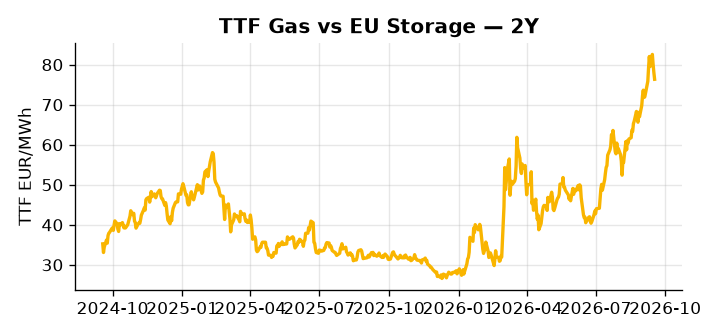

# European Cross-Commodity Risk Pack: Gas + Carbon → Power Curve Implications

**Daily desk brief — 2026-09-18**  
_Author: Sumer Sener · sumerberksener@gmail.com_  
_Generated by `scripts/generate_brief.py`. AI narrative + news themes via Anthropic Claude._

> **Data-freshness caveat:** Coal (last 2025-12-26, 266d old). Numbers below should be read with this in mind.

## 1 · Executive summary

**TL;DR — TTF at 76th percentile (+20% YTD) supported by US sanctions risk; coal at 7th percentile (stale, 266d); GB power spike (+22% daily) signals UK supply tightness unrelated to continental grid.**

TTF at the 76th percentile, up 20% on the month, is the dominant signal this morning, with the US House Russia sanctions bill passage embedding a geopolitical floor that keeps gas firmly tight and any retracement contingent on enforcement softening or dilution. GB power surged 22% on a single day to the 87th percentile, signalling an acute UK supply-side shock — likely wind, nuclear, or interconnector — that is decoupled from the continental grid and demands granular supply decomposition before the spread is tradeable. Coal sits at the 7th percentile historically, but with that data 266 days stale as of 2025-12-26, the dark spread is indicative not bankable, and merit-order and dispatch calls should not be anchored to that headline. Corpus Christi Stage 3, adding 1.5–2 Bcf/d of US capacity, introduces a credible arb-compression tail that keeps Cal+1 headroom compressed on the downside once cargoes normalise. With Russian sanctions risk reasserting as the primary geopolitical driver, gas tightness at the 76th percentile pulls front-curve risk wider while coal-floor unreliability and clean spreads in an ambiguous regime leave Cal+1 positioning extended but vulnerable to rapid retracement if enforcement pace disappoints.

_Generated by **claude-sonnet-4-6** via Anthropic API (two-pass extract→narrate). Prompts/responses logged to `ai/logs/`._
_Next-5d temperature anomaly — DE +0.1°C / FR +2.4°C vs 5-yr seasonal normal (Open-Meteo)._

## 2 · Monitor metrics

**Primary (cross-commodity headline tiles)**

| Metric | As of | Latest | Unit | 1d Δ | 1w Δ | 5y pctile | Headline |
|---|---|---:|---|---:|---:|---:|---|
| TTF Gas | 2026-09-17 | 76.35 | EUR/MWh | -2.15% | +4.10% | 76 | Within typical range |
| EU Storage | — | — | % full | — | — | — | (no data) |
| EUA Carbon | 2026-09-17 | 34.39 | EUR/tCO2 | +1.12% | -1.22% | 50 | Within typical range |
| DE Power | — | — | EUR/MWh | — | — | — | (no data) |
| GB Power | 2026-09-18 | 141.78 | EUR/MWh | +21.76% | -7.46% | 87 | Within typical range |
| Renewables | — | — | % of load | — | — | — | (no data) |
| Clean Spark | — | — | EUR/MWh | — | — | — | (no data) |
| Clean Dark | — | — | EUR/MWh | — | — | — | (no data) |

**Fundamentals inputs** _(feed derived metrics; not separately traded)_

| Metric | As of | Latest | Unit | 1d Δ | 1w Δ | 5y pctile | Headline |
|---|---|---:|---|---:|---:|---:|---|
| Coal | 2025-12-26 (STALE) | 96.00 | USD/t | -0.57% | +0.08% | 7 | 7th-percentile of 5-yr range — historically low |

_Spreads → abs EUR/MWh deltas; others → pct. Weekly Δ uses 5d trailing means. Full history in `data/<metric>.csv`._

## 3 · Gas + LNG arb

**TTF front-month** prints at 76.35 EUR/MWh — _Within typical range_.
**TTF − JKM (LNG arb)** at -3.23 EUR/MWh (JKM 26.75 USD/MMBtu) — JKM richer than TTF — Asia pulls cargoes, marginal European tightening risk.

## 4 · Carbon (EU ETS)

**EUA December** prints at 34.39 EUR/tCO2 — _Within typical range_. A euro of EUA adds ~0.37 EUR/MWh to gas-fired and ~0.85 EUR/MWh to coal-fired generation cost; strength compresses the dark spread faster than the spark.

**EU vs UK ETS** — Cobblestone's emissions desk trades EUA and UKA. Post-Brexit auction reform narrowed the UKA discount to EUA from £20+/t to single-digit £/t; CBAM phase-in pulls UK compliance demand toward parity. EUA−UKA basis remains a tradable cross-market signal.

**Supply / policy signal** — _CBAM full operational phase live since 1 Jan 2026 — importers paying for embedded emissions_  
Side: `policy` · Polarity: `bullish EUA` · Source: EU Regulation 2023/956 (CBAM)

Domestic carbon-cost burden gradually levelled with imports; supports EUA demand floor as carbon leakage protection tightens through 2034.

_No ETS-relevant news surfaced today — falling back to `data/policy_facts.py` (hand-maintained structural fact pack). Fact pack last reviewed 2026-05-08 (133d ago)._

## 5 · Power — Day-Ahead & curve

**GB day-ahead baseload** at 141.78 EUR/MWh — _Within typical range_.
**Cross-border net flows (Power Transportation):** NL↔DE -7.5 GWh (DE export).

**This week ahead**

- **Fri** 14:30 UTC — EIA weekly natural gas storage report: US storage trajectory anchors LNG export pricing into NW Europe — direct TTF transmission.
- **Fri** — ENTSO-E weekly day-ahead volumes / system-balance summary: Reads the European generation mix in last 7d — confirms or breaks the Cal+1 thesis.
- **Tue** 08:00 UTC — AGSI+ daily storage print: First read on the week's gas injection / withdrawal pace; sets the tone for TTF curve shape.
- **Oct** — Von der Leyen climate/energy proposals: Regulatory action expected; may include MSR intake adjustments, ETS-2 expansion scope, or sectoral allocation cuts affecting EUA supply. _(news-extracted)_

**Scenarios (1w horizon)**

| | Summary | TTF | DE Power |
|---|---|---:|---:|
| **Base** | TTF holds 75–78 EUR/MWh on sanctions rhetoric; GB supply normalizes; coal remains historically suppressed. | ±1-3% | unavailable; GB tracks upside if supply stress persists |
| **Upside** | US sanctions enforcement accelerates or Russia retaliates with supply cuts; Hormuz escalation triggers oil/LNG shock. | +8-12% | unavailable |
| **Downside** | US sanctions bill delayed/weakened; Corpus Christi cargoes ramp; EU-US arb collapses; demand softens into autumn. | -6-10% | unavailable |

_Illustrative, not forecasts. Magnitudes sized off historical sensitivity; AI-generated from today's extract pass._

## 6 · Today's themes

**Weather watch (next 7d)**
- **Storm · DE · Fri 18 – Tue 22 Sep** — peak gust 60 m/s (~218 km/h) on Sun 20 Sep. Wind generation likely surges Day 1, then risk of turbine cut-off if gusts exceed 25 m/s. Bearish DA early, sharp reversal possible. Watch DE-FR flow swings.
- **Storm · FR · Wed 23 – Thu 24 Sep** — peak gust 47 m/s (~170 km/h) on Wed 23 Sep. Strong wind boost to French generation; FR may export to neighbours. DA print likely below seasonal norm; watch FR-GB IFA flow toward GB.

**Watchlist (1–4 weeks)**
- US Russia sanctions implementation timeline; potential oil/gas flow restrictions.
- Corpus Christi LNG ramp-up pace and first commercial shipment schedule.

_Risk framing — built within a discipline of clear limits and continuous monitoring; observations here are framed as risk inputs, not directional calls. Positioning decisions remain with the desk._
_Methodology + sources: **README §Methodology**. Numbers auditable via the snapshot JSONs. Rule-based / informational — not investment advice._