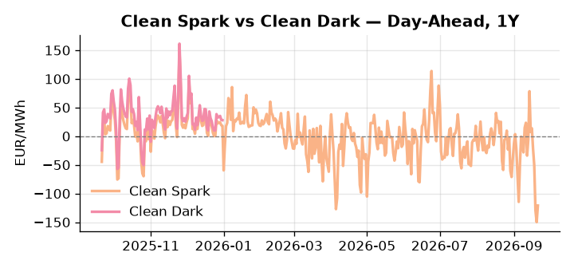
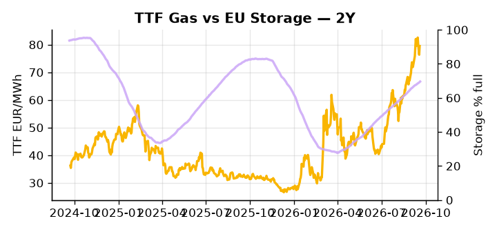

# European Cross-Commodity Risk Pack: Gas + Carbon → Power Curve Implications

**Daily desk brief — 2026-09-21**  
_Author: Sumer Sener · sumerberksener@gmail.com_  
_Generated by `scripts/generate_brief.py`. AI narrative + news themes via Anthropic Claude._

> **Data-freshness caveat:** Clean Dark (last 2025-12-31, 264d old); Coal (last 2025-12-26, 269d old). Numbers below should be read with this in mind.

## 1 · Executive summary

**TL;DR — Renewables at 98th-percentile crush German power to 9th-percentile (50.68 EUR/MWh); geopolitical premium on TTF offsets supply gains from Corpus Christi LNG Stage 3.**

Renewables running at the 98th percentile — covering 93.28% of German load — have crushed DE Day-Ahead power to the 9th percentile (50.68 EUR/MWh), driving Clean Spark to −121.05 EUR/MWh (4th percentile) and signalling that both coal and gas-fired generation are fully suppressed out of merit order; with coal data 269 days stale and clean dark 264 days old, dark spread is indicative not bankable, and the clean spark is the only reliable thermal signal. Against that backdrop, TTF holds at the 77th percentile as a sustained geopolitical premium — anchored by Macron's emergency G7 energy meeting and the pending US Russia sanctions bill — offsets the incremental supply headroom from Corpus Christi Stage 3 ramp, with storage sitting 15.8 percentage points below seasonal average and the refill pace structurally insufficient to absorb a cold-snap or LNG supply shock. The GB-DE power spread at roughly 120 EUR/MWh (GB at the 96th percentile versus DE at the 9th) reflects an extreme geographic asymmetry in renewable generation and tight British supply, with interconnector congestion compressing any arbitrage channel. With Russian sanctions bill risk reasserting on the gas curve, gas tightness at the 77th percentile AND clean spark compressed to the 4th percentile AND clean dark indicative-only keep the front-curve regime in renewable suppression mode, but Russian pipeline/LNG tail-risk pulls Cal+1 upside wide the moment wind fades or sanctions scope is confirmed.

_Generated by **claude-sonnet-4-6** via Anthropic API (two-pass extract→narrate). Prompts/responses logged to `ai/logs/`._
_Next-5d temperature anomaly — DE -0.9°C / FR +3.2°C / GB +2.6°C vs 5-yr seasonal normal (Open-Meteo)._

## 2 · Monitor metrics

**Primary (cross-commodity headline tiles)**

| Metric | As of | Latest | Unit | 1d Δ | 1w Δ | 5y pctile | Headline |
|---|---|---:|---|---:|---:|---:|---|
| TTF Gas | 2026-09-18 | 79.52 | EUR/MWh | +4.15% | +2.04% | 77 | Within typical range |
| EU Storage | 2026-09-19 | 69.62 | % full | +0.45% | +1.53% | 53 | 15.8 pp below the 5-yr seasonal average |
| EUA Carbon | 2026-09-18 | 34.49 | EUR/tCO2 | +0.31% | -1.29% | 50 | Within typical range |
| DE Power | 2026-09-21 | 50.68 | EUR/MWh | +132.58% | -58.99% | 9 | 9th-percentile of 5-yr range — historically low |
| GB Power | 2026-09-21 | 171.24 | EUR/MWh | +193.39% | -48.48% | 96 | 96th-percentile of 5-yr range — historically high |
| Renewables | 2026-09-20 | 93.28 | % of load | +9.91% | +87.56% | 98 | 98th-percentile of 5-yr range — historically high |
| Clean Spark | 2026-09-21 | -121.05 | EUR/MWh | +28.89 | -106.76 | 4 | 4th-percentile of 5-yr range — historically low |
| Clean Dark | 2025-12-31 (STALE) | 27.95 | EUR/MWh | -0.56 | +11.63 | 47 | Within typical range |

**Fundamentals inputs** _(feed derived metrics; not separately traded)_

| Metric | As of | Latest | Unit | 1d Δ | 1w Δ | 5y pctile | Headline |
|---|---|---:|---|---:|---:|---:|---|
| Coal | 2025-12-26 (STALE) | 96.00 | USD/t | -0.57% | +0.08% | 7 | 7th-percentile of 5-yr range — historically low |

_Spreads → abs EUR/MWh deltas; others → pct. Weekly Δ uses 5d trailing means. Full history in `data/<metric>.csv`._

## 3 · Gas + LNG arb

**TTF front-month** prints at 79.52 EUR/MWh — _Within typical range_.
**EU storage** at 69.6% full (-15.8 pp vs 5-yr seasonal avg) — _15.8 pp below the 5-yr seasonal average_.
**TTF − JKM (LNG arb)** at -2.28 EUR/MWh (JKM 27.51 USD/MMBtu) — JKM richer than TTF — Asia pulls cargoes, marginal European tightening risk.

## 4 · Carbon (EU ETS)

**EUA December** prints at 34.49 EUR/tCO2 — _Within typical range_. A euro of EUA adds ~0.37 EUR/MWh to gas-fired and ~0.85 EUR/MWh to coal-fired generation cost; strength compresses the dark spread faster than the spark.

**EU vs UK ETS** — Cobblestone's emissions desk trades EUA and UKA. Post-Brexit auction reform narrowed the UKA discount to EUA from £20+/t to single-digit £/t; CBAM phase-in pulls UK compliance demand toward parity. EUA−UKA basis remains a tradable cross-market signal.

**Supply / policy signal** — _CBAM full operational phase live since 1 Jan 2026 — importers paying for embedded emissions_  
Side: `policy` · Polarity: `bullish EUA` · Source: EU Regulation 2023/956 (CBAM)

Domestic carbon-cost burden gradually levelled with imports; supports EUA demand floor as carbon leakage protection tightens through 2034.

_No ETS-relevant news surfaced today — falling back to `data/policy_facts.py` (hand-maintained structural fact pack). Fact pack last reviewed 2026-05-08 (136d ago)._

## 5 · Power — Day-Ahead & curve

**DE day-ahead baseload** at 50.68 EUR/MWh — _9th-percentile of 5-yr range — historically low_.
**GB day-ahead baseload** at 171.24 EUR/MWh — _96th-percentile of 5-yr range — historically high_.
**DE − GB spread** at -120.56 EUR/MWh (GB premium) — drives interconnector flow direction.
**Cross-border net flows (Power Transportation):** DE↔FR -6.2 GWh (FR export); GB↔FR -6.2 GWh (FR export); NL↔DE -2.5 GWh (DE export).

**Clean spark spread** at -121.05 EUR/MWh — _4th-percentile of 5-yr range — historically low_. Bridge from gas + carbon fundamentals to gas-fired economics; sustained positive spark = TTF moves transmit directly into the power curve.

**Curve shape:** DA → W+1 → M+1 → Q+1 → Cal+1 → Cal+2 = 51 / 122 / 122 / 122 / 122 / 122 EUR/MWh — **Contango** (DA −Cal+1 spread -71 EUR/MWh). Forwards are seasonality projections — see Methodology.

{width=49%} {width=49%}

**This week ahead**

- **Tue** 08:00 UTC — AGSI+ daily storage print: First read on the week's gas injection / withdrawal pace; sets the tone for TTF curve shape.
- **Wed** 09:00 UTC — EEX EUA primary auction (Mon–Thu daily; Wed is largest volume): Supply-side EUA signal; auction clearing relative to spot reads as ETS demand strength.
- **Wed** — ENTSO-E DE_LU + GB next-week wind/solar forecast refresh: Sets the residual-load curve a week out; outsized prints move power Cal+1 directionally.
- **TBD** — G7 emergency energy meeting outcome: Coordination on energy supply/demand policy or price interventions could reshape DA power and gas curve expectations and geopolitical premium. _(news-extracted)_
- **TBD** — US Russia sanctions bill signed: Secondary sanctions on Russian energy exports would tighten LNG supply for EU and sustain TTF winter curve premium; timeline critical for Cal+1 risk. _(news-extracted)_

**Scenarios (24-72h horizon)**

| | Summary | TTF | DE Power |
|---|---|---:|---:|
| **Base** | Renewables remain elevated (90%+ of load); thermal suppressed; geopolitical premium on TTF sustained; storage refill pace slow. | +2–4% | ±1–3% |
| **Upside** | Wind/solar fade sharply (below 80th-percentile); thermal generation recalled; Russian sanctions bill signed; Cold snap risks storage refill. | +8–15% | +25–40% |
| **Downside** | Renewables persist above 95th-percentile; Corpus Christi cargoes reach NW Europe; geopolitical premium unwinds on no major escalation. | −5–8% | −20–30% |

_Illustrative, not forecasts. Magnitudes sized off historical sensitivity; AI-generated from today's extract pass._

## 6 · Today's themes

**Weather watch (next 7d)**
- **Storm · DE · Mon 21 – Tue 22 Sep** — peak gust 48 m/s (~174 km/h) on Mon 21 Sep. Wind generation likely surges Day 1, then risk of turbine cut-off if gusts exceed 25 m/s. Bearish DA early, sharp reversal possible. Watch DE-FR flow swings.
- **Storm · GB · Wed 23 – Thu 24 Sep** — peak gust 43 m/s (~156 km/h) on Wed 23 Sep. GB wind capacity is large — DA likely soft. Cut-off risk if gusts exceed safety thresholds; opposite tail (sudden tightening) possible.

**Watchlist (1–4 weeks)**
- G7 emergency energy meeting outcome and any coordinated supply/demand policy response
- US Russia sanctions bill signed; watch for secondary sanctions targeting energy trade

> **Cross-market regime tag:** Tight market: TTF rich vs history while storage runs below seasonal.

_Risk framing — built within a discipline of clear limits and continuous monitoring; observations here are framed as risk inputs, not directional calls. Positioning decisions remain with the desk._
_Methodology + sources: **README §Methodology**. Numbers auditable via the snapshot JSONs. Rule-based / informational — not investment advice._