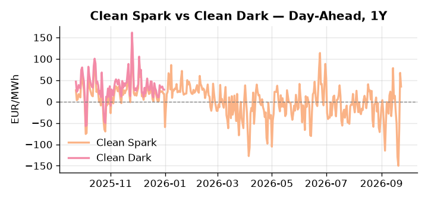
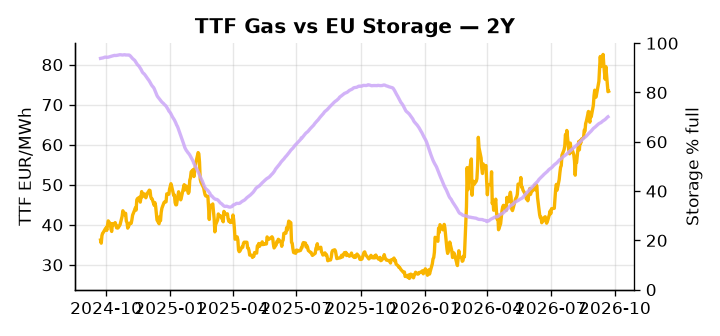

# European Cross-Commodity Risk Pack: Gas + Carbon → Power Curve Implications

**Daily desk brief — 2026-09-23**  
_Author: Sumer Sener · sumerberksener@gmail.com_  
_Generated by `scripts/generate_brief.py`. AI narrative + news themes via Anthropic Claude._

> **Data-freshness caveat:** Clean Dark (last 2025-12-31, 266d old); Coal (last 2025-12-26, 271d old). Numbers below should be read with this in mind.

## 1 · Executive summary

**TL;DR — GB Power at 96th percentile amid renewable collapse; storage 15.6 pp below seasonal; geopolitical ceasefire talks risk premium normalization.**

GB Power at the 96th percentile is the dominant signal this morning, driven by a renewable collapse to just 30.28% of load — a 22nd-percentile reading following a -60.64% daily move — leaving thermal dispatch extended into autumn and the front-month call firmly in-the-money. Storage sits 15.6 percentage points below seasonal average at 70.14% full, keeping TTF anchored at 73.34 EUR/MWh and headroom for any further drawdown compressed; refill pace through October and November will anchor the Q4 and Cal+1 curve shape. EUA mechanics warrant attention as Macron's push to relax EU climate rules and suspend methane-reporting deadlines — a bearish-EUA supply signal sourced from Politico EU Energy — lowers upstream compliance hedging pressure and extends fossil baseload runtime, softening the carbon floor that would otherwise support spark spreads. With coal and clean-dark spread data 271 and 266 days stale respectively, dark-spread valuations are indicative not bankable, and merit-order fuel-switch economics should be treated with that caveat. With Macron's Ukraine-Russia ceasefire talks threatening to collapse the geopolitical TTF premium, gas tightness and EUA mid-range softening under supply-side policy headwinds keep clean spreads in-the-money on the front curve but leave the Cal+1 regime exposed to sharp repricing if any credible normalization of Russian flows materialises.

_Generated by **claude-sonnet-4-6** via Anthropic API (two-pass extract→narrate). Prompts/responses logged to `ai/logs/`._
_Next-5d temperature anomaly — DE +0.0°C / FR +5.1°C vs 5-yr seasonal normal (Open-Meteo)._

## 2 · Monitor metrics

**Primary (cross-commodity headline tiles)**

| Metric | As of | Latest | Unit | 1d Δ | 1w Δ | 5y pctile | Headline |
|---|---|---:|---|---:|---:|---:|---|
| TTF Gas | 2026-09-22 | 73.34 | EUR/MWh | +0.12% | -5.69% | 74 | Within typical range |
| EU Storage | 2026-09-21 | 70.14 | % full | +0.29% | +1.68% | 54 | 15.6 pp below the 5-yr seasonal average |
| EUA Carbon | 2026-09-21 | 34.26 | EUR/tCO2 | -0.68% | -2.05% | 49 | Within typical range |
| DE Power | 2026-09-23 | 194.51 | EUR/MWh | -14.14% | -34.03% | 87 | Within typical range |
| GB Power | 2026-09-23 | 173.41 | EUR/MWh | -5.98% | -16.78% | 96 | 96th-percentile of 5-yr range — historically high |
| Renewables | 2026-09-22 | 30.28 | % of load | -60.64% | +72.19% | 22 | outsized daily move (-60.64%, 2.3σ) |
| Clean Spark | 2026-09-23 | 35.22 | EUR/MWh | -32.05 | -53.00 | 90 | 90th-percentile of 5-yr range — historically high |
| Clean Dark | 2025-12-31 (STALE) | 27.95 | EUR/MWh | -0.56 | +11.63 | 47 | Within typical range |

**Fundamentals inputs** _(feed derived metrics; not separately traded)_

| Metric | As of | Latest | Unit | 1d Δ | 1w Δ | 5y pctile | Headline |
|---|---|---:|---|---:|---:|---:|---|
| Coal | 2025-12-26 (STALE) | 96.00 | USD/t | -0.57% | +0.08% | 7 | 7th-percentile of 5-yr range — historically low |

_Spreads → abs EUR/MWh deltas; others → pct. Weekly Δ uses 5d trailing means. Full history in `data/<metric>.csv`._

## 3 · Gas + LNG arb

**TTF front-month** prints at 73.34 EUR/MWh — _Within typical range_.
**EU storage** at 70.1% full (-15.6 pp vs 5-yr seasonal avg) — _15.6 pp below the 5-yr seasonal average_.
**TTF − JKM (LNG arb)** at -4.19 EUR/MWh (JKM 26.05 USD/MMBtu) — JKM richer than TTF — Asia pulls cargoes, marginal European tightening risk.

## 4 · Carbon (EU ETS)

**EUA December** prints at 34.26 EUR/tCO2 — _Within typical range_. A euro of EUA adds ~0.37 EUR/MWh to gas-fired and ~0.85 EUR/MWh to coal-fired generation cost; strength compresses the dark spread faster than the spark.

**EU vs UK ETS** — Cobblestone's emissions desk trades EUA and UKA. Post-Brexit auction reform narrowed the UKA discount to EUA from £20+/t to single-digit £/t; CBAM phase-in pulls UK compliance demand toward parity. EUA−UKA basis remains a tradable cross-market signal.

**Supply / policy signal** — _Macron seeks EU climate/energy rule relaxation; methane-reporting law suspension under discussion to ease upstream compliance costs._  
Side: `supply` · Polarity: `bearish EUA` · Source: Politico EU Energy

Delayed methane-reporting deadlines reduce compliance capex for oil/gas producers, lowering hedging pressure on power; looser climate enforcement extends fossil baseload runtime, suppressing power curve and EUA dispatch economics.

_Surfaced from today's news flow by the AI extract pass (`ai/prompts/extract_v1.md` → `carbon_policy_signal`)._

## 5 · Power — Day-Ahead & curve

**DE day-ahead baseload** at 194.51 EUR/MWh — _Within typical range_.
**GB day-ahead baseload** at 173.41 EUR/MWh — _96th-percentile of 5-yr range — historically high_.
**DE − GB spread** at +21.10 EUR/MWh (DE premium) — drives interconnector flow direction.
**Cross-border net flows (Power Transportation):** DE↔FR -43.5 GWh (FR export); GB↔FR -51.8 GWh (FR export); NL↔DE -20.8 GWh (DE export).

**Clean spark spread** at +35.22 EUR/MWh — _90th-percentile of 5-yr range — historically high_. Bridge from gas + carbon fundamentals to gas-fired economics; sustained positive spark = TTF moves transmit directly into the power curve.

**Curve shape:** DA → W+1 → M+1 → Q+1 → Cal+1 → Cal+2 = 195 / 141 / 141 / 141 / 141 / 141 EUR/MWh — **Backwardation** (DA −Cal+1 spread +53 EUR/MWh). Forwards are seasonality projections — see Methodology.

{width=49%} {width=49%}

**This week ahead**

- **Wed** 09:00 UTC — EEX EUA primary auction (Mon–Thu daily; Wed is largest volume): Supply-side EUA signal; auction clearing relative to spot reads as ETS demand strength.
- **Wed** — ENTSO-E DE_LU + GB next-week wind/solar forecast refresh: Sets the residual-load curve a week out; outsized prints move power Cal+1 directionally.
- **Fri** 14:30 UTC — EIA weekly natural gas storage report: US storage trajectory anchors LNG export pricing into NW Europe — direct TTF transmission.
- **TBD** — Macron–Von der Leyen methane rule suspension decision: Outcome affects upstream hedging pressure and power baseload dispatch economics over weeks horizon. _(news-extracted)_

**Scenarios (24-72h | 1w horizon)**

| | Summary | TTF | DE Power |
|---|---|---:|---:|
| **Base** | Renewable recovery in next 2–3 days eases thermal dispatch; GB power retreats toward 85–90th percentile; TTF stable near 73.34 EUR/MWh. | ±1-2% | -5% to -8% (tracks renewable rebound and cooler demand unwinding) |
| **Upside** | Renewable collapse persists or deepens; cold front sweeps NW Europe; thermal baseload extended into Oct; storage refill slows. | +8-12% | +12-18% |
| **Downside** | Macron-led ceasefire talks yield credible Ukraine-Russia energy normalization; Russian gas supply expectations rise; geopolitical premium collapses. | -10-15% | -8-12% |

_Illustrative, not forecasts. Magnitudes sized off historical sensitivity; AI-generated from today's extract pass._

## 6 · Today's themes

**Weather watch (next 7d)**
- **Heat dome · FR · Wed 23 – Tue 29 Sep** — peak +9.5°C vs normal. Bullish FR power on AC load and possible nuclear river-cooling derating. Watch FR-nuclear availability prints if heat persists.
- **Storm · DE · Thu 24 Sep** — peak gust 46 m/s (~165 km/h) on Thu 24 Sep. Wind generation likely surges Day 1, then risk of turbine cut-off if gusts exceed 25 m/s. Bearish DA early, sharp reversal possible. Watch DE-FR flow swings.

**Watchlist (1–4 weeks)**
- Macron–Von der Leyen meetings on methane rule suspension timeline (days–weeks).
- EU windfall tax proposal on oil firms; German finance minister advocacy (weeks).

_Risk framing — built within a discipline of clear limits and continuous monitoring; observations here are framed as risk inputs, not directional calls. Positioning decisions remain with the desk._
_Methodology + sources: **README §Methodology**. Numbers auditable via the snapshot JSONs. Rule-based / informational — not investment advice._