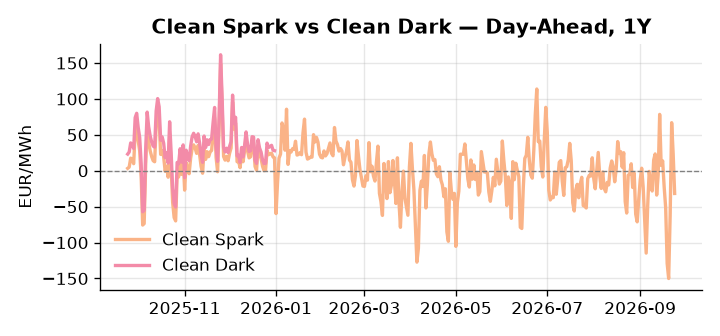
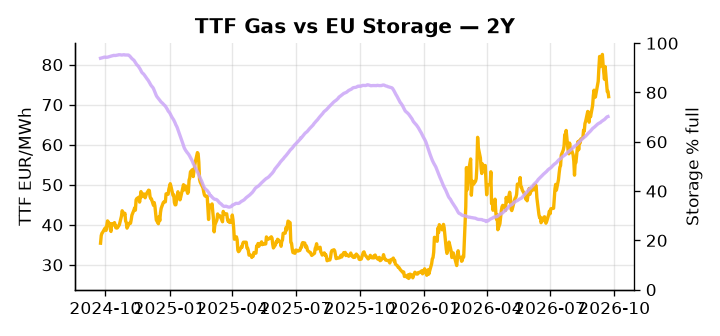

# European Cross-Commodity Risk Pack: Gas + Carbon → Power Curve Implications

**Daily desk brief — 2026-09-24**  
_Author: Sumer Sener · sumerberksener@gmail.com_  
_Generated by `scripts/generate_brief.py`. AI narrative + news themes via Anthropic Claude._

> **Data-freshness caveat:** Clean Dark (last 2025-12-31, 267d old); Coal (last 2025-12-26, 272d old). Numbers below should be read with this in mind.

## 1 · Executive summary

**TL;DR — GB Power at 93rd percentile amid US diesel export ban threat and geopolitical energy shock; TTF 74th pctile reflects gas-for-coal switch risk if refinery margins compress.**

GB Power at the 93rd percentile (163.24 EUR/MWh) is the dominant signal this morning, with TTF at the 74th percentile reflecting live fuel-switch risk should the threatened US diesel export ban — which covers more than half of EU supply — compress refinery margins and force power plants onto gas, a scenario carrying 10–15% TTF upside. Storage at 70.24% full, sitting 15.6 percentage points below the five-year seasonal norm, sustains the winter refill urgency that keeps thermal dispatch elevated and GB-DE spreads extended. On the carbon side, EUA holds in mid-range but the policy signal is structurally bearish: the EU methane reporting delay removes compliance costs on gas operators while Macron's push for negotiated Russian supply would lower the marginal cost of thermal generation and reduce emissions-intensive dispatch, a slow-motion downward pull on carbon that cuts against any policy floor. Note that with coal data 272 days old and clean-dark spread 267 days stale, fuel-switch economics are indicative not bankable, and the 7th-percentile coal print at 96 USD/t should be treated with caution. With Macron's Russia ceasefire negotiation the live geopolitical driver, gas tightness anchored by sub-seasonal storage AND a bearish-EUA policy signal AND clean-dark spreads too stale to confirm headroom pull front-curve risk wide, but a supply unlock would collapse that regime and compress Cal+1 spark differentials sharply.

_Generated by **claude-sonnet-4-6** via Anthropic API (two-pass extract→narrate). Prompts/responses logged to `ai/logs/`._
_Next-5d temperature anomaly — DE +1.1°C / FR +6.1°C vs 5-yr seasonal normal (Open-Meteo)._

## 2 · Monitor metrics

**Primary (cross-commodity headline tiles)**

| Metric | As of | Latest | Unit | 1d Δ | 1w Δ | 5y pctile | Headline |
|---|---|---:|---|---:|---:|---:|---|
| TTF Gas | 2026-09-23 | 72.01 | EUR/MWh | -1.81% | -6.90% | 74 | Within typical range |
| EU Storage | 2026-09-22 | 70.24 | % full | +0.14% | +1.72% | 54 | 15.6 pp below the 5-yr seasonal average |
| EUA Carbon | 2026-09-23 | 33.65 | EUR/tCO2 | -1.78% | -1.85% | 43 | Within typical range |
| DE Power | 2026-09-24 | 124.78 | EUR/MWh | -30.88% | -2.79% | 69 | Within typical range |
| GB Power | 2026-09-24 | 163.24 | EUR/MWh | -7.83% | +31.91% | 93 | 93th-percentile of 5-yr range — historically high |
| Renewables | 2026-09-23 | 34.31 | % of load | +13.31% | +45.55% | 29 | Within typical range |
| Clean Spark | 2026-09-24 | -31.62 | EUR/MWh | -55.75 | +5.70 | 25 | Within typical range |
| Clean Dark | 2025-12-31 (STALE) | 27.95 | EUR/MWh | -0.56 | +11.63 | 47 | Within typical range |

**Fundamentals inputs** _(feed derived metrics; not separately traded)_

| Metric | As of | Latest | Unit | 1d Δ | 1w Δ | 5y pctile | Headline |
|---|---|---:|---|---:|---:|---:|---|
| Coal | 2025-12-26 (STALE) | 96.00 | USD/t | -0.57% | +0.08% | 7 | 7th-percentile of 5-yr range — historically low |

_Spreads → abs EUR/MWh deltas; others → pct. Weekly Δ uses 5d trailing means. Full history in `data/<metric>.csv`._

## 3 · Gas + LNG arb

**TTF front-month** prints at 72.01 EUR/MWh — _Within typical range_.
**EU storage** at 70.2% full (-15.6 pp vs 5-yr seasonal avg) — _15.6 pp below the 5-yr seasonal average_.
**TTF − JKM (LNG arb)** at -4.67 EUR/MWh (JKM 25.73 USD/MMBtu) — JKM richer than TTF — Asia pulls cargoes, marginal European tightening risk.

## 4 · Carbon (EU ETS)

**EUA December** prints at 33.65 EUR/tCO2 — _Within typical range_. A euro of EUA adds ~0.37 EUR/MWh to gas-fired and ~0.85 EUR/MWh to coal-fired generation cost; strength compresses the dark spread faster than the spark.

**EU vs UK ETS** — Cobblestone's emissions desk trades EUA and UKA. Post-Brexit auction reform narrowed the UKA discount to EUA from £20+/t to single-digit £/t; CBAM phase-in pulls UK compliance demand toward parity. EUA−UKA basis remains a tradable cross-market signal.

**Supply / policy signal** — _EU methane reporting delay removes compliance costs on gas operators; Macron pushes regulatory relief to unlock negotiated Russian supply._  
Side: `policy` · Polarity: `bearish EUA` · Source: Politico EU Energy

Regulatory cost removal and Russian gas unlocking lower marginal cost of thermal generation, reducing merit-order position for coal and pushing carbon down via lower emissions-intensive dispatch.

_Surfaced from today's news flow by the AI extract pass (`ai/prompts/extract_v1.md` → `carbon_policy_signal`)._

## 5 · Power — Day-Ahead & curve

**DE day-ahead baseload** at 124.78 EUR/MWh — _Within typical range_.
**GB day-ahead baseload** at 163.24 EUR/MWh — _93th-percentile of 5-yr range — historically high_.
**DE − GB spread** at -38.46 EUR/MWh (GB premium) — drives interconnector flow direction.
**Cross-border net flows (Power Transportation):** DE↔FR -45.2 GWh (FR export); GB↔FR -24.7 GWh (FR export); NL↔DE +11.0 GWh (NL export).

**Clean spark spread** at -31.62 EUR/MWh — _Within typical range_. Bridge from gas + carbon fundamentals to gas-fired economics; sustained positive spark = TTF moves transmit directly into the power curve.

**Curve shape:** DA → W+1 → M+1 → Q+1 → Cal+1 → Cal+2 = 125 / 138 / 138 / 138 / 138 / 138 EUR/MWh — **Contango** (DA −Cal+1 spread -13 EUR/MWh). Forwards are seasonality projections — see Methodology.

{width=49%} {width=49%}

**This week ahead**

- **Fri** 14:30 UTC — EIA weekly natural gas storage report: US storage trajectory anchors LNG export pricing into NW Europe — direct TTF transmission.
- **Thu** 14:30 UTC — US EIA weekly crude inventories: Crude — and via crack spreads, refined-products — feed back into LNG arb economics.
- **Fri** — ENTSO-E weekly day-ahead volumes / system-balance summary: Reads the European generation mix in last 7d — confirms or breaks the Cal+1 thesis.
- **TBD** — US diesel ban 90-day implementation clock starts: Triggers refinery margin compression and power-plant fuel switching to gas within weeks. _(news-extracted)_

**Scenarios (24-72h | 1w horizon)**

| | Summary | TTF | DE Power |
|---|---|---:|---:|
| **Base** | US diesel ban threat priced in; refinery margins tighten moderately; TTF holds 70–75 EUR/MWh; GB Power eases 5–8%. | –2–3% | –3–5% |
| **Upside** | US diesel ban announced with imminent 90-day timeline; refinery output collapses; power plants forced to gas; storage drawdown accelerates. | +10–15% | +8–12% |
| **Downside** | Macron ceasefire negotiation unlocks Russian gas supply; methane reporting delay approved; regulatory floor removed; energy truce reprices geopolitical tail. | –15–20% | –12–18% |

_Illustrative, not forecasts. Magnitudes sized off historical sensitivity; AI-generated from today's extract pass._

## 6 · Today's themes

**Weather watch (next 7d)**
- **Heat dome · FR · Thu 24 – Wed 30 Sep** — peak +10.1°C vs normal. Bullish FR power on AC load and possible nuclear river-cooling derating. Watch FR-nuclear availability prints if heat persists.
- **Storm · DE · Thu 24 Sep** — peak gust 47 m/s (~170 km/h) on Thu 24 Sep. Wind generation likely surges Day 1, then risk of turbine cut-off if gusts exceed 25 m/s. Bearish DA early, sharp reversal possible. Watch DE-FR flow swings.

**Watchlist (1–4 weeks)**
- US diesel export ban announcement and 90-day implementation timeline.
- Macron–von der Leyen energy policy alignment decision on methane reporting delay.

_Risk framing — built within a discipline of clear limits and continuous monitoring; observations here are framed as risk inputs, not directional calls. Positioning decisions remain with the desk._
_Methodology + sources: **README §Methodology**. Numbers auditable via the snapshot JSONs. Rule-based / informational — not investment advice._