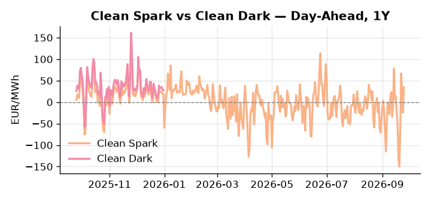
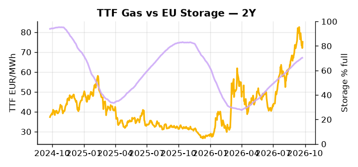

# European Cross-Commodity Risk Pack: Gas + Carbon → Power Curve Implications

**Daily desk brief — 2026-09-25**  
_Author: Sumer Sener · sumerberksener@gmail.com_  
_Generated by `scripts/generate_brief.py`. AI narrative + news themes via Anthropic Claude._

> **Data-freshness caveat:** Clean Dark (last 2025-12-31, 268d old); Coal (last 2025-12-26, 273d old). Numbers below should be read with this in mind.

## 1 · Executive summary

**TL;DR — GB Power at 96th-percentile amid renewable surge; diesel export ban threatens EU refinery margins and power plant backup costs—fuel-switch regime tightens.**

GB Power at the 96th percentile and Clean Spark at the 90th percentile — both extended — anchor the dominant signal: a renewable surge running at the 85th percentile and +86% daily is compressing the midday merit order while residual load spikes sustain a pronounced thermal premium. EU storage sitting 15.7 percentage points below the five-year seasonal average amplifies the tightness, with refill pace into winter the key variable for H2 power risk and gas economics. The Trump 90-day diesel export ban threatening more than half of EU refinery feedstock is forcing fuel-switch incentive higher and raising power-plant operating costs, with Monday's diplomatic watchlist item on negotiation progress the near-term catalyst to monitor; with coal and clean dark data 273 and 268 days stale respectively, the dark spread is indicative not bankable. TTF tightness, EUA in mid-range, and clean spark firmly in-the-money define a thermal-premium curve regime, but competing forces from Corpus Christi Stage 3 capacity additions introduce a headroom-compression dynamic on the supply side. With Iran war tail-risk reasserting and Suez disruption potential redirecting LNG flows, gas tightness AND EUA mid-range AND clean spark extended pull front-curve risk wider while the Cal+1 regime remains contingent on whether US LNG supply growth outpaces geopolitical-driven EU tightness.

_Generated by **claude-sonnet-4-6** via Anthropic API (two-pass extract→narrate). Prompts/responses logged to `ai/logs/`._
_Next-5d temperature anomaly — DE +1.7°C / FR +6.9°C vs 5-yr seasonal normal (Open-Meteo)._

## 2 · Monitor metrics

**Primary (cross-commodity headline tiles)**

| Metric | As of | Latest | Unit | 1d Δ | 1w Δ | 5y pctile | Headline |
|---|---|---:|---|---:|---:|---:|---|
| TTF Gas | 2026-09-24 | 75.11 | EUR/MWh | +4.30% | -5.88% | 75 | Within typical range |
| EU Storage | 2026-09-23 | 70.35 | % full | +0.16% | +1.72% | 54 | 15.7 pp below the 5-yr seasonal average |
| EUA Carbon | 2026-09-24 | 34.00 | EUR/tCO2 | +1.04% | -0.93% | 47 | Within typical range |
| DE Power | 2026-09-25 | 196.99 | EUR/MWh | +42.48% | +64.40% | 87 | Within typical range |
| GB Power | 2026-09-25 | 174.73 | EUR/MWh | -9.16% | +93.38% | 96 | 96th-percentile of 5-yr range — historically high |
| Renewables | 2026-09-24 | 63.92 | % of load | +86.31% | +6.47% | 85 | outsized daily move (+86.31%, 2.8σ) |
| Clean Spark | 2026-09-25 | 34.27 | EUR/MWh | +58.73 | +75.47 | 90 | 90th-percentile of 5-yr range — historically high |
| Clean Dark | 2025-12-31 (STALE) | 27.95 | EUR/MWh | -0.56 | +11.63 | 47 | Within typical range |

**Fundamentals inputs** _(feed derived metrics; not separately traded)_

| Metric | As of | Latest | Unit | 1d Δ | 1w Δ | 5y pctile | Headline |
|---|---|---:|---|---:|---:|---:|---|
| Coal | 2025-12-26 (STALE) | 96.00 | USD/t | -0.57% | +0.08% | 7 | 7th-percentile of 5-yr range — historically low |

_Spreads → abs EUR/MWh deltas; others → pct. Weekly Δ uses 5d trailing means. Full history in `data/<metric>.csv`._

## 3 · Gas + LNG arb

**TTF front-month** prints at 75.11 EUR/MWh — _Within typical range_.
**EU storage** at 70.3% full (-15.7 pp vs 5-yr seasonal avg) — _15.7 pp below the 5-yr seasonal average_.
**TTF − JKM (LNG arb)** at -2.01 EUR/MWh (JKM 25.73 USD/MMBtu) — JKM richer than TTF — Asia pulls cargoes, marginal European tightening risk.

## 4 · Carbon (EU ETS)

**EUA December** prints at 34.00 EUR/tCO2 — _Within typical range_. A euro of EUA adds ~0.37 EUR/MWh to gas-fired and ~0.85 EUR/MWh to coal-fired generation cost; strength compresses the dark spread faster than the spark.

**EU vs UK ETS** — Cobblestone's emissions desk trades EUA and UKA. Post-Brexit auction reform narrowed the UKA discount to EUA from £20+/t to single-digit £/t; CBAM phase-in pulls UK compliance demand toward parity. EUA−UKA basis remains a tradable cross-market signal.

**Supply / policy signal** — _CBAM full operational phase live since 1 Jan 2026 — importers paying for embedded emissions_  
Side: `policy` · Polarity: `bullish EUA` · Source: EU Regulation 2023/956 (CBAM)

Domestic carbon-cost burden gradually levelled with imports; supports EUA demand floor as carbon leakage protection tightens through 2034.

_No ETS-relevant news surfaced today — falling back to `data/policy_facts.py` (hand-maintained structural fact pack). Fact pack last reviewed 2026-05-08 (140d ago)._

## 5 · Power — Day-Ahead & curve

**DE day-ahead baseload** at 196.99 EUR/MWh — _Within typical range_.
**GB day-ahead baseload** at 174.73 EUR/MWh — _96th-percentile of 5-yr range — historically high_.
**DE − GB spread** at +22.26 EUR/MWh (DE premium) — drives interconnector flow direction.
**Cross-border net flows (Power Transportation):** DE↔FR -31.7 GWh (FR export); GB↔FR -33.6 GWh (FR export); NL↔DE -24.8 GWh (DE export).

**Clean spark spread** at +34.27 EUR/MWh — _90th-percentile of 5-yr range — historically high_. Bridge from gas + carbon fundamentals to gas-fired economics; sustained positive spark = TTF moves transmit directly into the power curve.

**Curve shape:** DA → W+1 → M+1 → Q+1 → Cal+1 → Cal+2 = 197 / 145 / 145 / 145 / 145 / 145 EUR/MWh — **Backwardation** (DA −Cal+1 spread +52 EUR/MWh). Forwards are seasonality projections — see Methodology.

{width=49%} {width=49%}

**This week ahead**

- **Fri** 14:30 UTC — EIA weekly natural gas storage report: US storage trajectory anchors LNG export pricing into NW Europe — direct TTF transmission.
- **Fri** — ENTSO-E weekly day-ahead volumes / system-balance summary: Reads the European generation mix in last 7d — confirms or breaks the Cal+1 thesis.
- **Tue** 08:00 UTC — AGSI+ daily storage print: First read on the week's gas injection / withdrawal pace; sets the tone for TTF curve shape.
- **Mon** — EU diplomatic offensive on US diesel ban: Negotiation progress on 90-day Trump timeline critical to refinery margin outlook. _(news-extracted)_

**Scenarios (24-72h horizon)**

| | Summary | TTF | DE Power |
|---|---|---:|---:|
| **Base** | Renewable volatility sustains thermal premium; diesel ban uncertainty weighs on refinery margins, TTF firm. | +2-4% | +1-3% |
| **Upside** | Iran war escalates; Suez disruption redirects LNG, tightens EU supply; diesel ban confirmed. TTF and GB power spike. | +8-12% | +15-22% |
| **Downside** | Trump delays diesel ban; US LNG (Corpus Christi Stage 3) ramps faster; renewables extend; EU demand softens into autumn. | -5-8% | -8-12% |

_Illustrative, not forecasts. Magnitudes sized off historical sensitivity; AI-generated from today's extract pass._

## 6 · Today's themes

**Weather watch (next 7d)**
- **Heat dome · FR · Fri 25 – Thu 01 Oct** — peak +10.9°C vs normal. Bullish FR power on AC load and possible nuclear river-cooling derating. Watch FR-nuclear availability prints if heat persists.
- **Storm · FR · Sat 26 – Sun 27 Sep** — peak gust 44 m/s (~158 km/h) on Sun 27 Sep. Strong wind boost to French generation; FR may export to neighbours. DA print likely below seasonal norm; watch FR-GB IFA flow toward GB.

**Watchlist (1–4 weeks)**
- Trump diesel ban announcement/implementation deadline (90 days from ~23 Sep); EU negotiation progress.
- Corpus Christi Stage 3 ramp-up to full capacity; incremental LNG spot volumes to Europe.

> **Cross-market regime tag:** Tight market: TTF rich vs history while storage runs below seasonal.

_Risk framing — built within a discipline of clear limits and continuous monitoring; observations here are framed as risk inputs, not directional calls. Positioning decisions remain with the desk._
_Methodology + sources: **README §Methodology**. Numbers auditable via the snapshot JSONs. Rule-based / informational — not investment advice._