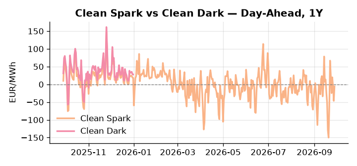
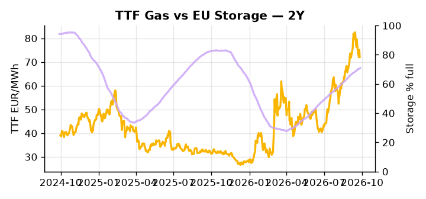

# European Cross-Commodity Risk Pack: Gas + Carbon → Power Curve Implications

**Daily desk brief — 2026-09-28**  
_Author: Sumer Sener · sumerberksener@gmail.com_  
_Generated by `scripts/generate_brief.py`. AI narrative + news themes via Anthropic Claude._

> **Data-freshness caveat:** Clean Dark (last 2025-12-31, 271d old); Coal (last 2025-12-26, 276d old). Numbers below should be read with this in mind.

## 1 · Executive summary

**TL;DR — GB Power at 96th-percentile amid Trump diesel export ban threat; EU demand-cut signal and 15.7 pp storage deficit intensify fuel-switch risk into winter.**

GB Power is printing at the 96th percentile, with EU storage sitting 15.7 percentage points below seasonal average at 70.88% full, as the Trump diesel export ban threat — against an EU bloc over 50% import-dependent on US diesel — forces immediate fuel-switch calculus into gas and power generation. The EU Commission's demand-cut signal compounds structural tightness, narrowing the Q4 refill buffer and lifting the winter-load risk premium across the forward curve. Renewables are temporarily masking the strain at the 85th percentile (63.25% of load following a 72.92% daily jump), but mean reversion toward the seasonal 50th percentile would restore 100–150 MW of thermal call on DA and strip out this short-term headroom. With coal data 276 days old at the 7th percentile and the clean dark spread 271 days stale at 27.95 EUR/MWh (47th percentile), the dark spread is indicative not bankable, and merit-order displacement cannot be credibly sized without an immediate refresh. With the Trump diesel ban threat reasserting EU fuel-switch risk, gas tightness against a structurally undersupplied storage backdrop AND carbon anchored without current policy signal AND clean-dark spreads too stale to confirm regime pull front-curve risk wide, leaving Cal+1 exposed to an upside repricing if ban scope is confirmed on the 90-day clock.

_Generated by **claude-sonnet-4-6** via Anthropic API (two-pass extract→narrate). Prompts/responses logged to `ai/logs/`._
_Next-5d temperature anomaly — DE +4.5°C / FR +5.6°C vs 5-yr seasonal normal (Open-Meteo)._

## 2 · Monitor metrics

**Primary (cross-commodity headline tiles)**

| Metric | As of | Latest | Unit | 1d Δ | 1w Δ | 5y pctile | Headline |
|---|---|---:|---|---:|---:|---:|---|
| TTF Gas | 2026-09-25 | 72.07 | EUR/MWh | -4.04% | -7.75% | 74 | Within typical range |
| EU Storage | 2026-09-26 | 70.88 | % full | +0.37% | +1.28% | 55 | 15.7 pp below the 5-yr seasonal average |
| EUA Carbon | 2026-09-25 | 34.06 | EUR/tCO2 | +0.18% | -1.08% | 48 | Within typical range |
| DE Power | 2026-09-28 | 150.75 | EUR/MWh | +36.79% | +27.81% | 79 | Within typical range |
| GB Power | 2026-09-28 | 177.39 | EUR/MWh | +57.28% | +26.56% | 96 | 96th-percentile of 5-yr range — historically high |
| Renewables | 2026-09-27 | 63.25 | % of load | +72.92% | -32.91% | 85 | outsized daily move (+72.92%, 2.2σ) |
| Clean Spark | 2026-09-28 | -5.93 | EUR/MWh | +40.55 | +37.36 | 44 | Within typical range |
| Clean Dark | 2025-12-31 (STALE) | 27.95 | EUR/MWh | -0.56 | +11.63 | 47 | Within typical range |

**Fundamentals inputs** _(feed derived metrics; not separately traded)_

| Metric | As of | Latest | Unit | 1d Δ | 1w Δ | 5y pctile | Headline |
|---|---|---:|---|---:|---:|---:|---|
| Coal | 2025-12-26 (STALE) | 96.00 | USD/t | -0.57% | +0.08% | 7 | 7th-percentile of 5-yr range — historically low |

_Spreads → abs EUR/MWh deltas; others → pct. Weekly Δ uses 5d trailing means. Full history in `data/<metric>.csv`._

## 3 · Gas + LNG arb

**TTF front-month** prints at 72.07 EUR/MWh — _Within typical range_.
**EU storage** at 70.9% full (-15.7 pp vs 5-yr seasonal avg) — _15.7 pp below the 5-yr seasonal average_.
**TTF − JKM (LNG arb)** at -5.37 EUR/MWh (JKM 25.82 USD/MMBtu) — JKM richer than TTF — Asia pulls cargoes, marginal European tightening risk.

## 4 · Carbon (EU ETS)

**EUA December** prints at 34.06 EUR/tCO2 — _Within typical range_. A euro of EUA adds ~0.37 EUR/MWh to gas-fired and ~0.85 EUR/MWh to coal-fired generation cost; strength compresses the dark spread faster than the spark.

**EU vs UK ETS** — Cobblestone's emissions desk trades EUA and UKA. Post-Brexit auction reform narrowed the UKA discount to EUA from £20+/t to single-digit £/t; CBAM phase-in pulls UK compliance demand toward parity. EUA−UKA basis remains a tradable cross-market signal.

**Supply / policy signal** — _CBAM full operational phase live since 1 Jan 2026 — importers paying for embedded emissions_  
Side: `policy` · Polarity: `bullish EUA` · Source: EU Regulation 2023/956 (CBAM)

Domestic carbon-cost burden gradually levelled with imports; supports EUA demand floor as carbon leakage protection tightens through 2034.

_No ETS-relevant news surfaced today — falling back to `data/policy_facts.py` (hand-maintained structural fact pack). Fact pack last reviewed 2026-05-08 (143d ago)._

## 5 · Power — Day-Ahead & curve

**DE day-ahead baseload** at 150.75 EUR/MWh — _Within typical range_.
**GB day-ahead baseload** at 177.39 EUR/MWh — _96th-percentile of 5-yr range — historically high_.
**DE − GB spread** at -26.64 EUR/MWh (GB premium) — drives interconnector flow direction.
**Cross-border net flows (Power Transportation):** DE↔FR +13.2 GWh (DE export); GB↔FR -21.4 GWh (FR export); NL↔DE -52.4 GWh (DE export).

**Clean spark spread** at -5.93 EUR/MWh — _Within typical range_. Bridge from gas + carbon fundamentals to gas-fired economics; sustained positive spark = TTF moves transmit directly into the power curve.

**Curve shape:** DA → W+1 → M+1 → Q+1 → Cal+1 → Cal+2 = 151 / 142 / 142 / 142 / 142 / 142 EUR/MWh — **Backwardation** (DA −Cal+1 spread +9 EUR/MWh). Forwards are seasonality projections — see Methodology.

{width=49%} {width=49%}

**This week ahead**

- **Tue** 08:00 UTC — AGSI+ daily storage print: First read on the week's gas injection / withdrawal pace; sets the tone for TTF curve shape.
- **Wed** 09:00 UTC — EEX EUA primary auction (Mon–Thu daily; Wed is largest volume): Supply-side EUA signal; auction clearing relative to spot reads as ETS demand strength.
- **Wed** — ENTSO-E DE_LU + GB next-week wind/solar forecast refresh: Sets the residual-load curve a week out; outsized prints move power Cal+1 directionally.
- **Wed** — Trump diesel ban 90-day clock starts (confirm effective date): If announced imminently, market reprices fuel-switch mechanics into winter; TTF and GB Power front-month repricing within hours. _(news-extracted)_

**Scenarios (24-72h horizon)**

| | Summary | TTF | DE Power |
|---|---|---:|---:|
| **Base** | Diesel ban delayed or narrowed by diplomacy; EU demand cuts phased. TTF stable, GB Power retraces 10–15%. | -2 to +3% | -5 to +8% |
| **Upside** | Trump diesel ban confirmed; EU Commission enforces emergency rationing. Fuel-switch into gas, storage refill halts, TTF spiked. | +12 to +18% | +18 to +28% |
| **Downside** | US-EU diplomatic deal exempts key EU ports; Henry Hub weakness and ample LNG supply ease LNG arbitrage. TTF softens, renewables sustain. | -6 to -3% | -12 to -5% |

_Illustrative, not forecasts. Magnitudes sized off historical sensitivity; AI-generated from today's extract pass._

## 6 · Today's themes

**Weather watch (next 7d)**
- **Heat dome · FR · Mon 28 – Thu 01 Oct** — peak +8.2°C vs normal. Bullish FR power on AC load and possible nuclear river-cooling derating. Watch FR-nuclear availability prints if heat persists.
- **Storm · DE · Tue 29 – Wed 30 Sep** — peak gust 39 m/s (~141 km/h) on Wed 30 Sep. Wind generation likely surges Day 1, then risk of turbine cut-off if gusts exceed 25 m/s. Bearish DA early, sharp reversal possible. Watch DE-FR flow swings.

**Watchlist (1–4 weeks)**
- Trump diesel export ban 90-day timeline — confirm effective date and scope.
- EU Commission demand-reduction mandate rollout — watch for emergency gas/power rationing decrees.

_Risk framing — built within a discipline of clear limits and continuous monitoring; observations here are framed as risk inputs, not directional calls. Positioning decisions remain with the desk._
_Methodology + sources: **README §Methodology**. Numbers auditable via the snapshot JSONs. Rule-based / informational — not investment advice._