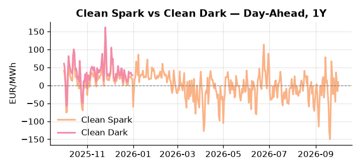
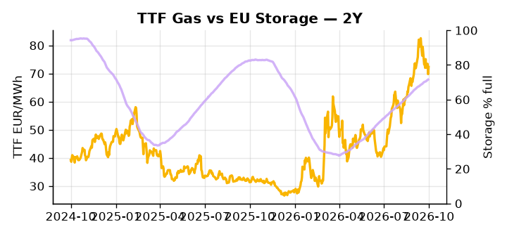

# European Cross-Commodity Risk Pack: Gas + Carbon → Power Curve Implications

**Daily desk brief — 2026-10-01**  
_Author: Sumer Sener · sumerberksener@gmail.com_  
_Generated by `scripts/generate_brief.py`. AI narrative + news themes via Anthropic Claude._

> **Data-freshness caveat:** Clean Dark (last 2025-12-31, 274d old); Coal (last 2025-12-26, 279d old). Numbers below should be read with this in mind.

## 1 · Executive summary

**TL;DR — GB Power at 91st-percentile (161 EUR/MWh) amid storage 15.5 pp below seasonal; Trump diesel reserve pressure and EU policy stalemate extend winter scarcity premium.**

GB Power at 161 EUR/MWh (91st-percentile) is the dominant signal, with storage sitting 15.5 percentage points below seasonal norm — a structural deficit that keeps the generation call firmly bid and the winter scarcity premium extended across the front curve. Trump's diesel reserve drawdown threat, with reserves already beyond the 33% threshold, injects transatlantic fuel-cost volatility directly into thermal spark-spread economics, while a potential export ban creates asymmetric upside to diesel-to-gas switching that is not yet priced with conviction. DE Power at the 82nd-percentile corroborates the pan-European tightness, and the EU policy stalemate — ministers signalling "limited solutions" on price caps — leaves forward curve convexity risk (Cal+1, Cal+2) unanchored against a credible backstop. With coal data 279 days old and clean-dark spread data 274 days stale, the clean-dark reading of 27.95 EUR/MWh at the 47th-percentile is indicative not bankable, and coal's 8th-percentile print at $96/t cannot be relied upon for live dark-spread or fuel-switch headroom assessments. Gas tightness — amplified by a 15.5 pp storage shortfall — AND EUA levels sustaining mid-curve exposure AND clean spreads compressed by stale thermal data keep the front-curve regime bid, with Trump's diesel intervention the dominant geopolitical driver pulling front-curve risk wider while Cal+1 regime credibility hinges on whether the EU fiscal rule vote delivers any meaningful price-cap backstop.

_Generated by **claude-sonnet-4-6** via Anthropic API (two-pass extract→narrate). Prompts/responses logged to `ai/logs/`._
_Next-5d temperature anomaly — DE +4.4°C / FR +3.1°C / GB +3.1°C vs 5-yr seasonal normal (Open-Meteo)._

## 2 · Monitor metrics

**Primary (cross-commodity headline tiles)**

| Metric | As of | Latest | Unit | 1d Δ | 1w Δ | 5y pctile | Headline |
|---|---|---:|---|---:|---:|---:|---|
| TTF Gas | 2026-09-30 | 72.36 | EUR/MWh | +3.66% | -3.12% | 74 | Within typical range |
| EU Storage | 2026-09-29 | 71.54 | % full | +0.29% | +1.26% | 56 | 15.5 pp below the 5-yr seasonal average |
| EUA Carbon | 2026-09-30 | 33.70 | EUR/tCO2 | -0.71% | -0.87% | 44 | Within typical range |
| DE Power | 2026-10-01 | 166.13 | EUR/MWh | +17.79% | -10.58% | 82 | Within typical range |
| GB Power | 2026-10-01 | 161.07 | EUR/MWh | +15.93% | -13.33% | 91 | 91th-percentile of 5-yr range — historically high |
| Renewables | 2026-09-30 | 61.90 | % of load | +24.08% | +5.26% | 83 | Within typical range |
| Clean Spark | 2026-10-01 | 9.01 | EUR/MWh | +25.09 | -16.56 | 63 | Within typical range |
| Clean Dark | 2025-12-31 (STALE) | 27.95 | EUR/MWh | -0.56 | +11.63 | 47 | Within typical range |

**Fundamentals inputs** _(feed derived metrics; not separately traded)_

| Metric | As of | Latest | Unit | 1d Δ | 1w Δ | 5y pctile | Headline |
|---|---|---:|---|---:|---:|---:|---|
| Coal | 2025-12-26 (STALE) | 96.00 | USD/t | -0.57% | +0.08% | 8 | 8th-percentile of 5-yr range — historically low |

_Spreads → abs EUR/MWh deltas; others → pct. Weekly Δ uses 5d trailing means. Full history in `data/<metric>.csv`._

## 3 · Gas + LNG arb

**TTF front-month** prints at 72.36 EUR/MWh — _Within typical range_.
**EU storage** at 71.5% full (-15.5 pp vs 5-yr seasonal avg) — _15.5 pp below the 5-yr seasonal average_.
**TTF − JKM (LNG arb)** at -5.09 EUR/MWh (JKM 25.74 USD/MMBtu) — JKM richer than TTF — Asia pulls cargoes, marginal European tightening risk.

## 4 · Carbon (EU ETS)

**EUA December** prints at 33.70 EUR/tCO2 — _Within typical range_. A euro of EUA adds ~0.37 EUR/MWh to gas-fired and ~0.85 EUR/MWh to coal-fired generation cost; strength compresses the dark spread faster than the spark.

**EU vs UK ETS** — Cobblestone's emissions desk trades EUA and UKA. Post-Brexit auction reform narrowed the UKA discount to EUA from £20+/t to single-digit £/t; CBAM phase-in pulls UK compliance demand toward parity. EUA−UKA basis remains a tradable cross-market signal.

**Supply / policy signal** — _CBAM full operational phase live since 1 Jan 2026 — importers paying for embedded emissions_  
Side: `policy` · Polarity: `bullish EUA` · Source: EU Regulation 2023/956 (CBAM)

Domestic carbon-cost burden gradually levelled with imports; supports EUA demand floor as carbon leakage protection tightens through 2034.

_No ETS-relevant news surfaced today — falling back to `data/policy_facts.py` (hand-maintained structural fact pack). Fact pack last reviewed 2026-05-08 (146d ago)._

## 5 · Power — Day-Ahead & curve

**DE day-ahead baseload** at 166.13 EUR/MWh — _Within typical range_.
**GB day-ahead baseload** at 161.07 EUR/MWh — _91th-percentile of 5-yr range — historically high_.
**DE − GB spread** at +5.06 EUR/MWh (DE premium) — drives interconnector flow direction.
**Cross-border net flows (Power Transportation):** DE↔FR +9.8 GWh (DE export); GB↔FR +34.7 GWh (GB export); NL↔DE -15.1 GWh (DE export).

**Clean spark spread** at +9.01 EUR/MWh — _Within typical range_. Bridge from gas + carbon fundamentals to gas-fired economics; sustained positive spark = TTF moves transmit directly into the power curve.

**Curve shape:** DA → W+1 → M+1 → Q+1 → Cal+1 → Cal+2 = 166 / 150 / 150 / 150 / 150 / 150 EUR/MWh — **Backwardation** (DA −Cal+1 spread +16 EUR/MWh). Forwards are seasonality projections — see Methodology.

{width=49%} {width=49%}

**This week ahead**

- **Fri** 14:30 UTC — EIA weekly natural gas storage report: US storage trajectory anchors LNG export pricing into NW Europe — direct TTF transmission.
- **Thu** 14:30 UTC — US EIA weekly crude inventories: Crude — and via crack spreads, refined-products — feed back into LNG arb economics.
- **Fri** — ENTSO-E weekly day-ahead volumes / system-balance summary: Reads the European generation mix in last 7d — confirms or breaks the Cal+1 thesis.

**Scenarios (1w | 1m horizon)**

| | Summary | TTF | DE Power |
|---|---|---:|---:|
| **Base** | Storage refill pace holds; policy stalemate persists; diesel reserves stable. Power firm at current premium. | ±2-4% | ±3-5% |
| **Upside** | Trump orders diesel export ban; EU reserve drawdown fails. Thermal margins compress; TTF follows coal arb lower. | -5-8% | -8-12% |
| **Downside** | Fiscal rule relaxation approved; EU price caps implemented. Winter weather turns mild; storage refill ahead of seasonal pace. | +6-10% | +10-15% |

_Illustrative, not forecasts. Magnitudes sized off historical sensitivity; AI-generated from today's extract pass._

## 6 · Today's themes

**Weather watch (next 7d)**
- **Heat dome · DE · Thu 01 – Sun 04 Oct** — peak +6.5°C vs normal. Mild bullish DE power on cooling load, but gas demand softens. Spark spread compresses; renewables (solar) likely strong — watch DA print fall midday.
- **Storm · GB · Thu 01 – Fri 02 Oct** — peak gust 36 m/s (~131 km/h) on Fri 02 Oct. GB wind capacity is large — DA likely soft. Cut-off risk if gusts exceed safety thresholds; opposite tail (sudden tightening) possible.

**Watchlist (1–4 weeks)**
- US diesel export ban executive order or announcement timeline — direct EU fuel cost and thermal margin impact.
- EU fiscal rule vote on energy spending relief — outcome drives power price cap/subsidy probability.

_Risk framing — built within a discipline of clear limits and continuous monitoring; observations here are framed as risk inputs, not directional calls. Positioning decisions remain with the desk._
_Methodology + sources: **README §Methodology**. Numbers auditable via the snapshot JSONs. Rule-based / informational — not investment advice._