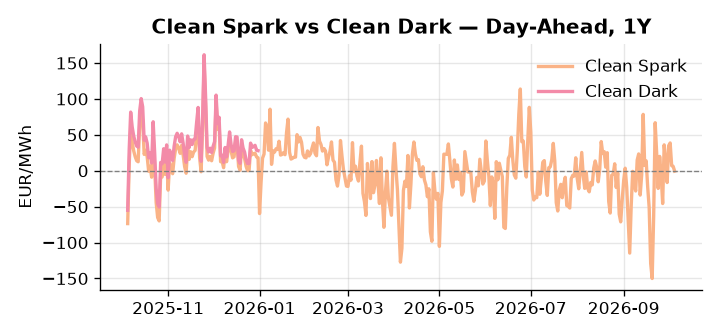
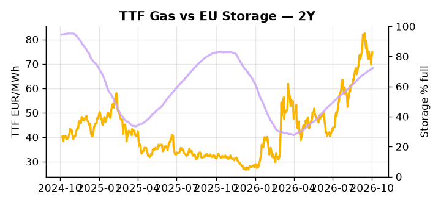

# European Cross-Commodity Risk Pack: Gas + Carbon → Power Curve Implications

**Daily desk brief — 2026-10-05**  
_Author: Sumer Sener · sumerberksener@gmail.com_  
_Generated by `scripts/generate_brief.py`. AI narrative + news themes via Anthropic Claude._

> **Data-freshness caveat:** Clean Dark (last 2025-12-31, 278d old); Coal (last 2025-12-26, 283d old). Numbers below should be read with this in mind.

## 1 · Executive summary

**TL;DR — Coal at 8th-percentile historic lows; EU storage 15.2 pp below seasonal trend; Trump diesel ban threat offset by G7 reserve release—power regime hinges on renewable weakness (12th-pctile) and thermal fuel-cost pass-through.**

Coal at historic lows (8th-percentile, 96 USD/t) is the headline anchor, but the dominant operational stress is EU storage sitting 15.2 percentage points below seasonal average at 72.4% full, keeping TTF structurally supported in the 72–76 EUR/MWh base range and winter refill risk firmly on the watchlist through Q1 2027. Renewables at the 12th-percentile (23.66% share) are suppressing the DA merit order and lifting thermal dispatch costs, with a -20% daily move already registered — a wind reversal here is the nearest-term catalyst for a DA spike. With coal data 283 days old and clean dark spread 278 days stale, the clean-dark reading of 27.95 EUR/MWh (47th-percentile) is indicative not bankable, though it points to thermal displacement remaining in play and fuel-switch economics live below 80 EUR/MWh TTF. The Trump diesel export ban threat introduces a two-way tail: formal proclamation tightens EU refinery feedstock and widens spark spreads, while G7 coordinated reserve release — the key watchlist event with no confirmed timeline — offsets and compresses margins. Gas tightness from the storage deficit AND EUA in mid-range AND clean-dark at the 47th-percentile keep the curve in a thermal-supported regime, but a Trump diesel ban formalisation pulls front-curve risk wider on spark differentials while the G7 release outcome determines whether the Cal+1 regime stays anchored or extends.

_Generated by **claude-sonnet-4-6** via Anthropic API (two-pass extract→narrate). Prompts/responses logged to `ai/logs/`._
_Next-5d temperature anomaly — DE +1.7°C / FR +2.5°C / GB +1.9°C vs 5-yr seasonal normal (Open-Meteo)._

## 2 · Monitor metrics

**Primary (cross-commodity headline tiles)**

| Metric | As of | Latest | Unit | 1d Δ | 1w Δ | 5y pctile | Headline |
|---|---|---:|---|---:|---:|---:|---|
| TTF Gas | 2026-10-02 | 74.76 | EUR/MWh | +1.11% | -0.41% | 75 | Within typical range |
| EU Storage | 2026-10-03 | 72.40 | % full | +0.35% | +1.49% | 58 | 15.2 pp below the 5-yr seasonal average |
| EUA Carbon | 2026-10-02 | 33.42 | EUR/tCO2 | -1.26% | -0.86% | 41 | Within typical range |
| DE Power | 2026-10-05 | 161.27 | EUR/MWh | -3.94% | +17.13% | 81 | Within typical range |
| GB Power | 2026-10-05 | 141.95 | EUR/MWh | +0.34% | +8.31% | 84 | Within typical range |
| Renewables | 2026-10-04 | 23.66 | % of load | -20.02% | -22.66% | 12 | Within typical range |
| Clean Spark | 2026-10-05 | -0.55 | EUR/MWh | -6.62 | +21.02 | 50 | Within typical range |
| Clean Dark | 2025-12-31 (STALE) | 27.95 | EUR/MWh | -0.56 | +11.63 | 47 | Within typical range |

**Fundamentals inputs** _(feed derived metrics; not separately traded)_

| Metric | As of | Latest | Unit | 1d Δ | 1w Δ | 5y pctile | Headline |
|---|---|---:|---|---:|---:|---:|---|
| Coal | 2025-12-26 (STALE) | 96.00 | USD/t | -0.57% | +0.08% | 8 | 8th-percentile of 5-yr range — historically low |

_Spreads → abs EUR/MWh deltas; others → pct. Weekly Δ uses 5d trailing means. Full history in `data/<metric>.csv`._

## 3 · Gas + LNG arb

**TTF front-month** prints at 74.76 EUR/MWh — _Within typical range_.
**EU storage** at 72.4% full (-15.2 pp vs 5-yr seasonal avg) — _15.2 pp below the 5-yr seasonal average_.
**TTF − JKM (LNG arb)** at -3.20 EUR/MWh (JKM 25.70 USD/MMBtu) — JKM richer than TTF — Asia pulls cargoes, marginal European tightening risk.

## 4 · Carbon (EU ETS)

**EUA December** prints at 33.42 EUR/tCO2 — _Within typical range_. A euro of EUA adds ~0.37 EUR/MWh to gas-fired and ~0.85 EUR/MWh to coal-fired generation cost; strength compresses the dark spread faster than the spark.

**EU vs UK ETS** — Cobblestone's emissions desk trades EUA and UKA. Post-Brexit auction reform narrowed the UKA discount to EUA from £20+/t to single-digit £/t; CBAM phase-in pulls UK compliance demand toward parity. EUA−UKA basis remains a tradable cross-market signal.

**Supply / policy signal** — _CBAM full operational phase live since 1 Jan 2026 — importers paying for embedded emissions_  
Side: `policy` · Polarity: `bullish EUA` · Source: EU Regulation 2023/956 (CBAM)

Domestic carbon-cost burden gradually levelled with imports; supports EUA demand floor as carbon leakage protection tightens through 2034.

_No ETS-relevant news surfaced today — falling back to `data/policy_facts.py` (hand-maintained structural fact pack). Fact pack last reviewed 2026-05-08 (150d ago)._

## 5 · Power — Day-Ahead & curve

**DE day-ahead baseload** at 161.27 EUR/MWh — _Within typical range_.
**GB day-ahead baseload** at 141.95 EUR/MWh — _Within typical range_.
**DE − GB spread** at +19.32 EUR/MWh (DE premium) — drives interconnector flow direction.
**Cross-border net flows (Power Transportation):** DE↔FR -20.4 GWh (FR export); GB↔FR -31.5 GWh (FR export); NL↔DE -9.0 GWh (DE export).

**Clean spark spread** at -0.55 EUR/MWh — _Within typical range_. Bridge from gas + carbon fundamentals to gas-fired economics; sustained positive spark = TTF moves transmit directly into the power curve.

**Curve shape:** DA → W+1 → M+1 → Q+1 → Cal+1 → Cal+2 = 161 / 158 / 158 / 158 / 158 / 158 EUR/MWh — **Backwardation** (DA −Cal+1 spread +3 EUR/MWh). Forwards are seasonality projections — see Methodology.

{width=49%} {width=49%}

**This week ahead**

- **Tue** 08:00 UTC — AGSI+ daily storage print: First read on the week's gas injection / withdrawal pace; sets the tone for TTF curve shape.
- **Wed** 09:00 UTC — EEX EUA primary auction (Mon–Thu daily; Wed is largest volume): Supply-side EUA signal; auction clearing relative to spot reads as ETS demand strength.
- **Wed** — ENTSO-E DE_LU + GB next-week wind/solar forecast refresh: Sets the residual-load curve a week out; outsized prints move power Cal+1 directionally.
- **N/A** — G7 reserve release announcement timeline: Monitor for formal release schedule; volume and drawdown rate will shape crude/product inventory trends and power fuel-cost dynamics over weeks. _(news-extracted)_

**Scenarios (24-72h | 1w horizon)**

| | Summary | TTF | DE Power |
|---|---|---:|---:|
| **Base** | Renewables recover modestly; storage refills slowly; TTF holds 72–76 EUR/MWh; DA power tracks 155–165 EUR/MWh. | ±1-2% | ±1-3% |
| **Upside** | Trump diesel ban formalised; EU refinery feedstock tightens; spark spreads widen as fuel-switching pressure mounts; crude rally feeds product costs. | +3-7% | +5-12% |
| **Downside** | G7 reserve release executed; crude/diesel inventory drawn; refinery margins compress; renewables wind forecast improves lifting DA thermal displacement. | -2-5% | -3-8% |

_Illustrative, not forecasts. Magnitudes sized off historical sensitivity; AI-generated from today's extract pass._

## 6 · Today's themes

**Weather watch (next 7d)**
- **Storm · FR · Wed 07 – Sun 11 Oct** — peak gust 45 m/s (~162 km/h) on Thu 08 Oct. Strong wind boost to French generation; FR may export to neighbours. DA print likely below seasonal norm; watch FR-GB IFA flow toward GB.
- **Storm · GB · Wed 07 – Fri 09 Oct** — peak gust 44 m/s (~159 km/h) on Fri 09 Oct. GB wind capacity is large — DA likely soft. Cut-off risk if gusts exceed safety thresholds; opposite tail (sudden tightening) possible.

**Watchlist (1–4 weeks)**
- US diesel export restrictions — escalation risk; monitor Trump admin rhetoric and formal proclamations.
- G7 reserve release timing and volume — watch for drawdown impact on global crude/product inventories.

> **Cross-market regime tag:** Tight market: TTF rich vs history while storage runs below seasonal.

_Risk framing — built within a discipline of clear limits and continuous monitoring; observations here are framed as risk inputs, not directional calls. Positioning decisions remain with the desk._
_Methodology + sources: **README §Methodology**. Numbers auditable via the snapshot JSONs. Rule-based / informational — not investment advice._