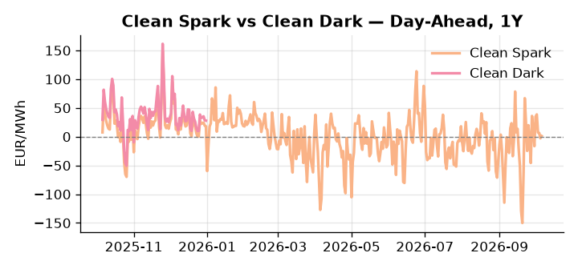
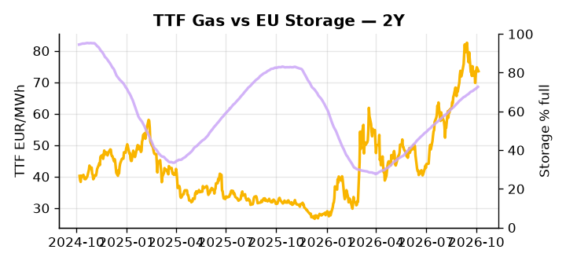

# European Cross-Commodity Risk Pack: Gas + Carbon → Power Curve Implications

**Daily desk brief — 2026-10-06**  
_Author: Sumer Sener · sumerberksener@gmail.com_  
_Generated by `scripts/generate_brief.py`. AI narrative + news themes via Anthropic Claude._

> **Data-freshness caveat:** Clean Dark (last 2025-12-31, 279d old); Coal (last 2025-12-26, 284d old). Numbers below should be read with this in mind.

## 1 · Executive summary

**TL;DR — GB Power at 92nd percentile (165.19 EUR/MWh) and storage 15.1pp below seasonal norm drive tightness; US diesel export ban threat and G7 reserve releases create near-term volatility; coal stale but historically cheap (8th pctile) offers hedging tailwind.**

GB Power at 165.19 EUR/MWh (92nd percentile) is the dominant signal this morning, with an 18% single-day move demanding an immediate outage and interconnector check before the open. EU storage sitting 15.1 percentage points below the five-year seasonal norm at 72.67% full compresses refill headroom materially and sustains a winter tail-risk premium across TTF and the power curve. The US diesel export ban threat against the G7's announced 100-million-barrel reserve release creates a direct tug-of-war on NW European heating fuel costs — a full ban could push refined product exposure 5–10 EUR/bbl equivalent higher, while the reserve release timing and phasing remain unresolved, leaving the net regime indeterminate. EUA sits 2.2σ below its 50-day trend at 33.2 EUR/t (39th percentile), offering a latent mean-reversion risk that could add 2–4% to carbon cost within weeks; with coal at the 8th percentile and clean dark data 279 days stale, the dark spread at 27.95 EUR/MWh is indicative not bankable and should not anchor tactical hedging decisions. Gas tightness from the storage deficit AND EUA extended below trend AND clean-dark in indicative-only territory keep the curve in a structurally bid front-month regime, with the US diesel export ban outcome the single geopolitical trigger most likely to widen front-curve risk further if enacted without allied carve-outs.

_Generated by **claude-sonnet-4-6** via Anthropic API (two-pass extract→narrate). Prompts/responses logged to `ai/logs/`._
_Next-5d temperature anomaly — DE +1.3°C / FR +1.0°C vs 5-yr seasonal normal (Open-Meteo)._

## 2 · Monitor metrics

**Primary (cross-commodity headline tiles)**

| Metric | As of | Latest | Unit | 1d Δ | 1w Δ | 5y pctile | Headline |
|---|---|---:|---|---:|---:|---:|---|
| TTF Gas | 2026-10-05 | 73.51 | EUR/MWh | -1.67% | -0.43% | 75 | Within typical range |
| EU Storage | 2026-10-04 | 72.67 | % full | +0.37% | +1.49% | 58 | 15.1 pp below the 5-yr seasonal average |
| EUA Carbon | 2026-10-05 | 33.20 | EUR/tCO2 | -0.66% | -1.19% | 39 | extended 2.2σ below the 50d trend |
| DE Power | 2026-10-06 | 160.55 | EUR/MWh | +2.54% | +5.78% | 81 | Within typical range |
| GB Power | 2026-10-06 | 165.19 | EUR/MWh | +18.06% | +3.38% | 92 | 92th-percentile of 5-yr range — historically high |
| Renewables | 2026-10-05 | 42.34 | % of load | +78.96% | -39.44% | 47 | outsized daily move (+78.96%, 2.2σ) |
| Clean Spark | 2026-10-06 | 1.31 | EUR/MWh | +3.97 | +5.68 | 52 | Within typical range |
| Clean Dark | 2025-12-31 (STALE) | 27.95 | EUR/MWh | -0.56 | +11.63 | 47 | Within typical range |

**Fundamentals inputs** _(feed derived metrics; not separately traded)_

| Metric | As of | Latest | Unit | 1d Δ | 1w Δ | 5y pctile | Headline |
|---|---|---:|---|---:|---:|---:|---|
| Coal | 2025-12-26 (STALE) | 96.00 | USD/t | -0.57% | +0.08% | 8 | 8th-percentile of 5-yr range — historically low |

_Spreads → abs EUR/MWh deltas; others → pct. Weekly Δ uses 5d trailing means. Full history in `data/<metric>.csv`._

## 3 · Gas + LNG arb

**TTF front-month** prints at 73.51 EUR/MWh — _Within typical range_.
**EU storage** at 72.7% full (-15.1 pp vs 5-yr seasonal avg) — _15.1 pp below the 5-yr seasonal average_.
**TTF − JKM (LNG arb)** at -4.45 EUR/MWh (JKM 25.72 USD/MMBtu) — JKM richer than TTF — Asia pulls cargoes, marginal European tightening risk.

## 4 · Carbon (EU ETS)

**EUA December** prints at 33.20 EUR/tCO2 — _extended 2.2σ below the 50d trend_. A euro of EUA adds ~0.37 EUR/MWh to gas-fired and ~0.85 EUR/MWh to coal-fired generation cost; strength compresses the dark spread faster than the spark.

**EU vs UK ETS** — Cobblestone's emissions desk trades EUA and UKA. Post-Brexit auction reform narrowed the UKA discount to EUA from £20+/t to single-digit £/t; CBAM phase-in pulls UK compliance demand toward parity. EUA−UKA basis remains a tradable cross-market signal.

**Supply / policy signal** — _CBAM full operational phase live since 1 Jan 2026 — importers paying for embedded emissions_  
Side: `policy` · Polarity: `bullish EUA` · Source: EU Regulation 2023/956 (CBAM)

Domestic carbon-cost burden gradually levelled with imports; supports EUA demand floor as carbon leakage protection tightens through 2034.

_No ETS-relevant news surfaced today — falling back to `data/policy_facts.py` (hand-maintained structural fact pack). Fact pack last reviewed 2026-05-08 (151d ago)._

## 5 · Power — Day-Ahead & curve

**DE day-ahead baseload** at 160.55 EUR/MWh — _Within typical range_.
**GB day-ahead baseload** at 165.19 EUR/MWh — _92th-percentile of 5-yr range — historically high_.
**DE − GB spread** at -4.64 EUR/MWh (GB premium) — drives interconnector flow direction.
**Cross-border net flows (Power Transportation):** DE↔FR -7.1 GWh (FR export); GB↔FR +3.1 GWh (GB export); NL↔DE +1.4 GWh (NL export).

**Clean spark spread** at +1.31 EUR/MWh — _Within typical range_. Bridge from gas + carbon fundamentals to gas-fired economics; sustained positive spark = TTF moves transmit directly into the power curve.

**Curve shape:** DA → W+1 → M+1 → Q+1 → Cal+1 → Cal+2 = 161 / 157 / 157 / 157 / 157 / 157 EUR/MWh — **Backwardation** (DA −Cal+1 spread +3 EUR/MWh). Forwards are seasonality projections — see Methodology.

{width=49%} {width=49%}

**This week ahead**

- **Tue** 08:00 UTC — AGSI+ daily storage print: First read on the week's gas injection / withdrawal pace; sets the tone for TTF curve shape.
- **Wed** 09:00 UTC — EEX EUA primary auction (Mon–Thu daily; Wed is largest volume): Supply-side EUA signal; auction clearing relative to spot reads as ETS demand strength.
- **Wed** — ENTSO-E DE_LU + GB next-week wind/solar forecast refresh: Sets the residual-load curve a week out; outsized prints move power Cal+1 directionally.
- **TBD** — US diesel export ban decision: Timing and scope critical to NW European refined supply tightness and winter heating demand. _(news-extracted)_
- **TBD** — G7 reserve release drawdown schedule: Phasing of 100M bbl crude + diesel release affects near-term European heating fuel margin and demand destruction risk. _(news-extracted)_

**Scenarios (1w horizon)**

| | Summary | TTF | DE Power |
|---|---|---:|---:|
| **Base** | Storage deficit and GB tightness persist; US diesel ban threat and reserve releases remain in negotiation. TTF stable 72–75 EUR/MWh; DE Power 155–165 EUR/MWh. | ±2-3% | ±2-4% |
| **Upside** | US diesel export ban announced with limited carve-outs; G7 reserve release delayed or scaled back. Heating fuel costs spike, driving gas-to-heat switching and winter demand. | +5-8% | +6-12% |
| **Downside** | G7 reserve releases executed swiftly and at full scale; US diesel ban deferred or exempts allies. Refined product tightness eases, heating demand softens, power merit-order improves. | -4-6% | -5-10% |

_Illustrative, not forecasts. Magnitudes sized off historical sensitivity; AI-generated from today's extract pass._

## 6 · Today's themes

**Weather watch (next 7d)**
- **Storm · FR · Wed 07 – Sun 11 Oct** — peak gust 47 m/s (~170 km/h) on Sat 10 Oct. Strong wind boost to French generation; FR may export to neighbours. DA print likely below seasonal norm; watch FR-GB IFA flow toward GB.
- **Storm · DE · Thu 08 – Mon 12 Oct** — peak gust 60 m/s (~216 km/h) on Sat 10 Oct. Wind generation likely surges Day 1, then risk of turbine cut-off if gusts exceed 25 m/s. Bearish DA early, sharp reversal possible. Watch DE-FR flow swings.

**Watchlist (1–4 weeks)**
- US diesel export ban decision timeline and extent of any carve-outs for allies.
- Timing and magnitude of announced G7 / European reserve releases (crude, diesel, strategic stocks).

_Risk framing — built within a discipline of clear limits and continuous monitoring; observations here are framed as risk inputs, not directional calls. Positioning decisions remain with the desk._
_Methodology + sources: **README §Methodology**. Numbers auditable via the snapshot JSONs. Rule-based / informational — not investment advice._