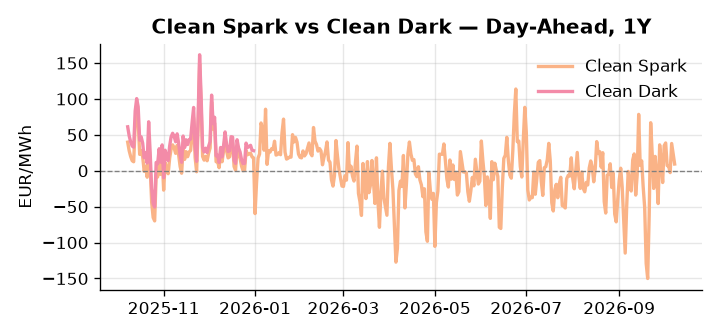
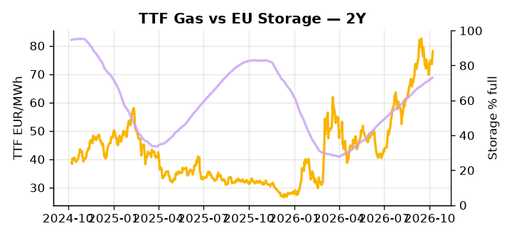

# European Cross-Commodity Risk Pack: Gas + Carbon → Power Curve Implications

**Daily desk brief — 2026-10-08**  
_Author: Sumer Sener · sumerberksener@gmail.com_  
_Generated by `scripts/generate_brief.py`. AI narrative + news themes via Anthropic Claude._

> **Data-freshness caveat:** Clean Dark (last 2025-12-31, 281d old); Coal (last 2025-12-26, 286d old). Numbers below should be read with this in mind.

## 1 · Executive summary

**TL;DR — Storage 15 pp below seasonal, renewables at 21st-pctile, and TTF +3.2% daily signal tight autumn gas regime; G7 reserve releases and record US LNG supply cap upside.**

Storage sitting 15.1 percentage points below its five-year seasonal norm, renewables printing at the 21st percentile after a 25% week-on-week drop, and TTF posting a 3.2% daily gain together define a tight autumn gas regime where the thermal merit-order call is extended and gas-to-power transmission is under real stress. DE and GB power are both elevated in the 83rd–84th percentile range, confirming that the gas signal is already transmitting into the power curve with limited headroom to absorb a cold front. On the carbon side, EUA compliance costs sit against a backdrop where the finalised EU-UK Brexit carbon linkage — broadening eligible instruments and reducing ETS segmentation risk — introduces modest structural relief on EUA-UKA arbitrage friction, a slow-motion supply normalisation into the 2027 curve that holds policy tone neutral rather than tightening. The primary cap on front-month upside remains the combination of G7 strategic crude reserve releases and record US LNG supply, which together compress fuel-switch incentive and keep TTF from extending its rally unchecked; with coal data 281–286 days stale, the clean dark spread is indicative not bankable, and thermal dispatch economics carry a caveat. With Hormuz tail-risk named on the watchlist as the dominant reversal lever, gas tightness AND a policy-neutral EUA anchored by linkage relief AND clean darks too stale to confirm fuel-switch economics keep the front-curve risk regime extended while Cal+1 pricing holds conditional on whether G7 reserve draws materialise before winter withdrawal season sharpens the storage deficit.

_Generated by **claude-sonnet-4-6** via Anthropic API (two-pass extract→narrate). Prompts/responses logged to `ai/logs/`._
_Next-5d temperature anomaly — DE -0.2°C / FR -0.1°C vs 5-yr seasonal normal (Open-Meteo)._

## 2 · Monitor metrics

**Primary (cross-commodity headline tiles)**

| Metric | As of | Latest | Unit | 1d Δ | 1w Δ | 5y pctile | Headline |
|---|---|---:|---|---:|---:|---:|---|
| TTF Gas | 2026-10-07 | 78.08 | EUR/MWh | +3.16% | +3.64% | 77 | Within typical range |
| EU Storage | 2026-10-06 | 72.97 | % full | +0.18% | +1.51% | 59 | 15.1 pp below the 5-yr seasonal average |
| EUA Carbon | 2026-10-07 | 33.89 | EUR/tCO2 | +0.83% | -1.03% | 47 | Within typical range |
| DE Power | 2026-10-08 | 178.00 | EUR/MWh | -7.21% | +2.89% | 84 | Within typical range |
| GB Power | 2026-10-08 | 142.02 | EUR/MWh | -24.26% | -1.77% | 83 | Within typical range |
| Renewables | 2026-10-07 | 29.72 | % of load | +0.57% | -25.26% | 21 | Within typical range |
| Clean Spark | 2026-10-08 | 9.37 | EUR/MWh | -13.84 | -0.74 | 63 | Within typical range |
| Clean Dark | 2025-12-31 (STALE) | 27.95 | EUR/MWh | -0.56 | +11.63 | 47 | Within typical range |

**Fundamentals inputs** _(feed derived metrics; not separately traded)_

| Metric | As of | Latest | Unit | 1d Δ | 1w Δ | 5y pctile | Headline |
|---|---|---:|---|---:|---:|---:|---|
| Coal | 2025-12-26 (STALE) | 96.00 | USD/t | -0.57% | +0.08% | 8 | 8th-percentile of 5-yr range — historically low |

_Spreads → abs EUR/MWh deltas; others → pct. Weekly Δ uses 5d trailing means. Full history in `data/<metric>.csv`._

## 3 · Gas + LNG arb

**TTF front-month** prints at 78.08 EUR/MWh — _Within typical range_.
**EU storage** at 73.0% full (-15.1 pp vs 5-yr seasonal avg) — _15.1 pp below the 5-yr seasonal average_.
**TTF − JKM (LNG arb)** at -0.37 EUR/MWh (JKM 25.88 USD/MMBtu) — JKM richer than TTF — Asia pulls cargoes, marginal European tightening risk.

## 4 · Carbon (EU ETS)

**EUA December** prints at 33.89 EUR/tCO2 — _Within typical range_. A euro of EUA adds ~0.37 EUR/MWh to gas-fired and ~0.85 EUR/MWh to coal-fired generation cost; strength compresses the dark spread faster than the spark.

**EU vs UK ETS** — Cobblestone's emissions desk trades EUA and UKA. Post-Brexit auction reform narrowed the UKA discount to EUA from £20+/t to single-digit £/t; CBAM phase-in pulls UK compliance demand toward parity. EUA−UKA basis remains a tradable cross-market signal.

**Supply / policy signal** — _UK and EU finalize Brexit agreement linking carbon emissions trading systems; expands eligible compliance instruments and reduces segmentation risk._  
Side: `policy` · Polarity: `neutral` · Source: Politico EU Energy

Broader compliance instrument eligibility lowers EUA-UKA arbitrage barriers, reduces ETS price discovery friction, and supports stable long-term curve pricing into 2027 — modest structural relief on segmentation tail-risk.

_Surfaced from today's news flow by the AI extract pass (`ai/prompts/extract_v1.md` → `carbon_policy_signal`)._

## 5 · Power — Day-Ahead & curve

**DE day-ahead baseload** at 178.00 EUR/MWh — _Within typical range_.
**GB day-ahead baseload** at 142.02 EUR/MWh — _Within typical range_.
**DE − GB spread** at +35.98 EUR/MWh (DE premium) — drives interconnector flow direction.
**Cross-border net flows (Power Transportation):** DE↔FR -18.4 GWh (FR export); GB↔FR -10.9 GWh (FR export); NL↔DE +36.3 GWh (NL export).

**Clean spark spread** at +9.37 EUR/MWh — _Within typical range_. Bridge from gas + carbon fundamentals to gas-fired economics; sustained positive spark = TTF moves transmit directly into the power curve.

**Curve shape:** DA → W+1 → M+1 → Q+1 → Cal+1 → Cal+2 = 178 / 162 / 162 / 162 / 162 / 162 EUR/MWh — **Backwardation** (DA −Cal+1 spread +16 EUR/MWh). Forwards are seasonality projections — see Methodology.

{width=49%} {width=49%}

**This week ahead**

- **Fri** 14:30 UTC — EIA weekly natural gas storage report: US storage trajectory anchors LNG export pricing into NW Europe — direct TTF transmission.
- **Thu** 14:30 UTC — US EIA weekly crude inventories: Crude — and via crack spreads, refined-products — feed back into LNG arb economics.
- **Fri** — ENTSO-E weekly day-ahead volumes / system-balance summary: Reads the European generation mix in last 7d — confirms or breaks the Cal+1 thesis.
- **Wed** — IEA assessment (oil reserve release trigger): Determines EU eligibility for further strategic stock releases post-March accord; timing shapes crude/diesel arb into Nov–Dec. _(news-extracted)_

**Scenarios (1w horizon)**

| | Summary | TTF | DE Power |
|---|---|---:|---:|
| **Base** | Soft coal, weak renewables, tight storage sustain gas-to-power call; TTF stable, DE power tracks 84th-pctile range. | +1-3% | tracks |
| **Upside** | Cold front drives renewables below 15th-pctile; storage refill pace weakens. Gas-fired call surges, TTF rallies on winter heating demand. | +8-12% | +5-8% |
| **Downside** | G7 reserve releases executed aggressively; crude/diesel margins collapse. Fuel-switch incentive evaporates, gas demand softens, TTF and DE power decline. | -6-10% | -4-7% |

_Illustrative, not forecasts. Magnitudes sized off historical sensitivity; AI-generated from today's extract pass._

## 6 · Today's themes

**Weather watch (next 7d)**
- **Storm · DE · Thu 08 – Mon 12 Oct** — peak gust 47 m/s (~170 km/h) on Thu 08 Oct. Wind generation likely surges Day 1, then risk of turbine cut-off if gusts exceed 25 m/s. Bearish DA early, sharp reversal possible. Watch DE-FR flow swings.
- **Storm · FR · Thu 08 – Sat 10 Oct** — peak gust 43 m/s (~154 km/h) on Thu 08 Oct. Strong wind boost to French generation; FR may export to neighbours. DA print likely below seasonal norm; watch FR-GB IFA flow toward GB.

**Watchlist (1–4 weeks)**
- IEA assessment trigger for any future EU oil/diesel stock releases post-March accord baseline.
- Timing and volume of G7 reserve release implementation; impact on crude/diesel spreads and DA power-fuel arbs.

> **Cross-market regime tag:** Tight market: TTF rich vs history while storage runs below seasonal.

_Risk framing — built within a discipline of clear limits and continuous monitoring; observations here are framed as risk inputs, not directional calls. Positioning decisions remain with the desk._
_Methodology + sources: **README §Methodology**. Numbers auditable via the snapshot JSONs. Rule-based / informational — not investment advice._